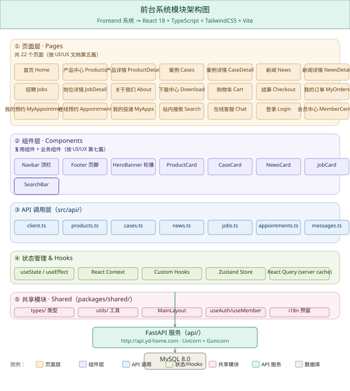
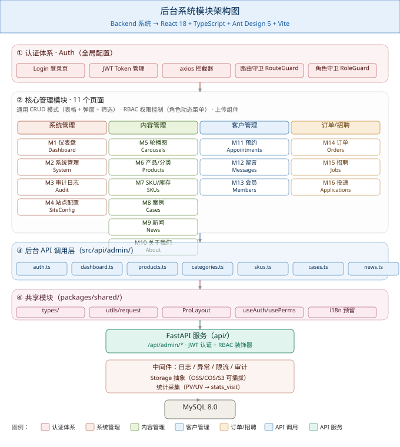
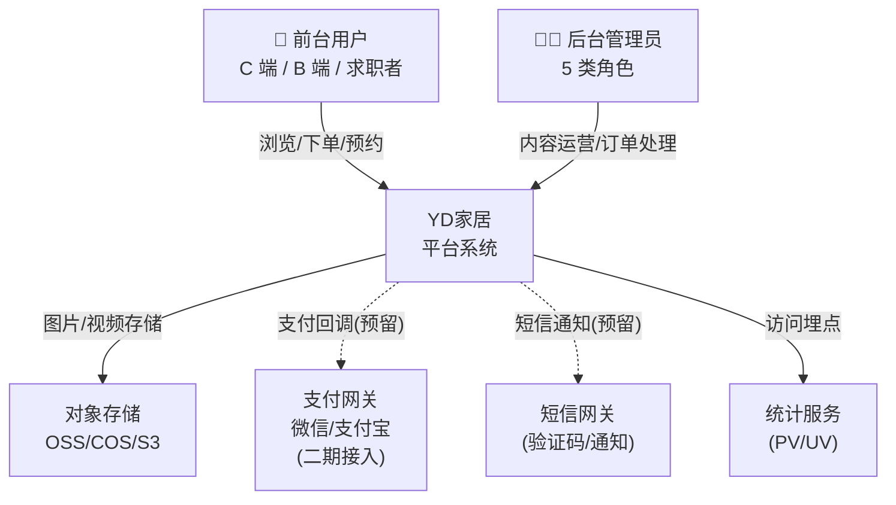
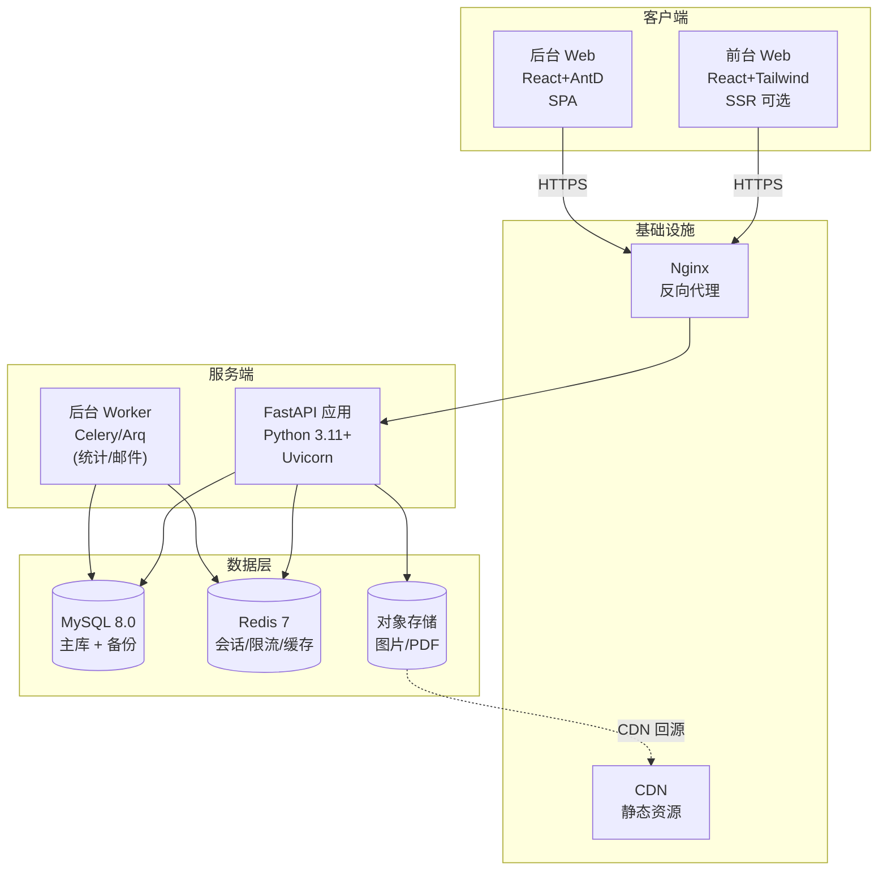
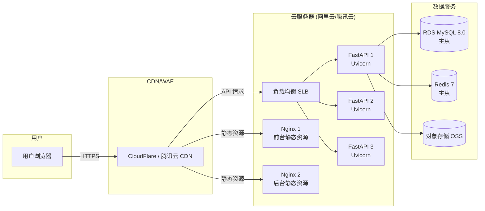
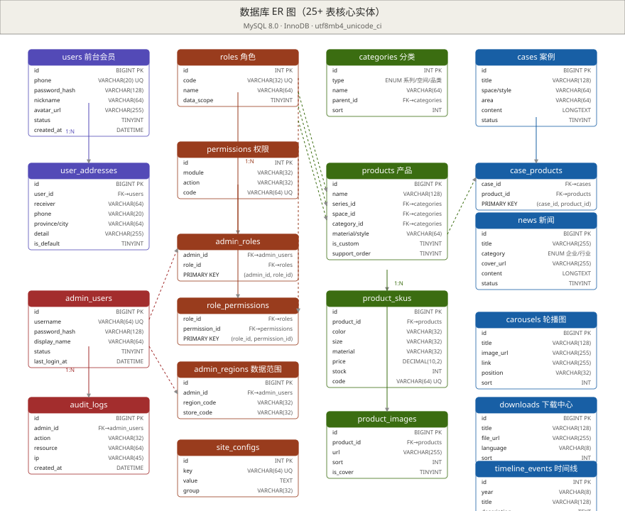
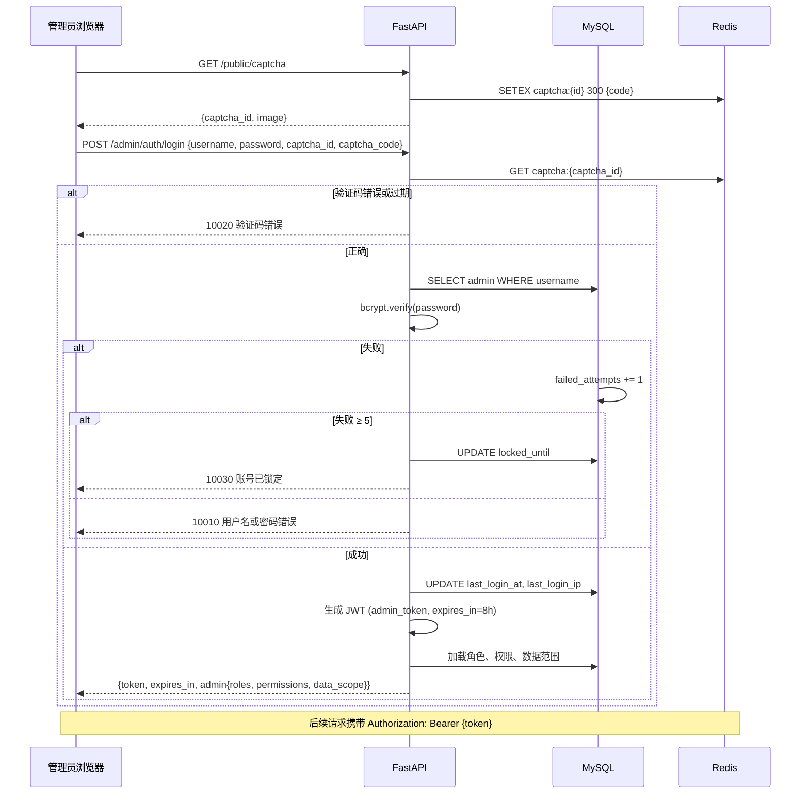
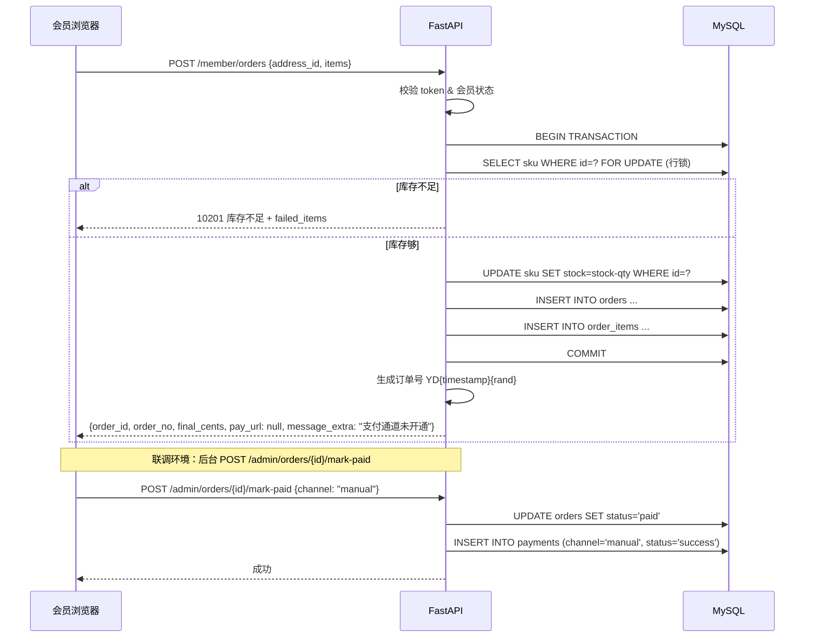
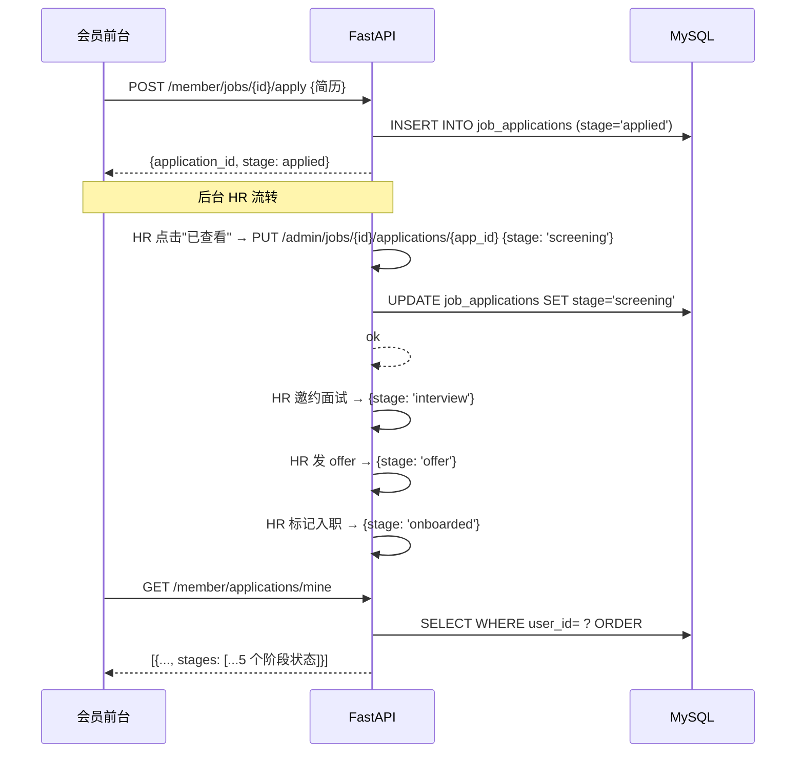
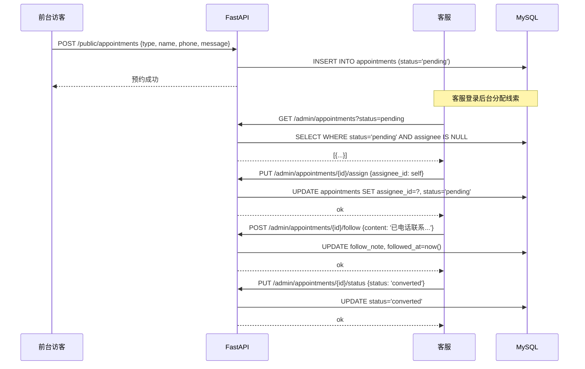

# YD家居平台 · 开发技术文档

> 版本：v1.1.1 ｜ 日期：2026-08-20 ｜ 状态：依据 PRD v1.2 + UI/UX 设计规格文档（v1.0）+ 数据库设计文档 v1.1 同步更新  
> 角色：架构通（Software Architect）｜ 范围：前后端开发流程、接口设计、数据库设计、前后端工程实现  
> 引用文档：`PRD_企业家居官网及后台管理系统.md`、`UI文档/UI-UX设计规格文档.md`、`开发文档/数据库设计文档.md`、`原型/prototype_*.html`（14 个交互原型）

> **v1.1 同步说明**：依据数据库设计文档 v1.1 同步更新 §2.3.2 products 表（新增 product_code / other_images_json / is_top / status 三态枚举 / chk_products_draft_no_top）、§2.3.3 news 表（新增 is_recommend / is_published / expire_at / 两条 CHECK 约束）、§4.3.2/§4.3.3 产品接口响应、§4.3.7/§4.3.8 新闻接口响应。
>
> **v1.1.1 同步说明（2026-08-20）**：依据「开发工具」清单调整，**移除 Docker 依赖**：
>
> - §6.1.1 必需工具 → 删除 Docker 行，新增 MySQL/Redis 本机安装说明
> - §6.1.2 本地启动 → 步骤 3 改为「本机 MySQL+Redis」或「Lite 模式」
> - §6.1.3 → 由「Docker Compose」改为「本机依赖服务（无 Docker）」
> - §6.1.4（新增） → Lite 模式（DB_TYPE=sqlite）切换说明
> - 附录 C「开发工具」表 → 删除 docker 行
> - §1.6 目录结构 → 移除 Dockerfile / docker-compose.yml
> - §6.5.1 CI services → 明确注释为 GitHub Actions 内置，与本机无关
> - 后续网站功能扩展沿用本工具清单与 Lite 模式

---

## 目录

- [第 0 章 · 文档说明](#第-0-章--文档说明)
- [第 1 章 · 系统总体架构](#第-1-章--系统总体架构)
- [第 2 章 · 数据库设计](#第-2-章--数据库设计)
- [第 3 章 · 后端设计（FastAPI）](#第-3-章--后端设计fastapi)
- [第 4 章 · 接口设计（REST API）](#第-4-章--接口设计rest-api)
- [第 5 章 · 前端设计（React）](#第-5-章--前端设计react)
- [第 6 章 · 开发流程](#第-6-章--开发流程)
- [附录 A · 错误码表](#附录-a--错误码表)
- [附录 B · 环境变量清单](#附录-b--环境变量清单)
- [附录 C · 第三方依赖清单](#附录-c--第三方依赖清单)
- [附录 D · 关键业务时序图](#附录-d--关键业务时序图)

---

## 第 0 章 · 文档说明

### 0.1 文档信息

| 项    | 内容                                         |
| ---- | ------------------------------------------ |
| 产品名称 | YD家居平台（前台展示系统 + 后台管理系统）                    |
| 文档版本 | v1.2                                       |
| 创建日期 | 2026-08-18                                 |
| 撰写依据 | PRD v1.2 + UI/UX 设计规格文档 v1.1 + 14 个高保真交互原型 |
| 目标读者 | 前端工程师、后端工程师、DBA、测试工程师、技术负责人                |
| 一期范围 | 前台全模块 + 后台全模块（详见 PRD §2.4）                 |
| 本版更新 | **v1.2（2026-08-21）**：① §5.2 后台管理系统补「分类管理」页与路由；② §4.5 产品管理接口补充说明（PUT 部分更新、sort DESC、GET 详情 get_admin_product）；③ 仪表盘图表 ECharts 实现说明（src/vendor 引入） |

### 0.2 阅读对象与使用方式

| 角色    | 重点阅读章节                         |
| ----- | ------------------------------ |
| 前端工程师 | 第 5 章、附录 C 依赖清单、UI/UX 文档第七篇组件库 |
| 后端工程师 | 第 3 章、第 4 章、附录 A 错误码表          |
| DBA   | 第 2 章、附录 C                     |
| 测试工程师 | 第 4 章接口契约、第 6 章测试策略            |
| 技术负责人 | 第 1 章 ADR、第 6 章开发流程与里程碑        |

### 0.3 术语表

| 术语       | 含义                                          |
| -------- | ------------------------------------------- |
| RBAC     | Role-Based Access Control，基于角色的访问控制         |
| JWT      | JSON Web Token，无状态会话令牌                      |
| SLA      | Service Level Agreement，服务等级协议              |
| SKU      | Stock Keeping Unit，最小存货单位（颜色×尺寸×材质组合）       |
| 软删除      | 不物理删除数据，通过状态字段标记（`is_deleted` / `status=0`） |
| 数据范围     | 管理员绑定的区域/门店范围，服务端按此过滤数据可见性                  |
| 关键词应答    | 在线客服的规则匹配型自动回复（命中关键词返回预设答案）                 |
| ADR      | Architecture Decision Record，架构决策记录         |
| Monorepo | 单一仓库管理多个子项目（前台/后台/共享）                       |

### 0.4 范围（In / Out）

**In（一期包含）**：

- 前台全部模块（首页、产品中心、SKU 详情、案例、新闻、招聘投递、关于我们含联系我们、下载中心、在线预约、在线客服、站内搜索、购物车与结算、我的订单、我的预约、我的投递、会员中心）
- 后台全部模块（登录、仪表盘、轮播图、产品/分类/SKU、案例、新闻、招聘/投递、关于、预约、留言、订单、系统管理含角色/权限/审计/站点配置）
- 细粒度权限（按模块 + 操作）、数据隔离（多区域/多门店）、审计日志
- 移动端响应式适配
- 关键业务时序：登录鉴权、下单/支付、投递 5 阶段、预约线索

**Out（本期不做，参考 PRD §2.4）**：

- 多语言（中英文切换，UI 文档已移除入口）
- SEO 全套（meta/sitemap/JSON-LD）
- 支付正式对账（保留回调接口占位，二期对接）
- 完整会员营销（积分/优惠券/活动）
- 生成式 AI 客服（保留关键词应答）
- 小程序 / App 原生端

### 0.5 文档约定

- **API 路径**：所有接口以 `/api/v1` 为前缀（v1 为本期稳定版）。
- **认证头**：前台会员用 `Authorization: Bearer <jwt>`，后台管理员用 `Authorization: Bearer <admin_jwt>`。
- **时间格式**：ISO 8601（`2026-08-18T10:30:00+08:00`），所有时间以东八区为基准。
- **金额**：单位为分（`amount_cents` 整型），响应中同时返回 `amount_yuan`（字符串，保留 2 位小数）。
- **命名**：表名 `snake_case` 复数（如 `users` / `product_skus`），字段 `snake_case` 单数，前端组件 `PascalCase`。

---

## 第 1 章 · 系统总体架构

### 1.1 架构概览

YD家居平台采用**前后端分离 + 双前端**的标准企业级架构：

```
┌──────────────────────────────────────────────────────────────┐
│                        用户层 (Users)                          │
│   C 端消费者  ·  B 端客户  ·  求职者  ·  后台 5 类角色管理员     │
└──────────────────────────────────────────────────────────────┘
              │                                       │
       ┌──────▼──────┐                         ┌─────▼─────┐
       │  前台展示系统  │                         │ 后台管理系统 │
       │ React+Tailwind│                         │React+AntD  │
       │   Vite 5      │                         │  Vite 5    │
       │  端口 3000    │                         │  端口 3001  │
       └──────┬───────┘                         └─────┬─────┘
              │ HTTPS                              │ HTTPS
              │ /api/v1/*                          │ /api/v1/admin/*
              └─────────────┬───────────────────────┘
                            │
                    ┌───────▼────────┐
                    │  FastAPI 服务   │  ← 单体应用，模块化分层
                    │   Uvicorn       │
                    │   端口 8000     │
                    └───────┬────────┘
                            │
              ┌─────────────┼─────────────┐
              │             │             │
       ┌──────▼──────┐ ┌────▼────┐ ┌──────▼──────┐
       │  MySQL 8.0   │ │  Redis  │ │  对象存储     │
       │  主库 + 备份  │ │  缓存   │ │  OSS/COS/S3  │
       │  端口 3306   │ │  端口   │ │  + CDN 加速  │
       │              │ │  6379   │ │              │
       └──────────────┘ └────────┘ └──────────────┘
```

**核心特征**：

1. **双前端独立部署**：前台（`yd-home-web`，端口 3000）与后台（`yd-admin-web`，端口 3001）独立构建、部署、CDN 分发。
2. **统一 API 网关**：FastAPI 单体应用统一提供 `/api/v1`（前台）与 `/api/v1/admin`（后台）两套路由，共享底层 service/repository 层。
3. **共享代码层**：`packages/shared` 维护 TypeScript 类型定义、工具函数、请求封装、设计 Token，前后端跨应用复用。
4. **无状态后端**：FastAPI 不保存会话状态（JWT 自包含），便于横向扩缩容。
5. **可插拔存储**：对象存储抽象 `Storage` 接口（OSS/COS/S3 可配置），本地开发用本地磁盘。

### 1.2 前台与后台模块架构图

下图分别展示前台展示系统与后台管理系统的模块架构（与 UI/UX 文档第三/四篇对应）。

**前台系统模块架构图**（22 个页面 + 组件 + API 调用 + 状态 + 共享模块）：



**后台系统模块架构图**（认证 + 16 个管理模块 + API 调用 + 共享模块）：



**关键设计说明**：

- 前台按 **页面 → 组件 → API 调用 → 状态/共享** 的单向依赖流向，组件层不直接调用 API，必须经 API 调用层封装。
- 后台按 **认证（拦截）→ 16 个模块 → API 调用 → 共享** 结构，认证体系对所有模块生效，路由守卫 + 角色守卫双重校验。
- 双前端共用 `packages/shared` 中的 `types/`（TS 类型）、`utils/request.ts`（请求封装）、`utils/format.ts`（格式化函数），减少重复代码。

### 1.3 C4 架构视图

采用 C4 模型描述系统架构，自顶向下四个层次。

#### 1.3.1 系统上下文图（Level 1）



#### 1.3.2 容器图（Level 2）



### 1.4 技术栈选型

| 层            | 选型                                        | 备选                  | 关键理由                                               |
| ------------ | ----------------------------------------- | ------------------- | -------------------------------------------------- |
| **后端语言**     | Python 3.11+                              | -                   | FastAPI 要求 3.8+，3.11+ 性能与类型注解更优                    |
| **后端框架**     | FastAPI 0.110+                            | Flask / Django REST | 原生异步、自动 OpenAPI、Pydantic 强类型、与 SQLAlchemy 2.0 适配最佳 |
| **数据库**      | MySQL 8.0                                 | PostgreSQL 16       | 国内运维生态成熟；utf8mb4_unicode_ci；JSON 字段够用；团队熟悉         |
| **ORM**      | SQLAlchemy 2.0                            | Tortoise / 裸 SQL    | FastAPI 事实标准，Alembic 迁移成熟，类型友好                     |
| **迁移**       | Alembic                                   | -                   | SQLAlchemy 官方迁移工具                                  |
| **缓存/会话**    | Redis 7                                   | -                   | 会话黑名单、限流计数器、热点缓存                                   |
| **前台框架**     | React 18 + TypeScript 5                   | Vue 3               | UI/UX 文档已锁定；生态丰富                                   |
| **前台 UI**    | Tailwind CSS 3.4                          | -                   | UI/UX 文档第二篇设计 Token 全部基于 Tailwind 实现               |
| **前台构建**     | Vite 5                                    | Next.js (SSR)       | 首期不做 SSR（PRD §7.4 SEO Out）；SPA 足够                  |
| **前台路由**     | React Router 6                            | TanStack Router     | 生态成熟、文档齐全                                          |
| **前台状态**     | Zustand + React Query                     | Redux Toolkit       | 轻量、TS 友好；React Query 解决服务端缓存与请求去重                  |
| **后台框架**     | React 18 + TypeScript 5                   | -                   | 与前台统一技术栈                                           |
| **后台 UI**    | Ant Design 5                              | Arco Design         | UI/UX 文档第三篇锁定 AntD，组件库最完整                          |
| **后台布局**     | ProLayout / 自研                            | -                   | 标准企业级布局（侧边栏 + 顶栏 + 内容区）                            |
| **状态管理**     | Zustand                                   | -                   | 与前台一致                                              |
| **HTTP 客户端** | Axios + 拦截器                               | -                   | 拦截器统一处理 JWT 注入、错误码、loading                         |
| **对象存储**     | 抽象 Storage 接口                             | 直连云厂商               | 本地开发用本地磁盘 mock，生产切云                                |
| **支付**       | 微信 / 支付宝（占位）                              | -                   | PRD §2.4 Out，先预留接口                                 |
| **CI/CD**    | GitHub Actions                            | GitLab CI           | 与代码仓库同源                                            |
| **监控**       | Sentry（错误） + Prometheus（指标）               | -                   | 开源、主流                                              |
| **测试**       | pytest（后端） + Vitest（前端） + Playwright（E2E） | -                   | 三层覆盖                                               |

### 1.5 部署架构



**部署清单**：

| 资源        | 规格（一期）         | 数量       | 用途                                    |
| --------- | -------------- | -------- | ------------------------------------- |
| 云服务器      | 4C8G           | 3        | FastAPI 节点（Gunicorn + Uvicorn worker） |
| 云服务器      | 2C4G           | 2        | Nginx 反向代理                            |
| RDS MySQL | 4C16G 100G SSD | 1 主 1 从  | 主库 + 备份                               |
| Redis     | 2C4G 4G        | 1 主 1 从  | 会话/缓存/限流                              |
| 对象存储      | 标准存储 500G      | 1 bucket | 图片/PDF                                |
| CDN       | 流量包 500G/月     | 1        | 静态资源加速                                |
| 域名 SSL    | -              | 2        | api.yd-home.com / admin.yd-home.com   |

### 1.6 代码仓库与目录结构

采用 **monorepo**（单仓多包）管理，pnpm workspace + Python 子项目。

```
yd-home-platform/                          # 仓库根目录
├── .github/                              # CI 配置
│   └── workflows/
│       ├── fe-build.yml
│       └── api-test.yml
├── apps/                                 # 独立部署应用
│   ├── web/                              # 前台展示系统
│   │   ├── src/
│   │   │   ├── pages/                    # 页面（按路由）
│   │   │   │   ├── Home.tsx
│   │   │   │   ├── products/
│   │   │   │   ├── cases/
│   │   │   │   ├── news/
│   │   │   │   ├── jobs/
│   │   │   │   ├── about/
│   │   │   │   ├── member/
│   │   │   │   └── ...
│   │   │   ├── components/               # 业务组件
│   │   │   │   ├── layout/               # Navbar / Footer / MainLayout
│   │   │   │   ├── business/             # ProductCard / Timeline / Carousel
│   │   │   │   └── feedback/             # Toast / Modal / Loading
│   │   │   ├── api/                      # API 调用层
│   │   │   │   ├── client.ts             # axios 实例 + 拦截器
│   │   │   │   ├── products.ts
│   │   │   │   ├── cases.ts
│   │   │   │   ├── news.ts
│   │   │   │   ├── jobs.ts
│   │   │   │   ├── orders.ts
│   │   │   │   ├── member.ts
│   │   │   │   ├── upload.ts
│   │   │   │   └── search.ts
│   │   │   ├── hooks/                    # 自定义 Hooks
│   │   │   │   ├── useAuth.ts
│   │   │   │   ├── useMember.ts
│   │   │   │   └── useDebounce.ts
│   │   │   ├── stores/                   # Zustand store
│   │   │   │   ├── cart.ts
│   │   │   │   └── ui.ts
│   │   │   ├── router.tsx
│   │   │   ├── App.tsx
│   │   │   └── main.tsx
│   │   ├── public/
│   │   ├── tailwind.config.js            # 设计 Token（UI/UX 文档第二篇）
│   │   ├── vite.config.ts
│   │   ├── tsconfig.json
│   │   └── package.json
│   │
│   └── admin/                            # 后台管理系统
│       ├── src/
│       │   ├── pages/                    # 16 个管理模块
│       │   │   ├── login/
│       │   │   ├── dashboard/
│       │   │   ├── carousels/
│       │   │   ├── products/
│       │   │   ├── categories/
│       │   │   ├── skus/
│       │   │   ├── cases/
│       │   │   ├── news/
│       │   │   ├── jobs/
│       │   │   ├── applications/
│       │   │   ├── about/
│       │   │   ├── appointments/
│       │   │   ├── messages/
│       │   │   ├── orders/
│       │   │   ├── system/               # 角色/管理员/审计
│       │   │   └── site-config/
│       │   ├── layouts/                  # ProLayout / 空白布局
│       │   ├── components/
│       │   ├── api/admin/                # 后台 API 调用层
│       │   │   ├── auth.ts
│       │   │   ├── dashboard.ts
│       │   │   └── ...
│       │   ├── hooks/
│       │   ├── stores/
│       │   ├── router.tsx                # 含路由守卫
│       │   └── main.tsx
│       ├── vite.config.ts
│       └── package.json
│
├── packages/                             # 共享包
│   └── shared/                           # 前后端共享
│       ├── src/
│       │   ├── types/                    # TypeScript 类型（与 Pydantic 同步）
│       │   │   ├── product.ts
│       │   │   ├── order.ts
│       │   │   ├── user.ts
│       │   │   └── index.ts
│       │   ├── utils/
│       │   │   ├── request.ts            # fetch 封装（无 axios 依赖）
│       │   │   ├── format.ts             # 金额/日期/手机号
│       │   │   └── validate.ts
│       │   └── constants/
│       │       ├── error-codes.ts        # 错误码常量（前后端同步）
│       │       └── permissions.ts        # 权限码常量
│       └── package.json
│
├── api/                                  # FastAPI 后端
│   ├── app/
│   │   ├── main.py                       # 入口
│   │   ├── core/                         # 核心配置
│   │   │   ├── config.py                 # Settings (pydantic-settings)
│   │   │   ├── security.py               # JWT / 密码哈希
│   │   │   ├── database.py               # SQLAlchemy 引擎
│   │   │   ├── redis.py
│   │   │   ├── storage.py                # 存储抽象
│   │   │   └── exceptions.py             # 自定义异常
│   │   ├── api/                          # 路由层
│   │   │   ├── v1/
│   │   │   │   ├── __init__.py
│   │   │   │   ├── public/               # 前台公开
│   │   │   │   │   ├── home.py
│   │   │   │   │   ├── products.py
│   │   │   │   │   └── ...
│   │   │   │   ├── member/               # 前台会员
│   │   │   │   │   ├── auth.py
│   │   │   │   │   ├── orders.py
│   │   │   │   │   └── ...
│   │   │   │   └── admin/                # 后台
│   │   │   │       ├── auth.py
│   │   │   │       ├── dashboard.py
│   │   │   │       └── ...
│   │   ├── services/                     # 业务层
│   │   │   ├── product_service.py
│   │   │   ├── order_service.py
│   │   │   └── ...
│   │   ├── repositories/                 # 仓储层（封装 SQLAlchemy）
│   │   │   ├── product_repo.py
│   │   │   └── ...
│   │   ├── models/                       # SQLAlchemy ORM 模型
│   │   │   ├── user.py
│   │   │   ├── product.py
│   │   │   └── ...
│   │   ├── schemas/                      # Pydantic 校验
│   │   │   ├── product.py
│   │   │   └── ...
│   │   ├── middleware/                   # 中间件
│   │   │   ├── audit.py
│   │   │   ├── rate_limit.py
│   │   │   └── logging.py
│   │   └── utils/
│   ├── alembic/                          # 数据库迁移
│   │   ├── versions/
│   │   └── env.py
│   ├── tests/
│   │   ├── unit/
│   │   ├── integration/
│   │   └── conftest.py
│   ├── pyproject.toml                    # 依赖（Poetry/uv）
│   ├── alembic.ini
│   └── .env.example                     # 含 DB_TYPE=mysql/sqlite 切换项
│
├── docs/                                 # 文档
│   ├── PRD_企业家居官网及后台管理系统.md
│   ├── UI文档/
│   └── 开发文档/
│       ├── figures/
│       ├── 开发技术文档.md                # 本文档
│       └── 开发技术文档.html              # HTML 浏览版
│
├── scripts/                              # 脚本
│   ├── seed.py                           # 种子数据
│   └── backup.sh
│
├── pnpm-workspace.yaml
└── README.md
```

> 仓库**不包含** `Dockerfile` 与 `docker-compose.yml`：本项目所有环境均走原生依赖或 Lite 模式（详见 §6.1.3 / §6.1.4）。后续网站功能扩展沿用此约定。

### 1.7 架构决策记录（ADR）

> ADR 模板：Status（Proposed/Accepted/Deprecated/Superseded）| Context | Decision | Consequences

---

#### ADR-001 · 双前端独立部署（拆分 React 应用）

**Status**: Accepted

**Context**：  
PRD §4.1 明确"前后端分离"；UI/UX 文档采用两套设计系统（前台 Tailwind、后台 AntD）。若采用单一 monorepo React 应用 + 路由切换，技术上可行但工程复杂（双主题切换、AntD 体积大拖慢前台首屏、权限控制耦合）。

**Decision**：  
采用 **monorepo 双独立应用** 架构：

- 前台 `apps/web`：React + Tailwind，无 AntD 依赖
- 后台 `apps/admin`：React + AntD 5
- 共享 `packages/shared`：仅 TypeScript 类型、工具函数、设计 Token 常量
- 各自独立 `package.json`、独立 `vite.config.ts`、独立 CDN 部署

**Consequences**：

- ✅ 前台首屏体积小（无 AntD 100KB+ 依赖），符合 UI/UX 性能要求
- ✅ 双主题独立演进，互不干扰
- ✅ 后台可独立做权限管理、不暴露给前台
- ⚠️ 类型同步需在 `packages/shared` 统一管理，后端 Pydantic Schema 变动需同步 TS 类型
- ⚠️ 仓库体积增大（两个 node_modules），需 pnpm workspace 治理

---

#### ADR-002 · 数据库选型：MySQL 8.0

**Status**: Accepted

**Context**：  
PRD §4.2 仅规定"关系型数据库 + 对象存储"，未指定具体 DBMS。

**Decision**：  
采用 **MySQL 8.0**（InnoDB 引擎，utf8mb4_unicode_ci 字符集）。

**Consequences**：

- ✅ 国内运维生态成熟，RDS 直接支持，DBA 团队熟悉
- ✅ utf8mb4 支持完整 Unicode（含 emoji），适配会员昵称
- ✅ JSON 字段类型支持部分非结构化数据（如扩展属性）
- ⚠️ 全文检索需借助 Elasticsearch（PRD Out 范围未涉及）
- ⚠️ 不支持数组/枚举原生类型，需在应用层维护
- 备选 PostgreSQL 16 优势（更强 JSONB、更完整枚举）暂未采用，预留二期评估

---

#### ADR-003 · 认证方案：JWT + 图形验证码（双通道）

**Status**: Accepted

**Context**：  
PRD §6.1 要求"账号密码 + 图形验证码登录"；§4.2 提到"JWT/Session 会话"。需在无状态与服务端可控之间平衡。

**Decision**：

- **后台管理员**：账号密码 + 图形验证码 → 颁发 JWT（`admin_token`，有效期 8h）+ Refresh Token（30d）
- **前台会员**：手机号 + 密码 → 颁发 JWT（`member_token`，有效期 7d）+ Refresh Token（90d）
- **JWT Payload**：`{ sub, role, data_scope, exp, iat, jti }`
- **Token 撤销**：Redis 维护 `jwt_blacklist:{jti}` 集合，TTL 与 token 一致
- **图形验证码**：`/api/v1/admin/captcha` 颁发，5 分钟有效，5 次错误后强制刷新

**Consequences**：

- ✅ 无状态，FastAPI 横向扩缩容友好
- ✅ 双 Token 机制减少登录态丢失
- ⚠️ 退出登录需将 jti 写入 Redis 黑名单
- ⚠️ 图形验证码依赖本地 Redis 存储，二期可切换为阿里云验证码服务

---

#### ADR-004 · 数据隔离：单库 + 字段过滤（多区域/多门店）

**Status**: Accepted

**Context**：  
PRD §6.12 要求"管理员绑定区域/门店，数据按范围过滤（多区域/多门店）"，§7.3 强调"权限校验服务端强制执行，数据隔离在服务端按角色范围过滤"。

**Decision**：  
采用 **单库单 schema + 字段过滤** 方案：

- 所有数据表带 `region_code` 与 `store_code` 字段（可空）
- `admin_regions` 表记录管理员 → 区域/门店的映射
- `data_scope` 枚举：`all`（全部）/ `region`（本区域）/ `store`（本门店）/ `self`（本人）
- 仓储层（`repositories/`）封装 `apply_data_scope(query, admin)` 函数自动注入 WHERE 条件
- API 层禁止直接查 ORM，必须经仓储层

**Consequences**：

- ✅ 单库运维成本低，迁移/备份简单
- ✅ 区域/门店组合灵活，可在 WHERE 条件动态拼接
- ⚠️ 必须强制所有查询走仓储层，否则越权（通过代码 review + 测试用例覆盖）
- 备选"多租户 schema"成本高、跨租户统计复杂，未采用

---

#### ADR-005 · 对象存储抽象（可插拔）

**Status**: Accepted

**Context**：  
PRD §11 风险"图片/PDF 存储依赖对象存储（OSS/COS/S3）与 CDN"。本地开发与生产环境需切换。

**Decision**：  
定义 `Storage` 抽象接口，提供 3 种实现：

- `LocalStorage`：本地文件系统（开发环境，存储到 `./uploads/`）
- `OSSStorage`：阿里云 OSS
- `COSStorage`：腾讯云 COS
- `S3Storage`：AWS S3（兼容 S3 协议）

**Consequences**：

- ✅ 业务代码依赖 `Storage` 接口，切换实现不需改业务
- ✅ 本地开发不依赖云服务，CI/E2E 测试可用 LocalStorage
- ⚠️ 不同云厂商的签名 URL、CDN 缓存策略有差异，抽象层需支持每家特有配置

---

#### ADR-006 · 支付预留：仅留接口占位

**Status**: Accepted

**Context**：  
PRD §2.4 明确支付"Out（本期不做）"，但 PRD §5.12 与 §6.11 需要"对接支付（微信/支付宝，预留）"。

**Decision**：

- 数据库保留 `payments` 表（订单支付流水）
- API 预留 `POST /api/v1/orders/{id}/pay` 与 `POST /api/v1/payments/callback/{channel}` 路由
- 实现中返回"支付通道未开通"错误码（`PAYMENT_DISABLED`）
- 订单状态机包含 `paid` 状态，可通过后台手动"标记已付款"实现联调

**Consequences**：

- ✅ 一期可完整联调"下单 → 标记付款 → 发货 → 完成"闭环
- ✅ 二期对接支付时只需实现具体通道，无需改业务逻辑
- ⚠️ 一期不做真实支付对账，需在 UI 提示"演示环境"

---

#### ADR-007 · 前后端类型同步：Pydantic → TypeScript 自动生成

**Status**: Accepted

**Context**：  
ADR-001 决定 monorepo 双前端 + FastAPI 后端，前后端类型同步是痛点（手抄易错）。

**Decision**：

- 后端 Pydantic Schema 加 `@json_schema` 导出
- 用 `datamodel-code-generator` 或 `pydantic2ts` 从 OpenAPI Schema 自动生成 `packages/shared/types/*.ts`
- CI 中加校验步骤：若生成的 TS 与 Pydantic 不一致则 PR fail

**Consequences**：

- ✅ 类型 100% 一致，避免运行时类型错误
- ✅ 后端改字段后前端 TS 编译即可发现问题
- ⚠️ 引入构建工具链，前端开发者需了解生成流程

---

> ADR 持续追加，命名规则 `ADR-NNN · 标题`，记录到本文档。

---

### 1.8 关键设计原则

| 原则             | 落地方式                                |
| -------------- | ----------------------------------- |
| **前后端分离**      | FastAPI 仅返回 JSON，前端路由与渲染独立          |
| **RESTful 规范** | 资源名词复数、HTTP 方法语义化、统一响应格式（详见第 4 章）   |
| **无状态后端**      | JWT 自包含，Redis 仅用于黑名单/缓存/限流          |
| **服务端强校验**     | Pydantic 校验请求体、权限装饰器拦截、仓储层数据范围过滤    |
| **类型优先**       | 后端 Pydantic + 前端 TypeScript，CI 自动同步 |
| **可观测性**       | 结构化日志、错误埋点（Sentry）、关键指标 Prometheus  |
| **渐进式增强**      | 一期功能完整，二期平滑扩展（支付/SEO/会员营销）          |

---

## 第 2 章 · 数据库设计

### 2.1 设计约定

#### 2.1.1 命名规范

| 类别   | 规范                                         | 示例                                            |
| ---- | ------------------------------------------ | --------------------------------------------- |
| 表名   | `snake_case` 复数                            | `users` / `product_skus` / `job_applications` |
| 字段名  | `snake_case` 单数                            | `user_id` / `created_at` / `is_deleted`       |
| 主键   | `id`（BIGINT UNSIGNED AUTO_INCREMENT）       | `id`                                          |
| 外键   | `{关联表单数}_id`                               | `user_id` / `product_id`                      |
| 唯一约束 | `{字段名}` 或 `{字段1}_{字段2}`                    | `phone` / `username`                          |
| 索引   | `idx_{表名}_{字段}` / `uniq_{表名}_{字段}`         | `idx_orders_user_id` / `uniq_users_phone`     |
| 时间字段 | `created_at` / `updated_at` / `deleted_at` | DATETIME(3) 毫秒精度                              |
| 状态字段 | `status`（TINYINT 枚举值）                      | `status TINYINT NOT NULL DEFAULT 1`           |
| 布尔字段 | `is_{状态}` 或 `has_{属性}`                     | `is_deleted` / `is_default`                   |

#### 2.1.2 通用字段

所有业务表（除关联表外）必须包含：

```sql
id              BIGINT UNSIGNED NOT NULL AUTO_INCREMENT  -- 主键
created_at      DATETIME(3)   NOT NULL DEFAULT CURRENT_TIMESTAMP(3)
updated_at      DATETIME(3)   NOT NULL DEFAULT CURRENT_TIMESTAMP(3) ON UPDATE CURRENT_TIMESTAMP(3)
deleted_at      DATETIME(3)   NULL                        -- 软删除时间（NULL = 未删除）
is_deleted      TINYINT(1)    NOT NULL DEFAULT 0          -- 软删除标记（双保险）
```

> **为什么双字段？**：`deleted_at` 用于范围查询（`WHERE deleted_at IS NULL`），`is_deleted` 用于 JOIN 条件简化（部分老 SQL 不支持 `IS NULL`）。

#### 2.1.3 字符集与时区

- 字符集：`utf8mb4` / 排序：`utf8mb4_unicode_ci`
- 时区：数据库服务器与连接均设为 `Asia/Shanghai`（UTC+8），应用层不跨时区转换
- 金额：存储为**整型分**（`amount_cents BIGINT`），应用层展示时除以 100

#### 2.1.4 软删除策略

- 列表查询一律过滤 `WHERE is_deleted = 0`
- 关联查询使用 LEFT JOIN + `ON ... AND a.is_deleted = 0`
- 硬删除仅限敏感数据（用户隐私、订单留痕要求不可硬删）

#### 2.1.5 数据隔离字段约定（审核新增）

数据隔离（PRD §6.12 / §7.3）**不是所有表都适用**，仅以下"区域敏感"表需要 `region_code` / `store_code`：

| 表                  | region_code | store_code | 说明            |
| ------------------ | ----------- | ---------- | ------------- |
| `orders`           | ✅           | ✅          | 按收货省份/归属门店    |
| `appointments`     | ✅           | ✅          | 预约客户区域/门店     |
| `messages`         | ✅           | ✅          | 留言客户区域/门店     |
| `job_applications` | ✅           | ⭕          | 按投递区域（可选）     |
| `products` 等内容表    | ⭕           | ⭕          | 内容全局共享，不做区域隔离 |

> **审核修正**：原 §2.6 的 `apply_data_scope()` 假设所有表都有 `region_code/store_code`，但实际只有订单/预约/留言/投递需要区域隔离，内容表（产品/案例/新闻/招聘）应全局可见。仓储层按"表是否标记 `IS_DATA_SCOPED`"决定是否注入过滤条件，避免对内容表误加空条件导致查不到数据。

### 2.2 ER 总览图

> **ER 图保存位置**：`figures/er-diagram.svg`（详见附图）



**ER 图说明**：

- 颜色区分 5 个域：紫色 = 前台用户域、红色 = 后台用户域、橙色 = 权限/配置、绿色 = 产品域、蓝色 = 内容域
- 业务/订单域（订单/预约/留言/招聘/投递）字段较多，详见 §2.3 数据字典详细表结构
- 实线表示强外键约束，虚线表示逻辑关联（如 admin_users 通过 admin_roles 与 roles 关联）
- **图幅限制说明**：ER 图聚焦核心实体（20 张），业务/订单域 9 张表（`orders / order_items / payments / appointments / messages / chat_keywords / jobs / job_applications / stats_visit`）在图中以说明文字呈现，字段级定义以数据字典为准；本文档全量共 **32 张表**。

**核心实体关系概览**：

| 关系                                  | 类型    | 说明                      |
| ----------------------------------- | ----- | ----------------------- |
| users → user_addresses              | 1:N   | 一个会员多个收货地址              |
| users → orders                      | 1:N   | 一个会员多个订单                |
| users → job_applications            | 1:N   | 会员投递记录（可匿名投递，但若登录则关联）   |
| products → product_skus             | 1:N   | 一个产品多个 SKU（颜色×尺寸×材质）    |
| products → product_images           | 1:N   | 产品图集                    |
| categories → products               | 1:N   | 三类分类（系列/空间/品类）各一对多产品    |
| products ↔ cases                    | N:M   | 通过 case_products 中间表    |
| orders → order_items → product_skus | 1:N:1 | 订单项关联到具体 SKU            |
| admin_users ↔ roles                 | N:M   | 通过 admin_roles 中间表      |
| roles ↔ permissions                 | N:M   | 通过 role_permissions 中间表 |
| admin_users → admin_regions         | 1:N   | 多区域/多门店绑定               |
| admin_users → audit_logs            | 1:N   | 操作审计                    |

### 2.3 数据字典

#### 2.3.1 用户与权限域（10 张表）

**`users` 前台会员**

| 字段              | 类型              | 约束                 | 说明                             |
| --------------- | --------------- | ------------------ | ------------------------------ |
| id              | BIGINT UNSIGNED | PK, AUTO_INCREMENT | 主键                             |
| phone           | VARCHAR(20)     | NOT NULL, UNIQUE   | 手机号（登录账号）                      |
| password_hash   | VARCHAR(128)    | NOT NULL           | bcrypt 哈希                      |
| nickname        | VARCHAR(64)     | NULL               | 昵称                             |
| avatar_url      | VARCHAR(255)    | NULL               | 头像 URL                         |
| email           | VARCHAR(128)    | NULL               | 邮箱（可选）                         |
| gender          | TINYINT         | NULL               | 0 未知 1 男 2 女                   |
| status          | TINYINT         | NOT NULL DEFAULT 1 | 0 禁用 1 正常                      |
| failed_attempts | TINYINT         | NOT NULL DEFAULT 0 | 连续登录失败次数（防爆破，与 admin_users 对齐） |
| locked_until    | DATETIME(3)     | NULL               | 锁定到期时间（失败 ≥ 5 次锁定 30 分钟）       |
| last_login_at   | DATETIME(3)     | NULL               | 最近登录                           |
| created_at      | DATETIME(3)     | NOT NULL           | -                              |
| updated_at      | DATETIME(3)     | NOT NULL           | -                              |
| deleted_at      | DATETIME(3)     | NULL               | 软删除                            |
| is_deleted      | TINYINT(1)      | NOT NULL DEFAULT 0 | 软删除标记                          |

索引：`uniq_phone (phone)`，`idx_status_created (status, created_at)`

> **审核补充（隐私合规，PRD §7.3 个人信息保护法）**：
>
> - **存储**：手机号为登录账号，库中明文存储（bcrypt 仅用于密码），但**接口响应一律脱敏**（`138****8000`），仅后台客服/订单处理角色可按需查看完整手机号（受数据范围 + 权限双重限制）；
> - **加密方案（可选增强）**：若后续需要更高安全等级，可将 `phone` 改为 `phone_encrypted`（AES-256-GCM）+ `phone_index`（HMAC-SHA256 哈希用于等值查询），登录时用哈希索引查、解密比对；
> - **日志脱敏**：应用日志、审计日志、异常堆栈中禁止输出完整手机号（统一 `mask_phone()` 工具函数）。

**`user_addresses` 会员收货地址**

| 字段          | 类型              | 约束                      | 说明     |
| ----------- | --------------- | ----------------------- | ------ |
| id          | BIGINT UNSIGNED | PK                      | -      |
| user_id     | BIGINT UNSIGNED | NOT NULL, FK → users.id | -      |
| receiver    | VARCHAR(64)     | NOT NULL                | 收件人姓名  |
| phone       | VARCHAR(20)     | NOT NULL                | 收件人手机  |
| province    | VARCHAR(32)     | NOT NULL                | 省      |
| city        | VARCHAR(32)     | NOT NULL                | 市      |
| district    | VARCHAR(32)     | NOT NULL                | 区/县    |
| detail      | VARCHAR(255)    | NOT NULL                | 详细地址   |
| postal_code | VARCHAR(10)     | NULL                    | 邮编     |
| is_default  | TINYINT(1)      | NOT NULL DEFAULT 0      | 是否默认地址 |
| created_at  | DATETIME(3)     | NOT NULL                | -      |
| updated_at  | DATETIME(3)     | NOT NULL                | -      |

索引：`idx_user_id (user_id)`

**`admin_users` 后台管理员**

| 字段              | 类型              | 约束                 | 说明        |
| --------------- | --------------- | ------------------ | --------- |
| id              | BIGINT UNSIGNED | PK                 | -         |
| username        | VARCHAR(64)     | NOT NULL, UNIQUE   | 登录账号      |
| password_hash   | VARCHAR(128)    | NOT NULL           | bcrypt 哈希 |
| display_name    | VARCHAR(64)     | NOT NULL           | 显示名       |
| avatar_url      | VARCHAR(255)    | NULL               | 头像        |
| email           | VARCHAR(128)    | NULL               | -         |
| phone           | VARCHAR(20)     | NULL               | -         |
| status          | TINYINT         | NOT NULL DEFAULT 1 | 0 禁用 1 正常 |
| last_login_at   | DATETIME(3)     | NULL               | -         |
| last_login_ip   | VARCHAR(45)     | NULL               | -         |
| failed_attempts | TINYINT         | NOT NULL DEFAULT 0 | 连续失败次数    |
| locked_until    | DATETIME(3)     | NULL               | 锁定到期时间    |
| created_at      | DATETIME(3)     | NOT NULL           | -         |
| updated_at      | DATETIME(3)     | NOT NULL           | -         |
| deleted_at      | DATETIME(3)     | NULL               | -         |
| is_deleted      | TINYINT(1)      | NOT NULL DEFAULT 0 | -         |

索引：`uniq_username (username)`，`idx_status (status)`

**`roles` 角色**

| 字段          | 类型           | 约束                 | 说明                                       |
| ----------- | ------------ | ------------------ | ---------------------------------------- |
| id          | INT UNSIGNED | PK                 | -                                        |
| code        | VARCHAR(32)  | NOT NULL, UNIQUE   | 角色编码（admin/editor/product/service/order） |
| name        | VARCHAR(64)  | NOT NULL           | 角色名                                      |
| data_scope  | TINYINT      | NOT NULL DEFAULT 4 | 1 all 2 region 3 store 4 self            |
| description | VARCHAR(255) | NULL               | 描述                                       |
| is_builtin  | TINYINT(1)   | NOT NULL DEFAULT 0 | 是否内置（不可删）                                |
| created_at  | DATETIME(3)  | NOT NULL           | -                                        |
| updated_at  | DATETIME(3)  | NOT NULL           | -                                        |

**`permissions` 权限**

| 字段         | 类型           | 约束               | 说明                                           |
| ---------- | ------------ | ---------------- | -------------------------------------------- |
| id         | INT UNSIGNED | PK               | -                                            |
| module     | VARCHAR(32)  | NOT NULL         | 模块名（如 products / orders）                     |
| action     | VARCHAR(32)  | NOT NULL         | 操作（view / create / update / delete / export） |
| code       | VARCHAR(64)  | NOT NULL, UNIQUE | 权限码（如 `products:create`）                     |
| name       | VARCHAR(64)  | NOT NULL         | 权限名                                          |
| created_at | DATETIME(3)  | NOT NULL         | -                                            |

索引：`uniq_module_action (module, action)`

**`admin_roles` 管理员-角色关联**

| 字段          | 类型                  | 约束                            | 说明   |
| ----------- | ------------------- | ----------------------------- | ---- |
| admin_id    | BIGINT UNSIGNED     | NOT NULL, FK → admin_users.id | -    |
| role_id     | INT UNSIGNED        | NOT NULL, FK → roles.id       | -    |
| PRIMARY KEY | (admin_id, role_id) |                               | 复合主键 |

**`role_permissions` 角色-权限关联**

| 字段            | 类型                       | 约束                            | 说明   |
| ------------- | ------------------------ | ----------------------------- | ---- |
| role_id       | INT UNSIGNED             | NOT NULL, FK → roles.id       | -    |
| permission_id | INT UNSIGNED             | NOT NULL, FK → permissions.id | -    |
| PRIMARY KEY   | (role_id, permission_id) |                               | 复合主键 |

**`admin_regions` 管理员数据范围**

| 字段          | 类型              | 约束                            | 说明                 |
| ----------- | --------------- | ----------------------------- | ------------------ |
| id          | BIGINT UNSIGNED | PK                            | -                  |
| admin_id    | BIGINT UNSIGNED | NOT NULL, FK → admin_users.id | -                  |
| region_code | VARCHAR(32)     | NOT NULL                      | 区域编码               |
| store_code  | VARCHAR(32)     | NULL                          | 门店编码（NULL = 区域内全部） |
| created_at  | DATETIME(3)     | NOT NULL                      | -                  |

索引：`idx_admin_id (admin_id)`，`idx_region_store (region_code, store_code)`

**`audit_logs` 操作审计日志**

| 字段          | 类型              | 约束                        | 说明                                                |
| ----------- | --------------- | ------------------------- | ------------------------------------------------- |
| id          | BIGINT UNSIGNED | PK                        | -                                                 |
| admin_id    | BIGINT UNSIGNED | NULL, FK → admin_users.id | 操作人（NULL = 系统）                                    |
| username    | VARCHAR(64)     | NOT NULL                  | 操作人账号（冗余防删除追溯）                                    |
| action      | VARCHAR(32)     | NOT NULL                  | login / create / update / delete / export / grant |
| resource    | VARCHAR(64)     | NOT NULL                  | 资源类型（product / order / role）                      |
| resource_id | BIGINT UNSIGNED | NULL                      | 资源 ID                                             |
| method      | VARCHAR(10)     | NOT NULL                  | HTTP 方法                                           |
| path        | VARCHAR(255)    | NOT NULL                  | 请求路径                                              |
| payload     | JSON            | NULL                      | 请求/响应摘要（敏感字段过滤）                                   |
| ip          | VARCHAR(45)     | NOT NULL                  | 操作 IP                                             |
| user_agent  | VARCHAR(255)    | NULL                      | UA                                                |
| status_code | SMALLINT        | NOT NULL                  | HTTP 状态码                                          |
| duration_ms | INT             | NOT NULL                  | 处理耗时                                              |
| created_at  | DATETIME(3)     | NOT NULL                  | -                                                 |

索引：`idx_admin_id (admin_id)`，`idx_resource (resource, resource_id)`，`idx_created_at (created_at)`

> **审核补充（敏感数据脱敏）**：`payload` 字段在写入前必须过滤以下字段（正则脱敏后存储）：`password`、`password_hash`、`token`、`Authorization` 头、完整手机号（保留前 3 后 4 位，如 `138****8000`）、完整身份证号。审计日志保留期为 3 年，到期归档至冷存储。

**`site_configs` 站点配置**

| 字段          | 类型              | 约束                        | 说明                                 |
| ----------- | --------------- | ------------------------- | ---------------------------------- |
| id          | INT UNSIGNED    | PK                        | -                                  |
| key         | VARCHAR(64)     | NOT NULL, UNIQUE          | 配置键（如 `site.name`）                 |
| value       | TEXT            | NOT NULL                  | 配置值                                |
| group       | VARCHAR(32)     | NOT NULL                  | 分组（basic / contact / social / seo） |
| description | VARCHAR(255)    | NULL                      | 说明                                 |
| updated_by  | BIGINT UNSIGNED | NULL, FK → admin_users.id | 最后修改人                              |
| created_at  | DATETIME(3)     | NOT NULL                  | -                                  |
| updated_at  | DATETIME(3)     | NOT NULL                  | -                                  |

#### 2.3.2 产品域（4 张表）

**`categories` 分类（系列/空间/品类）**

| 字段         | 类型                                | 约束                       | 说明              |
| ---------- | --------------------------------- | ------------------------ | --------------- |
| id         | INT UNSIGNED                      | PK                       | -               |
| type       | ENUM('series','space','category') | NOT NULL                 | 类型              |
| name       | VARCHAR(64)                       | NOT NULL                 | 中文名             |
| name_en    | VARCHAR(64)                       | NULL                     | 英文名（二期多语言）      |
| icon       | VARCHAR(255)                      | NULL                     | 图标 URL          |
| parent_id  | INT UNSIGNED                      | NULL, FK → categories.id | 父级 ID（支持树形，自引用） |
| sort       | INT                               | NOT NULL DEFAULT 0       | 排序              |
| status     | TINYINT                           | NOT NULL DEFAULT 1       | 启用状态            |
| created_at | DATETIME(3)                       | NOT NULL                 | -               |
| updated_at | DATETIME(3)                       | NOT NULL                 | -               |

索引：`idx_type_status (type, status)`，`idx_parent (parent_id)`

> **审核补充**：`parent_id` 补自引用 FK；`type` 与 `parent_id` 的组合应在应用层校验（父子同类型，如"系列"的父级必须为 NULL——分类树深度一期限制为 2 级）。

**`products` 产品**

| 字段                    | 类型              | 约束                       | 说明                                                   |
| --------------------- | --------------- | ------------------------ | ---------------------------------------------------- |
| id                    | BIGINT UNSIGNED | PK                       | -                                                    |
| **product_code**      | VARCHAR(64)     | NOT NULL, UNIQUE         | **产品编号（v1.1 新增·全局唯一）**                               |
| name                  | VARCHAR(128)    | NOT NULL                 | 产品名                                                  |
| subtitle              | VARCHAR(255)    | NULL                     | 副标题                                                  |
| series_id             | INT UNSIGNED    | NULL, FK → categories.id | 所属系列（如胡桃禮，type='series'）                             |
| space_id              | INT UNSIGNED    | NULL, FK → categories.id | 所属空间分类 id（type='space'）                              |
| category_id           | INT UNSIGNED    | NULL, FK → categories.id | 品类（type='category'，**与 space_id/series_id 三选一至少其一**） |
| material              | VARCHAR(64)     | NULL                     | 材质                                                   |
| style                 | VARCHAR(64)     | NULL                     | 风格                                                   |
| size_text             | VARCHAR(128)    | NULL                     | 尺寸文案                                                 |
| is_custom             | TINYINT(1)      | NOT NULL DEFAULT 0       | 是否支持定制                                               |
| support_order         | TINYINT(1)      | NOT NULL DEFAULT 0       | 是否支持在线下单                                             |
| tags                  | JSON            | NULL                     | 标签数组                                                 |
| cover_url             | VARCHAR(255)    | NULL                     | 封面图片 URL                                             |
| description           | TEXT            | NULL                     | 产品描述（富文本 HTML）                                       |
| **specs_json**        | JSON            | NULL                     | **规格参数（JSON 串，v1.1 命名明确）**                           |
| **other_images_json** | JSON            | NULL                     | **其它图片 URL（JSON 串，v1.1 新增）**                         |
| sort                  | INT             | NOT NULL DEFAULT 0       | 排序值                                                  |
| **status**            | ENUM            | NOT NULL DEFAULT 'draft' | **draft=草稿 / on_sale=上架 / off_sale=下架（v1.1 三态枚举）**   |
| **is_top**            | TINYINT(1)      | NOT NULL DEFAULT 0       | **是否置顶（v1.1 新增）**                                    |
| view_count            | INT             | NOT NULL DEFAULT 0       | 浏览量                                                  |
| created_at            | DATETIME(3)     | NOT NULL                 | -                                                    |
| updated_at            | DATETIME(3)     | NOT NULL                 | -                                                    |
| deleted_at            | DATETIME(3)     | NULL                     | -                                                    |
| is_deleted            | TINYINT(1)      | NOT NULL DEFAULT 0       | -                                                    |

索引：

- `idx_category_status (category_id, status)` — 产品中心列表
- `idx_series_status (series_id, status)` — 系列筛选
- `idx_space_status (space_id, status)` — 空间筛选
- `idx_support_order_status (support_order, status)` — 在线下单筛选
- `idx_status_top (status, is_top, sort)` — 发布列表（按置顶+排序，v1.1 新增）
- `idx_created (created_at)` — 按时间排序
- `FULLTEXT idx_name (name)` — 全文检索（中文用 ngram 分词）
- `uniq_product_code (product_code)` — 产品编号唯一（v1.1 新增）

**必填约束（PRD §6.4 品类 / 适用空间 / 系列 三选一至少其一）**——数据库层 CHECK 约束 + 应用层 Service 双重校验：

```sql
ALTER TABLE products
  ADD CONSTRAINT chk_products_category_or_space
  CHECK (category_id IS NOT NULL OR space_id IS NOT NULL OR series_id IS NOT NULL);

-- v1.1 新增：草稿不允许置顶
ALTER TABLE products
  ADD CONSTRAINT chk_products_draft_no_top
  CHECK (NOT (status = 'draft' AND is_top = 1));
```

> **审核补充**：原设计将 `category_id` 设为 `NOT NULL`，但 PRD §6.4 明确"必填项 = 品类 **或** 适用空间"，即只填空间、不填品类（或反之）也是合法的。改为三者**至少其一**（可同时为 NULL 仅当产品为"系列占位"场景，业务上不建议）。Service 层在 `ProductService.create/update` 中同步校验，返回 `10002 参数校验失败`。

> **v1.1 新增**：增加 `product_code`（产品编号，全局唯一，作为对外引用的稳定标识，区别于自增 id）、`other_images_json`（附属图 JSON 串）、`is_top`（置顶标识，与 `sort` 配合用于发布列表排序）、`status` 由 TINYINT 改为三态 ENUM 便于业务判断，新增 CHECK 防止"草稿置顶"的非法状态。

**`product_skus` 产品 SKU**

| 字段                 | 类型              | 约束                         | 说明      |
| ------------------ | --------------- | -------------------------- | ------- |
| id                 | BIGINT UNSIGNED | PK                         | -       |
| product_id         | BIGINT UNSIGNED | NOT NULL, FK → products.id | -       |
| code               | VARCHAR(64)     | NOT NULL, UNIQUE           | SKU 编码  |
| color              | VARCHAR(32)     | NULL                       | 颜色      |
| size               | VARCHAR(32)     | NULL                       | 尺寸      |
| material           | VARCHAR(32)     | NULL                       | 材质      |
| price_cents        | BIGINT          | NOT NULL                   | 价格（分）   |
| market_price_cents | BIGINT          | NULL                       | 划线价     |
| stock              | INT             | NOT NULL DEFAULT 0         | 库存      |
| stock_warning      | INT             | NOT NULL DEFAULT 10        | 库存预警阈值  |
| sales_count        | INT             | NOT NULL DEFAULT 0         | 累计销量    |
| image_url          | VARCHAR(255)    | NULL                       | SKU 专属图 |
| sort               | INT             | NOT NULL DEFAULT 0         | -       |
| status             | TINYINT         | NOT NULL DEFAULT 1         | 启用状态    |
| created_at         | DATETIME(3)     | NOT NULL                   | -       |
| updated_at         | DATETIME(3)     | NOT NULL                   | -       |

索引：`idx_product_status (product_id, status)`，`uniq_code (code)`，`idx_stock (stock)`

**`product_images` 产品图集**

| 字段         | 类型              | 约束                         | 说明     |
| ---------- | --------------- | -------------------------- | ------ |
| id         | BIGINT UNSIGNED | PK                         | -      |
| product_id | BIGINT UNSIGNED | NOT NULL, FK → products.id | -      |
| url        | VARCHAR(255)    | NOT NULL                   | 图片 URL |
| alt        | VARCHAR(128)    | NULL                       | 替代文本   |
| sort       | INT             | NOT NULL DEFAULT 0         | -      |
| is_cover   | TINYINT(1)      | NOT NULL DEFAULT 0         | 是否封面   |
| created_at | DATETIME(3)     | NOT NULL                   | -      |

索引：`idx_product_sort (product_id, sort)`

#### 2.3.3 内容域（9 张表）

**`cases` 案例**

| 字段           | 类型              | 约束                 | 说明             |
| ------------ | --------------- | ------------------ | -------------- |
| id           | BIGINT UNSIGNED | PK                 | -              |
| title        | VARCHAR(128)    | NOT NULL           | 案例标题           |
| subtitle     | VARCHAR(255)    | NULL               | 副标题            |
| space        | VARCHAR(64)     | NULL               | 空间（如 客厅/卧室）    |
| style        | VARCHAR(64)     | NULL               | 风格             |
| area         | VARCHAR(64)     | NULL               | 面积/户型          |
| cover_url    | VARCHAR(255)    | NULL               | 封面图            |
| content      | LONGTEXT        | NOT NULL           | 富文本 HTML       |
| view_count   | INT             | NOT NULL DEFAULT 0 | -              |
| sort         | INT             | NOT NULL DEFAULT 0 | -              |
| status       | TINYINT         | NOT NULL DEFAULT 1 | 0 草稿 1 发布 2 下架 |
| published_at | DATETIME(3)     | NULL               | 发布时间           |
| created_at   | DATETIME(3)     | NOT NULL           | -              |
| updated_at   | DATETIME(3)     | NOT NULL           | -              |
| deleted_at   | DATETIME(3)     | NULL               | -              |
| is_deleted   | TINYINT(1)      | NOT NULL DEFAULT 0 | -              |

索引：`idx_status_published (status, published_at)`，`idx_space_style (space, style)`

**`case_images` 案例图集**

| 字段         | 类型              | 约束                      | 说明 |
| ---------- | --------------- | ----------------------- | -- |
| id         | BIGINT UNSIGNED | PK                      | -  |
| case_id    | BIGINT UNSIGNED | NOT NULL, FK → cases.id | -  |
| url        | VARCHAR(255)    | NOT NULL                | -  |
| sort       | INT             | NOT NULL DEFAULT 0      | -  |
| created_at | DATETIME(3)     | NOT NULL                | -  |

**`case_products` 案例-产品关联**

| 字段          | 类型                    | 约束                         | 说明 |
| ----------- | --------------------- | -------------------------- | -- |
| case_id     | BIGINT UNSIGNED       | NOT NULL, FK → cases.id    | -  |
| product_id  | BIGINT UNSIGNED       | NOT NULL, FK → products.id | -  |
| PRIMARY KEY | (case_id, product_id) |                            | -  |

**`news` 新闻**

| 字段               | 类型                 | 约束                 | 说明                          |
| ---------------- | ------------------ | ------------------ | --------------------------- |
| id               | BIGINT UNSIGNED    | PK                 | -                           |
| title            | VARCHAR(255)       | NOT NULL           | 标题                          |
| category         | ENUM('corp','ind') | NOT NULL           | corp 企业新闻 / ind 行业资讯        |
| cover_url        | VARCHAR(255)       | NULL               | 封面图 URL                     |
| summary          | VARCHAR(512)       | NULL               | 摘要                          |
| content          | LONGTEXT           | NOT NULL           | 正文（富文本 HTML）                |
| author           | VARCHAR(64)        | NULL               | -                           |
| source           | VARCHAR(64)        | NULL               | 来源（转载标注）                    |
| view_count       | INT                | NOT NULL DEFAULT 0 | -                           |
| is_top           | TINYINT(1)         | NOT NULL DEFAULT 0 | 置顶                          |
| **is_recommend** | TINYINT(1)         | NOT NULL DEFAULT 0 | **推荐（v1.1 新增，与置顶区分）**       |
| **is_published** | TINYINT(1)         | NOT NULL DEFAULT 0 | **是否发布（v1.1 新增，独立于业务启用状态）** |
| status           | TINYINT            | NOT NULL DEFAULT 1 | 0 草稿 1 发布 2 下架              |
| published_at     | DATETIME(3)        | NULL               | 发布时间                        |
| **expire_at**    | DATETIME(3)        | NULL               | **截止时间（v1.1 新增，NULL=长期）**   |
| created_at       | DATETIME(3)        | NOT NULL           | -                           |
| updated_at       | DATETIME(3)        | NOT NULL           | -                           |
| deleted_at       | DATETIME(3)        | NULL               | -                           |
| is_deleted       | TINYINT(1)         | NOT NULL DEFAULT 0 | -                           |

索引：`idx_category_status (category, status, published_at)`，`idx_is_top (is_top, published_at)`，`idx_published_window (is_published, published_at, expire_at)`，`idx_recommend (is_recommend, is_published, published_at)`

**发布窗口 CHECK 约束（v1.1 新增）**：

```sql
ALTER TABLE news
  ADD CONSTRAINT chk_news_publish_window
  CHECK (expire_at IS NULL OR expire_at >= published_at);

ALTER TABLE news
  ADD CONSTRAINT chk_news_published_has_date
  CHECK (is_published = 0 OR published_at IS NOT NULL);
```

**`carousels` 轮播图**

| 字段         | 类型              | 约束                 | 说明                            |
| ---------- | --------------- | ------------------ | ----------------------------- |
| id         | BIGINT UNSIGNED | PK                 | -                             |
| title      | VARCHAR(128)    | NOT NULL           | -                             |
| image_url  | VARCHAR(255)    | NOT NULL           | -                             |
| link       | VARCHAR(255)    | NULL               | 点击跳转链接                        |
| position   | VARCHAR(32)     | NOT NULL           | home / cases / product-list 等 |
| sort       | INT             | NOT NULL DEFAULT 0 | -                             |
| enabled    | TINYINT(1)      | NOT NULL DEFAULT 1 | -                             |
| starts_at  | DATETIME(3)     | NULL               | 上线时间                          |
| ends_at    | DATETIME(3)     | NULL               | 下线时间                          |
| created_at | DATETIME(3)     | NOT NULL           | -                             |
| updated_at | DATETIME(3)     | NOT NULL           | -                             |

索引：`idx_position_enabled (position, enabled, sort)`

**`downloads` 下载中心（画册）**

| 字段             | 类型              | 约束                    | 说明      |
| -------------- | --------------- | --------------------- | ------- |
| id             | BIGINT UNSIGNED | PK                    | -       |
| title          | VARCHAR(128)    | NOT NULL              | -       |
| description    | VARCHAR(255)    | NULL                  | -       |
| file_url       | VARCHAR(255)    | NOT NULL              | PDF URL |
| cover_url      | VARCHAR(255)    | NULL                  | 缩略图     |
| file_size      | BIGINT          | NULL                  | 文件字节    |
| language       | VARCHAR(8)      | NOT NULL DEFAULT 'zh' | zh/en   |
| download_count | INT             | NOT NULL DEFAULT 0    | -       |
| sort           | INT             | NOT NULL DEFAULT 0    | -       |
| status         | TINYINT         | NOT NULL DEFAULT 1    | -       |
| created_at     | DATETIME(3)     | NOT NULL              | -       |
| updated_at     | DATETIME(3)     | NOT NULL              | -       |

**`timeline_events` 发展历程时间线**

| 字段          | 类型           | 约束                 | 说明                |
| ----------- | ------------ | ------------------ | ----------------- |
| id          | INT UNSIGNED | PK                 | -                 |
| year        | VARCHAR(8)   | NOT NULL           | 年份（如 1953 / 2026） |
| title       | VARCHAR(128) | NOT NULL           | 节点标题              |
| description | TEXT         | NULL               | 节点描述              |
| icon        | VARCHAR(255) | NULL               | 节点图标              |
| sort        | INT          | NOT NULL DEFAULT 0 | -                 |
| created_at  | DATETIME(3)  | NOT NULL           | -                 |
| updated_at  | DATETIME(3)  | NOT NULL           | -                 |

索引：`idx_sort (sort)`

**`about_sections` 关于我们区块**

| 字段         | 类型              | 约束                        | 说明                                   |
| ---------- | --------------- | ------------------------- | ------------------------------------ |
| id         | INT UNSIGNED    | PK                        | -                                    |
| code       | VARCHAR(32)     | NOT NULL, UNIQUE          | about-yd / history / brand / contact |
| title      | VARCHAR(128)    | NOT NULL                  | -                                    |
| content    | LONGTEXT        | NOT NULL                  | 富文本                                  |
| sort       | INT             | NOT NULL DEFAULT 0        | -                                    |
| updated_by | BIGINT UNSIGNED | NULL, FK → admin_users.id | 最后修改人                                |
| created_at | DATETIME(3)     | NOT NULL                  | -                                    |
| updated_at | DATETIME(3)     | NOT NULL                  | -                                    |

**`about_images` 关于我们图集**（PRD §6.8 要求"每个区块支持富文本、图集、时间轴条目维护"）

| 字段         | 类型              | 约束                               | 说明     |
| ---------- | --------------- | -------------------------------- | ------ |
| id         | BIGINT UNSIGNED | PK                               | -      |
| section_id | INT UNSIGNED    | NOT NULL, FK → about_sections.id | 所属区块   |
| url        | VARCHAR(255)    | NOT NULL                         | 图片 URL |
| alt        | VARCHAR(128)    | NULL                             | 替代文本   |
| sort       | INT             | NOT NULL DEFAULT 0               | -      |
| created_at | DATETIME(3)     | NOT NULL                         | -      |

索引：`idx_section_sort (section_id, sort)`

#### 2.3.4 招聘域（2 张表）

**`jobs` 招聘岗位**

| 字段           | 类型                      | 约束                 | 说明              |
| ------------ | ----------------------- | ------------------ | --------------- |
| id           | BIGINT UNSIGNED         | PK                 | -               |
| title        | VARCHAR(128)            | NOT NULL           | -               |
| category     | ENUM('social','campus') | NOT NULL           | 社会/校园招聘         |
| department   | VARCHAR(64)             | NOT NULL           | 部门              |
| location     | VARCHAR(128)            | NOT NULL           | 工作地点            |
| salary_range | VARCHAR(64)             | NULL               | 薪资范围（文案）        |
| description  | LONGTEXT                | NOT NULL           | 岗位职责            |
| requirements | LONGTEXT                | NOT NULL           | 任职要求            |
| headcount    | INT                     | NOT NULL DEFAULT 1 | 招聘人数            |
| status       | TINYINT                 | NOT NULL DEFAULT 1 | 0 下架 1 发布 3 已招满 |
| published_at | DATETIME(3)             | NULL               | -               |
| created_at   | DATETIME(3)             | NOT NULL           | -               |
| updated_at   | DATETIME(3)             | NOT NULL           | -               |
| deleted_at   | DATETIME(3)             | NULL               | -               |
| is_deleted   | TINYINT(1)              | NOT NULL DEFAULT 0 | -               |

索引：`idx_category_status (category, status, published_at)`

**`job_applications` 简历投递**

| 字段               | 类型                                                                                 | 约束                         | 说明                      |
| ---------------- | ---------------------------------------------------------------------------------- | -------------------------- | ----------------------- |
| id               | BIGINT UNSIGNED                                                                    | PK                         | -                       |
| job_id           | BIGINT UNSIGNED                                                                    | NOT NULL, FK → jobs.id     | 投递岗位                    |
| user_id          | BIGINT UNSIGNED                                                                    | NULL, FK → users.id        | 投递人（NULL = 匿名投递）        |
| region_code      | VARCHAR(32)                                                                        | NULL                       | 数据隔离：岗位所在区域（投递时冗余）      |
| name             | VARCHAR(64)                                                                        | NOT NULL                   | 姓名                      |
| phone            | VARCHAR(20)                                                                        | NOT NULL                   | 手机                      |
| email            | VARCHAR(128)                                                                       | NULL                       | 邮箱                      |
| education        | VARCHAR(64)                                                                        | NULL                       | 学历                      |
| school           | VARCHAR(128)                                                                       | NULL                       | 毕业院校                    |
| major            | VARCHAR(64)                                                                        | NULL                       | 专业                      |
| experience_years | INT                                                                                | NULL                       | 工作年限                    |
| current_company  | VARCHAR(128)                                                                       | NULL                       | 当前公司                    |
| resume_url       | VARCHAR(255)                                                                       | NULL                       | 简历附件                    |
| cover_letter     | TEXT                                                                               | NULL                       | 求职信                     |
| source           | VARCHAR(32)                                                                        | NOT NULL DEFAULT 'web'     | web / referral / campus |
| **stage**        | ENUM('applied','screening','interview','offer','onboarded','rejected','withdrawn') | NOT NULL DEFAULT 'applied' | **5 阶段状态机**（PRD §5.5）   |
| status_note      | VARCHAR(255)                                                                       | NULL                       | 状态备注                    |
| created_at       | DATETIME(3)                                                                        | NOT NULL                   | -                       |
| updated_at       | DATETIME(3)                                                                        | NOT NULL                   | -                       |

**5 阶段状态机映射**（PRD §6.7 联动）：

| 阶段值         | 前台展示文案     | 后台状态映射    |
| ----------- | ---------- | --------- |
| `applied`   | ① 职位申请     | 已投递       |
| `screening` | ② 简历筛选     | 待处理 / 已查看 |
| `interview` | ③ 面试考核     | 已邀约       |
| `offer`     | ④ Offer 签约 | 已发 Offer  |
| `onboarded` | ⑤ 入职报到     | 已入职       |
| `rejected`  | （后台标记）     | 已淘汰       |
| `withdrawn` | （前台撤销）     | 候选人主动撤销   |

索引：`idx_job_id (job_id)`，`idx_user_id (user_id)`，`idx_stage_created (stage, created_at)`，`idx_phone (phone)`，`idx_region (region_code)`，`uniq_user_job (user_id, job_id)`，`uniq_job_phone (job_id, phone)`

> **审核补充（防重复投递）**：原设计仅 `uniq_user_job (user_id, job_id)`，但 `user_id` 允许 NULL（匿名投递），MySQL 唯一索引对多个 NULL 不生效，**匿名用户可无限次投递同一岗位**。修复：
>
> 1. 新增 `uniq_job_phone (job_id, phone)` —— 同一手机号对同一岗位仅可投递一次（覆盖匿名场景）；
> 2. 应用层 `JobService.apply()` 先查 `user_id`（登录时）或 `phone`（匿名时）是否已投递，命中则返回 `10401 已投递过该岗位`；
> 3. 投递接口前置校验岗位状态：`status != 1` 时返回 `10402 岗位已下架`。

#### 2.3.5 业务域（3 张表）

**`appointments` 在线预约**

| 字段          | 类型                                                | 约束                         | 说明             |
| ----------- | ------------------------------------------------- | -------------------------- | -------------- |
| id          | BIGINT UNSIGNED                                   | PK                         | -              |
| type        | ENUM('visit','consult','custom','other')          | NOT NULL                   | 到店/咨询/定制/其它    |
| name        | VARCHAR(64)                                       | NOT NULL                   | -              |
| phone       | VARCHAR(20)                                       | NOT NULL                   | -              |
| region_code | VARCHAR(32)                                       | NULL                       | 数据隔离：客户区域      |
| store_code  | VARCHAR(32)                                       | NULL                       | 数据隔离：归属门店      |
| message     | TEXT                                              | NULL                       | 留言             |
| source_page | VARCHAR(128)                                      | NULL                       | 来源页面 URL       |
| status      | ENUM('pending','following','converted','invalid') | NOT NULL DEFAULT 'pending' | 待跟进/跟进中/已转化/无效 |
| assignee_id | BIGINT UNSIGNED                                   | NULL, FK → admin_users.id  | 跟进人            |
| followed_at | DATETIME(3)                                       | NULL                       | 最近跟进时间         |
| follow_note | TEXT                                              | NULL                       | 跟进记录           |
| created_at  | DATETIME(3)                                       | NOT NULL                   | -              |
| updated_at  | DATETIME(3)                                       | NOT NULL                   | -              |
| deleted_at  | DATETIME(3)                                       | NULL                       | -              |
| is_deleted  | TINYINT(1)                                        | NOT NULL DEFAULT 0         | -              |

索引：`idx_status_created (status, created_at)`，`idx_assignee (assignee_id)`，`idx_phone (phone)`，`idx_region_store (region_code, store_code)`（数据隔离）

**`messages` 留言（含客服 + 投递）**

| 字段            | 类型                                 | 约束                         | 说明                            |
| ------------- | ---------------------------------- | -------------------------- | ----------------------------- |
| id            | BIGINT UNSIGNED                    | PK                         | -                             |
| source        | ENUM('chat','job_apply','other')   | NOT NULL                   | 来源                            |
| ref_id        | BIGINT UNSIGNED                    | NULL                       | 关联资源 ID（如 job_application.id） |
| region_code   | VARCHAR(32)                        | NULL                       | 数据隔离：客户区域                     |
| store_code    | VARCHAR(32)                        | NULL                       | 数据隔离：归属门店                     |
| name          | VARCHAR(64)                        | NOT NULL                   | -                             |
| phone         | VARCHAR(20)                        | NOT NULL                   | -                             |
| email         | VARCHAR(128)                       | NULL                       | -                             |
| content       | TEXT                               | NOT NULL                   | 留言内容                          |
| reply_content | TEXT                               | NULL                       | 客服回复                          |
| reply_at      | DATETIME(3)                        | NULL                       | 回复时间                          |
| reply_by      | BIGINT UNSIGNED                    | NULL, FK → admin_users.id  | 回复人                           |
| status        | ENUM('pending','replied','closed') | NOT NULL DEFAULT 'pending' | 待回复/已回复/已关闭                   |
| assignee_id   | BIGINT UNSIGNED                    | NULL, FK → admin_users.id  | 处理人                           |
| created_at    | DATETIME(3)                        | NOT NULL                   | -                             |
| updated_at    | DATETIME(3)                        | NOT NULL                   | -                             |
| deleted_at    | DATETIME(3)                        | NULL                       | -                             |
| is_deleted    | TINYINT(1)                         | NOT NULL DEFAULT 0         | -                             |

索引：`idx_source_status (source, status, created_at)`，`idx_assignee (assignee_id)`，`idx_region_store (region_code, store_code)`（数据隔离）

**`chat_keywords` 客服关键词应答规则**

| 字段         | 类型                               | 约束                          | 说明                |
| ---------- | -------------------------------- | --------------------------- | ----------------- |
| id         | INT UNSIGNED                     | PK                          | -                 |
| keyword    | VARCHAR(64)                      | NOT NULL                    | 关键词（多个用 / 分隔）     |
| match_type | ENUM('exact','contains','regex') | NOT NULL DEFAULT 'contains' | 匹配方式              |
| reply      | TEXT                             | NOT NULL                    | 回复内容（支持 Markdown） |
| priority   | INT                              | NOT NULL DEFAULT 100        | 优先级（越小越优先）        |
| enabled    | TINYINT(1)                       | NOT NULL DEFAULT 1          | -                 |
| hit_count  | INT                              | NOT NULL DEFAULT 0          | 命中次数（统计）          |
| created_at | DATETIME(3)                      | NOT NULL                    | -                 |
| updated_at | DATETIME(3)                      | NOT NULL                    | -                 |

索引：`idx_enabled_priority (enabled, priority)`，`idx_keyword (keyword)`，`uniq_keyword (keyword)`

> **审核修正**：原设计 `FULLTEXT idx_keyword (keyword)` 不适配本场景——关键词是短词（≤64 字符），全文索引对短词收益低且需 ngram 分词。改为普通 B-Tree 索引 + `uniq_keyword` 唯一约束。实际匹配逻辑在应用层完成（见第 4 章 `POST /public/chat/query`）：将用户消息与关键词表做 `contains` 匹配（批量拉取启用规则到 Redis 缓存，按 `priority` 排序取最高优先级命中项）。

**种子数据**（参考 PRD §5.9 + 原型 `botAnswer()`）：

| 关键词           | 回复                                                               |
| ------------- | ---------------------------------------------------------------- |
| 价格 / 多少钱 / 报价 | 不同产品差异较大，您可在产品详情页查看价格与库存，或留下客服客服为您报价。                            |
| 预约 / 预约到店     | 您可以点击顶部导航"在线预约"留下姓名、电话与需求，客服将在 24 小时内联系您。                        |
| 售后 / 维修 / 退换  | 商品质量问题 7 天无理由退换、15 天质量问题换货。请联系客服：400-888-9999。                   |
| 地址 / 门店 / 展厅  | 总部展厅：广东省佛山市顺德区龙江镇国际家具城（详见"联系我们"页）。                               |
| 电话 / 热线 / 联系  | 销售热线 400-888-8888 / 服务热线 400-888-9999 / 邮箱 <contact@yd-home.com> |
| 人工 / 转人工      | 好的，已为您转接人工客服，请稍候。                                                |
| 招聘 / 找工作 / 应聘 | 招聘信息请见顶部"招聘"栏目，支持社会招聘与校园招聘。                                      |

#### 2.3.6 订单域（3 张表）

**`orders` 订单**

| 字段               | 类型                                                                           | 约束                         | 说明                      |
| ---------------- | ---------------------------------------------------------------------------- | -------------------------- | ----------------------- |
| id               | BIGINT UNSIGNED                                                              | PK                         | -                       |
| order_no         | VARCHAR(32)                                                                  | NOT NULL, UNIQUE           | 订单号（前缀 + 时间戳 + 随机）      |
| user_id          | BIGINT UNSIGNED                                                              | NOT NULL, FK → users.id    | 下单人                     |
| region_code      | VARCHAR(32)                                                                  | NULL                       | 数据隔离：区域（来自收货地址省份映射）     |
| store_code       | VARCHAR(32)                                                                  | NULL                       | 数据隔离：门店（下单时归属门店）        |
| created_by       | BIGINT UNSIGNED                                                              | NULL                       | 数据隔离：SELF 范围时使用（后台代下）   |
| status           | ENUM('pending','paid','shipped','completed','refunding','refunded','closed') | NOT NULL DEFAULT 'pending' | 订单状态机                   |
| total_cents      | BIGINT                                                                       | NOT NULL                   | 商品总额（分）                 |
| shipping_cents   | BIGINT                                                                       | NOT NULL DEFAULT 0         | 运费（分）                   |
| discount_cents   | BIGINT                                                                       | NOT NULL DEFAULT 0         | 优惠（分，预留二期）              |
| final_cents      | BIGINT                                                                       | NOT NULL                   | 实付金额（分）                 |
| paid_at          | DATETIME(3)                                                                  | NULL                       | 支付时间（mark-paid 或支付回调写入） |
| receiver         | VARCHAR(64)                                                                  | NOT NULL                   | 收件人                     |
| phone            | VARCHAR(20)                                                                  | NOT NULL                   | 收件电话                    |
| province         | VARCHAR(32)                                                                  | NOT NULL                   | -                       |
| city             | VARCHAR(32)                                                                  | NOT NULL                   | -                       |
| district         | VARCHAR(32)                                                                  | NOT NULL                   | -                       |
| detail           | VARCHAR(255)                                                                 | NOT NULL                   | -                       |
| note             | VARCHAR(255)                                                                 | NULL                       | 用户备注                    |
| shipping_company | VARCHAR(64)                                                                  | NULL                       | 物流公司                    |
| tracking_no      | VARCHAR(64)                                                                  | NULL                       | 物流单号                    |
| shipped_at       | DATETIME(3)                                                                  | NULL                       | 发货时间                    |
| completed_at     | DATETIME(3)                                                                  | NULL                       | 完成时间                    |
| closed_at        | DATETIME(3)                                                                  | NULL                       | 关闭时间                    |
| refund_reason    | VARCHAR(255)                                                                 | NULL                       | 退款原因                    |
| created_at       | DATETIME(3)                                                                  | NOT NULL                   | -                       |
| updated_at       | DATETIME(3)                                                                  | NOT NULL                   | -                       |
| deleted_at       | DATETIME(3)                                                                  | NULL                       | -                       |
| is_deleted       | TINYINT(1)                                                                   | NOT NULL DEFAULT 0         | -                       |

索引：`uniq_order_no (order_no)`，`idx_user_status (user_id, status, created_at)`，`idx_status_created (status, created_at)`，`idx_region_store (region_code, store_code)`（数据隔离查询）

**`order_items` 订单项**

| 字段             | 类型              | 约束                             | 说明           |
| -------------- | --------------- | ------------------------------ | ------------ |
| id             | BIGINT UNSIGNED | PK                             | -            |
| order_id       | BIGINT UNSIGNED | NOT NULL, FK → orders.id       | -            |
| sku_id         | BIGINT UNSIGNED | NOT NULL, FK → product_skus.id | -            |
| product_id     | BIGINT UNSIGNED | NOT NULL, FK → products.id     | 冗余便于查询       |
| product_name   | VARCHAR(128)    | NOT NULL                       | 冗余防删除        |
| sku_code       | VARCHAR(64)     | NOT NULL                       | 冗余           |
| sku_attrs      | VARCHAR(255)    | NULL                           | 颜色/尺寸/材质（文案） |
| image_url      | VARCHAR(255)    | NULL                           | SKU 图        |
| price_cents    | BIGINT          | NOT NULL                       | 下单单价         |
| quantity       | INT             | NOT NULL                       | 数量           |
| subtotal_cents | BIGINT          | NOT NULL                       | 小计           |
| created_at     | DATETIME(3)     | NOT NULL                       | -            |

索引：`idx_order_id (order_id)`，`idx_sku_id (sku_id)`

**`payments` 支付流水（预留）**

| 字段             | 类型                                            | 约束                       | 说明          |
| -------------- | --------------------------------------------- | ------------------------ | ----------- |
| id             | BIGINT UNSIGNED                               | PK                       | -           |
| order_id       | BIGINT UNSIGNED                               | NOT NULL, FK → orders.id | -           |
| channel        | ENUM('wechat','alipay','manual','none')       | NOT NULL DEFAULT 'none'  | 支付渠道        |
| transaction_id | VARCHAR(128)                                  | NULL                     | 第三方流水号      |
| amount_cents   | BIGINT                                        | NOT NULL                 | 金额          |
| status         | ENUM('pending','success','failed','refunded') | NOT NULL                 | -           |
| paid_at        | DATETIME(3)                                   | NULL                     | -           |
| raw_response   | JSON                                          | NULL                     | 第三方原始响应（脱敏） |
| created_at     | DATETIME(3)                                   | NOT NULL                 | -           |
| updated_at     | DATETIME(3)                                   | NOT NULL                 | -           |

索引：`idx_order_id (order_id)`，`idx_channel_status (channel, status, created_at)`

#### 2.3.7 统计域（1 张表）

**`stats_visit` 访问统计**

| 字段         | 类型              | 约束                 | 说明             |
| ---------- | --------------- | ------------------ | -------------- |
| id         | BIGINT UNSIGNED | PK                 | -              |
| visit_date | DATE            | NOT NULL           | 日期             |
| pv         | INT             | NOT NULL DEFAULT 0 | Page View      |
| uv         | INT             | NOT NULL DEFAULT 0 | Unique Visitor |
| ip_count   | INT             | NOT NULL DEFAULT 0 | 独立 IP          |
| created_at | DATETIME(3)     | NOT NULL           | -              |
| updated_at | DATETIME(3)     | NOT NULL           | -              |

索引：`uniq_date (visit_date)`

> **采集方案**：前台首屏注入轻量脚本 `navigator.sendBeacon('/api/v1/stats/visit', ...)` 上报 UV/PV，后端按 IP+UA hash 去重（Redis SET）。每晚 00:05 定时任务汇总写入 `stats_visit`。

### 2.4 关键表详设

#### 2.4.1 products 表的全文检索

产品名支持中文搜索，使用 MySQL 8.0 ngram 分词：

```sql
ALTER TABLE products
  ADD FULLTEXT INDEX idx_name_fulltext (name) WITH PARSER ngram;

-- 查询示例（搜索"胡桃木"）
SELECT * FROM products
WHERE MATCH(name) AGAINST('胡桃木' IN BOOLEAN MODE)
  AND is_deleted = 0 AND status = 1
ORDER BY MATCH(name) AGAINST('胡桃木' IN BOOLEAN MODE) DESC
LIMIT 20;
```

#### 2.4.2 orders 的状态机约束

使用 MySQL ENUM 在 schema 层强校验，仅允许以下状态流转：

```
                       ┌────────────────────────────┐
                       ▼                            │
pending ──支付──▶ paid ──发货──▶ shipped ──确认──▶ completed
   │              │  │                 │
   │              │  └── 退款申请 ──▶ refunding ──▶ refunded
   │              │                          ▲
   ▼              ▼                          │
  (超时未付)     (用户取消/仅退款)             │
 closed ◀────────────────────────────────────┘
```

**合法流转矩阵**（应用层 `OrderService.transit()` 校验）：

| 当前状态        | 允许动作               | 目标状态                  |
| ----------- | ------------------ | --------------------- |
| `pending`   | 支付成功（回调/mark-paid） | `paid`                |
| `pending`   | 用户取消               | `closed`              |
| `pending`   | 超时未付（定时任务，30 分钟）   | `closed`              |
| `paid`      | 用户申请退款             | `refunding`           |
| `paid`      | 后台发货               | `shipped`             |
| `paid`      | 用户取消（未发货，仅退）       | `closed`              |
| `shipped`   | 用户确认收货             | `completed`           |
| `shipped`   | 售后发起退款             | `refunding`           |
| `refunding` | 退款完成（后台确认）         | `refunded`            |
| `refunding` | 退款驳回               | 原状态（`paid`/`shipped`） |

> **审核补充**：原状态机图遗漏了 `paid → closed`（未发货取消）、`shipped → refunding`（售后退款）、`refunding → refunded` 的回流路径，且未说明 `closed` 的来源。已补全为上述矩阵。所有非法流转（如 `pending → completed`、`refunded → paid`）由 Service 抛 `10202 订单状态非法`。

#### 2.4.3 job_applications 的 5 阶段状态机

定义在前端为可视化时间线（5 节点卡片 + 渐变连接线），后台维护 stage 字段。前台"我的投递"页通过查询 stage 渲染进度条。

### 2.5 索引设计原则

1. **主键索引**：所有表必须有主键，类型 `BIGINT UNSIGNED AUTO_INCREMENT`
2. **外键索引**：所有 `xxx_id` 字段加索引
3. **联合索引**：高频查询条件按顺序建联合索引（如 `(status, created_at)`）
4. **唯一索引**：业务唯一字段加 UNIQUE 索引（如 `phone` / `order_no`）
5. **覆盖索引**：列表查询包含的所有字段尽量在索引中（避免回表）
6. **避免冗余**：单字段已索引的，联合索引不再以该字段为首列
7. **控制数量**：单表索引不超过 8 个，写入密集表（订单/审计）适当精简

### 2.6 数据隔离设计

#### 2.6.1 数据范围枚举

```python
class DataScope(IntEnum):
    ALL = 1      # 全部数据
    REGION = 2   # 本区域（region_code 匹配）
    STORE = 3    # 本门店（region_code + store_code 匹配）
    SELF = 4     # 仅本人创建的数据（admin_id = 当前用户）
```

#### 2.6.2 仓储层强制过滤

```python
# app/repositories/base.py
from sqlalchemy import select, and_, or_
from sqlalchemy.orm import Query
from app.core.security import get_current_admin
from app.models.admin_user import AdminUser
from app.core.config import settings

# 标记：仅这些表参与数据隔离（订单/预约/留言/投递）
DATA_SCOPED_MODELS = {"orders", "appointments", "messages", "job_applications"}

def apply_data_scope(query: Query, model, admin: AdminUser) -> Query:
    """根据管理员数据范围自动注入 WHERE 条件（仅对 DATA_SCOPED_MODELS 生效）"""
    table_name = model.__tablename__

    # 非数据隔离表：内容全局共享，直接返回
    if table_name not in DATA_SCOPED_MODELS:
        return query

    # 超级管理员 / 全部范围：不做过滤
    if admin.is_super_admin or admin.data_scope == DataScope.ALL:
        return query

    if admin.data_scope == DataScope.REGION:
        # 本区域：通过 admin_regions 关联
        region_codes = admin.get_region_codes()
        return query.filter(model.region_code.in_(region_codes))

    if admin.data_scope == DataScope.STORE:
        # 本门店：精确到 region_code + store_code
        store_keys = admin.get_store_keys()  # [(region, store), ...]
        conditions = [and_(model.region_code == r, model.store_code == s) for r, s in store_keys]
        return query.filter(or_(*conditions))

    if admin.data_scope == DataScope.SELF:
        return query.filter(model.created_by == admin.id)

    # 默认拒绝访问（防越权兜底）
    return query.filter(sqlalchemy.literal(False))
```

#### 2.6.3 单元测试覆盖

所有仓储层方法必须有以下测试用例：

```python
def test_apply_data_scope_all():
    admin = make_admin(data_scope=DataScope.ALL, is_super_admin=True)
    query = select(Order)
    filtered = apply_data_scope(query, Order, admin)
    assert "region_code" not in str(filtered.compile())

def test_apply_data_scope_region():
    admin = make_admin(data_scope=DataScope.REGION)
    admin.add_region("GD")
    query = select(Order)
    filtered = apply_data_scope(query, Order, admin)
    compiled = str(filtered.compile())
    assert "region_code IN" in compiled

def test_apply_data_scope_self():
    admin = make_admin(data_scope=DataScope.SELF, id=42)
    query = select(Order)
    filtered = apply_data_scope(query, Order, admin)
    compiled = str(filtered.compile())
    assert "created_by = 42" in compiled
```

#### 2.6.4 越权防护

- API 层禁止直接调用 ORM Session 的 `query()`，必须经仓储层
- 全局中间件校验 JWT 中的 `data_scope` 字段，写入 `request.state.admin`
- CI 中加 SQL 静态扫描：`grep -r "\.query(" api/` 报警

---

## 第 3 章 · 后端设计（FastAPI）

### 3.1 项目结构

后端采用**经典分层架构**，单一职责便于测试与演进。目录详见 §1.6，本节聚焦每层的职责与协作规则。

```
api/app/
├── main.py                 # FastAPI 入口，组装中间件、路由、生命周期
├── core/                   # 基础设施（无业务逻辑）
│   ├── config.py           # pydantic-settings 配置
│   ├── security.py         # JWT / 密码哈希 / 权限装饰器
│   ├── database.py         # SQLAlchemy 引擎 + Session 工厂
│   ├── redis.py            # Redis 客户端
│   ├── storage.py          # 存储抽象（OSS/COS/S3/Local）
│   ├── captcha.py          # 图形验证码
│   └── exceptions.py       # 自定义异常 + 全局异常处理器
├── api/                    # 路由层（HTTP 协议层）
│   └── v1/
│       ├── public/         # 前台公开接口（GET 为主）
│       ├── member/         # 前台会员接口（需 member_token）
│       └── admin/          # 后台接口（需 admin_token + 权限码）
├── services/               # 业务层（用例编排）
│   ├── product_service.py
│   ├── order_service.py
│   └── ...
├── repositories/           # 仓储层（数据访问 + 数据范围过滤）
│   ├── base.py             # apply_data_scope() 等通用
│   └── ...
├── models/                 # SQLAlchemy ORM（与表一一对应）
├── schemas/                # Pydantic 校验/响应模型
├── middleware/             # 自定义中间件（审计/限流/日志）
└── utils/                  # 工具函数（无状态）
```

#### 3.1.1 各层职责

| 层              | 输入           | 输出            | 不应做                    |
| -------------- | ------------ | ------------- | ---------------------- |
| **Router**     | HTTP Request | HTTP Response | 直查 ORM、拼业务逻辑           |
| **Service**    | 业务入参         | 领域结果          | 直查 ORM（必须经 Repository） |
| **Repository** | 查询条件         | ORM 对象 / dict | 业务逻辑、权限校验              |
| **Model**      | -            | ORM 映射        | 任何业务方法                 |
| **Schema**     | dict         | Pydantic 对象   | 业务逻辑                   |

#### 3.1.2 依赖注入流向

```
Router  ──depends──>  Repository / Service
   │                       │
   │                       ▼
   └──depends──>  DB Session / Redis / 当前用户
```

FastAPI 的 `Depends()` 是天然 DI 容器。

### 3.2 关键基础设施

#### 3.2.1 配置管理（`core/config.py`）

使用 `pydantic-settings` 从 `.env` 文件加载配置，强类型 + 自动校验：

```python
from pydantic_settings import BaseSettings, SettingsConfigDict

class Settings(BaseSettings):
    model_config = SettingsConfigDict(
        env_file=".env",
        env_file_encoding="utf-8",
        case_sensitive=False,
        extra="ignore",
    )

    # 基础
    APP_NAME: str = "YD Home API"
    APP_ENV: Literal["dev", "staging", "prod"] = "dev"
    DEBUG: bool = False
    API_PREFIX: str = "/api/v1"

    # 数据库
    DB_HOST: str = "127.0.0.1"
    DB_PORT: int = 3306
    DB_USER: str = "yd"
    DB_PASSWORD: str = ""
    DB_NAME: str = "yd_home"

    # Redis
    REDIS_URL: str = "redis://127.0.0.1:6379/0"

    # JWT
    JWT_SECRET: str = "change-me-in-prod"
    JWT_ALGORITHM: str = "HS256"
    ADMIN_TOKEN_EXPIRE_HOURS: int = 8
    MEMBER_TOKEN_EXPIRE_DAYS: int = 7

    # 对象存储
    STORAGE_BACKEND: Literal["local", "oss", "cos", "s3"] = "local"
    STORAGE_BUCKET: = ""

    @property
    def database_url(self) -> str:
        return f"mysql+pymysql://{self.DB_USER}:{self.DB_PASSWORD}@{self.DB_HOST}:{self.DB_PORT}/{self.DB_NAME}?charset=utf8mb4"

settings = Settings()
```

#### 3.2.2 数据库连接（`core/database.py`）

```python
from sqlalchemy import create_engine
from sqlalchemy.orm import sessionmaker, declarative_base, Session
from app.core.config import settings

engine = create_engine(
    settings.database_url,
    pool_size=20,
    max_overflow=10,
    pool_pre_ping=True,         # 防止连接被服务端关闭
    pool_recycle=3600,          # 1 小时回收
    echo=settings.DEBUG,
)

SessionLocal = sessionmaker(bind=engine, autoflush=False, autocommit=False, expire_on_commit=False)
Base = declarative_base()

# FastAPI 依赖
def get_db() -> Session:
    db = SessionLocal()
    try:
        yield db
    finally:
        db.close()
```

#### 3.2.3 Redis 客户端（`core/redis.py`）

```python
import redis.asyncio as aioredis
from app.core.config import settings

redis_client = aioredis.from_url(
    settings.REDIS_URL,
    encoding="utf-8",
    decode_responses=True,
    max_connections=50,
)
```

#### 3.2.4 存储抽象（`core/storage.py`）

```python
from abc import ABC, abstractmethod
from typing import BinaryIO

class Storage(ABC):
    @abstractmethod
    async def put(self, key: str, data: BinaryIO, content_type: str = "image/jpeg") -> str:
        """上传文件，返回可访问的 URL"""

    @abstractmethod
    async def delete(self, key: str) -> None: ...

    @abstractmethod
    async def signed_url(self, key: str, expires: int = 3600) -> str:
        """生成签名 URL（用于私有 bucket 临时下载））}

class LocalStorage(Storage):
    """本地文件系统（开发/测试）"""
    def __init__(self, base_dir: str = "./uploads", base_url: str = "http://localhost:8000/static"):
        self.base_dir = base_dir
        self.base_url = base_url

    async def put(self, key, data, content_type="image/jpeg"):
        path = f"{self.base_dir}/{key}"
        os.makedirs(os.path.dirname(path), exist_ok=True)
        with open(path, "wb") as f:
            f.write(data.read())
        return f"{self.base_url}/{key}"

class OSSStorage(Storage):
    """阿里云 OSS（生产）"""
    def __init__(self, ...):
        self.bucket = ...

    async def put(self, key, data, content_type="image/jpeg"):
        # 调用 oss2 SDK
        ...
```

**工厂函数**：

```python
def get_storage() -> Storage:
    backend = settings.STORAGE_BACKEND
    if backend == "local":
        return LocalStorage()
    elif backend == "oss":
        return OSSStorage(...)
    elif backend == "cos":
        return COSStorage(...)
    elif backend == "s3":
        return S3Storage(...)
    raise ValueError(f"Unknown storage: {backend}")
```

### 3.3 统一响应体与全局异常处理

#### 3.3.1 响应格式

所有成功响应统一格式：

```json
{
  "code": 0,
  "message": "ok",
  "data": { /* 业务数据，对象或数组 */ },
  "trace_id": "abc123def456"
}
```

**分页响应**（`data` 字段为对象）：

```json
{
  "code": 0,
  "message": "ok",
  "data": {
    "items": [ ... ],
    "total": 100,
    "page": 1,
    "page_size": 20,
    "total_pages": 5
  },
  "trace_id": "abc123def456"
}
```

#### 3.3.2 统一响应模型

```python
from typing import Generic, TypeVar, Optional, List
from pydantic import BaseModel

T = TypeVar("T")

class ApiResponse(BaseModel, Generic[T]):
    code: int = 0
    message: str = "ok"
    data: Optional[T] = None
    trace_id: Optional[str] = None

class PaginationData(BaseModel, Generic[T]):
    items: List[T]
    total: int
    page: int = 1
    page_size: int = 20

    @property
    def total_pages(self) -> int:
        return (self.total + self.page_size - 1) // self.page_size

ApiResponse[PaginationData[Product]]  # 完整类型
```

#### 3.3.3 自定义异常体系

```python
class BizExceptionError(Exception):
    """业务异常基类"""
    def __init__(self, code: int, message: str, status_code: int = 400):
        self.code = code
        self.message = message
        self.status_code = status_code
        super().__init__(message)

class NotFoundError(BizExceptionError):
    def __init__(self, message: str = "资源不存在"):
        super().__init__(code=10001, message=message, status_code=404)

class PermissionDeniedError(BizExceptionError):
    def __init__(self, message: str = "权限不足"):
        super().__init__(code=10003, message=message, status_code=403)

class ValidationError(BizExceptionError):
    def __init__(self, message: str = "参数校验失败"):
        super().__init__(code=10002, message=message, status_code=422)

# 错误码定义（与前端 packages/shared/constants/error-codes.ts 同步）
class ErrorCode:
    SUCCESS = 0
    PARAM_INVALID = 10002
    UNAUTHORIZED = 10010
    TOKEN_EXPIRED = 10011
    PERMISSION_DENIED = 10003
    NOT_FOUND = 10001
    CAPTCHA_INVALID = 10020
    PHONE_REGISTERED = 10101
    STOCK_NOT_ENOUGH = 10201
    ORDER_STATUS_INVALID = 10202
    PAYMENT_DISABLED = 10301  # 支付通道未开通
    INTERNAL_ERROR = 10999
    # ... 见附录 A 完整错误码
```

#### 3.3.4 全局异常处理器

```python
from fastapi import Request, FastAPI
from fastapi.exceptions import RequestValidationError
from fastapi.responses import JSONResponse
import uuid

@app.exception_handler(BizExceptionError)
async def biz_exception_handler(request: Request, exc: BizExceptionError):
    trace_id = request.headers.get("X-Trace-Id") or uuid.uuid4().hex[:16]
    return JSONResponse(
        status_code=exc.status_code,
        content={"code": exc.code, "message": exc.message, "data": None, "trace_id": trace_id},
    )

@app.exception_handler(RequestValidationError)
async def validation_exception_handler(request: Request, exc: RequestValidationError):
    trace_id = uuid.uuid4().hex[:16]
    # 提取第一条错误信息（友好展示）
    errors = exc.errors()
    first = errors[0] if errors else {}
    msg = f"{'.'.join(map(str, first.get('loc', [])))}: {first.get('msg', '参数错误')}"
    return JSONResponse(
        status_code=422,
        content={"code": ErrorCode.PARAM_INVALID, "message": msg, "data": None, "trace_id": trace_id},
    )

@app.exception_handler(Exception)
async def general_exception_handler(request: Request, exc: Exception):
    trace_id = uuid.uuid4().hex[:16]
    logger.exception(f"Unhandled exception trace_id={trace_id}")
    return JSONResponse(
        status_code=500,
        content={"code": ErrorCode.INTERNAL_ERROR, "message": "服务器内部错误", "data": None, "trace_id": trace_id},
    )
```

### 3.4 认证与鉴权

#### 3.4.1 JWT 实现（`core/security.py`）

```python
from datetime import datetime, timedelta, timezone
from jose import jwt, JWTError
from passlib.context import CryptContext
from app.core.config import settings

pwd_context = CryptContext(schemes=["bcrypt"], deprecated="auto")

def hash_password(password: str) -> str:
    return pwd_context.hash(password)

def verify_password(plain: str, hashed: str) -> bool:
    return pwd_context.verify(plain, hashed)

def create_token(payload: dict, expires_delta: timedelta) -> str:
    expire = datetime.now(timezone.utc) + expires_delta
    payload["exp"] = expire
    payload["iat"] = datetime.now(timezone.utc)
    payload["jti"] = uuid.uuid4().hex
    return jwt.encode(payload, settings.JWT_SECRET, algorithm=settings.JWT_ALGORITHM)

def create_admin_token(admin_id: int, role_codes: list[str], data_scope: int) -> str:
    payload = {"sub": f"admin:{admin_id}", "roles": role_codes, "data_scope": data_scope, "type": "admin"}
    return create_token(payload, timedelta(hours=settings.ADMIN_TOKEN_EXPIRE_HOURS))

def create_member_token(member_id: int) -> str:
    payload = {"sub": f"member:{member_id}", "type": "member"}
    return create_token(payload, timedelta(days=settings.MEMBER_TOKEN_EXPIRE_DAYS))

async def decode_token(token: str) -> dict:
    try:
        return jwt.decode(token, settings.JWT_SECRET, algorithms=[settings.JWT_ALGORITHM])
    except JWTError:
        raise UnauthorizedError("Token 无效或已过期")
```

#### 3.4.2 鉴权依赖（FastAPI Depends）

```python
from fastapi import Depends, Header
from typing import Annotated

async def get_current_admin(
    authorization: Annotated[str | None, Header()] = None,
    db: Session = Depends(get_db),
) -> AdminUser:
    if not authorization or not authorization.startswith("Bearer "):
        raise UnauthorizedError("未登录")
    token = authorization[7:]
    payload = await decode_token(token)

    if payload.get("type") != "admin":
        raise UnauthorizedError("Token 类型错误")

    # 检查黑名单
    jti = payload.get("jti")
    if await redis_client.exists(f"jwt_blacklist:{jti}"):
        raise UnauthorizedError("Token 已失效")

    admin_id = int(payload["sub"].split(":")[1])
    admin = db.get(AdminUser, admin_id)
    if not admin or admin.status != 1:
        raise UnauthorizedError("账号不存在或已禁用")
    return admin


async def get_current_member(
    authorization: Annotated[str | None, Header()] = None,
    db: Session = Depends(get_db),
) -> User:
    # 类似 get_current_admin，但 type=member
    ...
```

#### 3.4.3 RBAC 权限装饰器

```python
from functools import wraps
from fastapi import Depends

def require_permission(permission_code: str):
    """检查当前管理员是否拥有指定权限"""
    def decorator(func):
        @wraps(func)
        async def wrapper(*args, admin: AdminUser = Depends(get_current_admin), db: Session = Depends(get_db), **kwargs):
            # 查询管理员的所有权限码
            perms = db.execute(
                select(Permission.code)
                .join(RolePermission, RolePermission.permission_id == Permission.id)
                .join(AdminRole, AdminRole.role_id == RolePermission.role_id)
                .where(AdminRole.admin_id == admin.id)
            ).scalars().all()

            if permission_code not in perms:
                raise PermissionDeniedError(f"缺少权限：{permission_code}")

            return await func(*args, admin=admin, db=db, **kwargs)
        return wrapper
    return decorator

# 使用
@router.post("/admin/products", dependencies=[Depends(require_permission("products:create"))])
async def create_product(...): ...
```

#### 3.4.4 图形验证码（`core/captcha.py`）

```python
import io
import random
import string
from PIL import Image, ImageDraw, ImageFont
from app.core.redis import redis_client

class CaptchaGenerator:
    @staticmethod
    def generate_image(text: str) -> bytes:
        img = Image.new("RGB", (120, 40), color=(255, 255, 255))
        draw = ImageDraw.Draw(img)
        # 字体（打包到项目中）
        font = ImageFont.truetype("assets/fonts/Arial.ttf", 24)
        for i, char in enumerate(text):
            draw.text((10 + i * 25, 8), char, font=font, fill=(0, 0, 0))
        # 加干扰线
        for _ in range(4):
            x1, y1 = random.randint(0, 120), random.randint(0, 40)
            x2, y2 = random.randint(0, 120), random.randint(0, 40)
            draw.line([(x1, y1), (x2, y2)], fill=(150, 150, 150))
        buf = io.BytesIO()
        img.save(buf, format="PNG")
        return buf.getvalue()

async def create_captcha() -> tuple[str, str]:
    """ 返回 (验证码 ID, base 64 图片字符串) """
    text = "".join(random.choices(string.ascii_uppercase + string.digits, k=4))
    captcha_id = uuid.uuid4().hex
    await redis_client.setex(f"captcha:{captcha_id}", 300, text.lower())  # 5 分钟有效
    image_bytes = CaptchaGenerator.generate_image(text)
    image_b64 = base64.b64encode(image_bytes).decode()
    return captcha_id, f"data:image/png;base64,{image_b64}"

async def verify_captcha(captcha_id: str, user_input: str) -> bool:
    key = f"captcha:{captcha_id}"
    stored = await redis_client.get(key)
    if not stored or stored != user_input.lower():
        return False
    await redis_client.delete(key)  # 一次性
    return True
```

### 3.5 审计日志中间件

```python
from fastapi import Request
from starlette.middleware.base import BaseHTTPMiddleware
from app.models.audit_log import AuditLog
import time

class AuditMiddleware(BaseHTTPMiddleware):
    """仅记录 /api/v1/admin/* 下的非 GET 请求"""
    async def dispatch(self, request: Request, call_next):
        if not request.url.path.startswith("/api/v1/admin") or request.method == "GET":
            return await call_next(request)

        start = time.time()
        response = await call_next(request)
        duration = (time.time() - start) * 1000

        admin = getattr(request.state, "admin", None)
        if admin and response.status_code < 500:
            try:
                body = await request.body()
                payload = body.decode("utf-8")[:2000]  # 截断
            except Exception:
                payload = None

            # 异步写入（避免阻塞请求）
            await AuditLog.create(
                admin_id=admin.id,
                username=admin.username,
                action=self._infer_action(request.method),
                resource=self._infer_resource(request.url.path),
                resource_id=self._extract_id(request.url.path),
                method=request.method,
                path=request.url.path,
                payload=payload,
                ip=request.client.host,
                user_agent=request.headers.get("user-agent"),
                status_code=response.status_code,
                duration_ms=int(duration),
            )

        return response
```

### 3.6 对象存储与媒体处理

#### 3.6.1 上传接口

```python
from fastapi import UploadFile, File

@router.post("/admin/upload")
async def upload_image(
    file: UploadFile = File(...),
    admin: AdminUser = Depends(get_current_admin),
):
    # 1. 校验类型与大小
    if file.content_type not in ["image/jpeg", "image/png", "image/webp"]:
        raise ValidationError("仅支持 jpg/png/webp")
    if file.size > 5 * 1024 * 1024:  # 5MB
        raise ValidationError("文件大小不能超过 5MB")

    # 2. 生成对象 key
    ext = file.filename.split(".")[-1]
    key = f"uploads/{datetime.now():%Y/%m/%d}/{uuid.uuid4().hex}.{ext}"

    # 3. 上传
    storage = get_storage()
    url = await storage.put(key, file.file, file.content_type)

    return {"url": url, "key": key}
```

#### 3.6.2 图片处理（可选）

一期不做服务端图片处理（如压缩、缩略图），要求前端上传前压缩。如需二期引入 `Pillow`：

```python
from PIL import Image

async def generate_thumbnail(key: str, sizes: list[int] = [200, 400, 800]) -> list[str]:
    storage = get_storage()
    data = await storage.get(key)
    img = Image.open(io.BytesIO(data))
    urls = []
    for size in sizes:
        img.thumbnail((size, size))
        buf = io.BytesIO()
        img.save(buf, format="WEBP", quality=80)
        thumb_key = key.replace(".", f"_thumb_{size}.", 1)
        url = await storage.put(thumb_key, buf, "image/webp")
        urls.append(url)
    return urls
```

### 3.7 支付预留接口

```python
@router.post("/orders/{order_id}/pay")
async def pay_order(order_id: int, channel: str = "wechat"):
    """预留：一期返回 PAYMENT_DISABLED"""
    raise BizExceptionError(
        code=ErrorCode.PAYMENT_DISABLED,
        message=f"支付通道 [{channel}] 暂未开通，请使用后台'标记已付款'进行联调",
        status_code=400,
    )

@router.post("/payments/callback/{channel}")
async def payment_callback(channel: str, request: Request):
    """预留：二期实现微信/支付宝回调验签与订单状态更新"""
    raise BizExceptionError(
        code=ErrorCode.PAYMENT_DISABLED,
        message="支付回调暂未启用",
        status_code=400,
    )
```

### 3.8 定时任务与统计采集

使用 `apscheduler`（轻量、嵌入进程）：

```python
from apscheduler.schedulers.asyncio import AsyncIOScheduler
from app.services.stats_service import aggregate_visit_stats

scheduler = AsyncIOScheduler()

@scheduler.scheduled_job("cron", hour=0, minute=5)
async def daily_aggregate():
    """每天 00:05 汇总昨日访问统计"""
    yesterday = date.today() - timedelta(days=1)
    await aggregate_visit_stats(yesterday)

# 在 FastAPI 启动事件中
@app.on_event("startup")
async def startup():
    scheduler.start()
```

---

## 第 4 章 · 接口设计（REST API）

### 4.1 通用约定

#### 4.1.1 Base URL 与版本

- **Base URL**：`https://api.yd-home.com/api/v1`
- **后台**：`https://api.yd-home.com/api/v1/admin/*`
- **会员**：`https://api.yd-home.com/api/v1/member/*`
- **公开**：`https://api.yd-home.com/api/v1/public/*`
- 文档版本：`v1`（与 OpenAPI Schema `info.version` 一致）

#### 4.1.2 认证头

| 场景     | 请求头                                                      |
| ------ | -------------------------------------------------------- |
| 前台公开接口 | 无需认证                                                     |
| 前台会员   | `Authorization: Bearer <member_jwt>`                     |
| 后台管理   | `Authorization: Bearer <admin_jwt>` + `X-Trace-Id: <可选>` |

#### 4.1.3 通用请求头

```
Content-Type: application/json; charset=utf-8
Accept: application/json
Accept-Language: zh-CN
```

#### 4.1.4 通用查询参数（列表接口）

| 参数          | 类型     | 默认            | 说明                                                  |
| ----------- | ------ | ------------- | --------------------------------------------------- |
| `page`      | int    | 1             | 页码（从 1 起）                                           |
| `page_size` | int    | 20            | 每页条数（最大 100）                                        |
| `sort`      | string | `-created_at` | 排序字段，`-` 前缀表示倒序，如 `sort=price` / `sort=-view_count` |
| `keyword`   | string | -             | 关键词模糊匹配                                             |
| `status`    | int    | -             | 状态筛选                                                |

#### 4.1.5 通用响应（成功）

```json
{
  "code": 0,
  "message": "ok",
  "data": { /* 业务数据 */ },
  "trace_id": "a1b2c3d4e5f6"
}
```

#### 4.1.6 通用响应（错误）

```json
{
  "code": 10001,
  "message": "资源不存在",
  "data": null,
  "trace_id": "a1b2c3d4e5f6"
}
```

错误码详见 **附录 A**。

### 4.2 认证类接口

#### 4.2.1 `POST /api/v1/public/captcha` —— 颁发图形验证码

**鉴权**：无

**请求体**：无

**响应示例**：

```json
{
  "code": 0,
  "message": "ok",
  "data": {
    "captcha_id": "abc123def456",
    "image": "data:image/png;base64,iVBORw0KGgoAAAANSUhEUgAA..."
  },
  "trace_id": "..."
}
```

**错误码**：

- `10999` - 系统异常

#### 4.2.2 `POST /api/v1/admin/auth/login` —— 后台登录

**鉴权**：无（需 captcha_id + captcha_code）

**请求体**：

```json
{
  "username": "admin",
  "password": "Admin@123456",
  "captcha_id": "abc123def456",
  "captcha_code": "A3B7"
}
```

**响应示例**：

```json
{
  "code": 0,
  "message": "ok",
  "data": {
    "token": "eyJhbGciOiJIUzI1NiIsInR5cCI6IkpXVCJ9...",
    "expires_in": 28800,
    "admin": {
      "id": 1,
      "username": "admin",
      "display_name": "超级管理员",
      "avatar_url": "https://cdn.yd-home.com/avatars/admin.png",
      "roles": [
        { "code": "admin", "name": "超级管理员" }
      ],
      "data_scope": 1,
      "permissions": [
        "products:view", "products:create", "products:update",
        "products:delete", "products:export", "orders:view", ...
      ]
    }
  },
  "trace_id": "..."
}
```

**错误码**：

- `10020` - 验证码错误或已过期
- `10010` - 用户名或密码错误
- `10030` - 账号已锁定（连续失败 5 次）

#### 4.2.3 `POST /api/v1/admin/auth/logout` —— 后台退出

**鉴权**：admin

**请求体**：无

**响应**：

```json
{ "code": 0, "message": "已退出", "data": null, "trace_id": "..." }
```

#### 4.2.4 `GET /api/v1/admin/auth/me` —— 当前管理员信息

**鉴权**：admin

**响应**：

```json
{
  "code": 0,
  "message": "ok",
  "data": {
    "id": 1,
    "username": "admin",
    "display_name": "超级管理员",
    "avatar_url": "https://...",
    "roles": [...],
    "data_scope": 1,
    "permissions": [...]
  },
  "trace_id": "..."
}
```

#### 4.2.5 `POST /api/v1/member/auth/register` —— 前台会员注册

**鉴权**：无

**请求体**：

```json
{
  "phone": "13800138000",
  "password": "Member@123",
  "nickname": "张三"
}
```

**响应**：

```json
{
  "code": 0,
  "message": "注册成功",
  "data": {
    "token": "eyJhbGciOiJIUzI1NiIsInR5cCI6IkpXVCJ9...",
    "expires_in": 604800,
    "member": {
      "id": 10001,
      "phone": "138****8000",
      "nickname": "张三",
      "avatar_url": null
    }
  },
  "trace_id": "..."
}
```

**错误码**：

- `10101` - 手机号已注册
- `10002` - 参数校验失败（密码强度不够）

#### 4.2.6 `POST /api/v1/member/auth/login` —— 前台会员登录

**请求体**：

```json
{
  "phone": "13800138000",
  "password": "Member@123"
}
```

**响应**：同注册。

#### 4.2.7 `POST /api/v1/member/auth/logout` —— 会员退出

**鉴权**：member

#### 4.2.8 `GET /api/v1/member/auth/me` —— 当前会员信息

**鉴权**：member

**响应**：

```json
{
  "code": 0,
  "message": "ok",
  "data": {
    "id": 10001,
    "phone": "138****8000",
    "nickname": "张三",
    "avatar_url": "https://...",
    "email": null,
    "gender": null,
    "created_at": "2026-08-15T10:30:00+08:00"
  },
  "trace_id": "..."
}
```

#### 4.2.9 `PUT /api/v1/member/auth/me` —— 更新会员信息

**鉴权**：member

**请求体**：

```json
{
  "nickname": "张三丰",
  "avatar_url": "https://...",
  "email": "zs@example.com",
  "gender": 1
}
```

### 4.3 前台公开接口

#### 4.3.1 `GET /api/v1/public/home` —— 首页聚合数据

**鉴权**：无

**说明**：一次性返回首页所需的所有数据（轮播图、推荐产品、最新案例、新闻头条），减少前端请求数。

**响应**：

```json
{
  "code": 0,
  "message": "ok",
  "data": {
    "carousels": [
      {
        "id": 1,
        "title": "胡桃禮·实木餐厅系列",
        "image_url": "https://cdn.yd-home.com/banners/01.jpg",
        "link": "/products/123"
      }
    ],
    "featured_products": [
      {
        "id": 1,
        "name": "胡桃禮·实木餐桌",
        "cover_url": "https://...",
        "price_cents": 128000,
        "price_yuan": "1280.00",
        "tags": ["实木", "胡桃色"]
      }
    ],
    "latest_cases": [...],
    "latest_news": [...]
  },
  "trace_id": "..."
}
```

#### 4.3.2 `GET /api/v1/public/products` —— 产品列表

**鉴权**：无

**查询参数**：

- `series_id` (int, 可选)
- `space_id` (int, 可选) — 对应 UI/UX 文档 §5.2 空间筛选
- `category_id` (int, 可选)
- `keyword` (string, 可选) — 全文检索
- `support_order` (int, 可选) — 1 仅展示可下单
- `min_price`, `max_price` (int, 可选, 单位分)
- `page`, `page_size`, `sort`

**响应**：

```json
{
  "code": 0,
  "message": "ok",
  "data": {
    "items": [
      {
        "id": 1,
        "product_code": "YD-WT-001",
        "name": "胡桃禮·实木餐桌",
        "subtitle": "现代简约 · 餐厅精选",
        "cover_url": "https://...",
        "price_cents": 128000,
        "price_yuan": "1280.00",
        "tags": ["实木", "胡桃色"],
        "support_order": true,
        "is_top": false,
        "view_count": 1234
      }
    ],
    "total": 20,
    "page": 1,
    "page_size": 20,
    "total_pages": 1
  },
  "trace_id": "..."
}
```

> **v1.1 新增字段**字段：`product_code`（产品编号，全局唯一）、`is_top`（是否置顶，用于按"置顶优先+排序值"展示）。

#### 4.3.3 `GET /api/v1/public/products/{id}` —— 产品详情

**响应**：

```json
{
  "code": 0,
  "message": "ok",
  "data": {
    "id": 1,
    "product_code": "YD-WT-001",
    "name": "胡桃禮·实木餐桌",
    "subtitle": "...",
    "series": { "id": 1, "name": "胡桃禮" },
    "space": { "id": 2, "name": "餐厅" },
    "category": { "id": 3, "name": "餐桌" },
    "material": "北美黑胡桃木",
    "style": "现代简约",
    "size_text": "1800×900×750mm",
    "is_custom": false,
    "support_order": true,
    "is_top": false,
    "tags": ["实木", "胡桃色", "可定制"],
    "cover_url": "https://...",
    "images": [
      { "url": "https://...", "alt": "正面" },
      { "url": "https://...", "alt": "侧面" }
    ],
    "other_images": [
      "https://.../detail-1.jpg",
      "https://.../detail-2.jpg"
    ],
    "specs": {
      "主材": "北美黑胡桃木",
      "辅材": "橡木指接板",
      "表面工艺": "木蜡油"
    },
    "description": "<p>富文本 HTML...</p>",
    "skus": [
      {
        "id": 11,
        "code": "YD-001-180",
        "color": "胡桃色",
        "size": "1800mm",
        "material": "黑胡桃",
        "price_cents": 128000,
        "price_yuan": "1280.00",
        "market_price_cents": 148000,
        "stock": 23,
        "image_url": "https://...",
        "status": 1
      }
    ],
    "related_cases": [
      { "id": 5, "title": "胡桃木餐厅实景", "cover_url": "..." }
    ],
    "view_count": 1234
  },
  "trace_id": "..."
}
```

> **v1.1 新增字段**：`product_code`（对外引用标识）、`is_top`（置顶）、`other_images`（附属图 JSON 解析后数组）、`specs`（规格参数 JSON 解析后对象，区别于 `size_text` 文本摘要）。

#### 4.3.4 `GET /api/v1/public/categories` —— 分类列表（系列/空间/品类）

**查询参数**：`type` (series/space/category，可选)

**响应**：

```json
{
  "code": 0,
  "message": "ok",
  "data": [
    { "id": 1, "type": "series", "name": "胡桃禮", "icon": "...", "sort": 1 },
    { "id": 2, "type": "series", "name": "柏悦", "icon": "...", "sort": 2 },
    { "id": 11, "type": "space", "name": "客厅", "sort": 1 },
    ...
  ],
  "trace_id": "..."
}
```

#### 4.3.5 `GET /api/v1/public/cases` —— 案例列表

**查询参数**：`space`, `style`, `page`, `page_size`

#### 4.3.6 `GET /api/v1/public/cases/{id}` —— 案例详情

#### 4.3.7 `GET /api/v1/public/news` —— 新闻列表

**查询参数**：

- `category` (`corp`/`ind`) — 分类（corp=企业新闻 / ind=行业资讯，**v1.1 仅两种**）
- `keyword` (string, 可选) — 标题/摘要模糊匹配
- `is_recommend` (0/1, 可选) — 仅看推荐位（v1.1 新增）
- `page`, `page_size`, `sort`

**响应**：

```json
{
  "code": 0,
  "message": "ok",
  "data": {
    "items": [
      {
        "id": 1,
        "title": "YD家居斩获 2026 中国家居设计金奖",
        "category": "corp",
        "cover_url": "https://...",
        "summary": "10 月 12 日...",
        "author": "品牌部",
        "source": "原创",
        "is_top": true,
        "is_recommend": true,
        "is_published": true,
        "published_at": "2026-10-12T10:00:00",
        "expire_at": null,
        "view_count": 2345
      }
    ],
    "total": 12,
    "page": 1,
    "page_size": 20,
    "total_pages": 1
  },
  "trace_id": "..."
}
```

> **v1.1 新增字段**：`is_recommend`（推荐位，区分于 `is_top` 置顶）、`is_published`（是否对外发布，区别于业务启用状态）、`expire_at`（截止时间，NULL=长期有效）。仅返回 `is_published = true` 且当前时间在 `[published_at, expire_at]` 窗口内的新闻。

#### 4.3.8 `GET /api/v1/public/news/{id}` —— 新闻详情

**响应**：

```json
{
  "code": 0,
  "message": "ok",
  "data": {
    "id": 1,
    "title": "YD家居斩获 2026 中国家居设计金奖",
    "category": "corp",
    "cover_url": "https://...",
    "summary": "10 月 12 日...",
    "content": "<p>富文本 HTML...</p>",
    "author": "品牌部",
    "source": "原创",
    "is_top": true,
    "is_recommend": true,
    "is_published": true,
    "published_at": "2026-10-12T10:00:00",
    "expire_at": null,
    "view_count": 2345,
    "prev_id": 2,
    "next_id": 3
  },
  "trace_id": "..."
}
```

> **v1.1 新增字段**：`is_recommend`、`is_published`、`expire_at`、`source`（来源/转载标注）。若当前不在发布窗口（`is_published = false` 或 `now > expire_at`），后端仍返回数据但前端需提示"已下架"。

#### 4.3.9 `GET /api/v1/public/jobs` —— 招聘岗位列表

**查询参数**：`category` (social/campus), `department`, `keyword`, `page`, `page_size`

#### 4.3.10 `GET /api/v1/public/jobs/{id}` —— 岗位详情

#### 4.3.11 `GET /api/v1/public/about` —— 关于我们全部内容

**响应**：

```json
{
  "code": 0,
  "message": "ok",
  "data": {
    "about_yd": {
      "title": "关于 YD",
      "content": "<p>...</p>"
    },
    "history": {
      "title": "发展历程",
      "timeline": [
        { "year": "1953", "title": "品牌创立", "description": "...", "icon": "..." },
        { "year": "2026", "title": "百年店里程碑", "description": "...", "icon": "..." },
        { "year": "2053", "title": "百年愿景", "description": "...", "icon": "..." }
      ]
    },
    "brand": { "title": "品牌介绍", "content": "<p>...</p>" },
    "contact": {
      "title": "联系我们",
      "address": "广东省佛山市顺德区龙江镇国际家具城",
      "sales_phone": "400-888-8888",
      "service_phone": "400-888-9999",
      "email": "contact@yd-home.com",
      "social": {
        "wechat": "yd-home-official",
        "douyin": "yd_home",
        "xiaohongshu": "YD家居官方"
      }
    }
  },
  "trace_id": "..."
}
```

#### 4.3.12 `GET /api/v1/public/downloads` —— 下载中心列表

#### 4.3.13 `POST /api/v1/public/downloads/{id}/track` —— 下载追踪（用于统计下载量）

**请求体**：`{}`

#### 4.3.14 `GET /api/v1/public/carousels` —— 按位置获取轮播图

**查询参数**：`position` (home/cases/product-list)

#### 4.3.15 `GET /api/v1/public/search` —— 站内搜索（聚合）

**查询参数**：`keyword`, `type` (product/case/news/all)

**响应**：

```json
{
  "code": 0,
  "message": "ok",
  "data": {
    "products": [...],
    "cases": [...],
    "news": [...],
    "total": { "product": 5, "case": 3, "news": 8 }
  },
  "trace_id": "..."
}
```

#### 4.3.16 `POST /api/v1/public/appointments` —— 提交在线预约

**请求体**：

```json
{
  "type": "visit",
  "name": "李四",
  "phone": "13900139000",
  "region_code": "GD",
  "message": "希望到店参观客厅系列",
  "source_page": "https://yd-home.com/products?space=1"
}
```

**响应**：

```json
{ "code": 0, "message": "预约成功，客服将在 24 小时内联系您", "data": { "id": 20001 }, "trace_id": "..." }
```

#### 4.3.17 `POST /api/v1/public/messages` —— 提交客服留言（兜底）

**请求体**：

```json
{
  "source": "chat",
  "name": "王五",
  "phone": "13700137000",
  "content": "您好，我想咨询定制家具"
}
```

#### 4.3.18 `POST /api/v1/public/chat/query` —— 关键词智能应答

**请求体**：

```json
{
  "message": "请问你们门店在哪里？",
  "session_id": "sid-abc123"  // 可选，用于上下文
}
```

**响应**：

```json
{
  "code": 0,
  "message": "ok",
  "data": {
    "reply": "总部展厅：广东省佛山市顺德区龙江镇国际家具城，欢迎到店参观！",
    "matched_keyword": "地址",
    "matched": true,
    "suggestions": [
      "门店地址",
      "营业时间",
      "停车信息"
    ]
  },
  "trace_id": "..."
}
```

**未命中时**：

```json
{
  "code": 0,
  "message": "ok",
  "data": {
    "reply": "抱歉，暂未理解您的问题。请留下联系方式，客服将尽快回复您。",
    "matched": false,
    "suggestions": ["价格", "预约", "人工客服"]
  },
  "trace_id": "..."
}
```

#### 4.3.19 `POST /api/v1/public/stats/visit` —— 访问埋点上报

**请求体**：

```json
{
  "session_id": "sid-abc123",
  "path": "/products/1",
  "referrer": "https://baidu.com",
  "screen": "1920x1080"
}
```

**说明**：通过 `navigator.sendBeacon` 异步上报。

### 4.4 前台会员接口

#### 4.4.1 收货地址管理

| 方法     | 路径                                      | 说明   |
| ------ | --------------------------------------- | ---- |
| GET    | `/api/v1/member/addresses`              | 地址列表 |
| POST   | `/api/v1/member/addresses`              | 新增地址 |
| PUT    | `/api/v1/member/addresses/{id}`         | 更新地址 |
| DELETE | `/api/v1/member/addresses/{id}`         | 删除地址 |
| PUT    | `/api/v1/member/addresses/{id}/default` | 设为默认 |

**新增地址请求体**：

```json
{
  "receiver": "张三",
  "phone": "13800138000",
  "province": "广东省",
  "city": "佛山市",
  "district": "顺德区",
  "detail": "龙江镇国际家具城 5 路 8 号",
  "postal_code": "528318",
  "is_default": true
}
```

#### 4.4.2 购物车管理

> **设计决策**：购物车数据存数据库（关联 `user_id`），不存浏览器 localStorage（防丢失、支持多端同步）。

| 方法     | 路径                         | 说明                   |
| ------ | -------------------------- | -------------------- |
| GET    | `/api/v1/member/cart`      | 购物车列表（含 SKU 实时价格/库存） |
| POST   | `/api/v1/member/cart`      | 加购                   |
| PUT    | `/api/v1/member/cart/{id}` | 修改数量                 |
| DELETE | `/api/v1/member/cart/{id}` | 删除一项                 |
| DELETE | `/api/v1/member/cart`      | 清空                   |

**加购请求体**：

```json
{
  "sku_id": 11,
  "quantity": 1
}
```

**购物车列表响应**：

```json
{
  "code": 0,
  "message": "ok",
  "data": {
    "items": [
      {
        "id": 50001,
        "sku_id": 11,
        "product_id": 1,
        "product_name": "胡桃禮·实木餐桌",
        "sku_code": "YD-001-180",
        "sku_attrs": "胡桃色 / 1800mm / 黑胡桃",
        "image_url": "https://...",
        "price_cents": 128000,
        "price_yuan": "1280.00",
        "quantity": 1,
        "subtotal_cents": 128000,
        "subtotal_yuan": "1280.00",
        "stock": 23,
        "selected": true
      }
    ],
    "total_cents": 128000,
    "total_yuan": "1280.00",
    "selected_cents": 128000,
    "selected_yuan": "1280.00"
  },
  "trace_id": "..."
}
```

#### 4.4.3 `POST /api/v1/member/orders` —— 下单

**请求体**：

```json
{
  "address_id": 60001,
  "items": [
    { "cart_item_id": 50001, "quantity": 1 }
  ],
  "note": "工作日白天送达"
}
```

**响应**：

```json
{
  "code": 0,
  "message": "下单成功，请支付",
  "data": {
    "order_id": 70001,
    "order_no": "YD202608181030001",
    "final_cents": 128000,
    "final_yuan": "1280.00",
    "pay_url": null,
    "message_extra": "支付通道暂未开通，请在后台标记付款"
  },
  "trace_id": "..."
}
```

**错误码**：

- `10201` - 库存不足（响应 `data.failed_items: [{ sku_id, available }]`）
- `10202` - 购物车项已失效

#### 4.4.4 `GET /api/v1/member/orders` —— 我的订单

**查询参数**：`status` (pending/paid/shipped/completed/refunding/closed), `page`, `page_size`

#### 4.4.5 `GET /api/v1/member/orders/{id}` —— 订单详情

#### 4.4.6 `POST /api/v1/member/orders/{id}/cancel` —— 取消订单

**请求体**：`{ "reason": "不想要了" }`

#### 4.4.7 `POST /api/v1/member/orders/{id}/pay` —— 发起支付（预留）

**请求体**：`{ "channel": "wechat" }` —— 返回 `PAYMENT_DISABLED` 错误码。

#### 4.4.8 `POST /api/v1/member/orders/{id}/confirm` —— 确认收货

#### 4.4.9 `GET /api/v1/member/appointments/mine` —— 我的预约

#### 4.4.10 `GET /api/v1/member/jobs/{id}/apply` —— 投递岗位（前台）

**请求体**：

```json
{
  "name": "赵六",
  "phone": "13600136000",
  "email": "zhaoliu@example.com",
  "education": "本科",
  "school": "韩山师范学院",
  "major": "数据科学与大数据技术",
  "experience_years": 0,
  "current_company": "",
  "resume_url": "https://...",
  "cover_letter": "对家居行业充满热情..."
}
```

**响应**：

```json
{
  "code": 0,
  "message": "投递成功",
  "data": {
    "application_id": 80001,
    "stage": "applied",
    "stage_label": "① 职位申请"
  },
  "trace_id": "..."
}
```

**错误码**：

- `10401` - 已投递过该岗位
- `10402` - 岗位已下架

#### 4.4.11 `GET /api/v1/member/applications/mine` —— 我的投递（5 阶段）

**响应**：

```json
{
  "code": 0,
  "message": "ok",
  "data": [
    {
      "id": 80001,
      "job": { "id": 51, "title": "产品经理", "department": "产品部", "location": "佛山" },
      "stage": "screening",
      "stage_label": "② 简历筛选",
      "stage_progress": 2,
      "stage_total": 5,
      "stages": [
        { "code": "applied", "label": "职位申请", "reached": true, "current": false },
        { "code": "screening", "label": "简历筛选", "reached": true, "current": true },
        { "code": "interview", "label": "面试考核", "reached": false, "current": false },
        { "code": "offer", "label": "Offer 签约", "reached": false, "current": false },
        { "code": "onboarded", "label": "入职报到", "reached": false, "current": false }
      ],
      "created_at": "2026-08-15T10:30:00+08:00",
      "can_withdraw": true
    }
  ],
  "trace_id": "..."
}
```

#### 4.4.12 `DELETE /api/v1/member/applications/{id}` —— 撤销投递

**约束**：仅 `stage in (applied, screening)` 时允许撤销。

### 4.5 后台管理接口

所有后台接口鉴权要求：`admin_token` + `require_permission(<code>)` 装饰器；自动应用数据范围过滤（详见 §2.6）。

#### 4.5.1 仪表盘（`/api/v1/admin/dashboard`）

**`GET /api/v1/admin/dashboard/stats` —— 核心 KPI**

**鉴权**：`admin` + `dashboard:view`

**查询参数**：`range` (today/week/month)

**响应**：

```json
{
  "code": 0,
  "message": "ok",
  "data": {
    "pv": 12345,
    "uv": 4321,
    "appointments": 56,
    "messages": 23,
    "orders": {
      "total": 100,
      "pending": 12,
      "paid": 30,
      "shipped": 8,
      "completed": 45,
      "refunding": 3,
      "closed": 2
    },
    "sales_cents": 580000,
    "sales_yuan": "5800.00",
    "range": "week"
  },
  "trace_id": "..."
}
```

**`GET /api/v1/admin/dashboard/trends` —— 趋势图数据**

**查询参数**：`metric` (pv/orders/sales), `range` (7d/30d/90d)

**响应**：

```json
{
  "code": 0,
  "message": "ok",
  "data": {
    "metric": "pv",
    "range": "7d",
    "series": [
      { "date": "2026-08-12", "value": 1500 },
      { "date": "2026-08-13", "value": 1800 },
      { "date": "2026-08-14", "value": 1700 },
      { "date": "2026-08-15", "value": 2000 },
      { "date": "2026-08-16", "value": 2200 },
      { "date": "2026-08-17", "value": 1900 },
      { "date": "2026-08-18", "value": 1245 }
    ]
  },
  "trace_id": "..."
}
```

#### 4.5.2 轮播图管理（`/api/v1/admin/carousels`）

| 方法     | 路径                             | 鉴权码                | 说明    |
| ------ | ------------------------------ | ------------------ | ----- |
| GET    | `/admin/carousels`             | `carousels:view`   | 列表    |
| GET    | `/admin/carousels/{id}`        | `carousels:view`   | 详情    |
| POST   | `/admin/carousels`             | `carousels:create` | 新增    |
| PUT    | `/admin/carousels/{id}`        | `carousels:update` | 更新    |
| DELETE | `/admin/carousels/{id}`        | `carousels:delete` | 删除    |
| PUT    | `/admin/carousels/{id}/toggle` | `carousels:update` | 启用/停用 |
| POST   | `/admin/carousels/reorder`     | `carousels:update` | 拖拽排序  |

**轮播图列表查询参数**：`position` (home/cases/product-list), `enabled`

**新增/更新请求体**：

```json
{
  "title": "胡桃禮·实木餐厅系列",
  "image_url": "https://cdn.yd-home.com/banners/01.jpg",
  "link": "/products/123",
  "position": "home",
  "sort": 1,
  "enabled": true,
  "starts_at": "2026-08-18T00:00:00+08:00",
  "ends_at": "2026-09-18T23:59:59+08:00"
}
```

#### 4.5.3 分类管理（`/api/v1/admin/categories`）

| 方法     | 路径                       | 鉴权码                 |
| ------ | ------------------------ | ------------------- |
| GET    | `/admin/categories`      | `categories:view`   |
| POST   | `/admin/categories`      | `categories:create` |
| PUT    | `/admin/categories/{id}` | `categories:update` |
| DELETE | `/admin/categories/{id}` | `categories:delete` |

**请求体**：

```json
{
  "type": "series",
  "name": "胡桃禮",
  "name_en": "Walnut Series",
  "icon": "https://...",
  "parent_id": null,
  "sort": 1,
  "status": 1
}
```

#### 4.5.4 产品管理（`/api/v1/admin/products`）

| 方法     | 路径                                         | 鉴权码               |
| ------ | ------------------------------------------ | ----------------- |
| GET    | `/admin/products`                          | `products:view`   |
| GET    | `/admin/products/{id}`                     | `products:view`   |
| POST   | `/admin/products`                          | `products:create` |
| PUT    | `/admin/products/{id}`                     | `products:update` |
| DELETE | `/admin/products/{id}`                     | `products:delete` |
| PUT    | `/admin/products/{id}/status`              | `products:update` |
| POST   | `/admin/products/{id}/skus`                | `skus:create`     |
| PUT    | `/admin/products/{id}/skus/{sku_id}`       | `skus:update`     |
| DELETE | `/admin/products/{id}/skus/{sku_id}`       | `skus:delete`     |
| PUT    | `/admin/products/{id}/skus/{sku_id}/stock` | `skus:update`     |
| POST   | `/admin/products/{id}/images`              | `products:update` |

**产品列表查询参数**：完整支持 §4.1.4，外加 `series_id`, `space_id`, `category_id`, `support_order`, `keyword`, `min_price`, `max_price`

**新增产品请求体**：

```json
{
  "name": "胡桃禮·实木餐桌",
  "subtitle": "现代简约 · 餐厅精选",
  "series_id": 1,
  "space_id": 2,
  "category_id": 3,
  "material": "北美黑胡桃木",
  "style": "现代简约",
  "size_text": "1800×900×750mm",
  "is_custom": false,
  "support_order": true,
  "tags": ["实木", "胡桃色", "可定制"],
  "cover_url": "https://...",
  "description": "<p>富文本</p>",
  "sort": 0,
  "status": 1
}
```

**v1.2 补充说明（对齐实际实现）**：

1. **PUT 为部分更新**：请求体使用 `ProductUpdate` schema（`exclude_unset`），仅应用客户端显式传入的字段。**上下架只需传 `{"status":"off_sale"}`**，不会清空其它字段（不再要求全字段，修复 status-only 422）。
2. **排序规则**：`sort` 数值**越大越靠前**；列表排序 `is_top DESC → sort DESC → id DESC`（前台 `/public/products` 同规则）。
3. **GET 详情返回 ORM 全字段**：后台 `GET /admin/products/{id}` 由 `get_admin_product()` 返回 `Product` ORM（`to_admin_dict` 序列化），**包含所有状态**（draft/off_sale 也可见，后台编辑需要）与全部字段（含 `style`、`space_name/series_name/category_name`）。
4. **列表补分类名**：`list_admin_products` 批量查询 categories 补齐 `space_name / series_name / category_name` 供表格展示。
5. **价格校验**：最低价 ≤ 最高价，前端表单 + 后端 `ValueError → HTTP 400` 双重拦截。
6. **软删除**：`DELETE` 置 `is_deleted=1`；列表/详情均过滤已删除。

**批量调整 SKU 库存请求体**：

```json
{
  "delta": -1,
  "reason": "出库",
  "remark": "工单 #20260818001"
}
```

**响应**：

```json
{
  "code": 0,
  "message": "ok",
  "data": {
    "sku_id": 11,
    "stock_before": 24,
    "stock_after": 23
  },
  "trace_id": "..."
}
```

#### 4.5.5 案例管理（`/api/v1/admin/cases`）

| 方法     | 路径                           | 鉴权码            |
| ------ | ---------------------------- | -------------- |
| GET    | `/admin/cases`               | `cases:view`   |
| GET    | `/admin/cases/{id}`          | `cases:view`   |
| POST   | `/admin/cases`               | `cases:create` |
| PUT    | `/admin/cases/{id}`          | `cases:update` |
| DELETE | `/admin/cases/{id}`          | `cases:delete` |
| POST   | `/admin/cases/{id}/products` | `cases:update` |

**请求体**：

```json
{
  "title": "胡桃木餐厅实景",
  "subtitle": "120㎡ 简约三居",
  "space": "餐厅",
  "style": "现代简约",
  "area": "120㎡ 三居室",
  "cover_url": "https://...",
  "content": "<p>富文本 HTML</p>",
  "product_ids": [1, 5, 8],
  "status": 1,
  "published_at": "2026-08-18T10:00:00+08:00"
}
```

#### 4.5.6 新闻管理（`/api/v1/admin/news`）

| 方法     | 路径                     | 鉴权码           |
| ------ | ---------------------- | ------------- |
| GET    | `/admin/news`          | `news:view`   |
| GET    | `/admin/news/{id}`     | `news:view`   |
| POST   | `/admin/news`          | `news:create` |
| PUT    | `/admin/news/{id}`     | `news:update` |
| DELETE | `/admin/news/{id}`     | `news:delete` |
| PUT    | `/admin/news/{id}/top` | `news:update` |

#### 4.5.7 招聘管理（`/api/v1/admin/jobs`）

| 方法     | 路径                                       | 鉴权码                   |
| ------ | ---------------------------------------- | --------------------- |
| GET    | `/admin/jobs`                            | `jobs:view`           |
| GET    | `/admin/jobs/{id}`                       | `jobs:view`           |
| POST   | `/admin/jobs`                            | `jobs:create`         |
| PUT    | `/admin/jobs/{id}`                       | `jobs:update`         |
| DELETE | `/admin/jobs/{id}`                       | `jobs:delete`         |
| GET    | `/admin/jobs/{id}/applications`          | `applications:view`   |
| PUT    | `/admin/jobs/{id}/applications/{app_id}` | `applications:update` |

**更新投递状态请求体**：

```json
{
  "stage": "interview",
  "status_note": "面试定在 8 月 25 日 14:00，腾讯会议"
}
```

**投递列表响应**：

```json
{
  "code": 0,
  "message": "ok",
  "data": {
    "items": [
      {
        "id": 80001,
        "job": { "id": 51, "title": "产品经理" },
        "user": { "id": 10001, "phone": "138****8000", "nickname": "张三" },
        "name": "张三",
        "phone": "13800138000",
        "education": "本科",
        "school": "韩山师范学院",
        "stage": "screening",
        "stage_label": "简历筛选",
        "resume_url": "https://...",
        "status_note": null,
        "created_at": "2026-08-15T10:30:00+08:00"
      }
    ],
    "total": 45,
    "page": 1,
    "page_size": 20
  },
  "trace_id": "..."
}
```

#### 4.5.8 关于我们管理（`/api/v1/admin/about`）

| 方法     | 路径                             | 鉴权码            |
| ------ | ------------------------------ | -------------- |
| GET    | `/admin/about`                 | `about:view`   |
| PUT    | `/admin/about/sections/{code}` | `about:update` |
| GET    | `/admin/about/timeline`        | `about:view`   |
| POST   | `/admin/about/timeline`        | `about:update` |
| PUT    | `/admin/about/timeline/{id}`   | `about:update` |
| DELETE | `/admin/about/timeline/{id}`   | `about:update` |

**时间线节点请求体**：

```json
{
  "year": "2053",
  "title": "百年愿景",
  "description": "服务百万家庭...",
  "icon": "https://..."
}
```

#### 4.5.9 预约管理（`/api/v1/admin/appointments`）

| 方法   | 路径                                | 鉴权码                   |
| ---- | --------------------------------- | --------------------- |
| GET  | `/admin/appointments`             | `appointments:view`   |
| GET  | `/admin/appointments/{id}`        | `appointments:view`   |
| PUT  | `/admin/appointments/{id}/assign` | `appointments:update` |
| PUT  | `/admin/appointments/{id}/status` | `appointments:update` |
| POST | `/admin/appointments/{id}/follow` | `appointments:update` |
| GET  | `/admin/appointments/export`      | `appointments:export` |

**分配跟进人请求体**：

```json
{
  "assignee_id": 5,
  "note": "由王客服跟进"
}
```

**更新状态请求体**：

```json
{
  "status": "following",
  "note": "已电话联系，客户确认到店时间"
}
```

**追加跟进记录请求体**：

```json
{
  "content": "客户对胡桃禮系列感兴趣，约下周二到店",
  "next_follow_at": "2026-08-25T10:00:00+08:00"
}
```

**导出**：`GET /admin/appointments/export?status=pending&format=xlsx` —— 返回 Excel 文件流（`Content-Type: application/vnd.openxmlformats-officedocument.spreadsheetml.sheet`）。

#### 4.5.10 留言管理（`/api/v1/admin/messages`）

| 方法   | 路径                            | 鉴权码               |
| ---- | ----------------------------- | ----------------- |
| GET  | `/admin/messages`             | `messages:view`   |
| GET  | `/admin/messages/{id}`        | `messages:view`   |
| POST | `/admin/messages/{id}/reply`  | `messages:update` |
| PUT  | `/admin/messages/{id}/status` | `messages:update` |
| PUT  | `/admin/messages/{id}/assign` | `messages:update` |
| GET  | `/admin/messages/export`      | `messages:export` |

**回复留言请求体**：

```json
{
  "reply_content": "您好，感谢咨询胡桃禮系列。我已为您准备了产品手册与报价单...",
  "send_sms": false
}
```

#### 4.5.11 客服关键词管理（`/api/v1/admin/chat/keywords`）

| 方法     | 路径                          | 鉴权码           |
| ------ | --------------------------- | ------------- |
| GET    | `/admin/chat/keywords`      | `chat:view`   |
| POST   | `/admin/chat/keywords`      | `chat:update` |
| PUT    | `/admin/chat/keywords/{id}` | `chat:update` |
| DELETE | `/admin/chat/keywords/{id}` | `chat:delete` |

**请求体**：

```json
{
  "keyword": "价格/多少钱/报价",
  "match_type": "contains",
  "reply": "不同产品差异较大，您可在产品详情页查看价格与库存...",
  "priority": 10,
  "enabled": true
}
```

#### 4.5.12 订单管理（`/api/v1/admin/orders`）

| 方法   | 路径                             | 鉴权码             |
| ---- | ------------------------------ | --------------- |
| GET  | `/admin/orders`                | `orders:view`   |
| GET  | `/admin/orders/{id}`           | `orders:view`   |
| PUT  | `/admin/orders/{id}/ship`      | `orders:update` |
| PUT  | `/admin/orders/{id}/complete`  | `orders:update` |
| POST | `/admin/orders/{id}/refund`    | `orders:refund` |
| PUT  | `/admin/orders/{id}/note`      | `orders:update` |
| POST | `/admin/orders/{id}/mark-paid` | `orders:update` |
| GET  | `/admin/orders/export`         | `orders:export` |

**订单列表查询参数**：`status`, `keyword`, `user_id`, `start_date`, `end_date`, `min_amount`, `max_amount`, `page`, `page_size`, `sort`

**发货请求体**：

```json
{
  "shipping_company": "顺丰",
  "tracking_no": "SF1234567890",
  "note": "易碎品，请轻拿轻放"
}
```

**退款请求体**：

```json
{
  "reason": "客户申请退款",
  "refund_amount_cents": 128000,
  "restock": true
}
```

**手动标记已付款请求体**（联调用）：

```json
{
  "channel": "manual",
  "remark": "内部测试，演示环境"
}
```

#### 4.5.13 下载中心管理（`/api/v1/admin/downloads`）

| 方法     | 路径                      | 鉴权码                |
| ------ | ----------------------- | ------------------ |
| GET    | `/admin/downloads`      | `downloads:view`   |
| POST   | `/admin/downloads`      | `downloads:create` |
| PUT    | `/admin/downloads/{id}` | `downloads:update` |
| DELETE | `/admin/downloads/{id}` | `downloads:delete` |

#### 4.5.14 站点配置（`/api/v1/admin/site-config`）

| 方法   | 路径                         | 鉴权码           |
| ---- | -------------------------- | ------------- |
| GET  | `/admin/site-config`       | `site:view`   |
| PUT  | `/admin/site-config/{key}` | `site:update` |
| POST | `/admin/site-config/batch` | `site:update` |

**批量更新请求体**：

```json
{
  "items": [
    { "key": "site.name", "value": "YD家居" },
    { "key": "site.contact.phone", "value": "400-888-8888" },
    { "key": "site.contact.email", "value": "contact@yd-home.com" }
  ]
}
```

#### 4.5.15 角色管理（`/api/v1/admin/roles`）

| 方法     | 路径                              | 鉴权码            |
| ------ | ------------------------------- | -------------- |
| GET    | `/admin/roles`                  | `roles:view`   |
| POST   | `/admin/roles`                  | `roles:create` |
| PUT    | `/admin/roles/{id}`             | `roles:update` |
| DELETE | `/admin/roles/{id}`             | `roles:delete` |
| GET    | `/admin/roles/{id}/permissions` | `roles:view`   |
| PUT    | `/admin/roles/{id}/permissions` | `roles:update` |

**角色请求体**：

```json
{
  "code": "product_manager",
  "name": "产品管理员",
  "data_scope": 1,
  "description": "负责产品/分类/SKU 管理",
  "permission_codes": [
    "products:view", "products:create", "products:update", "products:delete", "products:export",
    "categories:view", "categories:create", "categories:update", "categories:delete",
    "skus:view", "skus:create", "skus:update", "skus:delete"
  ]
}
```

#### 4.5.16 管理员管理（`/api/v1/admin/admins`）

| 方法     | 路径                                  | 鉴权码             |
| ------ | ----------------------------------- | --------------- |
| GET    | `/admin/admins`                     | `admins:view`   |
| POST   | `/admin/admins`                     | `admins:create` |
| PUT    | `/admin/admins/{id}`                | `admins:update` |
| DELETE | `/admin/admins/{id}`                | `admins:delete` |
| PUT    | `/admin/admins/{id}/reset-password` | `admins:update` |
| PUT    | `/admin/admins/{id}/status`         | `admins:update` |

**新增管理员请求体**：

```json
{
  "username": "editor001",
  "password": "Editor@123456",
  "display_name": "李编辑",
  "email": "editor@yd-home.com",
  "phone": "13900139000",
  "role_ids": [2, 3],
  "regions": [
    { "region_code": "GD", "store_code": "FS01" }
  ]
}
```

#### 4.5.17 审计日志（`/api/v1/admin/audit-logs`）

| 方法  | 路径                         | 鉴权码            |
| --- | -------------------------- | -------------- |
| GET | `/admin/audit-logs`        | `audit:view`   |
| GET | `/admin/audit-logs/export` | `audit:export` |

**查询参数**：`admin_id`, `action`, `resource`, `start_date`, `end_date`, `keyword`

#### 4.5.18 文件上传（`/api/v1/admin/upload`）

| 方法   | 路径                    | 鉴权码             | 说明            |
| ---- | --------------------- | --------------- | ------------- |
| POST | `/admin/upload`       | `upload:create` | 单文件上传         |
| POST | `/admin/upload/batch` | `upload:create` | 批量上传（最多 10 个） |

**单文件上传**：`multipart/form-data` 包含 `file` 字段，支持 `image/jpeg | image/png | image/webp | application/pdf`，≤10MB。

**响应**：

```json
{
  "code": 0,
  "message": "ok",
  "data": {
    "url": "https://cdn.yd-home.com/uploads/2026/08/18/abc123.jpg",
    "key": "uploads/2026/08/18/abc123.jpg",
    "size": 234567,
    "content_type": "image/jpeg"
  },
  "trace_id": "..."
}
```

#### 4.5.19 会员管理（`/api/v1/admin/members`）

| 方法  | 路径                           | 鉴权码              |
| --- | ---------------------------- | ---------------- |
| GET | `/admin/members`             | `members:view`   |
| GET | `/admin/members/{id}`        | `members:view`   |
| PUT | `/admin/members/{id}/status` | `members:update` |
| GET | `/admin/members/{id}/orders` | `members:view`   |

#### 4.5.20 数据导出（`/api/v1/admin/exports`）

| 方法   | 路径                            | 鉴权码                   |
| ---- | ----------------------------- | --------------------- |
| POST | `/admin/exports/orders`       | `orders:export`       |
| POST | `/admin/exports/appointments` | `appointments:export` |
| POST | `/admin/exports/messages`     | `messages:export`     |
| POST | `/admin/exports/audit-logs`   | `audit:export`        |

通用导出请求体：

```json
{
  "filters": { "status": "paid", "start_date": "2026-08-01", "end_date": "2026-08-18" },
  "fields": ["order_no", "user_id", "total_cents", "status", "created_at"],
  "format": "xlsx"
}
```

**响应**：返回异步任务 ID：

```json
{ "code": 0, "message": "导出任务已提交", "data": { "task_id": "exp-uuid" }, "trace_id": "..." }
```

**`GET /admin/exports/{task_id}` —— 查询导出进度**：

```json
{
  "code": 0,
  "message": "ok",
  "data": {
    "task_id": "exp-uuid",
    "status": "completed",
    "progress": 100,
    "file_url": "https://...",
    "expires_at": "2026-08-19T10:30:00+08:00",
    "created_at": "2026-08-18T10:30:00+08:00"
  },
  "trace_id": "..."
}
```

### 4.6 接口安全与限流

#### 4.6.1 限流策略

通过 `slowapi` 或自研 Redis 滑动窗口：

| 接口                          | 限制                |
| --------------------------- | ----------------- |
| `POST /auth/login`          | 5 次 / 分钟 / IP     |
| `POST /auth/register`       | 3 次 / 小时 / IP     |
| `POST /public/captcha`      | 10 次 / 分钟 / IP    |
| `POST /member/auth/login`   | 5 次 / 分钟 / IP     |
| `POST /public/appointments` | 3 次 / 分钟 / IP（防刷） |
| `POST /public/chat/query`   | 30 次 / 分钟 / IP    |
| 所有 GET 接口                   | 60 次 / 分钟 / 用户    |

#### 4.6.2 防爬虫

- 后台接口全部要求 JWT，前台 GET 接口允许匿名但限流
- User-Agent 黑名单（常见爬虫）
- 关键接口要求 Referer 校验（如 `/member/orders`）
- 验证码兜底：异常流量触发图形验证码

### 4.7 OpenAPI 自动文档

FastAPI 内置 OpenAPI 3.0 Schema，可通过以下端点访问：

- **Swagger UI**：`https://api.yd-home.com/docs`
- **ReDoc**：`https://api.yd-home.com/redoc`
- **OpenAPI JSON**：`https://api.yd-home.com/openapi.json`

前端可通过 `openapi-typescript` 工具从 `openapi.json` 自动生成 TypeScript 类型，配合 ADR-007 同步策略。

---

## 第 5 章 · 前端设计（React）

### 5.1 前台展示系统（apps/web）

#### 5.1.1 技术栈与版本

| 项                            | 版本    | 说明                           |
| ---------------------------- | ----- | ---------------------------- |
| React                        | 18.2+ | 并发模式（useTransition）、Suspense |
| TypeScript                   | 5.4+  | 严格模式 strict                  |
| Tailwind CSS                 | 3.4+  | 设计 Token（色/字/距）全部基于此         |
| Vite                         | 5.x   | 开发服务器 + 构建                   |
| React Router                 | 6.x   | 数据路由（loader/action）          |
| Zustand                      | 4.x   | 客户端状态（购物车/UI）                |
| React Query (TanStack Query) | 5.x   | 服务端状态、请求去重、缓存                |
| Axios                        | 1.x   | HTTP 客户端（含拦截器）               |
| Framer Motion                | 11.x  | 动效（轮播/弹窗过渡）                  |
| React Hook Form              | 7.x   | 表单                           |
| Zod                          | 3.x   | 表单校验                         |

#### 5.1.2 路由表

```
/                                       → Home 首页
/products                               → Products 产品中心（支持 ?series=&space=&keyword=）
/products/:id                           → ProductDetail 产品详情
/cases                                  → Cases 案例
/cases/:id                              → CaseDetail 案例详情
/news                                   → News 列表（支持 ?category=corp|ind）
/news/:id                               → NewsDetail 新闻详情
/jobs                                   → Jobs 招聘（支持 ?category=social|campus）
/jobs/:id                               → JobDetail 岗位详情
/jobs/mine                              → MyApplications 我的投递（需登录）
/about                                  → About 关于我们（Hash 锚点：#about-yd/#history/#brand/#contact）
/downloads                              → Downloads 下载中心
/cart                                   → Cart 购物车（需登录）
/checkout                               → Checkout 结算（需登录）
/member/orders                          → MyOrders 我的订单
/member/appointments                    → MyAppointments 我的预约
/member/addresses                       → Addresses 收货地址
/member/settings                        → MemberSettings 账户设置
/appointment                            → Appointment 在线预约表单
/search?q=                              → Search 搜索结果
/login                                  → Login 登录
/register                               → Register 注册
/forgot                                 → ForgotPassword 忘记密码
```

#### 5.1.3 状态管理

**Zustand stores**：

```typescript
// stores/cart.ts
import { create } from 'zustand';
import { persist } from 'zustand/middleware';

interface CartItem {
  sku_id: number;
  product_id: number;
  product_name: string;
  sku_code: string;
  image_url: string;
  price_cents: number;
  quantity: number;
  selected: boolean;
  stock: number;
}

interface CartState {
  localItems: CartItem[];  // 未登录时暂存
  badge: number;
  bumpKey: number;  // 用于动画触发
  addLocal: (item: CartItem) => void;
  removeLocal: (sku_id: number) => void;
  updateQuantity: (sku_id: number, qty: number) => void;
  syncWithServer: () => Promise<void>;
  clear: () => void;
}

export const useCartStore = create<CartState>()(
  persist(
    (set, get) => ({
      localItems: [],
      badge: 0,
      bumpKey: 0,
      addLocal: (item) => {
        set((s) => {
          const existing = s.localItems.find((i) => i.sku_id === item.sku_id);
          const items = existing
            ? s.localItems.map((i) => (i.sku_id === item.sku_id ? { ...i, quantity: i.quantity + item.quantity } : i))
            : [...s.localItems, item];
          return {
            localItems: items,
            badge: items.reduce((sum, i) => sum + i.quantity, 0),
            bumpKey: s.bumpKey + 1,
          };
        });
      },
      // ...
    }),
    { name: 'yd_cart_local' }
  )
);
```

**React Query（服务端状态）**：

```typescript
// hooks/useProducts.ts
import { useQuery } from '@tanstack/react-query';
import { getProductList } from '@/api/products';

export const useProducts = (params: ProductListParams) =>
  useQuery({
    queryKey: ['products', params],
    queryFn: () => getProductList(params),
    staleTime: 30_000,  // 30s 内不重复请求
    placeholderData: (prev) => prev,  // 翻页时保留上一页数据（placeholder）
  });
```

#### 5.1.4 API 调用层（`src/api/`）

```typescript
// api/client.ts —— axios 实例 + 拦截器
import axios, { AxiosError } from 'axios';
import { message } from 'antd-mobile'; // 或自定义 Toast
import { ErrorCode } from '@yd/shared/constants/error-codes';

export const client = axios.create({
  baseURL: import.meta.env.VITE_API_BASE_URL,
  timeout: 15000,
});

// 请求拦截器：注入 JWT
client.interceptors.request.use((config) => {
  const token = localStorage.getItem('yd_member_token');
  if (token) {
    config.headers.Authorization = `Bearer ${token}`;
  }
  return config;
});

// 响应拦截器：统一处理错误码
client.interceptors.response.use(
  (resp) => {
    const body = resp.data;
    if (body.code !== 0) {
      // 业务错误
      if (body.code === ErrorCode.UNAUTHORIZED || body.code === ErrorCode.TOKEN_EXPIRED) {
        localStorage.removeItem('yd_member_token');
        // 跳转登录
        if (!location.pathname.startsWith('/login')) {
          location.href = '/login?redirect=' + encodeURIComponent(location.pathname);
        }
      } else {
        message.error(body.message);
      }
      return Promise.reject(body);
    }
    return body.data;
  },
  (error: AxiosError) => {
    if (error.response?.status === 401) {
      // 网络层 401
    }
    return Promise.reject({
      code: ErrorCode.NETWORK_ERROR,
      message: '网络异常，请稍后重试',
    });
  }
);
```

```typescript
// api/products.ts
import { client } from './client';

export interface ProductListParams {
  page?: number;
  page_size?: number;
  series_id?: number;
  space_id?: number;
  category_id?: number;
  keyword?: string;
  support_order?: boolean;
  sort?: string;
}

export const getProductList = (params: ProductListParams) =>
  client.get<{ items: Product[]; total: number }>('/public/products', { params });

export const getProductDetail = (id: number) =>
  client.get<Product>(`/public/products/${id}`);
```

#### 5.1.5 设计 Token 落地（Tailwind config）

```javascript
// tailwind.config.js —— 与 UI/UX 文档第二篇对齐
module.exports = {
  content: ['./index.html', './src/**/*.{ts,tsx}'],
  theme: {
    extend: {
      colors: {
        ink: {
          50: '#FAFAF7',
          100: '#F5F4EF',
          500: '#1F1F1F',
          900: '#0A0A0A',
        },
        stone: {
          50: '#F1EFE8',
          100: '#D3D1C7',
          400: '#888780',
          900: '#2C2C2A',
        },
        gold: {
          50: '#FAEEDA',
          100: '#FAC775',
          400: '#EF9F27',
          600: '#BA7517',
          900: '#633806',
        },
        sand: {
          50: '#F5F0E8',
          100: '#E8DDC4',
        },
        coal: '#2C2C2A',
      },
      fontFamily: {
        display: ['Lexend', 'Noto Sans SC', 'sans-serif'],
        body: ['Source Sans 3', 'Noto Sans SC', 'sans-serif'],
      },
      spacing: {
        '4.5': '1.125rem',
        '18': '4.5rem',
      },
      borderRadius: {
        DEFAULT: '0.5rem',
        lg: '0.75rem',
        xl: '1rem',
      },
      boxShadow: {
        soft: '0 4px 12px -2px rgba(31, 31, 31, 0.06), 0 2px 6px -1px rgba(31, 31, 31, 0.04)',
        lift: '0 12px 32px -4px rgba(31, 31, 31, 0.08)',
      },
      transitionTimingFunction: {
        'soft-out': 'cubic-bezier(0.22, 1, 0.36, 1)',
      },
    },
  },
};
```

#### 5.1.6 组件映射（UI/UX 第七篇 → React 组件）

| UI/UX 组件                      | React 路径                                   | 说明                       |
| ----------------------------- | ------------------------------------------ | ------------------------ |
| Navbar 顶栏                     | `components/layout/Navbar.tsx`             | 含二级下拉、会员头像               |
| Footer 页脚                     | `components/layout/Footer.tsx`             | 下载中心快捷入口                 |
| HeroBanner 轮播                 | `components/business/HeroBanner.tsx`       | 基于 Swiper                |
| ProductCard                   | `components/business/ProductCard.tsx`      | 含标签/价格/收藏                |
| CaseCard / NewsCard / JobCard | `components/business/*`                    | 同上模式                     |
| Pagination                    | `components/feedback/Pagination.tsx`       | 基于 Ant Design Mobile 或自研 |
| Modal 弹窗                      | `components/feedback/Modal.tsx`            | 含登录/预约/客服/留言             |
| Timeline 时间线                  | `components/business/Timeline.tsx`         | 关于我们·发展历程                |
| LoginModal / AuthForm         | `components/business/LoginModal.tsx`       | 登录/注册切换                  |
| SearchModal                   | `components/business/SearchModal.tsx`      | 全局搜索                     |
| ChatModal                     | `components/business/ChatModal.tsx`        | 在线客服浮窗                   |
| MemberModal                   | `components/business/MemberModal.tsx`      | 个人中心弹窗                   |
| BookModal                     | `components/business/AppointmentModal.tsx` | 在线预约表单                   |
| Toast                         | `components/feedback/Toast.tsx`            | 顶部居中 toast               |

### 5.2 后台管理系统（apps/admin）

#### 5.2.1 技术栈

| 项                     | 版本       |       |
| --------------------- | -------- | ----- |
| React                 | 18.2+    |       |
| TypeScript            | 5.4+     |       |
| Ant Design            | 5.x      |       |
| Vite                  | 5.x      |       |
| React Router          | 6.x      |       |
| Zustand               | 4.x      |       |
| React Query           | 5.x      |       |
| Axios                 | 1.x      |       |
| ECharts               | 5.x      | 仪表盘图表 |
| React Hook Form + Zod | 7+ / 3.x |       |

#### 5.2.2 路由表（含路由守卫）

```typescript
// router.tsx
import { createBrowserRouter, Navigate } from 'react-router-dom';
import { RouteGuard } from '@/components/RouteGuard';
import { RoleGuard } from '@/components/RoleGuard';

export const router = createBrowserRouter([
  {
    path: '/login',
    element: <LoginPage />,
  },
  {
    path: '/',
    element: <RouteGuard><ProLayout /></RouteGuard>,  // 顶层守卫：未登录跳 /login
    children: [
      { index: true, element: <Navigate to="/dashboard" /> },
      { path: 'dashboard', element: <RoleGuard code="dashboard:view"><DashboardPage /></RoleGuard> },

      // 内容管理
      { path: 'carousels', element: <RoleGuard code="carousels:view"><CarouselsPage /></RoleGuard> },
      { path: 'products', element: <RoleGuard code="products:view"><ProductsPage /></RoleGuard> },
      { path: 'products/:id', element: <ProductDetailPage /> },
      { path: 'products/:id/skus', element: <RoleGuard code="skus:view"><SKUsPage /></RoleGuard> },
      { path: 'categories', element: <RoleGuard code="categories:view"><CategoriesPage /></RoleGuard> },
      { path: 'cases', element: <RoleGuard code="cases:view"><CasesPage /></RoleGuard> },
      { path: 'news', element: <RoleGuard code="news:view"><NewsPage /></RoleGuard> },
      { path: 'jobs', element: <RoleGuard code="jobs:view"><JobsPage /></RoleGuard> },
      { path: 'jobs/:id/applications', element: <RoleGuard code="applications:view"><ApplicationsPage /></RoleGuard> },
      { path: 'about', element: <RoleGuard code="about:view"><AboutPage /></RoleGuard> },

      // 客户管理
      { path: 'appointments', element: <RoleGuard code="appointments:view"><AppointmentsPage /></RoleGuard> },
      { path: 'messages', element: <RoleGuard code="messages:view"><MessagesPage /></RoleGuard> },
      { path: 'chat-keywords', element: <RoleGuard code="chat:view"><ChatKeywordsPage /></RoleGuard> },
      { path: 'members', element: <RoleGuard code="members:view"><MembersPage /></RoleGuard> },

      // 订单/招聘
      { path: 'orders', element: <RoleGuard code="orders:view"><OrdersPage /></RoleGuard> },
      { path: 'downloads', element: <RoleGuard code="downloads:view"><DownloadsPage /></RoleGuard> },

      // 系统管理
      { path: 'system/roles', element: <RoleGuard code="roles:view"><RolesPage /></RoleGuard> },
      { path: 'system/admins', element: <RoleGuard code="admins:view"><AdminsPage /></RoleGuard> },
      { path: 'system/audit-logs', element: <RoleGuard code="audit:view"><AuditLogsPage /></RoleGuard> },
      { path: 'system/site-config', element: <RoleGuard code="site:view"><SiteConfigPage /></RoleGuard> },
    ],
  },
]);
```

#### 5.2.2.1 分类管理页（v1.2 补充）

- **路由**：`/admin/categories` ｜ **权限码**：`categories:view`（admin / product 角色）
- **实现**：`Categories.tsx` —— 顶部 Tabs（空间 / 系列 / 品类），每 Tab 一张表格 + 新增 / 编辑（Modal）/ 删除（二次确认）/ 启用禁用
- **数据源**：`GET /admin/categories?kind=space|series|category`
- **联动**：产品表单的空间/系列/品类下拉与前台筛选栏均读取该接口，后台增删分类 → 前台自动同步（react-query 30s 轮询 + 窗口聚焦刷新）
- **删除保护**：被产品引用的分类删除 → 后端返回 400「该分类已被引用」

#### 5.2.2.2 仪表盘图表（v1.2 补充）

- **技术方案**：ECharts 5.x 本地 vendor 引入——`yd-admin/src/vendor/echarts.min.js`（1MB UMD 单文件），`main.tsx` 副作用 `import './vendor/echarts.min.js'` 注入全局 `window.echarts`（绕开 npm/pnpm 环境异常与 vite base 路径问题）
- **图表**：预约趋势（折线+面积，橙）、资讯发布趋势（柱状+柱顶数值，蓝）；`EChartBox` 组件 init/setOption 分离，数据到达后渲染，空数据用 demo 兜底
- **X 轴日期**：后端 `days` 返回独立字符串数组 `["8/15","8/16",...]`，`xAxis.data` 直接使用；`axisLabel.interval:0 + rotate:0 + lineHeight:16 + grid.bottom:32` 保证 7 个日期等距不粘连
- **注意**：已移除 `<StrictMode>`（React 19 double-mount 会导致 ECharts dispose 后仍 setOption 而空白）

#### 5.2.3 路由守卫与角色守卫

```typescript
// components/RouteGuard.tsx
import { Navigate, useLocation } from 'react-router-dom';
import { useAuthStore } from '@/stores/auth';

export const RouteGuard = ({ children }: { children: React.ReactNode }) => {
  const { token, admin, fetchMe } = useAuthStore();
  const location = useLocation();

  if (!token) {
    return <Navigate to="/login" state={{ redirect: location.pathname }} replace />;
  }
  if (!admin) {
    // 静默加载当前用户信息
    fetchMe();
    return <Spin />;
  }
  return <>{children}</>;
};

// components/RoleGuard.tsx
export const RoleGuard = ({ code, children }: { code: string; children: React.ReactNode }) => {
  const { hasPermission } = useAuthStore();
  if (!hasPermission(code)) {
    return <Result status="403" title="403" subTitle={`您没有 [${code}] 权限`} />;
  }
  return <>{children}</>;
};
```

#### 5.2.4 动态菜单（按权限过滤）

```typescript
// hooks/useMenu.ts
const ALL_MENU = [
  { key: '/dashboard', label: '仪表盘', icon: 'DashboardOutlined', perm: 'dashboard:view' },
  {
    key: 'content',
    label: '内容管理',
    icon: 'ContainerOutlined',
    children: [
      { key: '/carousels', label: '轮播图', perm: 'carousels:view' },
      { key: '/products', label: '产品/分类', perm: 'products:view' },
      { key: '/cases', label: '案例', perm: 'cases:view' },
      { key: '/news', label: '新闻', perm: 'news:view' },
      { key: '/jobs', label: '招聘', perm: 'jobs:view' },
      { key: '/about', label: '关于我们', perm: 'about:view' },
    ],
  },
  // ... 更多分组
];

export const useMenu = () => {
  const { permissions } = useAuthStore();
  const filter = (items: MenuItem[]): MenuItem[] =>
    items
      .filter((item) => !item.perm || permissions.includes(item.perm))
      .map((item) => ({
        ...item,
        children: item.children ? filter(item.children) : undefined,
      }))
      .filter((item) => !item.children || item.children.length > 0);

  return filter(ALL_MENU);
};
```

#### 5.2.5 AntD 主题定制

```typescript
// theme.ts
import { theme } from 'antd';

export const ydAdminTheme: ThemeConfig = {
  algorithm: theme.defaultAlgorithm,
  token: {
    colorPrimary: '#1677ff',
    colorSuccess: '#52c41a',
    colorWarning: '#faad14',
    colorError: '#ff4d4f',
    borderRadius: 6,
    fontSize: 14,
    fontFamily: '"Inter", -apple-system, BlinkMacSystemFont, "PingFang SC", "Microsoft YaHei", sans-serif',
  },
  components: {
    Layout: {
      siderBg: '#001529',
      headerBg: '#FFFFFF',
      headerHeight: 56,
    },
    Menu: {
      darkItemBg: '#001529',
      darkSubMenuItemBg: '#000C17',
    },
    Table: {
      headerBg: '#FAFAFA',
      headerSplitColor: 'transparent',
    },
  },
};
```

#### 5.2.6 通用 CRUD 页面模板

后台 80% 页面是「表格 + 弹窗 + 筛选」模式，封装通用组件：

```typescript
// pages/_crud/CrudPage.tsx
import { ProTable, ProForm } from '@/components';

interface CrudPageProps<T> {
  // 配置
  title: string;
  api: { list: (p: any) => Promise<any>; create: (d: T) => Promise<any>; update: (d: T) => Promise<any>; delete: (id: number) => Promise<any> };
  columns: ProColumns<T>[];
  formFields: FormField[];
  permissions: { view: string; create: string; update: string; delete: string; export?: string };
}

export const CrudPage = <T extends { id: number }>({ ... }: CrudPageProps<T>) => {
  const [editing, setEditing] = useState<T | null>(null);
  const [modalOpen, setModalOpen] = useState(false);

  return (
    <div>
      <ProTable
        api={api.list}
        columns={columns}
        searchFields={['keyword', 'status', 'created_at']}
        toolBar={
          <Button
            type="primary"
            icon={<PlusOutlined />}
            disabled={!hasPermission(permissions.create)}
            onClick={() => { setEditing(null); setModalOpen(true); }}
          >
            新增
          </Button>
        }
      />

      <ProForm
        title={editing ? '编辑' : '新增'}
        open={modalOpen}
        onClose={() => setModalOpen(false)}
        fields={formFields}
        initialValues={editing}
        onSubmit={async (values) => {
          if (editing) await api.update({ ...editing, ...values });
          else await api.create(values);
          setModalOpen(false);
          message.success('保存成功');
        }}
      />
    </div>
  );
};
```

### 5.3 共享层（packages/shared）

#### 5.3.1 TypeScript 类型生成

```bash
# 从 OpenAPI 自动生成
npx openapi-typescript https://api.yd-home.com/openapi.json -o packages/shared/src/types/api.ts
```

#### 5.3.2 错误码常量

```typescript
// packages/shared/src/constants/error-codes.ts
export const ErrorCode = {
  SUCCESS: 0,
  PARAM_INVALID: 10002,
  UNAUTHORIZED: 10010,
  TOKEN_EXPIRED: 10011,
  PERMISSION_DENIED: 10003,
  NOT_FOUND: 10001,
  CAPTCHA_INVALID: 10020,
  PHONE_REGISTERED: 10101,
  STOCK_NOT_ENOUGH: 10201,
  ORDER_STATUS_INVALID: 10202,
  PAYMENT_DISABLED: 10301,
  JOB_ALREADY_APPLIED: 10401,
  JOB_CLOSED: 10402,
  INTERNAL_ERROR: 10999,
  NETWORK_ERROR: 10998,
} as const;
```

#### 5.3.3 权限码常量

```typescript
// packages/shared/src/constants/permissions.ts
export const PermissionCode = {
  DASHBOARD_VIEW: 'dashboard:view',
  PRODUCTS_VIEW: 'products:view',
  PRODUCTS_CREATE: 'products:create',
  PRODUCTS_UPDATE: 'products:update',
  PRODUCTS_DELETE: 'products:delete',
  PRODUCTS_EXPORT: 'products:export',
  // ... 见附录 A 权限码表
} as const;
```

---

## 第 6 章 · 开发流程

### 6.1 环境准备

#### 6.1.1 必需工具

| 工具           | 版本     | 用途                             |
| ------------ | ------ | ------------------------------ |
| Node.js      | 20 LTS | 前端构建                           |
| pnpm         | 9.x    | monorepo 包管理                   |
| Python       | 3.11+  | 后端开发                           |
| uv / Poetry  | -      | Python 依赖管理                    |
| MySQL        | 8.0    | 数据库（本机安装；Lite 模式下可用 SQLite 替代） |
| Redis        | 7.x    | 缓存/会话（Lite 模式下可选）              |
| MySQL Client | 8.0    | 数据库连接                          |
| Git          | 2.40+  | 版本控制                           |

> **关于 Docker**：本项目刻意不引入 Docker 作为开发依赖。本机数据库与缓存通过 6.1.3 节安装；如不愿装 MySQL/Redis，可切换至 **Lite 模式**（`DB_TYPE=sqlite`，详见 6.1.4）。所有后续网站功能扩展同样沿用此模式，不再追加容器化工具。

#### 6.1.2 本地启动

```bash
# 1. 克隆仓库
git clone https://github.com/your-org/yd-home-platform.git
cd yd-home-platform

# 2. 安装依赖
pnpm install

# 3. 启动数据库：二选一
#    A) 标准模式：本机 MySQL(3306) + Redis(6379)
#         - Windows 服务 / macOS brew services / Linux systemctl，见 6.1.3
#    B) Lite 模式：跳过数据库安装，使用 SQLite（DB_TYPE=sqlite 自动切换，无需 Redis）

# 4. 后端：初始化数据库与种子数据
cd api
uv sync                              # 安装 Python 依赖
cp .env.example .env                 # 复制环境变量
alembic upgrade head                 # 应用迁移
python -m scripts.seed               # 导入种子数据
uvicorn app.main:app --reload --port 8000

# 5. 前端（开两个终端）
cd apps/web && pnpm dev               # 前台 http://localhost:3000
cd apps/admin && pnpm dev             # 后台 http://localhost:3001
```

#### 6.1.3 本机依赖服务（无 Docker）

本项目不依赖任何容器化工具，所有依赖均在本机原生安装。

#### MySQL 8.0（本机安装）

| 平台      | 安装方式                                                                                  |
| ------- | ------------------------------------------------------------------------------------- |
| Windows | MySQL Installer MSI（勾选 Server + Workbench），端口 3306；推荐配置 `MYSQL_DATABASE=yd_furniture` |
| macOS   | `brew install mysql@8.0 && brew services start mysql@8.0`                             |
| Linux   | `sudo apt install mysql-server-8.0` 或 yum/dnf 对应包                                     |

初始化完成后创建数据库与账号：

```sql
-- MySQL 客户端（mysql -u root -p）执行
CREATE DATABASE yd_furniture CHARACTER SET utf8mb4 COLLATE utf8mb4_unicode_ci;
CREATE USER 'yd_app'@'%' IDENTIFIED BY 'Yd@1234567';
GRANT ALL PRIVILEGES ON yd_furniture.* TO 'yd_app'@'%';
FLUSH PRIVILEGES;
```

如本机另有 MySQL 实例，可直接复用，只需在 `api/.env.mysql` 里调整 `DB_USER/DB_PASSWORD/DB_HOST/DB_PORT`。

#### Redis 7.x（本机安装）

| 平台      | 安装方式                                              |
| ------- | ------------------------------------------------- |
| Windows | 官方 zip / Memurai / Microsoft WSL2 + Redis 包       |
| macOS   | `brew install redis && brew services start redis` |
| Linux   | `sudo apt install redis-server`                   |

启动后默认监听 `127.0.0.1:6379`，无需密码（开发环境）。

#### 启动验证

```bash
mysql -uyd_app -p -h 127.0.0.1 -e "SELECT VERSION();"   # 应输出 8.0.x
redis-cli ping                                        # 应输出 PONG
```

#### 6.1.4 Lite 模式（DB_TYPE 切换 SQLite）

如果开发机**不方便安装 MySQL/Redis**（或处于零依赖环境），可启用 Lite 模式：

```bash
# api/.env
DB_TYPE=sqlite                                 # 替代 mysql，启用 SQLite
SQLITE_PATH=./yd_furniture.db                  # 本地文件位置，自动创建

# 验证码 mock（M1 阶段，无 Redis 时仍能开发登录）
DEV_CAPTCHA_CODE=ABCD                          # 见 4.2 mock 说明
DEBUG=True                                     # 启用 verify_captcha 接受固定码
```

后端 `config.py` 启动时按 `DB_TYPE` 选择引擎：

- `DB_TYPE=mysql`（默认）：连本机 MySQL（§6.1.3）
- `DB_TYPE=sqlite`：用本地 `.db` 文件，零依赖；SQLAlchemy 自动切换为 SQLite dialect

Lite 模式下数据存储在 `api/yd_furniture.db`，删除该文件即可重置。

> **后续网站开发兼容**：所有新接口、新数据访问层均必须同时兼容 `MySQL`/`SQLite` 两种 dialect（避免使用 `CURRENT_TIMESTAMP(3)` 等 MySQL 专属语法）；DDL 一律通过 SQLAlchemy 模型声明，使 SQLAlchemy 自动生成 dialect 兼容的 DDL。

### 6.2 开发规范

#### 6.2.1 Git 分支策略

```
main                           # 主分支（生产）
  ├── release/v1.0             # 发布分支（预发布）
  │     └── hotfix/xxx          #  紧急修复
  └── develop                  # 主开发分支
        ├── feature/*          #  功能开发
        ├── refactor/*         #  重构
        └── chore/*            #  杂项（依赖/工具）
```

**命名示例**：

- `feature/product-sku-search` —— 产品 SKU 搜索
- `feature/admin-order-refund` —— 后台订单退款
- `hotfix/login-jwt-expired` —— 登录 JWT 过期修复

#### 6.2.2 Commit 规范（Conventional Commits）

```
<type>(<scope>): <subject>

<body>

<footer>
```

**type 枚举**：

| type       | 用途           |
| ---------- | ------------ |
| `feat`     | 新功能          |
| `fix`      | 修复           |
| `docs`     | 仅文档          |
| `refactor` | 重构（非新功能、非修复） |
| `perf`     | 性能优化         |
| `test`     | 测试           |
| `chore`    | 构建/工具/依赖     |
| `style`    | 代码格式（无逻辑变化）  |

**示例**：

```
feat(api): add product list with multi-dimensional filter

支持系列/空间/品类三维筛选 + 关键词全文检索。

- 增加 idx 系列/空间/品类 联合索引
- Pydantic schema ProductListParams
- Service 层封装 apply_filters()
```

#### 6.2.3 代码规范

**Python**：  
-：

- 格式化：`ruff format`
- Lint：`ruff check`
- 类型注解覆盖率 ≥ 90%
- 函数 ≤ 50 行，类 ≤ 300 行

**TypeScript**：  
-：

- 格式化：`prettier --write`
- Lint：`eslint`
- TypeScript strict mode
- 函数 ≤ 80 行，组件 ≤ 300 行

#### 6.2.4 接口文档同步

- 后端 Pydantic Schema 变更必须同步 PR 到 `packages/shared/types/`
- CI 校验：`api/openapi.json` 与 `packages/shared/types/api.ts` 必须一致
- 不一致时 PR fail

### 6.3 前后端联调

#### 6.3.1 Mock 数据

后端未未完成时，前端可用 `msw`（Mock Service Worker）或本地 JSON 文件 mock。

#### 6.3.2 联调流程

1. 后端先完成接口开发与 Postman/Swagger 自测
2. 前端通过 Swagger UI 验证接口，调整 Pydantic → TS 类型
3. 联调环境：前端指向 `https://api-staging.yd-home.com`
4. 关键路径端到端测试：浏览 → 加购 → 下单 → 发货 → 完成

### 6.4 测试策略

#### 6.4.1 测试金字塔

```
                  /\
                 /  \  E2E (Playwright)
                /    \
               /------\  集成测试（pytest + httpx）
              /        \
             /----------\  单元测试（pytest + vitest）
```

| 层级     | 工具                          | 覆盖率目标             |
| ------ | --------------------------- | ----------------- |
| 单元测试   | pytest + vitest             | ≥ 70%             |
| 集成测试   | pytest + httpx + TestClient | ≥ 50%（关键 Service） |
| E2E 测试 | Playwright                  | 关键路径 100% 覆盖      |

#### 6.4.2 后端测试示例

```python
# tests/integration/test_orders.py
@pytest.mark.asyncio
async def test_create_order_success(async_client, member_token, sku):
    payload = {
        "address_id": 60001,
        "items": [{"sku_id": sku.id, "quantity": 1}],
    }
    resp = await async_client.post(
        "/api/v1/member/orders",
        json=payload,
        headers={"Authorization": f"Bearer {member_token}"},
    )
    assert resp.status_code == 200
    body = resp.json()
    assert body["code"] == 0
    assert "order_id" in body["data"]

@pytest.mark.asyncio
async def test_create_order_stock_insufficient(async_client, member_token, sku):
    sku.stock = 0
    payload = {
        "address_id": 60001,
        "items": [{"sku_id": sku.id, "quantity": 1}],
    }
    resp = await async_client.post(
        "/api/v1/member/orders",
        json=payload,
        headers={"Authorization": f"Bearer {member_token}"},
    )
    body = resp.json()
    assert body["code"] == ErrorCode.STOCK_NOT_ENOUGH
```

#### 6.4.3 前端 E2E 示例

```typescript
// e2e/order.spec.ts
test('complete order flow', async ({ page }) => {
  await page.goto('/products/1');
  await page.click('button:has-text("加入购物车")');
  await page.click('[data-testid="cart-link"]');
  await page.click('button:has-text("去结算")');
  await page.fill('input[name="receiver"]', '张三');
  // ... 完整下单流程
  await expect(page.locator('text=下单成功')).toBeVisible();
});
```

### 6.5 构建与部署

#### 6.5.1 CI（GitHub Actions）

```yaml
# .github/workflows/api-test.yml
name: API Tests
on: [push, pull_request]
jobs:
  test:
    runs-on: ubuntu-latest
    # CI 端使用 GitHub Actions 内置 services 容器，与本机 Docker 无关
    services:
      mysql:
        image: mysql:8.0
        env:
          MYSQL_DATABASE: yd_test
          MYSQL_ROOT_PASSWORD: testpass
        ports: ['3306:3306']
        options: --health-cmd="mysqladmin ping"
      redis:
        image: redis:7
        ports: ['6379:6379']
    steps:
      - uses: actions/checkout@v4
      - uses: actions/setup-python@v5
        with:
          python-version: '3.11'
      - run: cd api && pip install uv && uv sync
      - run: cd api && uv run pytest --cov=app --cov-report=xml
      - uses: codecov/codecov-action@v3
```

> **说明**：此处 `services` 镜像由 GitHub Actions runner 拉取并运行，开发机无需安装 Docker；本机开发请走 §6.1.3（原生 MySQL + Redis）或 §6.1.4（Lite 模式）。

```yaml
# .github/workflows/fe-build.yml
name: Frontend Build
on: [push, pull_request]
jobs:
  build-web:
    runs-on: ubuntu-latest
    steps:
      - uses: actions/checkout@v4
      - uses: pnpm/action-setup@v3
        with: { version: 9 }
      - uses: actions/setup-node@v4
        with: { node-version: '20', cache: 'pnpm' }
      - run: pnpm install
      - run: pnpm --filter web build
      - uses: actions/upload-artifact@v4
        with: { name: web-dist, path: apps/web/dist }
```

#### 6.5.2 部署流水线

```
git push origin main
       ↓
CI: 测试 + 类型检查 + 构建
       ↓
镜像推送到镜像仓库（阿里云 ACR / 腾讯云 TCR）
       ↓
K8s/Serverless 滚动更新（蓝绿）
       ↓
健康检查通过 → 切流量
```

### 6.6 里程碑与任务拆解

> 一期全量交付的迭代切分（仅供参考，可根据团队实际情况调整）

| 里程碑        | 周次      | 交付内容                                           |
| ---------- | ------- | ---------------------------------------------- |
| M0 - 基础设施  | W1      | monorepo 骨架 + CI/CD + 本机依赖服务（MySQL/Redis/Lite） |
| M1 - 后端骨架  | W2-W3   | FastAPI 框架 + 数据库迁移 + 鉴权 + 仓储层                  |
| M2 - 后台内容  | W4-W5   | 后台登录/仪表盘/分类/产品/SKU/案例/新闻/招聘                    |
| M3 - 后台运营  | W6-W7   | 预约/留言/订单/关于我们/站点配置/审计                          |
| M4 - 前台骨架  | W8-W9   | 前台路由 + 共享组件 + 设计 Token 落地                      |
| M5 - 前台内容  | W10-W11 | 首页/产品中心/产品详情/案例/新闻/招聘/关于                       |
| M6 - 会员闭环  | W12-W13 | 登录/会员中心/购物车/订单/预约/我的投递                         |
| M7 - 联调与上线 | W14-W15 | 联调/性能优化/E2E/灰度上线/全量发布                          |

---

## 附录 A · 错误码表

| 错误码   | 含义          | HTTP | 说明                     |
| ----- | ----------- | ---- | ---------------------- |
| 0     | 成功          | 200  | -                      |
| 10001 | 资源不存在       | 404  | NotFoundError          |
| 10002 | 参数校验失败      | 422  | RequestValidationError |
| 10003 | 权限不足        | 403  | PermissionDeniedError  |
| 10010 | 未登录         | 401  | UnauthorizedError      |
| 10011 | Token 已过期   | 401  | -                      |
| 10012 | Token 无效    | 401  | 签名错误                   |
| 10020 | 验证码错误或已过期   | 400  | -                      |
| 10030 | 账号已锁定       | 403  | 连续失败 ≥ 5 次             |
| 10101 | 手机号已注册      | 409  | -                      |
| 10102 | 手机号格式未      | 422  | -                      |
| 10201 | 库存不足        | 400  | data.failed_items      |
| 10202 | 订单状态非法      | 400  | -                      |
| 10203 | 订单已关闭       | 400  | -                      |
| 10301 | 支付通道未开通     | 400  | 一期占位                   |
| 10401 | 已投递过该岗位     | 409  | -                      |
| 10402 | 岗位已下架       | 400  | -                      |
| 10403 | 不可撤销（非前期阶段） | 400  | -                      |
| 10501 | 文件上传失败      | 400  | -                      |
| 10502 | 文件类型不支持     | 400  | -                      |
| 10503 | 文件过大        | 400  | > 10MB                 |
| 10601 | 数据范围越权      | 403  | 跨区域/门店访问               |
| 10998 | 网络异常        | -    | 前端 axios 拦截器定义         |
| 10999 | 服务器内部错误     | 500  | -                      |

---

## 附录 B · 环境变量清单

### 后端（`api/.env`）

```bash
# 基础
APP_NAME=YD Home API
APP_ENV=dev          # dev / staging / prod
DEBUG=true
API_PREFIX=/api/v1

# 数据库
DB_HOST=127.0.0.1
DB_PORT=3306
DB_USER=yd
DB_PASSWORD=ydpass
DB_NAME=yd_home

# Redis
REDIS_URL=redis://127.0.0.1:6379/0

# JWT（生产必须强随机）
JWT_SECRET=change-me-to-strong-random-secret
JWT_ALGORITHM=HS256
ADMIN_TOKEN_EXPIRE_HOURS=8
MEMBER_TOKEN_EXPIRE_DAYS=7

# 对象存储
STORAGE_BACKEND=local        # local / oss / cos / s3
STORAGE_BUCKET=              # bucket 名称（生产）
STORAGE_REGION=              # OSS/COS 区域
STORAGE_ACCESS_KEY=
STORAGE_SECRET_KEY=
STORAGE_BASE_URL=https://cdn.yd-home.com  # 静态资源 CDN

# 跨域
CORS_ORIGINS=http://localhost:3000,http://localhost:3001

# 监控
SENTRY_DSN=
```

### 前台（`apps/web/.env`）

```bash
VITE_API_BASE_URL=http://localhost:8000/api/v1
VITE_SITE_NAME=YD家居
VITE_SENTRY_DSN=
VITE_BAIDU_ANALYTICS=
```

### 后台（`apps/admin/.env`）

```bash
VITE_API_BASE_URL=http://localhost:8000/api/v1
VITE_APP_NAME=YD家居后台
VITE_SENTRY_DSN=
```

---

## 附录 C · 第三方依赖清单

### 后端（Python）

| 依赖                      | 版本     | 用途                          |
| ----------------------- | ------ | --------------------------- |
| fastapi                 | 0.110+ | Web 框架                      |
| uvicorn[standard]       | 0.27+  | ASGI 服务器                    |
| gunicorn                | 21+    | 生产 WSGI（管理 Uvicorn workers） |
| pydantic                | 2.6+   | 数据校验                        |
| pydantic-settings       | 2.2+   | 配置管理                        |
| sqlalchemy              | 2.0+   | ORM                         |
| alembic                 | 1.13+  | 数据库迁移                       |
| pymysql                 | 1.1+   | MySQL 驱动                    |
| redis                   | 5.0+   | 缓存/限流                       |
| python-jose[cryptcrypt] | 3.3+   | JWT 编解码                     |
| passlib[bcrypt          | 1.7+   | 密码哈希                        |
| python-multipart        | 0.0.9+ | 文件上传                        |
| pillow                  | 10+    | 图片处理（二期）                    |
| oss2                    | 2.18+  | 阿里云 OSS                     |
| cos-python-sdk-v5       | 1.9+   | 腾讯云 COS                     |
| boto3                   | 1.34+  | AWS S3                      |
| apscheduler             | 3.10+  | 定时任务                        |
| httpx                   | 0.27+  | 异步 HTTP 客户端 + 测试            |
| pytest                  | 8+     | 测试                          |
| pytest-asyncio          | 0.23+  | 异步测试                        |
| ruff                    | 0.4+   | 格式化 + Lint                  |
| sentry-sdk[fastapi]     | 1.40+  | 错误监控                        |

### 前台（前端）

| 依赖                    | 版本          | 用途      |
| --------------------- | ----------- | ------- |
| react / react-dom     | 18.2+       | 框架      |
| typescript            | 5.4+        | 类型      |
| vite                  | 5.x         | 构建      |
| react-router-dom      | 6.22+       | 路由      |
| @tanstack/react-query | 5.x         | 服务端状态   |
| zustand               | 4.5+        | 客户端状态   |
| axios                 | 1.6+        | HTTP    |
| tailwindcss           | 3.4+        | 样式      |
| framer-motion         | 11+         | 动效      |
| react-hook-form       | 7.x         | 表单      |
| zod                   | 3.x         | 校验      |
| @yd/shared            | workspace:* | 共享类型/工具 |
| swiper                | 11+         | 轮播      |
| echarts               | 5.x         | 图表      |

### 后台（前端）

| 依赖                         | 版本          | 用途          |
| -------------------------- | ----------- | ----------- |
| react / react-dom          | 18.2+       | 框架          |
| typescript                 | 5.4+        | 类型          |
| vite                       | 5.x         | 构建          |
| react-router-dom           | 6.22+       | 路由          |
| @tanstack/react-query      | 5.x         | 服务端状态       |
| zustand                    | 4.5+        | 客户端状态       |
| axios                      | 1.6+        | HTTP        |
| antd                       | 5.16+       | UI 组件       |
| @ant-design/icons          | 5.3+        | 图标          |
| @ant-design/pro-components | 2.7+        | Pro 表格/Form |
| echarts                    | 5.x         | 图表          |
| echarts-for-react          | 3.0+        | React 封装    |
| react-hook-form + zod      | -           | 表单          |
| dayjs                      | 1.11+       | 日期          |
| @yd/shared                 | workspace:* | 共享          |

### 开发工具

| 依赖                 | 版本    | 用途         |
| ------------------ | ----- | ---------- |
| pnpm               | 9.x   | 包管理        |
| husky              | 9.x   | Git hooks  |
| lint-staged        | 15+   | 暂存代码检查     |
| commitlint         | 19+   | commit 校验  |
| prettier           | 3.x   | 格式化        |
| eslint             | 8.x   | JS/TS Lint |
| @typescript-eslint | 7.x   | TS 规则      |
| playwright         | 1.42+ | E2E        |

> **说明**：本项目**不依赖 Docker**。本地数据库与缓存走"本机 MySQL + Redis"或"Lite 模式（SQLite 替代 MySQL）"两条路；CI 端使用 GitHub Actions 内置 `services` 容器（无需本机 Docker 守护进程），与本工具清单无关。后续网站功能扩展同样沿用此清单，无需新增容器化工具。

---

## 附录 D · 关键业务时序图

### D.1 后台登录鉴权时序



### D.2 下单支付时序（含库存校验）



### D.3 投递 5 阶段时序



### D.4 预约线索流转



---

> **文档结束**。本文档由「架构通」专家角色基于 PRD v1.2 + UI/UX 设计规格文档撰写。如需补充 ADR、调整字段或扩展接口，请更新对应章节并同步至 Git。
