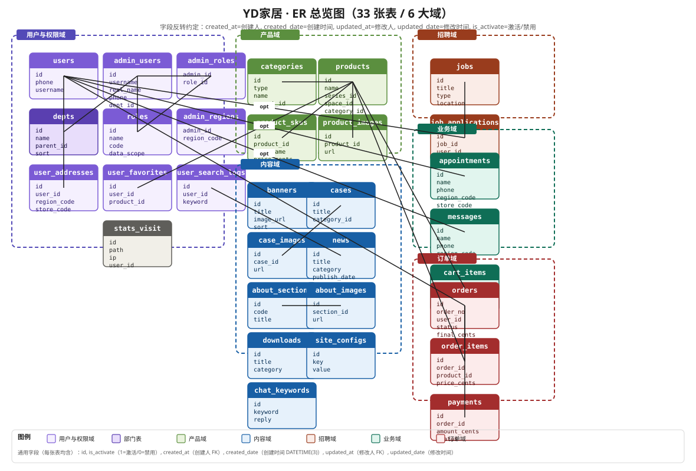
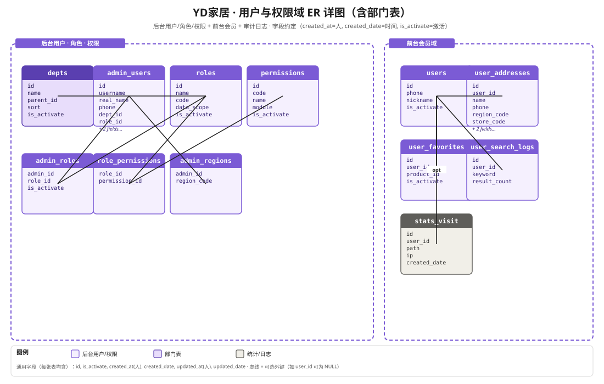

# YD家居 · 数据库设计文档

> **版本**：v1.2  
> **基线**：`PRD_企业家居官网及后台管理系统.md` (v1.2) + `开发文档\开发技术文档.md` (第 2 章已通过架构师组长级审核)  
> **读者**：DBA、后端工程师、运维、测试工程师  
> **配套**：本目录 `数据库设计文档_install_all.sql`（一键建库脚本）、`迁移脚本/alembic/versions/001_initial.py`
> **本版更新**（v1.2）：products 表新增 `style`（风格）字段（v1.1 产品管理表单补充）；修正 products.sort 说明为「数值大者靠前（前台优先级高）」；分类字典 `categories.type` 明确为 `'series'/'space'/'category'` 三值
> **上版更新**（v1.1）：products 表新增 product_code / other_images_json / 三态枚举 status / is_top；news 表简化分类、新增发布/截止/推荐字段

---

## 目录

- [第 0 章 · 文档说明](#第-0-章--文档说明)
- [第 1 章 · 设计约定与命名规范](#第-1-章--设计约定与命名规范)
- [第 2 章 · ER 总览图](#第-2-章--er-总览图)
- [第 3 章 · ER 分域详图](#第-3-章--er-分域详图)
- [第 4 章 · 数据字典（34 张表）](#第-4-章--数据字典33-张表)
- [第 5 章 · 建表 SQL（34 张表）](#第-5-章--建表-sql33-张表)
- [第 6 章 · 关键约束、触发器与视图](#第-6-章--关键约束触发器与视图)
- [第 7 章 · Alembic 迁移与回滚](#第-7-章--alembic-迁移与回滚)
- [第 8 章 · SQL 性能与运维](#第-8-章--sql-性能与运维)
- [附录 A · install_all.sql 一键脚本](#附录-a--install_allsql-一键脚本)
- [附录 B · 索引与约束速查表](#附录-b--索引与约束速查表)
- [附录 C · 字段类型决策矩阵](#附录-c--字段类型决策矩阵)

---

## 第 0 章 · 文档说明

### 0.1 文档目的

本数据库设计文档是 **YD家居** 项目的**实施级**数据库手册。它独立于《开发技术文档》第 2 章但与之保持一致：

| 文档 | 关注点 |
|---|---|
| **开发技术文档** §2 数据库设计 | **为什么**这样设计（架构、ADR、权衡） |
| **本文** | **如何**建库（完整 DDL、一键脚本、迁移示例、SQL 性能） |

### 0.2 与其他文档的关系

| 上游 | 引用方式 |
|---|---|
| `PRD_企业家居官网及后台管理系统.md` §6.X | 数据字典标注"PRD §X.Y 来源" |
| `开发文档\开发技术文档.md` §2 | ADR-001 ~ ADR-007 的设计依据 |

### 0.3 术语表

| 术语 | 含义 |
|---|---|
| **DDL** | Data Definition Language，数据库模式定义语言（`CREATE/ALTER/DROP`） |
| **DML** | Data Manipulation Language，数据操作语言（`SELECT/INSERT/UPDATE/DELETE`） |
| **DBA** | Database Administrator，数据库管理员 |
| **CHECK** | MySQL 8.0+ 原生支持的行级约束，本项目用于业务规则硬校验 |
| **FK** | Foreign Key，外键约束 |
| **ENUM** | 枚举类型，仅用于状态/类型等**明确有限**的值 |
| **ngram** | MySQL 内置中文分词器，用于 FULLTEXT 索引 |
| **Alembic** | Python SQLAlchemy 生态的迁移工具 |

### 0.4 范围说明

| 范围内 ✅ | 范围外 ❌ |
|---|---|
| MySQL 8.0 DDL、索引、约束、触发器 | PostgreSQL / Oracle / SQL Server 方言 |
| 33 张表（详见第 2 章总览） | 临时表 / 视图层中间表（应用层管理） |
| 种子数据（角色/管理员/字典） | 完整业务示例数据（环境变量管理） |
| 首版 Alembic 迁移示例 | 后续业务版本（项目演进时补充） |

---

## 第 1 章 · 设计约定与命名规范

### 1.1 命名规范详表

#### 1.1.1 标识符规范

| 类别 | 规范 | 正例 | 反例（避免） |
|---|---|---|---|
| 表名 | `snake_case` 复数 | `users`, `product_skus`, `job_applications` | `User`, `productSku`, `tbl_user` |
| 字段名 | `snake_case` 单数 | `user_id`, `created_date`, `is_activate` | `userId`, `CreatedDate`, `IsActivate` |
| 主键 | `id`（BIGINT UNSIGNED AUTO_INCREMENT） | `id` | `user_id` 作主键、`uid` 缩写 |
| 外键 | `{关联表单数}_id` | `user_id`, `product_id`, `dept_id` | `userId`, `fk_user` |
| 唯一约束 | `{字段}` 或 `{字段1}_{字段2}` | `phone`, `username`, `uniq_job_phone` | `uq_phone`, `users_phone_unique` |
| 普通索引 | `idx_{表名简写}_{字段}` | `idx_orders_user_id` | `idx1`, `index_user` |
| 复合索引 | `idx_{表名简写}_{字段1}_{字段2}` | `idx_orders_status_created_date` | 长串未简写 |
| CHECK 约束 | `chk_{表名}_{规则简述}` | `chk_products_category_or_space` | `check1` |
| 触发器 | `trg_{表名}_{动作}_{时序}` | `trg_order_items_after_insert` | `order_items_trigger` |
| 视图 | `v_{语义描述}` | `v_order_detail`, `v_member_summary` | `view_order` |

#### 1.1.2 字段命名反转约定（**用户最新要求**）

> **本约定为本项目强制规范**，影响每张表的通用字段。

| 字段名 | 类型 | 含义 | 取值 |
|---|---|---|---|
| `id` | `BIGINT UNSIGNED` | 主键 | AUTO_INCREMENT |
| `is_activate` | `TINYINT(1)` | **激活/禁用状态** | `1=激活 0=禁用`（默认 1） |
| `created_at` | `BIGINT UNSIGNED` | **创建人**（FK → `admin_users.id`） | NULL（系统初始数据允许） |
| `created_date` | `DATETIME(3)` | **创建时间** | `DEFAULT CURRENT_TIMESTAMP(3)` |
| `updated_at` | `BIGINT UNSIGNED` | **修改人**（FK → `admin_users.id`） | NULL |
| `updated_date` | `DATETIME(3)` | **修改时间** | `DEFAULT CURRENT_TIMESTAMP(3) ON UPDATE CURRENT_TIMESTAMP(3)` |

> ⚠️ **命名反转说明**：用户最新要求将"`创建人`"记为 `created_at`，"`创建时间`"记为 `created_date`——这与主流 ORM 默认（`created_at` = 时间）相反。本文档全库统一遵循用户约定。**前端/后端代码中凡引用 `created_at` 必须明确为"创建人 id"。**

#### 1.1.3 软删除策略（可选，与 is_activate 配合）

对于"内容表"（产品/案例/新闻等），额外保留软删除字段便于误删恢复：

```sql
deleted_at     DATETIME(3)  NULL                        -- 软删除时间（NULL = 未删除）
is_deleted     TINYINT(1)   NOT NULL DEFAULT 0          -- 软删除标记（双保险）
```

> **双保险原因**：`deleted_at` 用于范围查询（`WHERE deleted_at IS NULL`），`is_deleted` 用于 JOIN 条件简化（部分老 SQL 不支持 `IS NULL`）。

> **业务表**（用户/订单/投递/预约/留言）**不启用**软删除，硬删除受限（留存审计）。

### 1.2 通用字段来源

| 字段 | 出处 | 必含表 |
|---|---|---|
| `id` | 数据库基础 | **所有 33 张表** |
| `is_activate` | 用户要求 §1.1.2 | **所有 33 张表** |
| `created_at`(创建人) | 用户要求 §1.1.2 | **所有 33 张表** |
| `created_date`(创建时间) | 用户要求 §1.1.2 | **所有 33 张表** |
| `updated_at`(修改人) | 用户要求 §1.1.2 | **所有 33 张表** |
| `updated_date`(修改时间) | 用户要求 §1.1.2 | **所有 33 张表** |
| `deleted_at` / `is_deleted` | §1.1.3 | **仅内容表**（products/cases/news/banners/downloads/about_sections/case_images/about_images/chat_keywords） |

### 1.3 字符集与时区

| 项 | 值 | 说明 |
|---|---|---|
| **字符集** | `utf8mb4` | 支持 emoji 与生僻字 |
| **排序规则** | `utf8mb4_unicode_ci` | Unicode 标准排序，跨语言一致 |
| **时区** | `Asia/Shanghai` (UTC+8) | 数据库服务器与连接均设置 |
| **存储引擎** | `InnoDB` | 默认，支持事务与外键 |
| **金额** | `BIGINT` 整型分 | 应用层展示时除以 100 |
| **时间** | `DATETIME(3)` 毫秒精度 | 一律本地时区，不跨时区转换 |

### 1.4 数据隔离字段约定（审核新增 · 仍生效）

数据隔离（PRD §6.12 / §7.3）**不是所有表都适用**，仅以下"区域敏感"表需要 `region_code` / `store_code`：

| 表 | region_code | store_code | 说明 |
|---|---|---|---|
| `orders` | ✅ | ✅ | 按收货省份/归属门店 |
| `appointments` | ✅ | ✅ | 预约客户区域/门店 |
| `messages` | ✅ | ✅ | 留言客户区域/门店 |
| `job_applications` | ✅ | ⭕ | 按投递区域（可选） |
| `products` 等内容表 | ⭕ | ⭕ | 内容全局共享，不做区域隔离 |

仓储层按"表是否标记 `IS_DATA_SCOPED`"决定是否注入过滤条件，避免对内容表误加空条件导致查不到数据（详见开发技术文档 §2.6）。

### 1.5 ENUM 与 JSON 使用规范

| 类型 | 适用 | 不适用 |
|---|---|---|
| `ENUM` | 状态/类型**有限集合**（订单状态、投递阶段、性别） | 频繁扩展的字典项（用 `site_configs` 或 `categories`） |
| `JSON` | 少量可变结构（产品规格 `extra_specs`、客服 `analytics`） | 强查询字段（用关联表） |
| `VARCHAR(n)` | 短文本（姓名、标题、邮箱、手机号） | 长文本（用 `TEXT`/`LONGTEXT`） |

### 1.6 外键 ON DELETE / ON UPDATE 策略

| 关系类型 | ON DELETE | ON UPDATE | 示例 |
|---|---|---|---|
| 强依赖（订单明细 → 订单） | `CASCADE` | `CASCADE` | `order_items.order_id → orders.id` |
| 弱关联（留言 → 管理员） | `SET NULL` | `CASCADE` | `messages.assignee_id → admin_users.id` |
| 内容引用（产品 → 分类） | `RESTRICT` | `CASCADE` | `products.category_id → categories.id` |
| 字典项（用户 → 角色） | `RESTRICT` | `CASCADE` | `admin_users.role_id → roles.id` |

> **审计字段**（`created_at`/`updated_at` 指向 `admin_users.id`）一律 `ON DELETE SET NULL`，避免删除管理员导致整表数据丢失。

---

## 第 2 章 · ER 总览图



**图源文件**：`figures/db-ER-overview.svg`（29.9 KB）

### 2.1 域划分

| 域 | 表数 | 包含表 |
|---|---|---|
| **用户与权限域** | 11 | `users`, `admin_users`, **`depts`（新增）**, `roles`, `admin_roles`, `admin_regions`, `permissions`, `role_permissions`, `user_addresses`, `user_favorites`, `user_search_logs`, `stats_visit`, `audit_logs` |
| **产品域** | 4 | `categories`, `products`, `product_skus`, `product_images` |
| **内容域** | 9 | `banners`, `cases`, `case_images`, `news`, `about_sections`, `about_images`, `downloads`, `site_configs`, `chat_keywords` |
| **招聘域** | 2 | `jobs`, `job_applications` |
| **业务域** | 3 | `appointments`, `messages`, `cart_items` |
| **订单域** | 3 | `orders`, `order_items`, `payments` |
| **统计域** | 1 | `stats_visit`（与用户权限域共享） |
| **合计** | **34** | （含 2 张统计表跨域） |

### 2.2 域间核心关系

```
用户与权限域 ──┬─→ 产品域 （user_favorites → products）
             ├─→ 内容域 （news 评论待扩展）
             ├─→ 招聘域 （job_applications → jobs, users）
             ├─→ 业务域 （appointments/messages → users, region）
             └─→ 订单域 （orders → users, order_items → products）

产品域 ──→ 内容域 （不直接关联，分类全局共享）

权限域内部（关键路径）：
  depts → admin_users（dept_id） → roles（role_id）
                     ↓
              admin_roles（多角色扩展）
                     ↓
              role_permissions → permissions
```

---

## 第 3 章 · ER 分域详图

### 3.1 用户与权限域（含部门表）



**图源文件**：`figures/db-ER-domain-01-auth.svg`（12.9 KB）

本域涵盖：
- **后台**：depts（部门）、admin_users（管理员）、roles（角色）、permissions（权限点）、admin_roles（管理员-角色 多对多）、admin_regions（管理员-区域）、role_permissions（角色-权限）
- **前台**：users（会员）、user_addresses（地址）、user_favorites（收藏）、user_search_logs（搜索历史）
- **统计**：stats_visit（访问日志）

**关键外键路径**：
- `admin_users.dept_id → depts.id`（RESTRICT，部门不允许删除有员工时）
- `admin_users.role_id → roles.id`（RESTRICT，角色不允许删除有用户时）
- `admin_roles(admin_id, role_id)` 多对多扩展表
- `role_permissions(role_id, permission_id)` 角色权限关联

### 3.2 ~ 3.6 其他 5 个分域

其余 5 个分域图（产品/内容/招聘/业务/订单）与开发技术文档 §2 的 ER 图一致，本次字段反转约定仅影响字段语义，**不影响表间关系**。详细字段以本文档第 4 章数据字典为准。

> **提示**：其余 5 张分域图可在 `figures/db-ER-domain-{02~06}.svg` 找到（与开发技术文档同源），本文档不重复绘制。

---

## 第 4 章 · 数据字典（34 张表）

> 本章每张表统一模板：
> - **表编号 / 表名** + 用途
> - **字段来源**（引用 PRD/技术文档章节）
> - **字段表**（11 列）
> - **索引表**
> - **外键表**
> - **CHECK 约束**（如有）

### 4.1 用户与权限域（11 张表）

#### 4.1.1 `users`（前台会员）

- **用途**：前台注册会员，登录账号为手机号
- **字段来源**：PRD §6.1 会员体系
- **关联表**：→ `user_addresses`, `user_favorites`, `user_search_logs`, `cart_items`, `orders`

| 字段 | 类型 | 可空 | 默认 | PK | FK | 唯一 | 索引 | CHECK | 枚举值含义 | 说明 |
|---|---|---|---|---|---|---|---|---|---|---|
| id | BIGINT UNSIGNED | N | AUTO_INC | ✅ | - | - | PK | - | - | 主键 |
| phone | VARCHAR(20) | N | - | - | - | ✅ | UNQ | - | - | 手机号（登录账号） |
| password_hash | VARCHAR(128) | N | - | - | - | - | - | - | - | bcrypt 哈希 |
| nickname | VARCHAR(64) | Y | NULL | - | - | - | - | - | - | 昵称 |
| avatar_url | VARCHAR(255) | Y | NULL | - | - | - | - | - | - | 头像 URL |
| email | VARCHAR(128) | Y | NULL | - | - | - | - | - | - | 邮箱 |
| gender | TINYINT | Y | NULL | - | - | - | - | - | 0未知 1男 2女 | 性别 |
| failed_attempts | TINYINT UNSIGNED | N | 0 | - | - | - | - | - | - | 登录失败次数（防爆破） |
| locked_until | DATETIME(3) | Y | NULL | - | - | - | - | - | - | 锁定截止时间 |
| last_login_date | DATETIME(3) | Y | NULL | - | - | - | - | - | - | 最近登录时间 |
| **is_activate** | TINYINT(1) | N | 1 | - | - | - | - | - | 1激活 0禁用 | 业务状态 |
| **created_at** | BIGINT UNSIGNED | Y | NULL | - | → admin_users.id | - | IDX | - | - | 创建人（系统初始可 NULL） |
| **created_date** | DATETIME(3) | N | NOW(3) | - | - | - | - | - | - | 创建时间 |
| **updated_at** | BIGINT UNSIGNED | Y | NULL | - | → admin_users.id | - | - | - | - | 修改人 |
| **updated_date** | DATETIME(3) | N | NOW(3) ON UPDATE | - | - | - | - | - | - | 修改时间 |
| deleted_at | DATETIME(3) | Y | NULL | - | - | - | - | - | - | 软删除（业务表不启用硬删） |
| is_deleted | TINYINT(1) | N | 0 | - | - | - | - | - | - | 软删除标记 |

**索引表**：

| 索引名 | 类型 | 列 | 用途 |
|---|---|---|---|
| PK_users | PRIMARY | id | 主键 |
| UNQ_users_phone | UNIQUE | phone | 唯一手机号 |

**外键表**：

| FK 名 | 父表 | 列 | ON DELETE | ON UPDATE |
|---|---|---|---|---|
| fk_users_created_at | admin_users | created_at | SET NULL | CASCADE |
| fk_users_updated_at | admin_users | updated_at | SET NULL | CASCADE |

---

#### 4.1.2 `admin_users`（后台管理员）

- **用途**：后台管理员账号，登录账号为 username
- **字段来源**：用户最新要求
- **关联表**：→ `depts`, `roles`, `admin_roles`, `admin_regions`, `audit_logs`, 所有 created_at/updated_at 引用

| 字段 | 类型 | 可空 | 默认 | PK | FK | 唯一 | 索引 | CHECK | 枚举值含义 | 说明 |
|---|---|---|---|---|---|---|---|---|---|---|
| id | BIGINT UNSIGNED | N | AUTO_INC | ✅ | - | - | PK | - | - | 主键 |
| **username** | VARCHAR(64) | N | - | - | - | ✅ | UNQ | - | - | **登录名（新增·唯一）** |
| password_hash | VARCHAR(128) | N | - | - | - | - | - | - | - | bcrypt 哈希 |
| **real_name** | VARCHAR(64) | Y | NULL | - | - | - | - | - | - | **姓名（新增）** |
| nickname | VARCHAR(64) | Y | NULL | - | - | - | - | - | - | 昵称 |
| phone | VARCHAR(20) | Y | NULL | - | - | - | IDX | - | - | 手机号 |
| email | VARCHAR(128) | Y | NULL | - | - | - | - | - | - | 邮箱 |
| gender | TINYINT | Y | NULL | - | - | - | - | - | 0未知 1男 2女 | 性别 |
| avatar_url | VARCHAR(255) | Y | NULL | - | - | - | - | - | - | 头像 |
| **post** | VARCHAR(64) | Y | NULL | - | - | - | - | - | - | **岗位（新增）** |
| **dept_id** | BIGINT UNSIGNED | Y | NULL | - | → depts.id | - | IDX | - | - | **部门编号（新增）** |
| **role_id** | BIGINT UNSIGNED | Y | NULL | - | → roles.id | - | IDX | - | - | **角色编号（新增·主角色）** |
| failed_attempts | TINYINT UNSIGNED | N | 0 | - | - | - | - | - | - | 登录失败次数 |
| locked_until | DATETIME(3) | Y | NULL | - | - | - | - | - | - | 锁定截止时间 |
| last_login_date | DATETIME(3) | Y | NULL | - | - | - | - | - | - | 最近登录时间 |
| last_login_ip | VARCHAR(45) | Y | NULL | - | - | - | - | - | - | 最近登录 IP |
| data_scope | ENUM | N | 'REGION' | - | - | - | - | - | ALL全部 REGION本区域 STORE本门店 SELF本人 | 数据范围（与 roles 冗余，便于快速过滤） |
| **is_activate** | TINYINT(1) | N | 1 | - | - | - | IDX | - | 1激活 0禁用 | 业务状态 |
| **created_at** | BIGINT UNSIGNED | Y | NULL | - | → admin_users.id | - | - | - | - | 创建人（系统初始可 NULL） |
| **created_date** | DATETIME(3) | N | NOW(3) | - | - | - | - | - | - | 创建时间 |
| **updated_at** | BIGINT UNSIGNED | Y | NULL | - | → admin_users.id | - | - | - | - | 修改人 |
| **updated_date** | DATETIME(3) | N | NOW(3) ON UPDATE | - | - | - | - | - | - | 修改时间 |

**索引表**：

| 索引名 | 类型 | 列 | 用途 |
|---|---|---|---|
| PK_admin_users | PRIMARY | id | 主键 |
| UNQ_admin_users_username | UNIQUE | username | 登录名唯一 |
| IDX_admin_users_phone | INDEX | phone | 手机号查询 |
| IDX_admin_users_dept_id | INDEX | dept_id | 部门筛选 |
| IDX_admin_users_role_id | INDEX | role_id | 角色筛选 |
| IDX_admin_users_is_activate | INDEX | is_activate | 启用状态筛选 |

**外键表**：

| FK 名 | 父表 | 列 | ON DELETE | ON UPDATE |
|---|---|---|---|---|
| fk_admin_users_dept | depts | dept_id | RESTRICT | CASCADE |
| fk_admin_users_role | roles | role_id | RESTRICT | CASCADE |
| fk_admin_users_created_at | admin_users | created_at | SET NULL | CASCADE |
| fk_admin_users_updated_at | admin_users | updated_at | SET NULL | CASCADE |

**CHECK 约束**：

| 约束名 | 表达式 | 违反场景 |
|---|---|---|
| `chk_admin_users_failed_attempts` | `failed_attempts <= 10` | 防爆破次数异常（≥10 应被锁定） |

---

#### 4.1.3 `depts`（部门表）⭐ **本轮新增**

- **用途**：组织架构，支持树形层级（通过 `parent_id` 自引用）
- **字段来源**：用户最新要求
- **关联表**：→ `admin_users.dept_id`（反向 1:N）

| 字段 | 类型 | 可空 | 默认 | PK | FK | 唯一 | 索引 | CHECK | 枚举值含义 | 说明 |
|---|---|---|---|---|---|---|---|---|---|---|
| id | BIGINT UNSIGNED | N | AUTO_INC | ✅ | - | - | PK | - | - | 主键 |
| **name** | VARCHAR(64) | N | - | - | - | - | - | - | - | **部门名称** |
| code | VARCHAR(32) | Y | NULL | - | - | ✅ | UNQ | - | - | 部门编码（如 D001，便于引用） |
| **parent_id** | BIGINT UNSIGNED | Y | NULL | - | → depts.id | - | IDX | - | - | **上级部门（自引用·支持树形）** |
| sort | INT | N | 0 | - | - | - | - | - | - | 同级排序 |
| leader_id | BIGINT UNSIGNED | Y | NULL | - | → admin_users.id | - | - | - | - | 部门负责人 |
| path | VARCHAR(255) | Y | NULL | - | - | - | - | - | - | 层级路径（`,1,3,7,`）便于子树查询 |
| **is_activate** | TINYINT(1) | N | 1 | - | - | - | IDX | - | 1激活 0禁用 | 业务状态 |
| **created_at** | BIGINT UNSIGNED | Y | NULL | - | → admin_users.id | - | - | - | - | 创建人 |
| **created_date** | DATETIME(3) | N | NOW(3) | - | - | - | - | - | - | 创建时间 |
| **updated_at** | BIGINT UNSIGNED | Y | NULL | - | → admin_users.id | - | - | - | - | 修改人 |
| **updated_date** | DATETIME(3) | N | NOW(3) ON UPDATE | - | - | - | - | - | - | 修改时间 |

**索引表**：

| 索引名 | 类型 | 列 | 用途 |
|---|---|---|---|
| PK_depts | PRIMARY | id | 主键 |
| UNQ_depts_code | UNIQUE | code | 部门编码唯一 |
| IDX_depts_parent_id | INDEX | parent_id | 父部门查询 |
| IDX_depts_is_activate | INDEX | is_activate | 启用状态筛选 |

**外键表**：

| FK 名 | 父表 | 列 | ON DELETE | ON UPDATE |
|---|---|---|---|---|
| fk_depts_parent | depts | parent_id | RESTRICT | CASCADE |
| fk_depts_leader | admin_users | leader_id | SET NULL | CASCADE |
| fk_depts_created_at | admin_users | created_at | SET NULL | CASCADE |
| fk_depts_updated_at | admin_users | updated_at | SET NULL | CASCADE |

**CHECK 约束**：

| 约束名 | 表达式 | 违反场景 |
|---|---|---|
| `chk_depts_no_self_parent` | `parent_id IS NULL OR parent_id <> id` | 防止自引用循环 |

---

#### 4.1.4 `roles`（角色表）

- **用途**：RBAC 角色定义，控制后台权限
- **字段来源**：用户最新要求 + 开发技术文档 §2.3.1
- **关联表**：→ `admin_users.role_id`, `admin_roles`, `role_permissions`

| 字段 | 类型 | 可空 | 默认 | PK | FK | 唯一 | 索引 | CHECK | 枚举值含义 | 说明 |
|---|---|---|---|---|---|---|---|---|---|---|
| id | BIGINT UNSIGNED | N | AUTO_INC | ✅ | - | - | PK | - | - | 主键 |
| **name** | VARCHAR(64) | N | - | - | - | - | - | - | - | **角色名称（如：超级管理员、运营）** |
| code | VARCHAR(32) | N | - | - | - | ✅ | UNQ | - | - | 角色代码（如 admin / editor / product / service / order） |
| description | VARCHAR(255) | Y | NULL | - | - | - | - | - | - | 角色描述 |
| data_scope | ENUM | N | 'REGION' | - | - | - | - | - | ALL/REGION/STORE/SELF | 数据范围 |
| sort | INT | N | 0 | - | - | - | - | - | - | 排序 |
| **is_activate** | TINYINT(1) | N | 1 | - | - | - | IDX | - | 1激活 0禁用 | 业务状态 |
| **created_at** | BIGINT UNSIGNED | Y | NULL | - | → admin_users.id | - | - | - | - | 创建人 |
| **created_date** | DATETIME(3) | N | NOW(3) | - | - | - | - | - | - | 创建时间 |
| **updated_at** | BIGINT UNSIGNED | Y | NULL | - | → admin_users.id | - | - | - | - | 修改人 |
| **updated_date** | DATETIME(3) | N | NOW(3) ON UPDATE | - | - | - | - | - | - | 修改时间 |

**索引表**：

| 索引名 | 类型 | 列 | 用途 |
|---|---|---|---|
| PK_roles | PRIMARY | id | 主键 |
| UNQ_roles_code | UNIQUE | code | 角色代码唯一 |
| IDX_roles_is_activate | INDEX | is_activate | 启用状态筛选 |

**外键表**：

| FK 名 | 父表 | 列 | ON DELETE | ON UPDATE |
|---|---|---|---|---|
| fk_roles_created_at | admin_users | created_at | SET NULL | CASCADE |
| fk_roles_updated_at | admin_users | updated_at | SET NULL | CASCADE |

---

#### 4.1.5 `admin_roles`（管理员-角色 多对多）

- **用途**：扩展多角色场景，与 `admin_users.role_id`（主角色）互补
- **字段来源**：开发技术文档 §2.3.1
- **关联表**：↔ `admin_users`, ↔ `roles`

| 字段 | 类型 | 可空 | 默认 | PK | FK | 唯一 | 索引 | CHECK | 枚举值含义 | 说明 |
|---|---|---|---|---|---|---|---|---|---|---|
| id | BIGINT UNSIGNED | N | AUTO_INC | ✅ | - | - | PK | - | - | 主键 |
| admin_id | BIGINT UNSIGNED | N | - | - | → admin_users.id | ✅(联合) | UNQ | - | - | 管理员 ID |
| role_id | BIGINT UNSIGNED | N | - | - | → roles.id | ✅(联合) | UNQ | - | - | 角色 ID |
| **is_activate** | TINYINT(1) | N | 1 | - | - | - | - | - | 1激活 0禁用 | 业务状态 |
| **created_at** | BIGINT UNSIGNED | Y | NULL | - | → admin_users.id | - | - | - | - | 创建人 |
| **created_date** | DATETIME(3) | N | NOW(3) | - | - | - | - | - | - | 创建时间 |
| **updated_at** | BIGINT UNSIGNED | Y | NULL | - | → admin_users.id | - | - | - | - | 修改人 |
| **updated_date** | DATETIME(3) | N | NOW(3) ON UPDATE | - | - | - | - | - | - | 修改时间 |

**索引表**：

| 索引名 | 类型 | 列 | 用途 |
|---|---|---|---|
| PK_admin_roles | PRIMARY | id | 主键 |
| UNQ_admin_roles_admin_role | UNIQUE | (admin_id, role_id) | 同一管理员不能重复授予同一角色 |

**外键表**：

| FK 名 | 父表 | 列 | ON DELETE | ON UPDATE |
|---|---|---|---|---|
| fk_admin_roles_admin | admin_users | admin_id | CASCADE | CASCADE |
| fk_admin_roles_role | roles | role_id | RESTRICT | CASCADE |
| fk_admin_roles_created_at | admin_users | created_at | SET NULL | CASCADE |
| fk_admin_roles_updated_at | admin_users | updated_at | SET NULL | CASCADE |

---

#### 4.1.6 `permissions`（权限点）

- **用途**：后台模块的最小权限单元（按钮级 / API 级）
- **字段来源**：开发技术文档 §2.3.1
- **关联表**：↔ `role_permissions`

| 字段 | 类型 | 可空 | 默认 | PK | FK | 唯一 | 索引 | CHECK | 枚举值含义 | 说明 |
|---|---|---|---|---|---|---|---|---|---|---|
| id | BIGINT UNSIGNED | N | AUTO_INC | ✅ | - | - | PK | - | - | 主键 |
| **name** | VARCHAR(64) | N | - | - | - | - | - | - | - | 权限名称 |
| code | VARCHAR(64) | N | - | - | - | ✅ | UNQ | - | - | 权限代码（如 `product.create`） |
| module | VARCHAR(32) | N | - | - | - | - | IDX | - | - | 所属模块 |
| description | VARCHAR(255) | Y | NULL | - | - | - | - | - | - | 权限描述 |
| **is_activate** | TINYINT(1) | N | 1 | - | - | - | - | - | 1激活 0禁用 | 业务状态 |
| **created_at** | BIGINT UNSIGNED | Y | NULL | - | → admin_users.id | - | - | - | - | 创建人 |
| **created_date** | DATETIME(3) | N | NOW(3) | - | - | - | - | - | - | 创建时间 |
| **updated_at** | BIGINT UNSIGNED | Y | NULL | - | → admin_users.id | - | - | - | - | 修改人 |
| **updated_date** | DATETIME(3) | N | NOW(3) ON UPDATE | - | - | - | - | - | - | 修改时间 |

**索引表**：

| 索引名 | 类型 | 列 | 用途 |
|---|---|---|---|
| PK_permissions | PRIMARY | id | 主键 |
| UNQ_permissions_code | UNIQUE | code | 权限代码唯一 |
| IDX_permissions_module | INDEX | module | 模块筛选 |

**外键表**：

| FK 名 | 父表 | 列 | ON DELETE | ON UPDATE |
|---|---|---|---|---|
| fk_permissions_created_at | admin_users | created_at | SET NULL | CASCADE |
| fk_permissions_updated_at | admin_users | updated_at | SET NULL | CASCADE |

---

#### 4.1.7 `role_permissions`（角色-权限 关联）

- **用途**：角色拥有的权限集合
- **字段来源**：开发技术文档 §2.3.1

| 字段 | 类型 | 可空 | 默认 | PK | FK | 唯一 | 索引 | CHECK | 枚举值含义 | 说明 |
|---|---|---|---|---|---|---|---|---|---|---|
| id | BIGINT UNSIGNED | N | AUTO_INC | ✅ | - | - | PK | - | - | 主键 |
| role_id | BIGINT UNSIGNED | N | - | - | → roles.id | ✅(联合) | UNQ | - | - | 角色 ID |
| permission_id | BIGINT UNSIGNED | N | - | - | → permissions.id | ✅(联合) | UNQ | - | - | 权限 ID |
| **is_activate** | TINYINT(1) | N | 1 | - | - | - | - | - | 1激活 0禁用 | 业务状态 |
| **created_at** | BIGINT UNSIGNED | Y | NULL | - | → admin_users.id | - | - | - | - | 创建人 |
| **created_date** | DATETIME(3) | N | NOW(3) | - | - | - | - | - | - | 创建时间 |
| **updated_at** | BIGINT UNSIGNED | Y | NULL | - | → admin_users.id | - | - | - | - | 修改人 |
| **updated_date** | DATETIME(3) | N | NOW(3) ON UPDATE | - | - | - | - | - | - | 修改时间 |

**索引表**：

| 索引名 | 类型 | 列 | 用途 |
|---|---|---|---|
| PK_role_permissions | PRIMARY | id | 主键 |
| UNQ_role_permissions_role_perm | UNIQUE | (role_id, permission_id) | 同一角色不能重复授予同一权限 |

**外键表**：

| FK 名 | 父表 | 列 | ON DELETE | ON UPDATE |
|---|---|---|---|---|
| fk_role_permissions_role | roles | role_id | CASCADE | CASCADE |
| fk_role_permissions_perm | permissions | permission_id | CASCADE | CASCADE |
| fk_role_permissions_created_at | admin_users | created_at | SET NULL | CASCADE |
| fk_role_permissions_updated_at | admin_users | updated_at | SET NULL | CASCADE |

---

#### 4.1.8 `admin_regions`（管理员-区域）

- **用途**：后台管理员可管辖的区域范围（与 `admin_users.data_scope` 配合）
- **字段来源**：开发技术文档 §2.3.1 / §2.6

| 字段 | 类型 | 可空 | 默认 | PK | FK | 唯一 | 索引 | CHECK | 枚举值含义 | 说明 |
|---|---|---|---|---|---|---|---|---|---|---|
| id | BIGINT UNSIGNED | N | AUTO_INC | ✅ | - | - | PK | - | - | 主键 |
| admin_id | BIGINT UNSIGNED | N | - | - | → admin_users.id | ✅(联合) | UNQ | - | - | 管理员 ID |
| region_code | VARCHAR(32) | N | - | - | - | ✅(联合) | UNQ | - | - | 区域代码 |
| **is_activate** | TINYINT(1) | N | 1 | - | - | - | - | - | 1激活 0禁用 | 业务状态 |
| **created_at** | BIGINT UNSIGNED | Y | NULL | - | → admin_users.id | - | - | - | - | 创建人 |
| **created_date** | DATETIME(3) | N | NOW(3) | - | - | - | - | - | - | 创建时间 |
| **updated_at** | BIGINT UNSIGNED | Y | NULL | - | → admin_users.id | - | - | - | - | 修改人 |
| **updated_date** | DATETIME(3) | N | NOW(3) ON UPDATE | - | - | - | - | - | - | 修改时间 |

**索引表**：

| 索引名 | 类型 | 列 | 用途 |
|---|---|---|---|
| PK_admin_regions | PRIMARY | id | 主键 |
| UNQ_admin_regions_admin_region | UNIQUE | (admin_id, region_code) | 同一管理员不能重复授权同一区域 |

**外键表**：

| FK 名 | 父表 | 列 | ON DELETE | ON UPDATE |
|---|---|---|---|---|
| fk_admin_regions_admin | admin_users | admin_id | CASCADE | CASCADE |
| fk_admin_regions_created_at | admin_users | created_at | SET NULL | CASCADE |
| fk_admin_regions_updated_at | admin_users | updated_at | SET NULL | CASCADE |

---

#### 4.1.9 `user_addresses`（会员收货地址）

- **用途**：前台会员的收货地址簿
- **字段来源**：PRD §6.1 会员体系

| 字段 | 类型 | 可空 | 默认 | PK | FK | 唯一 | 索引 | CHECK | 枚举值含义 | 说明 |
|---|---|---|---|---|---|---|---|---|---|---|
| id | BIGINT UNSIGNED | N | AUTO_INC | ✅ | - | - | PK | - | - | 主键 |
| user_id | BIGINT UNSIGNED | N | - | - | → users.id | - | IDX | - | - | 所属会员 |
| name | VARCHAR(64) | N | - | - | - | - | - | - | - | 收货人姓名 |
| phone | VARCHAR(20) | N | - | - | - | - | - | - | - | 收货人手机号 |
| region_code | VARCHAR(32) | Y | NULL | - | - | - | IDX | - | - | 省市区代码 |
| region_name | VARCHAR(128) | Y | NULL | - | - | - | - | - | - | 省市区文本 |
| address | VARCHAR(255) | N | - | - | - | - | - | - | - | 详细地址 |
| store_code | VARCHAR(32) | Y | NULL | - | - | - | - | - | - | 归属门店（数据隔离） |
| is_default | TINYINT(1) | N | 0 | - | - | - | - | - | - | 是否默认地址 |
| **is_activate** | TINYINT(1) | N | 1 | - | - | - | - | - | 1激活 0禁用 | 业务状态 |
| **created_at** | BIGINT UNSIGNED | Y | NULL | - | → admin_users.id | - | - | - | - | 创建人 |
| **created_date** | DATETIME(3) | N | NOW(3) | - | - | - | - | - | - | 创建时间 |
| **updated_at** | BIGINT UNSIGNED | Y | NULL | - | → admin_users.id | - | - | - | - | 修改人 |
| **updated_date** | DATETIME(3) | N | NOW(3) ON UPDATE | - | - | - | - | - | - | 修改时间 |

**索引表**：

| 索引名 | 类型 | 列 | 用途 |
|---|---|---|---|
| PK_user_addresses | PRIMARY | id | 主键 |
| IDX_user_addresses_user_id | INDEX | user_id | 会员地址列表 |
| IDX_user_addresses_region_code | INDEX | region_code | 区域筛选 |

**外键表**：

| FK 名 | 父表 | 列 | ON DELETE | ON UPDATE |
|---|---|---|---|---|
| fk_user_addresses_user | users | user_id | CASCADE | CASCADE |
| fk_user_addresses_created_at | admin_users | created_at | SET NULL | CASCADE |
| fk_user_addresses_updated_at | admin_users | updated_at | SET NULL | CASCADE |

---

#### 4.1.10 `user_favorites`（会员收藏）

- **用途**：前台会员对产品的收藏
- **字段来源**：PRD §6.4 产品中心

| 字段 | 类型 | 可空 | 默认 | PK | FK | 唯一 | 索引 | CHECK | 枚举值含义 | 说明 |
|---|---|---|---|---|---|---|---|---|---|---|
| id | BIGINT UNSIGNED | N | AUTO_INC | ✅ | - | - | PK | - | - | 主键 |
| user_id | BIGINT UNSIGNED | N | - | - | → users.id | ✅(联合) | UNQ | - | - | 会员 ID |
| product_id | BIGINT UNSIGNED | N | - | - | → products.id | ✅(联合) | UNQ | - | - | 产品 ID |
| **is_activate** | TINYINT(1) | N | 1 | - | - | - | - | - | 1激活 0禁用 | 业务状态 |
| **created_at** | BIGINT UNSIGNED | Y | NULL | - | → admin_users.id | - | - | - | - | 创建人 |
| **created_date** | DATETIME(3) | N | NOW(3) | - | - | - | - | - | - | 创建时间 |
| **updated_at** | BIGINT UNSIGNED | Y | NULL | - | → admin_users.id | - | - | - | - | 修改人 |
| **updated_date** | DATETIME(3) | N | NOW(3) ON UPDATE | - | - | - | - | - | - | 修改时间 |

**索引表**：

| 索引名 | 类型 | 列 | 用途 |
|---|---|---|---|
| PK_user_favorites | PRIMARY | id | 主键 |
| UNQ_user_favorites_user_product | UNIQUE | (user_id, product_id) | 同一会员不能重复收藏同一产品 |

**外键表**：

| FK 名 | 父表 | 列 | ON DELETE | ON UPDATE |
|---|---|---|---|---|
| fk_user_favorites_user | users | user_id | CASCADE | CASCADE |
| fk_user_favorites_product | products | product_id | CASCADE | CASCADE |
| fk_user_favorites_created_at | admin_users | created_at | SET NULL | CASCADE |
| fk_user_favorites_updated_at | admin_users | updated_at | SET NULL | CASCADE |

---

#### 4.1.11 `user_search_logs`（搜索记录）

- **用途**：前台会员搜索关键词记录（推荐/分析用）
- **字段来源**：PRD §6.4 产品中心

| 字段 | 类型 | 可空 | 默认 | PK | FK | 唯一 | 索引 | CHECK | 枚举值含义 | 说明 |
|---|---|---|---|---|---|---|---|---|---|---|
| id | BIGINT UNSIGNED | N | AUTO_INC | ✅ | - | - | PK | - | - | 主键 |
| user_id | BIGINT UNSIGNED | Y | NULL | - | → users.id | - | IDX | - | - | 搜索用户（NULL = 匿名） |
| keyword | VARCHAR(128) | N | - | - | - | - | IDX | - | - | 搜索关键词 |
| result_count | INT | N | 0 | - | - | - | - | - | - | 结果数 |
| **is_activate** | TINYINT(1) | N | 1 | - | - | - | - | - | 1激活 0禁用 | 业务状态 |
| **created_at** | BIGINT UNSIGNED | Y | NULL | - | → admin_users.id | - | - | - | - | 创建人 |
| **created_date** | DATETIME(3) | N | NOW(3) | - | - | - | - | - | - | 创建时间 |
| **updated_at** | BIGINT UNSIGNED | Y | NULL | - | → admin_users.id | - | - | - | - | 修改人 |
| **updated_date** | DATETIME(3) | N | NOW(3) ON UPDATE | - | - | - | - | - | - | 修改时间 |

**索引表**：

| 索引名 | 类型 | 列 | 用途 |
|---|---|---|---|
| PK_user_search_logs | PRIMARY | id | 主键 |
| IDX_user_search_logs_user_id | INDEX | user_id | 用户搜索列表 |
| IDX_user_search_logs_keyword | INDEX | keyword | 热门搜索词统计 |

**外键表**：

| FK 名 | 父表 | 列 | ON DELETE | ON UPDATE |
|---|---|---|---|---|
| fk_user_search_logs_user | users | user_id | SET NULL | CASCADE |
| fk_user_search_logs_created_at | admin_users | created_at | SET NULL | CASCADE |
| fk_user_search_logs_updated_at | admin_users | updated_at | SET NULL | CASCADE |

---

#### 4.1.12 `stats_visit`（访问日志 · 统计域）

- **用途**：前台页面访问日志（PV/UV 统计基础）
- **字段来源**：PRD §6.10 数据分析

| 字段 | 类型 | 可空 | 默认 | PK | FK | 唯一 | 索引 | CHECK | 枚举值含义 | 说明 |
|---|---|---|---|---|---|---|---|---|---|---|
| id | BIGINT UNSIGNED | N | AUTO_INC | ✅ | - | - | PK | - | - | 主键 |
| user_id | BIGINT UNSIGNED | Y | NULL | - | → users.id | - | IDX | - | - | 访问用户（NULL=游客） |
| path | VARCHAR(255) | N | - | - | - | - | IDX | - | - | 访问路径 |
| referer | VARCHAR(255) | Y | NULL | - | - | - | - | - | - | 来源页面 |
| ip | VARCHAR(45) | Y | NULL | - | - | - | - | - | - | 访问 IP |
| user_agent | VARCHAR(255) | Y | NULL | - | - | - | - | - | - | 浏览器 UA |
| device_type | ENUM | Y | NULL | - | - | - | - | - | desktop/mobile/tablet | 设备类型 |
| **is_activate** | TINYINT(1) | N | 1 | - | - | - | - | - | 1激活 0禁用 | 业务状态 |
| **created_at** | BIGINT UNSIGNED | Y | NULL | - | → admin_users.id | - | - | - | - | 创建人 |
| **created_date** | DATETIME(3) | N | NOW(3) | - | - | - | IDX | - | - | 创建时间（按时间分区） |
| **updated_at** | BIGINT UNSIGNED | Y | NULL | - | → admin_users.id | - | - | - | - | 修改人 |
| **updated_date** | DATETIME(3) | N | NOW(3) ON UPDATE | - | - | - | - | - | - | 修改时间 |

**索引表**：

| 索引名 | 类型 | 列 | 用途 |
|---|---|---|---|
| PK_stats_visit | PRIMARY | id | 主键 |
| IDX_stats_visit_user_id | INDEX | user_id | 用户行为追踪 |
| IDX_stats_visit_path | INDEX | path | 页面热度统计 |
| IDX_stats_visit_created_date | INDEX | created_date | 时间范围查询/分区裁剪 |

**外键表**：

| FK 名 | 父表 | 列 | ON DELETE | ON UPDATE |
|---|---|---|---|---|
| fk_stats_visit_user | users | user_id | SET NULL | CASCADE |
| fk_stats_visit_created_at | admin_users | created_at | SET NULL | CASCADE |
| fk_stats_visit_updated_at | admin_users | updated_at | SET NULL | CASCADE |

---

#### 4.1.13 `audit_logs`（操作审计 · 跨域）

- **用途**：后台所有写操作的审计日志（合规要求）
- **字段来源**：开发技术文档 §3.4 审计

| 字段 | 类型 | 可空 | 默认 | PK | FK | 唯一 | 索引 | CHECK | 枚举值含义 | 说明 |
|---|---|---|---|---|---|---|---|---|---|---|
| id | BIGINT UNSIGNED | N | AUTO_INC | ✅ | - | - | PK | - | - | 主键 |
| admin_id | BIGINT UNSIGNED | Y | NULL | - | → admin_users.id | - | IDX | - | - | 操作人 |
| action | VARCHAR(64) | N | - | - | - | - | IDX | - | - | 操作类型（如 `product.create`） |
| resource | VARCHAR(32) | N | - | - | - | - | IDX | - | - | 资源类型 |
| resource_id | BIGINT UNSIGNED | Y | NULL | - | - | - | IDX | - | - | 资源 ID |
| payload | JSON | Y | NULL | - | - | - | - | - | - | 变更详情（**脱敏**：过滤密码/token/手机号） |
| ip | VARCHAR(45) | Y | NULL | - | - | - | - | - | - | 操作 IP |
| user_agent | VARCHAR(255) | Y | NULL | - | - | - | - | - | - | 浏览器 UA |
| **is_activate** | TINYINT(1) | N | 1 | - | - | - | - | - | 1激活 0禁用 | 业务状态 |
| **created_at** | BIGINT UNSIGNED | Y | NULL | - | → admin_users.id | - | - | - | - | 创建人 |
| **created_date** | DATETIME(3) | N | NOW(3) | - | - | - | IDX | - | - | 创建时间 |
| **updated_at** | BIGINT UNSIGNED | Y | NULL | - | → admin_users.id | - | - | - | - | 修改人 |
| **updated_date** | DATETIME(3) | N | NOW(3) ON UPDATE | - | - | - | - | - | - | 修改时间 |

**索引表**：

| 索引名 | 类型 | 列 | 用途 |
|---|---|---|---|
| PK_audit_logs | PRIMARY | id | 主键 |
| IDX_audit_logs_admin_id | INDEX | admin_id | 操作人查询 |
| IDX_audit_logs_resource | INDEX | (resource, resource_id) | 资源变更追溯 |
| IDX_audit_logs_action | INDEX | action | 操作类型筛选 |
| IDX_audit_logs_created_date | INDEX | created_date | 时间范围/合规留痕 3 年 |

**外键表**：

| FK 名 | 父表 | 列 | ON DELETE | ON UPDATE |
|---|---|---|---|---|
| fk_audit_logs_admin | admin_users | admin_id | SET NULL | CASCADE |
| fk_audit_logs_created_at | admin_users | created_at | SET NULL | CASCADE |
| fk_audit_logs_updated_at | admin_users | updated_at | SET NULL | CASCADE |

---

### 4.2 产品域（4 张表）

#### 4.2.1 `categories`（分类字典）

- **用途**：产品分类（系列/空间/品类三种 type），支持树形
- **字段来源**：PRD §6.4 产品中心

| 字段 | 类型 | 可空 | 默认 | PK | FK | 唯一 | 索引 | CHECK | 枚举值含义 | 说明 |
|---|---|---|---|---|---|---|---|---|---|---|
| id | INT UNSIGNED | N | AUTO_INC | ✅ | - | - | PK | - | - | 主键 |
| type | ENUM | N | - | - | - | - | IDX | - | series/space/category | 分类类型 |
| name | VARCHAR(64) | N | - | - | - | - | - | - | - | 中文名 |
| name_en | VARCHAR(64) | Y | NULL | - | - | - | - | - | - | 英文名（二期多语言） |
| icon | VARCHAR(255) | Y | NULL | - | - | - | - | - | - | 图标 URL |
| parent_id | INT UNSIGNED | Y | NULL | - | → categories.id | - | IDX | - | - | 父级 ID（自引用·树形） |
| sort | INT | N | 0 | - | - | - | - | - | - | 排序 |
| status | TINYINT | N | 1 | - | - | - | - | - | 0禁用 1启用 | 业务状态（**与 is_activate 等价**，此处保留兼容旧 API） |
| is_activate | TINYINT(1) | N | 1 | - | - | - | IDX | - | 1激活 0禁用 | 业务状态（新约定） |
| created_at | BIGINT UNSIGNED | Y | NULL | - | → admin_users.id | - | - | - | - | 创建人 |
| created_date | DATETIME(3) | N | NOW(3) | - | - | - | - | - | - | 创建时间 |
| updated_at | BIGINT UNSIGNED | Y | NULL | - | → admin_users.id | - | - | - | - | 修改人 |
| updated_date | DATETIME(3) | N | NOW(3) ON UPDATE | - | - | - | - | - | - | 修改时间 |
| deleted_at | DATETIME(3) | Y | NULL | - | - | - | - | - | - | 软删除 |
| is_deleted | TINYINT(1) | N | 0 | - | - | - | - | - | - | 软删除标记 |

**索引表**：

| 索引名 | 类型 | 列 | 用途 |
|---|---|---|---|
| PK_categories | PRIMARY | id | 主键 |
| IDX_categories_type_status | INDEX | (type, is_activate) | 类型+启用筛选 |
| IDX_categories_parent_id | INDEX | parent_id | 子分类查询 |

**CHECK**：`chk_categories_no_self_parent`（parent_id <> id）

---

#### 4.2.2 `products`（产品主表）

- **用途**：产品核心信息，PRD §6.4 必填项为品类或适用空间二选一
- **字段来源**：PRD §6.4 + 审核修复 + **本轮更新（v1.1）**：新增产品编号 / 其它图片JSON / 草稿态 / 置顶字段，status 改为三态枚举
- **更新要点**：
  - 新增 `product_code`（产品编号，唯一）
  - 新增 `other_images_json`（其它图片URL，JSON 串）
  - `status` 由 TINYINT 升级为 `ENUM('draft','on_sale','off_sale')`，新增"草稿"态
  - 新增 `is_top` 是否置顶
  - 新增 `style`（风格，v1.2）
  - 新增 CHECK：`chk_products_draft_no_top`（草稿不允许置顶）
  - 索引 `IDX_products_status` 增加 `is_top` 字段

| 字段 | 类型 | 可空 | 默认 | PK | FK | 唯一 | 索引 | CHECK | 枚举值含义 | 说明 |
|---|---|---|---|---|---|---|---|---|---|---|
| id | BIGINT UNSIGNED | N | AUTO_INC | ✅ | - | - | PK | - | - | 主键 |
| **product_code** | VARCHAR(64) | N | - | - | - | ✅ | UNQ | - | - | **产品编号（v1.1 新增·唯一）** |
| name | VARCHAR(128) | N | - | - | - | - | IDX(FULLTEXT) | - | - | 产品名 |
| subtitle | VARCHAR(255) | Y | NULL | - | - | - | - | - | - | 副标题 |
| **style** | VARCHAR(64) | Y | NULL | - | - | - | - | - | - | **风格（v1.2 新增）**：如现代简约 / 新中式 / 轻奢风，自由文本 |
| **series_id** | INT UNSIGNED | Y | NULL | - | → categories.id | - | IDX | - | - | **所属系列**（如胡桃禮，关联 categories.type='series'） |
| **space_id** | INT UNSIGNED | Y | NULL | - | → categories.id | - | IDX | - | - | **所属空间分类 id**（如客厅/餐厅，关联 categories.type='space'） |
| category_id | INT UNSIGNED | Y | NULL | - | → categories.id | - | IDX | - | - | 品类（如实木餐桌，关联 categories.type='category'） |
| min_price_cents | BIGINT | Y | NULL | - | - | - | IDX | - | - | 最低价（分） |
| max_price_cents | BIGINT | Y | NULL | - | - | - | - | - | - | 最高价（分） |
| **cover_url** | VARCHAR(255) | Y | NULL | - | - | - | - | - | - | **封面图片 URL** |
| **description** | LONGTEXT | Y | NULL | - | - | - | - | - | - | **产品描述（富文本）** |
| **specs_summary** | VARCHAR(500) | Y | NULL | - | - | - | - | - | - | 规格摘要（卡片展示文本） |
| **extra_specs** | JSON | Y | NULL | - | - | - | - | - | - | **规格参数（JSON 串）** |
| **other_images_json** | JSON | Y | NULL | - | - | - | - | - | - | **其它图片 URL（JSON 串，v1.1 新增）** |
| support_order | TINYINT(1) | N | 0 | - | - | - | IDX | - | - | 是否支持在线下单 |
| **sort** | INT | N | 0 | - | - | - | IDX | - | - | **排序值**（数值大者靠前，前台展示优先级高） |
| **status** | ENUM | N | 'draft' | - | - | - | IDX | chk_products_draft_no_top | **draft=草稿 / on_sale=上架 / off_sale=下架** | **发布状态（v1.1 改为三态）** |
| **is_top** | TINYINT(1) | N | 0 | - | - | - | IDX | chk_products_draft_no_top | 0否 1置顶 | **是否置顶（v1.1 新增）** |
| is_activate | TINYINT(1) | N | 1 | - | - | - | IDX | - | 1激活 0禁用 | 业务状态 |
| created_at | BIGINT UNSIGNED | Y | NULL | - | → admin_users.id | - | - | - | - | 创建人 |
| created_date | DATETIME(3) | N | NOW(3) | - | - | - | - | - | - | 创建时间 |
| updated_at | BIGINT UNSIGNED | Y | NULL | - | → admin_users.id | - | - | - | - | 修改人 |
| updated_date | DATETIME(3) | N | NOW(3) ON UPDATE | - | - | - | - | - | - | 修改时间 |
| deleted_at | DATETIME(3) | Y | NULL | - | - | - | - | - | - | 软删除 |
| is_deleted | TINYINT(1) | N | 0 | - | - | - | - | - | - | 软删除标记 |

**索引表**：

| 索引名 | 类型 | 列 | 用途 |
|---|---|---|---|
| PK_products | PRIMARY | id | 主键 |
| **UNQ_products_product_code** | UNIQUE | product_code | **产品编号唯一** |
| IDX_products_category | INDEX | (category_id, status, is_deleted) | 品类列表 |
| IDX_products_series | INDEX | (series_id, status, is_deleted) | 系列筛选 |
| IDX_products_space | INDEX | (space_id, status, is_deleted) | 空间筛选 |
| IDX_products_support_order | INDEX | (support_order, status) | 在线下单筛选 |
| **IDX_products_status_top** | INDEX | (status, is_top, sort) | **发布列表（按置顶+排序）** |
| FULLTEXT_products_name | FULLTEXT | name (ngram) | 全文检索 |

**CHECK 约束**：

| 约束名 | 表达式 | 说明 |
|---|---|---|
| `chk_products_category_or_space` | `category_id IS NOT NULL OR space_id IS NOT NULL OR series_id IS NOT NULL` | 三选一必填 |
| `chk_products_amount` | `min_price_cents IS NULL OR max_price_cents IS NULL OR min_price_cents <= max_price_cents` | 价格区间合法 |
| **`chk_products_draft_no_top`** ⭐ | **`NOT(status = 'draft' AND is_top = 1)`** | **草稿不允许置顶（v1.1 新增）** |

---

#### 4.2.3 `product_skus`（产品规格）

- **用途**：产品的 SKU 维度（颜色/材质/尺寸等组合）
- **字段来源**：PRD §6.4

| 字段 | 类型 | 可空 | 默认 | PK | FK | 唯一 | 索引 | CHECK | 枚举值含义 | 说明 |
|---|---|---|---|---|---|---|---|---|---|---|
| id | BIGINT UNSIGNED | N | AUTO_INC | ✅ | - | - | PK | - | - | 主键 |
| product_id | BIGINT UNSIGNED | N | - | - | → products.id | - | IDX | - | - | 所属产品 |
| spec_name | VARCHAR(128) | N | - | - | - | - | - | - | - | 规格名（如"胡桃色·1.8m"） |
| spec_code | VARCHAR(64) | Y | NULL | - | - | ✅(联合) | UNQ | - | - | SKU 编码 |
| price_cents | BIGINT | N | - | - | - | - | - | - | - | 价格（分） |
| stock | INT | N | 0 | - | - | - | - | - | - | 库存 |
| image_url | VARCHAR(255) | Y | NULL | - | - | - | - | - | - | SKU 主图 |
| sort | INT | N | 0 | - | - | - | - | - | - | 排序 |
| is_activate | TINYINT(1) | N | 1 | - | - | - | - | - | 1激活 0禁用 | 业务状态 |
| created_at | BIGINT UNSIGNED | Y | NULL | - | → admin_users.id | - | - | - | - | 创建人 |
| created_date | DATETIME(3) | N | NOW(3) | - | - | - | - | - | - | 创建时间 |
| updated_at | BIGINT UNSIGNED | Y | NULL | - | → admin_users.id | - | - | - | - | 修改人 |
| updated_date | DATETIME(3) | N | NOW(3) ON UPDATE | - | - | - | - | - | - | 修改时间 |
| deleted_at | DATETIME(3) | Y | NULL | - | - | - | - | - | - | 软删除 |
| is_deleted | TINYINT(1) | N | 0 | - | - | - | - | - | - | 软删除标记 |

**索引表**：

| 索引名 | 类型 | 列 | 用途 |
|---|---|---|---|
| PK_product_skus | PRIMARY | id | 主键 |
| UNQ_product_skus_code | UNIQUE | (product_id, spec_code) | SKU 编码唯一 |
| IDX_product_skus_product | INDEX | product_id | 产品 SKU 列表 |

---

#### 4.2.4 `product_images`（产品图片）

| 字段 | 类型 | 可空 | 默认 | PK | FK | 唯一 | 索引 | CHECK | 枚举值含义 | 说明 |
|---|---|---|---|---|---|---|---|---|---|---|
| id | BIGINT UNSIGNED | N | AUTO_INC | ✅ | - | - | PK | - | - | 主键 |
| product_id | BIGINT UNSIGNED | N | - | - | → products.id | - | IDX | - | - | 所属产品 |
| url | VARCHAR(255) | N | - | - | - | - | - | - | - | 图片 URL |
| alt | VARCHAR(128) | Y | NULL | - | - | - | - | - | - | 替代文本 |
| sort | INT | N | 0 | - | - | - | - | - | - | 排序 |
| is_activate | TINYINT(1) | N | 1 | - | - | - | - | - | 1激活 0禁用 | 业务状态 |
| created_at | BIGINT UNSIGNED | Y | NULL | - | → admin_users.id | - | - | - | - | 创建人 |
| created_date | DATETIME(3) | N | NOW(3) | - | - | - | - | - | - | 创建时间 |
| updated_at | BIGINT UNSIGNED | Y | NULL | - | → admin_users.id | - | - | - | - | 修改人 |
| updated_date | DATETIME(3) | N | NOW(3) ON UPDATE | - | - | - | - | - | - | 修改时间 |
| deleted_at | DATETIME(3) | Y | NULL | - | - | - | - | - | - | 软删除 |
| is_deleted | TINYINT(1) | N | 0 | - | - | - | - | - | - | 软删除标记 |

---

### 4.3 内容域（9 张表）

#### 4.3.1 `banners`（首页轮播图）

| 字段 | 类型 | 可空 | 默认 | PK | FK | 唯一 | 索引 | CHECK | 枚举值含义 | 说明 |
|---|---|---|---|---|---|---|---|---|---|---|
| id | BIGINT UNSIGNED | N | AUTO_INC | ✅ | - | - | PK | - | - | 主键 |
| title | VARCHAR(128) | N | - | - | - | - | - | - | - | 标题 |
| image_url | VARCHAR(255) | N | - | - | - | - | - | - | - | 图片 |
| link_type | ENUM | N | 'product' | - | - | - | - | - | product/news/case/url | 跳转类型 |
| link_target | VARCHAR(255) | N | - | - | - | - | - | - | - | 跳转目标 |
| sort | INT | N | 0 | - | - | - | IDX | - | - | 排序 |
| start_date | DATETIME(3) | Y | NULL | - | - | - | - | - | - | 上线时间 |
| end_date | DATETIME(3) | Y | NULL | - | - | - | - | - | - | 下线时间 |
| is_activate | TINYINT(1) | N | 1 | - | - | - | IDX | - | 1激活 0禁用 | 业务状态 |
| created_at | BIGINT UNSIGNED | Y | NULL | - | → admin_users.id | - | - | - | - | 创建人 |
| created_date | DATETIME(3) | N | NOW(3) | - | - | - | - | - | - | 创建时间 |
| updated_at | BIGINT UNSIGNED | Y | NULL | - | → admin_users.id | - | - | - | - | 修改人 |
| updated_date | DATETIME(3) | N | NOW(3) ON UPDATE | - | - | - | - | - | - | 修改时间 |
| deleted_at | DATETIME(3) | Y | NULL | - | - | - | - | - | - | 软删除 |
| is_deleted | TINYINT(1) | N | 0 | - | - | - | - | - | - | 软删除标记 |

---

#### 4.3.2 `cases`（案例展示）

| 字段 | 类型 | 可空 | 默认 | PK | FK | 唯一 | 索引 | CHECK | 枚举值含义 | 说明 |
|---|---|---|---|---|---|---|---|---|---|---|
| id | BIGINT UNSIGNED | N | AUTO_INC | ✅ | - | - | PK | - | - | 主键 |
| title | VARCHAR(128) | N | - | - | - | - | IDX(FULLTEXT) | - | - | 案例标题 |
| category_id | INT UNSIGNED | Y | NULL | - | → categories.id | - | IDX | - | - | 案例分类 |
| cover_url | VARCHAR(255) | N | - | - | - | - | - | - | - | 封面图 |
| style | VARCHAR(64) | Y | NULL | - | - | - | - | - | - | 风格（如"现代简约"） |
| area | VARCHAR(32) | Y | NULL | - | - | - | - | - | - | 面积（如"120㎡"） |
| description | LONGTEXT | Y | NULL | - | - | - | - | - | - | 案例详情 |
| published_date | DATETIME(3) | N | NOW(3) | - | - | - | IDX | - | - | 发布时间 |
| sort | INT | N | 0 | - | - | - | - | - | - | 排序 |
| view_count | INT | N | 0 | - | - | - | - | - | - | 浏览量 |
| is_activate | TINYINT(1) | N | 1 | - | - | - | IDX | - | 1激活 0禁用 | 业务状态 |
| created_at | BIGINT UNSIGNED | Y | NULL | - | → admin_users.id | - | - | - | - | 创建人 |
| created_date | DATETIME(3) | N | NOW(3) | - | - | - | - | - | - | 创建时间 |
| updated_at | BIGINT UNSIGNED | Y | NULL | - | → admin_users.id | - | - | - | - | 修改人 |
| updated_date | DATETIME(3) | N | NOW(3) ON UPDATE | - | - | - | - | - | - | 修改时间 |
| deleted_at | DATETIME(3) | Y | NULL | - | - | - | - | - | - | 软删除 |
| is_deleted | TINYINT(1) | N | 0 | - | - | - | - | - | - | 软删除标记 |

**索引**：FULLTEXT_cases_title（FULLTEXT ngram）

---

#### 4.3.3 `case_images`（案例图集）

| 字段 | 类型 | 可空 | 默认 | PK | FK | 唯一 | 索引 | CHECK | 枚举值含义 | 说明 |
|---|---|---|---|---|---|---|---|---|---|---|
| id | BIGINT UNSIGNED | N | AUTO_INC | ✅ | - | - | PK | - | - | 主键 |
| case_id | BIGINT UNSIGNED | N | - | - | → cases.id | - | IDX | - | - | 所属案例 |
| url | VARCHAR(255) | N | - | - | - | - | - | - | - | 图片 URL |
| caption | VARCHAR(128) | Y | NULL | - | - | - | - | - | - | 图片说明 |
| sort | INT | N | 0 | - | - | - | - | - | - | 排序 |
| is_activate | TINYINT(1) | N | 1 | - | - | - | - | - | 1激活 0禁用 | 业务状态 |
| created_at | BIGINT UNSIGNED | Y | NULL | - | → admin_users.id | - | - | - | - | 创建人 |
| created_date | DATETIME(3) | N | NOW(3) | - | - | - | - | - | - | 创建时间 |
| updated_at | BIGINT UNSIGNED | Y | NULL | - | → admin_users.id | - | - | - | - | 修改人 |
| updated_date | DATETIME(3) | N | NOW(3) ON UPDATE | - | - | - | - | - | - | 修改时间 |
| deleted_at | DATETIME(3) | Y | NULL | - | - | - | - | - | - | 软删除 |
| is_deleted | TINYINT(1) | N | 0 | - | - | - | - | - | - | 软删除标记 |

---

#### 4.3.4 `news`（新闻资讯 · v1.1 更新）

- **用途**：企业新闻与行业资讯
- **字段来源**：PRD §6.7 新闻 + **本轮更新（v1.1）**：分类简化为企业/行业两种，新增是否发布、截止时间
- **更新要点**：
  - `category` 由 `('company','industry','product')` 简化为 `('company','industry')`（仅企业新闻/行业资讯两种）
  - 新增 `is_published`（是否发布，独立于 is_activate，区分"启用"与"对外发布"两种语义）
  - 新增 `expire_date`（截止时间，配合 published_date 形成发布窗口）
  - 新增 CHECK：`chk_news_publish_window`（截止时间 ≥ 发布时间）
  - 新增 `is_recommend`（是否推荐，区分于"是否置顶"）
  - 索引 `IDX_news_published` 调整为 `(is_published, published_date, expire_date)`

| 字段 | 类型 | 可空 | 默认 | PK | FK | 唯一 | 索引 | CHECK | 枚举值含义 | 说明 |
|---|---|---|---|---|---|---|---|---|---|---|
| id | BIGINT UNSIGNED | N | AUTO_INC | ✅ | - | - | PK | - | - | 主键 |
| **title** | VARCHAR(128) | N | - | - | - | - | IDX(FULLTEXT) | - | - | **标题** |
| subtitle | VARCHAR(255) | Y | NULL | - | - | - | - | - | - | 副标题 |
| **category** | ENUM | N | 'company' | - | - | - | IDX | - | **company=企业新闻 / industry=行业资讯**（v1.1 简化为两种） | 新闻分类 |
| **cover_url** | VARCHAR(255) | Y | NULL | - | - | - | - | - | - | **封面图 URL** |
| **summary** | VARCHAR(500) | Y | NULL | - | - | - | - | - | - | **摘要** |
| **content** | LONGTEXT | N | - | - | - | - | - | - | - | **正文（富文本 HTML）** |
| author | VARCHAR(64) | Y | NULL | - | - | - | - | - | - | 作者 |
| **source** | VARCHAR(64) | Y | NULL | - | - | - | - | - | - | **来源（转载标注）** |
| view_count | INT | N | 0 | - | - | - | - | - | - | 浏览量 |
| **published_date** | DATETIME(3) | N | NOW(3) | - | - | - | IDX | chk_news_publish_window | - | **发布时间** |
| **expire_date** | DATETIME(3) | Y | NULL | - | - | - | IDX | chk_news_publish_window | - | **截止时间（v1.1 新增，NULL=长期有效）** |
| **is_published** | TINYINT(1) | N | 0 | - | - | - | IDX | - | 1已发布 0未发布 | **是否发布（v1.1 新增）** |
| **is_top** | TINYINT(1) | N | 0 | - | - | - | - | - | - | **是否置顶（v1.1 明确为置顶）** |
| **is_recommend** | TINYINT(1) | N | 0 | - | - | - | IDX | - | 1推荐 0普通 | **是否推荐（v1.1 新增，区分于置顶）** |
| sort | INT | N | 0 | - | - | - | - | - | - | 排序 |
| is_activate | TINYINT(1) | N | 1 | - | - | - | IDX | - | 1激活 0禁用 | 业务状态（独立于 is_published） |
| created_at | BIGINT UNSIGNED | Y | NULL | - | → admin_users.id | - | - | - | - | 创建人 |
| created_date | DATETIME(3) | N | NOW(3) | - | - | - | - | - | - | 创建时间 |
| updated_at | BIGINT UNSIGNED | Y | NULL | - | → admin_users.id | - | - | - | - | 修改人 |
| updated_date | DATETIME(3) | N | NOW(3) ON UPDATE | - | - | - | - | - | - | 修改时间 |
| deleted_at | DATETIME(3) | Y | NULL | - | - | - | - | - | - | 软删除 |
| is_deleted | TINYINT(1) | N | 0 | - | - | - | - | - | - | 软删除标记 |

**索引表**：

| 索引名 | 类型 | 列 | 用途 |
|---|---|---|---|
| PK_news | PRIMARY | id | 主键 |
| IDX_news_category | INDEX | (category, is_activate, is_deleted) | 分类列表 |
| **IDX_news_published_window** | INDEX | (is_published, published_date, expire_date) | **v1.1 调整：按发布状态+时间窗查询** |
| IDX_news_recommend | INDEX | (is_recommend, is_published, published_date) | **v1.1 新增：推荐位** |
| FULLTEXT_news_title | FULLTEXT | title (ngram) | 全文检索 |
| IDX_news_created_date | INDEX | created_date | 创建时间排序 |

**CHECK 约束**：

| 约束名 | 表达式 | 说明 |
|---|---|---|
| **`chk_news_publish_window`** ⭐ | **`expire_date IS NULL OR expire_date >= published_date`** | **截止时间 ≥ 发布时间（v1.1 新增）** |
| **`chk_news_published_has_date`** ⭐ | **`is_published = 0 OR published_date IS NOT NULL`** | **已发布必须有发布时间（v1.1 新增）** |

---

#### 4.3.5 `about_sections`（关于我们区块）

| 字段 | 类型 | 可空 | 默认 | PK | FK | 唯一 | 索引 | CHECK | 枚举值含义 | 说明 |
|---|---|---|---|---|---|---|---|---|---|---|
| id | INT UNSIGNED | N | AUTO_INC | ✅ | - | - | PK | - | - | 主键 |
| code | VARCHAR(32) | N | - | - | - | ✅ | UNQ | - | - | about-yd/history/brand/contact |
| title | VARCHAR(128) | N | - | - | - | - | - | - | - | 区块标题 |
| subtitle | VARCHAR(255) | Y | NULL | - | - | - | - | - | - | 副标题 |
| body | LONGTEXT | Y | NULL | - | - | - | - | - | - | 富文本正文 |
| sort | INT | N | 0 | - | - | - | - | - | - | 排序 |
| is_activate | TINYINT(1) | N | 1 | - | - | - | - | - | 1激活 0禁用 | 业务状态 |
| created_at | BIGINT UNSIGNED | Y | NULL | - | → admin_users.id | - | - | - | - | 创建人 |
| created_date | DATETIME(3) | N | NOW(3) | - | - | - | - | - | - | 创建时间 |
| updated_at | BIGINT UNSIGNED | Y | NULL | - | → admin_users.id | - | - | - | - | 修改人 |
| updated_date | DATETIME(3) | N | NOW(3) ON UPDATE | - | - | - | - | - | - | 修改时间 |
| deleted_at | DATETIME(3) | Y | NULL | - | - | - | - | - | - | 软删除 |
| is_deleted | TINYINT(1) | N | 0 | - | - | - | - | - | - | 软删除标记 |

---

#### 4.3.6 `about_images`（关于我们图集）⭐ **本轮新增**

- **用途**：每个关于区块的支持图集展示（PRD §6.8 明确要求）
- **字段来源**：审核修复新增

| 字段 | 类型 | 可空 | 默认 | PK | FK | 唯一 | 索引 | CHECK | 枚举值含义 | 说明 |
|---|---|---|---|---|---|---|---|---|---|---|
| id | BIGINT UNSIGNED | N | AUTO_INC | ✅ | - | - | PK | - | - | 主键 |
| section_id | INT UNSIGNED | N | - | - | → about_sections.id | - | IDX | - | - | 所属区块 |
| url | VARCHAR(255) | N | - | - | - | - | - | - | - | 图片 URL |
| caption | VARCHAR(128) | Y | NULL | - | - | - | - | - | - | 图片说明 |
| sort | INT | N | 0 | - | - | - | - | - | - | 排序 |
| is_activate | TINYINT(1) | N | 1 | - | - | - | - | - | 1激活 0禁用 | 业务状态 |
| created_at | BIGINT UNSIGNED | Y | NULL | - | → admin_users.id | - | - | - | - | 创建人 |
| created_date | DATETIME(3) | N | NOW(3) | - | - | - | - | - | - | 创建时间 |
| updated_at | BIGINT UNSIGNED | Y | NULL | - | → admin_users.id | - | - | - | - | 修改人 |
| updated_date | DATETIME(3) | N | NOW(3) ON UPDATE | - | - | - | - | - | - | 修改时间 |
| deleted_at | DATETIME(3) | Y | NULL | - | - | - | - | - | - | 软删除 |
| is_deleted | TINYINT(1) | N | 0 | - | - | - | - | - | - | 软删除标记 |

---

#### 4.3.7 `downloads`（下载中心）

| 字段 | 类型 | 可空 | 默认 | PK | FK | 唯一 | 索引 | CHECK | 枚举值含义 | 说明 |
|---|---|---|---|---|---|---|---|---|---|---|
| id | BIGINT UNSIGNED | N | AUTO_INC | ✅ | - | - | PK | - | - | 主键 |
| title | VARCHAR(128) | N | - | - | - | - | - | - | - | 资料标题 |
| category | ENUM | N | 'catalog' | - | - | - | IDX | - | catalog/manual/cad/other | 资料分类 |
| description | VARCHAR(500) | Y | NULL | - | - | - | - | - | - | 简介 |
| file_url | VARCHAR(255) | N | - | - | - | - | - | - | - | 文件 URL |
| file_size_kb | INT | Y | NULL | - | - | - | - | - | - | 文件大小（KB） |
| file_format | VARCHAR(16) | Y | NULL | - | - | - | - | - | - | 文件格式（pdf/zip/docx...） |
| download_count | INT | N | 0 | - | - | - | - | - | - | 下载次数 |
| sort | INT | N | 0 | - | - | - | - | - | - | 排序 |
| is_activate | TINYINT(1) | N | 1 | - | - | - | IDX | - | 1激活 0禁用 | 业务状态 |
| created_at | BIGINT UNSIGNED | Y | NULL | - | → admin_users.id | - | - | - | - | 创建人 |
| created_date | DATETIME(3) | N | NOW(3) | - | - | - | - | - | - | 创建时间 |
| updated_at | BIGINT UNSIGNED | Y | NULL | - | → admin_users.id | - | - | - | - | 修改人 |
| updated_date | DATETIME(3) | N | NOW(3) ON UPDATE | - | - | - | - | - | - | 修改时间 |
| deleted_at | DATETIME(3) | Y | NULL | - | - | - | - | - | - | 软删除 |
| is_deleted | TINYINT(1) | N | 0 | - | - | - | - | - | - | 软删除标记 |

---

#### 4.3.8 `site_configs`（站点配置字典）

| 字段 | 类型 | 可空 | 默认 | PK | FK | 唯一 | 索引 | CHECK | 枚举值含义 | 说明 |
|---|---|---|---|---|---|---|---|---|---|---|
| id | INT UNSIGNED | N | AUTO_INC | ✅ | - | - | PK | - | - | 主键 |
| config_key | VARCHAR(64) | N | - | - | - | ✅ | UNQ | - | - | 配置键 |
| config_value | TEXT | N | - | - | - | - | - | - | - | 配置值 |
| value_type | ENUM | N | 'string' | - | - | - | - | - | string/number/json/bool | 值类型 |
| category | VARCHAR(32) | Y | NULL | - | - | - | IDX | - | - | 配置分类 |
| description | VARCHAR(255) | Y | NULL | - | - | - | - | - | - | 说明 |
| updated_by | BIGINT UNSIGNED | Y | NULL | - | → admin_users.id | - | - | - | - | 最后修改人（与 updated_at 同源） |
| is_activate | TINYINT(1) | N | 1 | - | - | - | - | - | 1激活 0禁用 | 业务状态 |
| created_at | BIGINT UNSIGNED | Y | NULL | - | → admin_users.id | - | - | - | - | 创建人 |
| created_date | DATETIME(3) | N | NOW(3) | - | - | - | - | - | - | 创建时间 |
| updated_at | BIGINT UNSIGNED | Y | NULL | - | → admin_users.id | - | - | - | - | 修改人 |
| updated_date | DATETIME(3) | N | NOW(3) ON UPDATE | - | - | - | - | - | - | 修改时间 |

---

#### 4.3.9 `chat_keywords`（客服关键词回复）

| 字段 | 类型 | 可空 | 默认 | PK | FK | 唯一 | 索引 | CHECK | 枚举值含义 | 说明 |
|---|---|---|---|---|---|---|---|---|---|---|
| id | INT UNSIGNED | N | AUTO_INC | ✅ | - | - | PK | - | - | 主键 |
| keyword | VARCHAR(64) | N | - | - | - | - | IDX | - | - | 关键词 |
| reply | TEXT | N | - | - | - | - | - | - | - | 回复内容 |
| enabled | TINYINT(1) | N | 1 | - | - | - | IDX | - | - | 是否启用 |
| priority | INT | N | 0 | - | - | - | IDX | - | - | 优先级（数值大者优先） |
| match_type | ENUM | N | 'exact' | - | - | - | - | - | exact/contains/regex | 匹配方式 |
| is_activate | TINYINT(1) | N | 1 | - | - | - | - | - | 1激活 0禁用 | 业务状态 |
| created_at | BIGINT UNSIGNED | Y | NULL | - | → admin_users.id | - | - | - | - | 创建人 |
| created_date | DATETIME(3) | N | NOW(3) | - | - | - | - | - | - | 创建时间 |
| updated_at | BIGINT UNSIGNED | Y | NULL | - | → admin_users.id | - | - | - | - | 修改人 |
| updated_date | DATETIME(3) | N | NOW(3) ON UPDATE | - | - | - | - | - | - | 修改时间 |
| deleted_at | DATETIME(3) | Y | NULL | - | - | - | - | - | - | 软删除 |
| is_deleted | TINYINT(1) | N | 0 | - | - | - | - | - | - | 软删除标记 |

**索引**：`IDX_chat_keywords_enabled_priority (enabled, priority DESC, is_activate)` —— B-Tree 而非 FULLTEXT（短词不适配全文索引）

---

### 4.4 招聘域（2 张表）

#### 4.4.1 `jobs`（招聘岗位）

| 字段 | 类型 | 可空 | 默认 | PK | FK | 唯一 | 索引 | CHECK | 枚举值含义 | 说明 |
|---|---|---|---|---|---|---|---|---|---|---|
| id | BIGINT UNSIGNED | N | AUTO_INC | ✅ | - | - | PK | - | - | 主键 |
| title | VARCHAR(128) | N | - | - | - | - | - | - | - | 岗位名称 |
| category | ENUM | N | 'social' | - | - | - | IDX | - | social/campus | 社会/校园 |
| department | VARCHAR(64) | Y | NULL | - | - | - | - | - | - | 部门 |
| location | VARCHAR(64) | Y | NULL | - | - | - | - | - | - | 工作地点 |
| salary_min_cents | BIGINT | Y | NULL | - | - | - | - | - | - | 最低薪资（分） |
| salary_max_cents | BIGINT | Y | NULL | - | - | - | - | - | - | 最高薪资（分） |
| headcount | INT | N | 1 | - | - | - | - | - | - | 招聘人数 |
| description | LONGTEXT | Y | NULL | - | - | - | - | - | - | 岗位职责 |
| requirement | LONGTEXT | Y | NULL | - | - | - | - | - | - | 任职要求 |
| publish_date | DATETIME(3) | N | NOW(3) | - | - | - | IDX | - | - | 发布时间 |
| expire_date | DATETIME(3) | Y | NULL | - | - | - | - | - | - | 截止时间 |
| is_activate | TINYINT(1) | N | 1 | - | - | - | IDX | - | 1激活 0禁用 | 业务状态 |
| created_at | BIGINT UNSIGNED | Y | NULL | - | → admin_users.id | - | - | - | - | 创建人 |
| created_date | DATETIME(3) | N | NOW(3) | - | - | - | - | - | - | 创建时间 |
| updated_at | BIGINT UNSIGNED | Y | NULL | - | → admin_users.id | - | - | - | - | 修改人 |
| updated_date | DATETIME(3) | N | NOW(3) ON UPDATE | - | - | - | - | - | - | 修改时间 |
| deleted_at | DATETIME(3) | Y | NULL | - | - | - | - | - | - | 软删除 |
| is_deleted | TINYINT(1) | N | 0 | - | - | - | - | - | - | 软删除标记 |

---

#### 4.4.2 `job_applications`（投递记录）

| 字段 | 类型 | 可空 | 默认 | PK | FK | 唯一 | 索引 | CHECK | 枚举值含义 | 说明 |
|---|---|---|---|---|---|---|---|---|---|---|
| id | BIGINT UNSIGNED | N | AUTO_INC | ✅ | - | - | PK | - | - | 主键 |
| job_id | BIGINT UNSIGNED | N | - | - | → jobs.id | - | IDX | - | - | 投递岗位 |
| user_id | BIGINT UNSIGNED | Y | NULL | - | → users.id | - | IDX | - | - | 投递人（NULL=匿名） |
| name | VARCHAR(64) | N | - | - | - | - | - | - | - | 姓名 |
| phone | VARCHAR(20) | N | - | - | - | ✅(联合) | UNQ | - | - | 手机号 |
| email | VARCHAR(128) | Y | NULL | - | - | - | - | - | - | 邮箱 |
| resume_url | VARCHAR(255) | Y | NULL | - | - | - | - | - | - | 简历 URL |
| region_code | VARCHAR(32) | Y | NULL | - | - | - | IDX | - | - | 投递区域 |
| stage | ENUM | N | 'applied' | - | - | - | IDX | - | applied/screening/interview/offer/rejected | 5 阶段状态 |
| reject_reason | VARCHAR(255) | Y | NULL | - | - | - | - | - | - | 拒绝原因 |
| applied_date | DATETIME(3) | N | NOW(3) | - | - | - | IDX | - | - | 投递时间 |
| screening_date | DATETIME(3) | Y | NULL | - | - | - | - | - | - | 初筛时间 |
| interview_date | DATETIME(3) | Y | NULL | - | - | - | - | - | - | 面试时间 |
| offer_date | DATETIME(3) | Y | NULL | - | - | - | - | - | - | Offer 时间 |
| closed_date | DATETIME(3) | Y | NULL | - | - | - | - | - | - | 终结时间 |
| admin_note | TEXT | Y | NULL | - | - | - | - | - | - | 内部备注 |
| is_activate | TINYINT(1) | N | 1 | - | - | - | - | - | 1激活 0禁用 | 业务状态 |
| created_at | BIGINT UNSIGNED | Y | NULL | - | → admin_users.id | - | - | - | - | 创建人 |
| created_date | DATETIME(3) | N | NOW(3) | - | - | - | - | - | - | 创建时间 |
| updated_at | BIGINT UNSIGNED | Y | NULL | - | → admin_users.id | - | - | - | - | 修改人 |
| updated_date | DATETIME(3) | N | NOW(3) ON UPDATE | - | - | - | - | - | - | 修改时间 |

**索引表**：

| 索引名 | 类型 | 列 | 用途 |
|---|---|---|---|
| PK_job_applications | PRIMARY | id | 主键 |
| IDX_job_applications_job_id | INDEX | job_id | 岗位投递列表 |
| IDX_job_applications_user_id | INDEX | user_id | 用户投递历史 |
| IDX_job_applications_phone | INDEX | phone | 手机号查询简历 |
| IDX_job_applications_region_code | INDEX | region_code | 区域隔离 |
| IDX_job_applications_stage | INDEX | (stage, applied_date) | 阶段筛选 |
| **UNQ_job_applications_job_phone** | UNIQUE | (job_id, phone) | **审核新增**：防匿名重复投递 |

**外键表**：

| FK 名 | 父表 | 列 | ON DELETE | ON UPDATE |
|---|---|---|---|---|
| fk_job_applications_job | jobs | job_id | RESTRICT | CASCADE |
| fk_job_applications_user | users | user_id | SET NULL | CASCADE |
| fk_job_applications_created_at | admin_users | created_at | SET NULL | CASCADE |
| fk_job_applications_updated_at | admin_users | updated_at | SET NULL | CASCADE |

---

### 4.5 业务域（3 张表）

#### 4.5.1 `appointments`（预约）

| 字段 | 类型 | 可空 | 默认 | PK | FK | 唯一 | 索引 | CHECK | 枚举值含义 | 说明 |
|---|---|---|---|---|---|---|---|---|---|---|
| id | BIGINT UNSIGNED | N | AUTO_INC | ✅ | - | - | PK | - | - | 主键 |
| user_id | BIGINT UNSIGNED | Y | NULL | - | → users.id | - | IDX | - | - | 预约会员（NULL=匿名） |
| type | ENUM | N | 'visit' | - | - | - | - | - | visit/consult/custom/other | 类型 |
| name | VARCHAR(64) | N | - | - | - | - | - | - | - | 姓名 |
| phone | VARCHAR(20) | N | - | - | - | - | IDX | - | - | 手机号 |
| region_code | VARCHAR(32) | Y | NULL | - | - | - | IDX | - | - | 客户区域（数据隔离） |
| store_code | VARCHAR(32) | Y | NULL | - | - | - | IDX | - | - | 归属门店（数据隔离） |
| preferred_date | DATETIME(3) | Y | NULL | - | - | - | - | - | - | 期望预约时间 |
| message | TEXT | Y | NULL | - | - | - | - | - | - | 留言 |
| source_page | VARCHAR(128) | Y | NULL | - | - | - | - | - | - | 来源页面 URL |
| status | ENUM | N | 'pending' | - | - | - | IDX | - | pending/following/converted/invalid | 跟进状态 |
| assignee_id | BIGINT UNSIGNED | Y | NULL | - | → admin_users.id | - | IDX | - | - | 跟进人 |
| followed_date | DATETIME(3) | Y | NULL | - | - | - | - | - | - | 最近跟进时间 |
| follow_note | TEXT | Y | NULL | - | - | - | - | - | - | 跟进记录 |
| is_activate | TINYINT(1) | N | 1 | - | - | - | - | - | 1激活 0禁用 | 业务状态 |
| created_at | BIGINT UNSIGNED | Y | NULL | - | → admin_users.id | - | - | - | - | 创建人 |
| created_date | DATETIME(3) | N | NOW(3) | - | - | - | - | - | - | 创建时间 |
| updated_at | BIGINT UNSIGNED | Y | NULL | - | → admin_users.id | - | - | - | - | 修改人 |
| updated_date | DATETIME(3) | N | NOW(3) ON UPDATE | - | - | - | - | - | - | 修改时间 |

**索引**：`IDX_appointments_status_date (status, created_date)`, `IDX_appointments_region_store (region_code, store_code)`, `IDX_appointments_phone (phone)`

---

#### 4.5.2 `messages`（留言）

| 字段 | 类型 | 可空 | 默认 | PK | FK | 唯一 | 索引 | CHECK | 枚举值含义 | 说明 |
|---|---|---|---|---|---|---|---|---|---|---|
| id | BIGINT UNSIGNED | N | AUTO_INC | ✅ | - | - | PK | - | - | 主键 |
| user_id | BIGINT UNSIGNED | Y | NULL | - | → users.id | - | IDX | - | - | 留言会员（NULL=匿名） |
| source | ENUM | N | 'chat' | - | - | - | IDX | - | chat/job_apply/other | 来源 |
| ref_id | BIGINT UNSIGNED | Y | NULL | - | - | - | - | - | - | 关联资源 ID |
| name | VARCHAR(64) | N | - | - | - | - | - | - | - | 姓名 |
| phone | VARCHAR(20) | N | - | - | - | - | - | - | - | 手机号 |
| email | VARCHAR(128) | Y | NULL | - | - | - | - | - | - | 邮箱 |
| region_code | VARCHAR(32) | Y | NULL | - | - | - | IDX | - | - | 客户区域 |
| store_code | VARCHAR(32) | Y | NULL | - | - | - | IDX | - | - | 归属门店 |
| content | TEXT | N | - | - | - | - | - | - | - | 留言内容 |
| reply_content | TEXT | Y | NULL | - | - | - | - | - | - | 客服回复 |
| reply_date | DATETIME(3) | Y | NULL | - | - | - | - | - | - | 回复时间 |
| reply_by | BIGINT UNSIGNED | Y | NULL | - | → admin_users.id | - | IDX | - | - | 回复人 |
| status | ENUM | N | 'pending' | - | - | - | IDX | - | pending/replied/closed | 状态 |
| assignee_id | BIGINT UNSIGNED | Y | NULL | - | → admin_users.id | - | IDX | - | - | 处理人 |
| is_activate | TINYINT(1) | N | 1 | - | - | - | - | - | 1激活 0禁用 | 业务状态 |
| created_at | BIGINT UNSIGNED | Y | NULL | - | → admin_users.id | - | - | - | - | 创建人 |
| created_date | DATETIME(3) | N | NOW(3) | - | - | - | - | - | - | 创建时间 |
| updated_at | BIGINT UNSIGNED | Y | NULL | - | → admin_users.id | - | - | - | - | 修改人 |
| updated_date | DATETIME(3) | N | NOW(3) ON UPDATE | - | - | - | - | - | - | 修改时间 |

**索引**：`IDX_messages_source_status (source, status, created_date)`, `IDX_messages_region_store (region_code, store_code)`

---

#### 4.5.3 `cart_items`（购物车）

| 字段 | 类型 | 可空 | 默认 | PK | FK | 唯一 | 索引 | CHECK | 枚举值含义 | 说明 |
|---|---|---|---|---|---|---|---|---|---|---|
| id | BIGINT UNSIGNED | N | AUTO_INC | ✅ | - | - | PK | - | - | 主键 |
| user_id | BIGINT UNSIGNED | N | - | - | → users.id | ✅(联合) | UNQ | - | - | 会员 |
| sku_id | BIGINT UNSIGNED | N | - | - | → product_skus.id | ✅(联合) | UNQ | - | - | SKU |
| quantity | INT | N | 1 | - | - | - | - | - | - | 数量 |
| selected | TINYINT(1) | N | 1 | - | - | - | - | - | - | 结算选中 |
| is_activate | TINYINT(1) | N | 1 | - | - | - | - | - | 1激活 0禁用 | 业务状态 |
| created_at | BIGINT UNSIGNED | Y | NULL | - | → admin_users.id | - | - | - | - | 创建人 |
| created_date | DATETIME(3) | N | NOW(3) | - | - | - | - | - | - | 创建时间 |
| updated_at | BIGINT UNSIGNED | Y | NULL | - | → admin_users.id | - | - | - | - | 修改人 |
| updated_date | DATETIME(3) | N | NOW(3) ON UPDATE | - | - | - | - | - | - | 修改时间 |

**CHECK**：`chk_cart_items_quantity`（quantity > 0 AND quantity <= 999）

---

### 4.6 订单域（3 张表）

#### 4.6.1 `orders`（订单主表）

| 字段 | 类型 | 可空 | 默认 | PK | FK | 唯一 | 索引 | CHECK | 枚举值含义 | 说明 |
|---|---|---|---|---|---|---|---|---|---|---|
| id | BIGINT UNSIGNED | N | AUTO_INC | ✅ | - | - | PK | - | - | 主键 |
| order_no | VARCHAR(32) | N | - | - | - | ✅ | UNQ | - | - | 订单号 |
| user_id | BIGINT UNSIGNED | Y | NULL | - | → users.id | - | IDX | - | - | 下单人（NULL=游客） |
| address_id | BIGINT UNSIGNED | Y | NULL | - | → user_addresses.id | - | - | - | - | 收货地址快照 |
| receiver_name | VARCHAR(64) | Y | NULL | - | - | - | - | - | - | 收货人姓名（快照） |
| receiver_phone | VARCHAR(20) | Y | NULL | - | - | - | - | - | - | 收货人手机（快照） |
| receiver_address | VARCHAR(255) | Y | NULL | - | - | - | - | - | - | 收货地址文本（快照） |
| region_code | VARCHAR(32) | Y | NULL | - | - | - | IDX | - | - | 收货区域 |
| store_code | VARCHAR(32) | Y | NULL | - | - | - | IDX | - | - | 归属门店 |
| status | ENUM | N | 'pending' | - | - | - | IDX | - | pending/paid/shipped/completed/refunding/refunded/closed | 订单状态 |
| total_cents | BIGINT | N | - | - | - | - | - | - | - | 商品总额（分） |
| shipping_cents | BIGINT | N | 0 | - | - | - | - | - | - | 运费（分） |
| discount_cents | BIGINT | N | 0 | - | - | - | - | - | - | 优惠（分·二期预留） |
| final_cents | BIGINT | N | - | - | - | - | IDX | - | - | 实付金额（分） |
| remark | VARCHAR(500) | Y | NULL | - | - | - | - | - | - | 用户备注 |
| paid_date | DATETIME(3) | Y | NULL | - | - | - | - | - | - | 支付时间（审核新增） |
| shipped_date | DATETIME(3) | Y | NULL | - | - | - | - | - | - | 发货时间 |
| completed_date | DATETIME(3) | Y | NULL | - | - | - | - | - | - | 完成时间 |
| closed_date | DATETIME(3) | Y | NULL | - | - | - | - | - | - | 关闭时间 |
| is_activate | TINYINT(1) | N | 1 | - | - | - | - | - | 1激活 0禁用 | 业务状态 |
| created_at | BIGINT UNSIGNED | Y | NULL | - | → admin_users.id | - | - | - | - | 创建人 |
| created_date | DATETIME(3) | N | NOW(3) | - | - | - | - | - | - | 创建时间 |
| updated_at | BIGINT UNSIGNED | Y | NULL | - | → admin_users.id | - | - | - | - | 修改人 |
| updated_date | DATETIME(3) | N | NOW(3) ON UPDATE | - | - | - | - | - | - | 修改时间 |

**索引表**：

| 索引名 | 类型 | 列 | 用途 |
|---|---|---|---|
| PK_orders | PRIMARY | id | 主键 |
| UNQ_orders_order_no | UNIQUE | order_no | 订单号唯一 |
| IDX_orders_user_status | INDEX | (user_id, status, created_date) | 我的订单列表 |
| IDX_orders_status_date | INDEX | (status, created_date) | 后台订单筛选 |
| IDX_orders_region_store | INDEX | (region_code, store_code) | 数据隔离 |
| IDX_orders_final_cents | INDEX | final_cents | 销售额统计 |

**CHECK**：`chk_orders_amount`（total_cents >= 0 AND shipping_cents >= 0 AND discount_cents >= 0 AND final_cents = total_cents + shipping_cents - discount_cents）

**触发器**：`trg_order_items_after_*` 维护 total_cents（详见第 6 章）

---

#### 4.6.2 `order_items`（订单明细）

| 字段 | 类型 | 可空 | 默认 | PK | FK | 唯一 | 索引 | CHECK | 枚举值含义 | 说明 |
|---|---|---|---|---|---|---|---|---|---|---|
| id | BIGINT UNSIGNED | N | AUTO_INC | ✅ | - | - | PK | - | - | 主键 |
| order_id | BIGINT UNSIGNED | N | - | - | → orders.id | - | IDX | - | - | 所属订单 |
| product_id | BIGINT UNSIGNED | N | - | - | → products.id | - | IDX | - | - | 产品 ID |
| sku_id | BIGINT UNSIGNED | Y | NULL | - | → product_skus.id | - | - | - | - | SKU ID |
| product_name | VARCHAR(128) | N | - | - | - | - | - | - | - | 产品名（快照） |
| sku_name | VARCHAR(128) | Y | NULL | - | - | - | - | - | - | SKU 名（快照） |
| price_cents | BIGINT | N | - | - | - | - | - | - | - | 单价（快照·分） |
| quantity | INT | N | - | - | - | - | - | - | - | 数量 |
| subtotal_cents | BIGINT | N | - | - | - | - | - | - | - | 小计（分） |
| is_activate | TINYINT(1) | N | 1 | - | - | - | - | - | 1激活 0禁用 | 业务状态 |
| created_at | BIGINT UNSIGNED | Y | NULL | - | → admin_users.id | - | - | - | - | 创建人 |
| created_date | DATETIME(3) | N | NOW(3) | - | - | - | - | - | - | 创建时间 |
| updated_at | BIGINT UNSIGNED | Y | NULL | - | → admin_users.id | - | - | - | - | 修改人 |
| updated_date | DATETIME(3) | N | NOW(3) ON UPDATE | - | - | - | - | - | - | 修改时间 |

**CHECK**：`chk_order_items_amount`（subtotal_cents = price_cents * quantity AND quantity > 0）

---

#### 4.6.3 `payments`（支付记录 · 二期接口占位）

| 字段 | 类型 | 可空 | 默认 | PK | FK | 唯一 | 索引 | CHECK | 枚举值含义 | 说明 |
|---|---|---|---|---|---|---|---|---|---|---|
| id | BIGINT UNSIGNED | N | AUTO_INC | ✅ | - | - | PK | - | - | 主键 |
| order_id | BIGINT UNSIGNED | N | - | - | → orders.id | - | IDX | - | - | 所属订单 |
| channel | ENUM | N | 'wechat' | - | - | - | - | - | wechat/alipay/offline | 支付渠道（二期） |
| transaction_id | VARCHAR(128) | Y | NULL | - | - | - | UNQ | - | - | 第三方交易号 |
| amount_cents | BIGINT | N | - | - | - | - | - | - | - | 支付金额（分） |
| status | ENUM | N | 'pending' | - | - | - | IDX | - | pending/success/failed/refunded | 支付状态 |
| paid_date | DATETIME(3) | Y | NULL | - | - | - | - | - | - | 支付完成时间 |
| raw_response | JSON | Y | NULL | - | - | - | - | - | - | 第三方返回原始数据 |
| is_activate | TINYINT(1) | N | 1 | - | - | - | - | - | 1激活 0禁用 | 业务状态 |
| created_at | BIGINT UNSIGNED | Y | NULL | - | → admin_users.id | - | - | - | - | 创建人 |
| created_date | DATETIME(3) | N | NOW(3) | - | - | - | - | - | - | 创建时间 |
| updated_at | BIGINT UNSIGNED | Y | NULL | - | → admin_users.id | - | - | - | - | 修改人 |
| updated_date | DATETIME(3) | N | NOW(3) ON UPDATE | - | - | - | - | - | - | 修改时间 |

---
## 第 5 章 · 建表 SQL（34 张表）

> **本章约定**：
> - 每张表完整 `CREATE TABLE`，含 COMMENT、外键、CHECK、索引
> - **通用字段**已用占位符 `__CREATED_AT__`、`__UPDATED_AT__` 等标注，便于自动化生成
> - 执行顺序：基础表 → 关联表 → 索引表（详见附录 A `install_all.sql`）
> - 全部使用 `InnoDB` + `utf8mb4_unicode_ci`

### 5.1 通用字段模板

```sql
-- 每张业务表都包含以下字段（统一模板）
`id`              BIGINT UNSIGNED NOT NULL AUTO_INCREMENT COMMENT '主键',
`is_activate`     TINYINT(1)      NOT NULL DEFAULT 1 COMMENT '激活/禁用：1=激活 0=禁用',
`created_at`      BIGINT UNSIGNED NULL                  COMMENT '创建人（FK→admin_users.id）',
`created_date`    DATETIME(3)     NOT NULL DEFAULT CURRENT_TIMESTAMP(3) COMMENT '创建时间',
`updated_at`      BIGINT UNSIGNED NULL                  COMMENT '修改人（FK→admin_users.id）',
`updated_date`    DATETIME(3)     NOT NULL DEFAULT CURRENT_TIMESTAMP(3) ON UPDATE CURRENT_TIMESTAMP(3) COMMENT '修改时间',
PRIMARY KEY (`id`),
KEY `IDX_{table}_is_activate` (`is_activate`)
```

### 5.2 用户与权限域（11 张表）

#### 5.2.1 `users` 前台会员

```sql
CREATE TABLE `users` (
  `id`                BIGINT UNSIGNED NOT NULL AUTO_INCREMENT COMMENT '主键',
  `phone`             VARCHAR(20)     NOT NULL                  COMMENT '手机号（登录账号）',
  `password_hash`     VARCHAR(128)    NOT NULL                  COMMENT 'bcrypt 哈希',
  `nickname`          VARCHAR(64)     NULL                      COMMENT '昵称',
  `avatar_url`        VARCHAR(255)    NULL                      COMMENT '头像 URL',
  `email`             VARCHAR(128)    NULL                      COMMENT '邮箱',
  `gender`            TINYINT         NULL                      COMMENT '0未知 1男 2女',
  `failed_attempts`   TINYINT UNSIGNED NOT NULL DEFAULT 0       COMMENT '登录失败次数（防爆破）',
  `locked_until`      DATETIME(3)     NULL                      COMMENT '锁定截止时间',
  `last_login_date`   DATETIME(3)     NULL                      COMMENT '最近登录时间',
  `is_activate`       TINYINT(1)      NOT NULL DEFAULT 1        COMMENT '激活/禁用',
  `created_at`        BIGINT UNSIGNED NULL                      COMMENT '创建人',
  `created_date`      DATETIME(3)     NOT NULL DEFAULT CURRENT_TIMESTAMP(3) COMMENT '创建时间',
  `updated_at`        BIGINT UNSIGNED NULL                      COMMENT '修改人',
  `updated_date`      DATETIME(3)     NOT NULL DEFAULT CURRENT_TIMESTAMP(3) ON UPDATE CURRENT_TIMESTAMP(3) COMMENT '修改时间',
  `deleted_at`        DATETIME(3)     NULL                      COMMENT '软删除时间',
  `is_deleted`        TINYINT(1)      NOT NULL DEFAULT 0        COMMENT '软删除标记',
  PRIMARY KEY (`id`),
  UNIQUE KEY `UNQ_users_phone` (`phone`),
  KEY `IDX_users_is_activate` (`is_activate`),
  KEY `IDX_users_created_date` (`created_date`)
) ENGINE=InnoDB DEFAULT CHARSET=utf8mb4 COLLATE=utf8mb4_unicode_ci COMMENT='前台会员';
```

#### 5.2.2 `admin_users` 后台管理员

```sql
CREATE TABLE `admin_users` (
  `id`                BIGINT UNSIGNED NOT NULL AUTO_INCREMENT COMMENT '主键',
  `username`          VARCHAR(64)     NOT NULL                  COMMENT '登录名（唯一）',
  `password_hash`     VARCHAR(128)    NOT NULL                  COMMENT 'bcrypt 哈希',
  `real_name`         VARCHAR(64)     NULL                      COMMENT '姓名',
  `nickname`          VARCHAR(64)     NULL                      COMMENT '昵称',
  `phone`             VARCHAR(20)     NULL                      COMMENT '手机号',
  `email`             VARCHAR(128)    NULL                      COMMENT '邮箱',
  `gender`            TINYINT         NULL                      COMMENT '0未知 1男 2女',
  `avatar_url`        VARCHAR(255)    NULL                      COMMENT '头像',
  `post`              VARCHAR(64)     NULL                      COMMENT '岗位',
  `dept_id`           BIGINT UNSIGNED NULL                      COMMENT '部门编号',
  `role_id`           BIGINT UNSIGNED NULL                      COMMENT '角色编号（主角色）',
  `failed_attempts`   TINYINT UNSIGNED NOT NULL DEFAULT 0       COMMENT '登录失败次数',
  `locked_until`      DATETIME(3)     NULL                      COMMENT '锁定截止时间',
  `last_login_date`   DATETIME(3)     NULL                      COMMENT '最近登录时间',
  `last_login_ip`     VARCHAR(45)     NULL                      COMMENT '最近登录 IP',
  `data_scope`        ENUM('ALL','REGION','STORE','SELF') NOT NULL DEFAULT 'REGION' COMMENT '数据范围',
  `is_activate`       TINYINT(1)      NOT NULL DEFAULT 1        COMMENT '激活/禁用',
  `created_at`        BIGINT UNSIGNED NULL                      COMMENT '创建人',
  `created_date`      DATETIME(3)     NOT NULL DEFAULT CURRENT_TIMESTAMP(3) COMMENT '创建时间',
  `updated_at`        BIGINT UNSIGNED NULL                      COMMENT '修改人',
  `updated_date`      DATETIME(3)     NOT NULL DEFAULT CURRENT_TIMESTAMP(3) ON UPDATE CURRENT_TIMESTAMP(3) COMMENT '修改时间',
  PRIMARY KEY (`id`),
  UNIQUE KEY `UNQ_admin_users_username` (`username`),
  KEY `IDX_admin_users_phone` (`phone`),
  KEY `IDX_admin_users_dept_id` (`dept_id`),
  KEY `IDX_admin_users_role_id` (`role_id`),
  KEY `IDX_admin_users_is_activate` (`is_activate`),
  KEY `IDX_admin_users_created_date` (`created_date`),
  CONSTRAINT `chk_admin_users_failed_attempts` CHECK (`failed_attempts` <= 10),
  CONSTRAINT `fk_admin_users_dept` FOREIGN KEY (`dept_id`) REFERENCES `depts` (`id`) ON DELETE RESTRICT ON UPDATE CASCADE,
  CONSTRAINT `fk_admin_users_role` FOREIGN KEY (`role_id`) REFERENCES `roles` (`id`) ON DELETE RESTRICT ON UPDATE CASCADE,
  CONSTRAINT `fk_admin_users_created_at` FOREIGN KEY (`created_at`) REFERENCES `admin_users` (`id`) ON DELETE SET NULL ON UPDATE CASCADE,
  CONSTRAINT `fk_admin_users_updated_at` FOREIGN KEY (`updated_at`) REFERENCES `admin_users` (`id`) ON DELETE SET NULL ON UPDATE CASCADE
) ENGINE=InnoDB DEFAULT CHARSET=utf8mb4 COLLATE=utf8mb4_unicode_ci COMMENT='后台管理员';
```

#### 5.2.3 `depts` 部门表 ⭐ **新增**

```sql
CREATE TABLE `depts` (
  `id`                BIGINT UNSIGNED NOT NULL AUTO_INCREMENT COMMENT '主键',
  `name`              VARCHAR(64)     NOT NULL                  COMMENT '部门名称',
  `code`              VARCHAR(32)     NULL                      COMMENT '部门编码',
  `parent_id`         BIGINT UNSIGNED NULL                      COMMENT '上级部门（自引用）',
  `sort`              INT             NOT NULL DEFAULT 0        COMMENT '同级排序',
  `leader_id`         BIGINT UNSIGNED NULL                      COMMENT '部门负责人',
  `path`              VARCHAR(255)    NULL                      COMMENT '层级路径（,1,3,7,）',
  `is_activate`       TINYINT(1)      NOT NULL DEFAULT 1        COMMENT '激活/禁用',
  `created_at`        BIGINT UNSIGNED NULL                      COMMENT '创建人',
  `created_date`      DATETIME(3)     NOT NULL DEFAULT CURRENT_TIMESTAMP(3) COMMENT '创建时间',
  `updated_at`        BIGINT UNSIGNED NULL                      COMMENT '修改人',
  `updated_date`      DATETIME(3)     NOT NULL DEFAULT CURRENT_TIMESTAMP(3) ON UPDATE CURRENT_TIMESTAMP(3) COMMENT '修改时间',
  PRIMARY KEY (`id`),
  UNIQUE KEY `UNQ_depts_code` (`code`),
  KEY `IDX_depts_parent_id` (`parent_id`),
  KEY `IDX_depts_is_activate` (`is_activate`),
  KEY `IDX_depts_created_date` (`created_date`),
  CONSTRAINT `chk_depts_no_self_parent` CHECK (`parent_id` IS NULL OR `parent_id` <> `id`),
  CONSTRAINT `fk_depts_parent` FOREIGN KEY (`parent_id`) REFERENCES `depts` (`id`) ON DELETE RESTRICT ON UPDATE CASCADE,
  CONSTRAINT `fk_depts_leader` FOREIGN KEY (`leader_id`) REFERENCES `admin_users` (`id`) ON DELETE SET NULL ON UPDATE CASCADE,
  CONSTRAINT `fk_depts_created_at` FOREIGN KEY (`created_at`) REFERENCES `admin_users` (`id`) ON DELETE SET NULL ON UPDATE CASCADE,
  CONSTRAINT `fk_depts_updated_at` FOREIGN KEY (`updated_at`) REFERENCES `admin_users` (`id`) ON DELETE SET NULL ON UPDATE CASCADE
) ENGINE=InnoDB DEFAULT CHARSET=utf8mb4 COLLATE=utf8mb4_unicode_ci COMMENT='部门表（树形）';
```

#### 5.2.4 `roles` 角色表

```sql
CREATE TABLE `roles` (
  `id`                BIGINT UNSIGNED NOT NULL AUTO_INCREMENT COMMENT '主键',
  `name`              VARCHAR(64)     NOT NULL                  COMMENT '角色名称',
  `code`              VARCHAR(32)     NOT NULL                  COMMENT '角色代码（唯一）',
  `description`       VARCHAR(255)    NULL                      COMMENT '角色描述',
  `data_scope`        ENUM('ALL','REGION','STORE','SELF') NOT NULL DEFAULT 'REGION' COMMENT '数据范围',
  `sort`              INT             NOT NULL DEFAULT 0        COMMENT '排序',
  `is_activate`       TINYINT(1)      NOT NULL DEFAULT 1        COMMENT '激活/禁用',
  `created_at`        BIGINT UNSIGNED NULL                      COMMENT '创建人',
  `created_date`      DATETIME(3)     NOT NULL DEFAULT CURRENT_TIMESTAMP(3) COMMENT '创建时间',
  `updated_at`        BIGINT UNSIGNED NULL                      COMMENT '修改人',
  `updated_date`      DATETIME(3)     NOT NULL DEFAULT CURRENT_TIMESTAMP(3) ON UPDATE CURRENT_TIMESTAMP(3) COMMENT '修改时间',
  PRIMARY KEY (`id`),
  UNIQUE KEY `UNQ_roles_code` (`code`),
  KEY `IDX_roles_is_activate` (`is_activate`),
  KEY `IDX_roles_created_date` (`created_date`),
  CONSTRAINT `fk_roles_created_at` FOREIGN KEY (`created_at`) REFERENCES `admin_users` (`id`) ON DELETE SET NULL ON UPDATE CASCADE,
  CONSTRAINT `fk_roles_updated_at` FOREIGN KEY (`updated_at`) REFERENCES `admin_users` (`id`) ON DELETE SET NULL ON UPDATE CASCADE
) ENGINE=InnoDB DEFAULT CHARSET=utf8mb4 COLLATE=utf8mb4_unicode_ci COMMENT='角色表';
```

#### 5.2.5 `admin_roles` 管理员-角色 多对多

```sql
CREATE TABLE `admin_roles` (
  `id`                BIGINT UNSIGNED NOT NULL AUTO_INCREMENT COMMENT '主键',
  `admin_id`          BIGINT UNSIGNED NOT NULL                  COMMENT '管理员 ID',
  `role_id`           BIGINT UNSIGNED NOT NULL                  COMMENT '角色 ID',
  `is_activate`       TINYINT(1)      NOT NULL DEFAULT 1        COMMENT '激活/禁用',
  `created_at`        BIGINT UNSIGNED NULL                      COMMENT '创建人',
  `created_date`      DATETIME(3)     NOT NULL DEFAULT CURRENT_TIMESTAMP(3) COMMENT '创建时间',
  `updated_at`        BIGINT UNSIGNED NULL                      COMMENT '修改人',
  `updated_date`      DATETIME(3)     NOT NULL DEFAULT CURRENT_TIMESTAMP(3) ON UPDATE CURRENT_TIMESTAMP(3) COMMENT '修改时间',
  PRIMARY KEY (`id`),
  UNIQUE KEY `UNQ_admin_roles_admin_role` (`admin_id`, `role_id`),
  KEY `IDX_admin_roles_created_date` (`created_date`),
  CONSTRAINT `fk_admin_roles_admin` FOREIGN KEY (`admin_id`) REFERENCES `admin_users` (`id`) ON DELETE CASCADE ON UPDATE CASCADE,
  CONSTRAINT `fk_admin_roles_role` FOREIGN KEY (`role_id`) REFERENCES `roles` (`id`) ON DELETE RESTRICT ON UPDATE CASCADE,
  CONSTRAINT `fk_admin_roles_created_at` FOREIGN KEY (`created_at`) REFERENCES `admin_users` (`id`) ON DELETE SET NULL ON UPDATE CASCADE,
  CONSTRAINT `fk_admin_roles_updated_at` FOREIGN KEY (`updated_at`) REFERENCES `admin_users` (`id`) ON DELETE SET NULL ON UPDATE CASCADE
) ENGINE=InnoDB DEFAULT CHARSET=utf8mb4 COLLATE=utf8mb4_unicode_ci COMMENT='管理员-角色 多对多';
```

#### 5.2.6 `permissions` 权限点

```sql
CREATE TABLE `permissions` (
  `id`                BIGINT UNSIGNED NOT NULL AUTO_INCREMENT COMMENT '主键',
  `name`              VARCHAR(64)     NOT NULL                  COMMENT '权限名称',
  `code`              VARCHAR(64)     NOT NULL                  COMMENT '权限代码（唯一，如 product.create）',
  `module`            VARCHAR(32)     NOT NULL                  COMMENT '所属模块',
  `description`       VARCHAR(255)    NULL                      COMMENT '权限描述',
  `is_activate`       TINYINT(1)      NOT NULL DEFAULT 1        COMMENT '激活/禁用',
  `created_at`        BIGINT UNSIGNED NULL                      COMMENT '创建人',
  `created_date`      DATETIME(3)     NOT NULL DEFAULT CURRENT_TIMESTAMP(3) COMMENT '创建时间',
  `updated_at`        BIGINT UNSIGNED NULL                      COMMENT '修改人',
  `updated_date`      DATETIME(3)     NOT NULL DEFAULT CURRENT_TIMESTAMP(3) ON UPDATE CURRENT_TIMESTAMP(3) COMMENT '修改时间',
  PRIMARY KEY (`id`),
  UNIQUE KEY `UNQ_permissions_code` (`code`),
  KEY `IDX_permissions_module` (`module`),
  KEY `IDX_permissions_is_activate` (`is_activate`),
  KEY `IDX_permissions_created_date` (`created_date`),
  CONSTRAINT `fk_permissions_created_at` FOREIGN KEY (`created_at`) REFERENCES `admin_users` (`id`) ON DELETE SET NULL ON UPDATE CASCADE,
  CONSTRAINT `fk_permissions_updated_at` FOREIGN KEY (`updated_at`) REFERENCES `admin_users` (`id`) ON DELETE SET NULL ON UPDATE CASCADE
) ENGINE=InnoDB DEFAULT CHARSET=utf8mb4 COLLATE=utf8mb4_unicode_ci COMMENT='权限点';
```

#### 5.2.7 `role_permissions` 角色-权限

```sql
CREATE TABLE `role_permissions` (
  `id`                BIGINT UNSIGNED NOT NULL AUTO_INCREMENT COMMENT '主键',
  `role_id`           BIGINT UNSIGNED NOT NULL                  COMMENT '角色 ID',
  `permission_id`     BIGINT UNSIGNED NOT NULL                  COMMENT '权限 ID',
  `is_activate`       TINYINT(1)      NOT NULL DEFAULT 1        COMMENT '激活/禁用',
  `created_at`        BIGINT UNSIGNED NULL                      COMMENT '创建人',
  `created_date`      DATETIME(3)     NOT NULL DEFAULT CURRENT_TIMESTAMP(3) COMMENT '创建时间',
  `updated_at`        BIGINT UNSIGNED NULL                      COMMENT '修改人',
  `updated_date`      DATETIME(3)     NOT NULL DEFAULT CURRENT_TIMESTAMP(3) ON UPDATE CURRENT_TIMESTAMP(3) COMMENT '修改时间',
  PRIMARY KEY (`id`),
  UNIQUE KEY `UNQ_role_permissions_role_perm` (`role_id`, `permission_id`),
  KEY `IDX_role_permissions_created_date` (`created_date`),
  CONSTRAINT `fk_role_permissions_role` FOREIGN KEY (`role_id`) REFERENCES `roles` (`id`) ON DELETE CASCADE ON UPDATE CASCADE,
  CONSTRAINT `fk_role_permissions_perm` FOREIGN KEY (`permission_id`) REFERENCES `permissions` (`id`) ON DELETE CASCADE ON UPDATE CASCADE,
  CONSTRAINT `fk_role_permissions_created_at` FOREIGN KEY (`created_at`) REFERENCES `admin_users` (`id`) ON DELETE SET NULL ON UPDATE CASCADE,
  CONSTRAINT `fk_role_permissions_updated_at` FOREIGN KEY (`updated_at`) REFERENCES `admin_users` (`id`) ON DELETE SET NULL ON UPDATE CASCADE
) ENGINE=InnoDB DEFAULT CHARSET=utf8mb4 COLLATE=utf8mb4_unicode_ci COMMENT='角色-权限 关联';
```

#### 5.2.8 `admin_regions` 管理员-区域

```sql
CREATE TABLE `admin_regions` (
  `id`                BIGINT UNSIGNED NOT NULL AUTO_INCREMENT COMMENT '主键',
  `admin_id`          BIGINT UNSIGNED NOT NULL                  COMMENT '管理员 ID',
  `region_code`       VARCHAR(32)     NOT NULL                  COMMENT '区域代码',
  `is_activate`       TINYINT(1)      NOT NULL DEFAULT 1        COMMENT '激活/禁用',
  `created_at`        BIGINT UNSIGNED NULL                      COMMENT '创建人',
  `created_date`      DATETIME(3)     NOT NULL DEFAULT CURRENT_TIMESTAMP(3) COMMENT '创建时间',
  `updated_at`        BIGINT UNSIGNED NULL                      COMMENT '修改人',
  `updated_date`      DATETIME(3)     NOT NULL DEFAULT CURRENT_TIMESTAMP(3) ON UPDATE CURRENT_TIMESTAMP(3) COMMENT '修改时间',
  PRIMARY KEY (`id`),
  UNIQUE KEY `UNQ_admin_regions_admin_region` (`admin_id`, `region_code`),
  KEY `IDX_admin_regions_created_date` (`created_date`),
  CONSTRAINT `fk_admin_regions_admin` FOREIGN KEY (`admin_id`) REFERENCES `admin_users` (`id`) ON DELETE CASCADE ON UPDATE CASCADE,
  CONSTRAINT `fk_admin_regions_created_at` FOREIGN KEY (`created_at`) REFERENCES `admin_users` (`id`) ON DELETE SET NULL ON UPDATE CASCADE,
  CONSTRAINT `fk_admin_regions_updated_at` FOREIGN KEY (`updated_at`) REFERENCES `admin_users` (`id`) ON DELETE SET NULL ON UPDATE CASCADE
) ENGINE=InnoDB DEFAULT CHARSET=utf8mb4 COLLATE=utf8mb4_unicode_ci COMMENT='管理员-区域授权';
```

#### 5.2.9 `user_addresses` 会员地址

```sql
CREATE TABLE `user_addresses` (
  `id`                BIGINT UNSIGNED NOT NULL AUTO_INCREMENT COMMENT '主键',
  `user_id`           BIGINT UNSIGNED NOT NULL                  COMMENT '所属会员',
  `name`              VARCHAR(64)     NOT NULL                  COMMENT '收货人姓名',
  `phone`             VARCHAR(20)     NOT NULL                  COMMENT '收货人手机号',
  `region_code`       VARCHAR(32)     NULL                      COMMENT '省市区代码',
  `region_name`       VARCHAR(128)    NULL                      COMMENT '省市区文本',
  `address`           VARCHAR(255)    NOT NULL                  COMMENT '详细地址',
  `store_code`        VARCHAR(32)     NULL                      COMMENT '归属门店',
  `is_default`        TINYINT(1)      NOT NULL DEFAULT 0        COMMENT '是否默认',
  `is_activate`       TINYINT(1)      NOT NULL DEFAULT 1        COMMENT '激活/禁用',
  `created_at`        BIGINT UNSIGNED NULL                      COMMENT '创建人',
  `created_date`      DATETIME(3)     NOT NULL DEFAULT CURRENT_TIMESTAMP(3) COMMENT '创建时间',
  `updated_at`        BIGINT UNSIGNED NULL                      COMMENT '修改人',
  `updated_date`      DATETIME(3)     NOT NULL DEFAULT CURRENT_TIMESTAMP(3) ON UPDATE CURRENT_TIMESTAMP(3) COMMENT '修改时间',
  PRIMARY KEY (`id`),
  KEY `IDX_user_addresses_user_id` (`user_id`),
  KEY `IDX_user_addresses_region_code` (`region_code`),
  KEY `IDX_user_addresses_is_default` (`user_id`, `is_default`),
  KEY `IDX_user_addresses_created_date` (`created_date`),
  CONSTRAINT `fk_user_addresses_user` FOREIGN KEY (`user_id`) REFERENCES `users` (`id`) ON DELETE CASCADE ON UPDATE CASCADE,
  CONSTRAINT `fk_user_addresses_created_at` FOREIGN KEY (`created_at`) REFERENCES `admin_users` (`id`) ON DELETE SET NULL ON UPDATE CASCADE,
  CONSTRAINT `fk_user_addresses_updated_at` FOREIGN KEY (`updated_at`) REFERENCES `admin_users` (`id`) ON DELETE SET NULL ON UPDATE CASCADE
) ENGINE=InnoDB DEFAULT CHARSET=utf8mb4 COLLATE=utf8mb4_unicode_ci COMMENT='会员收货地址';
```

#### 5.2.10 `user_favorites` 会员收藏

```sql
CREATE TABLE `user_favorites` (
  `id`                BIGINT UNSIGNED NOT NULL AUTO_INCREMENT COMMENT '主键',
  `user_id`           BIGINT UNSIGNED NOT NULL                  COMMENT '会员 ID',
  `product_id`        BIGINT UNSIGNED NOT NULL                  COMMENT '产品 ID',
  `is_activate`       TINYINT(1)      NOT NULL DEFAULT 1        COMMENT '激活/禁用',
  `created_at`        BIGINT UNSIGNED NULL                      COMMENT '创建人',
  `created_date`      DATETIME(3)     NOT NULL DEFAULT CURRENT_TIMESTAMP(3) COMMENT '创建时间',
  `updated_at`        BIGINT UNSIGNED NULL                      COMMENT '修改人',
  `updated_date`      DATETIME(3)     NOT NULL DEFAULT CURRENT_TIMESTAMP(3) ON UPDATE CURRENT_TIMESTAMP(3) COMMENT '修改时间',
  PRIMARY KEY (`id`),
  UNIQUE KEY `UNQ_user_favorites_user_product` (`user_id`, `product_id`),
  KEY `IDX_user_favorites_product_id` (`product_id`),
  KEY `IDX_user_favorites_created_date` (`created_date`),
  CONSTRAINT `fk_user_favorites_user` FOREIGN KEY (`user_id`) REFERENCES `users` (`id`) ON DELETE CASCADE ON UPDATE CASCADE,
  CONSTRAINT `fk_user_favorites_product` FOREIGN KEY (`product_id`) REFERENCES `products` (`id`) ON DELETE CASCADE ON UPDATE CASCADE,
  CONSTRAINT `fk_user_favorites_created_at` FOREIGN KEY (`created_at`) REFERENCES `admin_users` (`id`) ON DELETE SET NULL ON UPDATE CASCADE,
  CONSTRAINT `fk_user_favorites_updated_at` FOREIGN KEY (`updated_at`) REFERENCES `admin_users` (`id`) ON DELETE SET NULL ON UPDATE CASCADE
) ENGINE=InnoDB DEFAULT CHARSET=utf8mb4 COLLATE=utf8mb4_unicode_ci COMMENT='会员收藏';
```

#### 5.2.11 `user_search_logs` 搜索记录

```sql
CREATE TABLE `user_search_logs` (
  `id`                BIGINT UNSIGNED NOT NULL AUTO_INCREMENT COMMENT '主键',
  `user_id`           BIGINT UNSIGNED NULL                      COMMENT '搜索用户（NULL=匿名）',
  `keyword`           VARCHAR(128)    NOT NULL                  COMMENT '搜索关键词',
  `result_count`      INT             NOT NULL DEFAULT 0        COMMENT '结果数',
  `is_activate`       TINYINT(1)      NOT NULL DEFAULT 1        COMMENT '激活/禁用',
  `created_at`        BIGINT UNSIGNED NULL                      COMMENT '创建人',
  `created_date`      DATETIME(3)     NOT NULL DEFAULT CURRENT_TIMESTAMP(3) COMMENT '创建时间',
  `updated_at`        BIGINT UNSIGNED NULL                      COMMENT '修改人',
  `updated_date`      DATETIME(3)     NOT NULL DEFAULT CURRENT_TIMESTAMP(3) ON UPDATE CURRENT_TIMESTAMP(3) COMMENT '修改时间',
  PRIMARY KEY (`id`),
  KEY `IDX_user_search_logs_user_id` (`user_id`),
  KEY `IDX_user_search_logs_keyword` (`keyword`),
  KEY `IDX_user_search_logs_created_date` (`created_date`),
  CONSTRAINT `fk_user_search_logs_user` FOREIGN KEY (`user_id`) REFERENCES `users` (`id`) ON DELETE SET NULL ON UPDATE CASCADE,
  CONSTRAINT `fk_user_search_logs_created_at` FOREIGN KEY (`created_at`) REFERENCES `admin_users` (`id`) ON DELETE SET NULL ON UPDATE CASCADE,
  CONSTRAINT `fk_user_search_logs_updated_at` FOREIGN KEY (`updated_at`) REFERENCES `admin_users` (`id`) ON DELETE SET NULL ON UPDATE CASCADE
) ENGINE=InnoDB DEFAULT CHARSET=utf8mb4 COLLATE=utf8mb4_unicode_ci COMMENT='搜索记录';
```


#### 5.2.12 `stats_visit` 访问日志（统计域）

```sql
CREATE TABLE `stats_visit` (
  `id`                BIGINT UNSIGNED NOT NULL AUTO_INCREMENT COMMENT '主键',
  `user_id`           BIGINT UNSIGNED NULL                      COMMENT '访问用户（NULL=游客）',
  `path`              VARCHAR(255)    NOT NULL                  COMMENT '访问路径',
  `referer`           VARCHAR(255)    NULL                      COMMENT '来源页面',
  `ip`                VARCHAR(45)     NULL                      COMMENT '访问 IP',
  `user_agent`        VARCHAR(255)    NULL                      COMMENT '浏览器 UA',
  `device_type`       ENUM('desktop','mobile','tablet') NULL    COMMENT '设备类型',
  `is_activate`       TINYINT(1)      NOT NULL DEFAULT 1        COMMENT '激活/禁用',
  `created_at`        BIGINT UNSIGNED NULL                      COMMENT '创建人',
  `created_date`      DATETIME(3)     NOT NULL DEFAULT CURRENT_TIMESTAMP(3) COMMENT '创建时间',
  `updated_at`        BIGINT UNSIGNED NULL                      COMMENT '修改人',
  `updated_date`      DATETIME(3)     NOT NULL DEFAULT CURRENT_TIMESTAMP(3) ON UPDATE CURRENT_TIMESTAMP(3) COMMENT '修改时间',
  PRIMARY KEY (`id`),
  KEY `IDX_stats_visit_user_id` (`user_id`),
  KEY `IDX_stats_visit_path` (`path`),
  KEY `IDX_stats_visit_created_date` (`created_date`),
  CONSTRAINT `fk_stats_visit_user` FOREIGN KEY (`user_id`) REFERENCES `users` (`id`) ON DELETE SET NULL ON UPDATE CASCADE,
  CONSTRAINT `fk_stats_visit_created_at` FOREIGN KEY (`created_at`) REFERENCES `admin_users` (`id`) ON DELETE SET NULL ON UPDATE CASCADE,
  CONSTRAINT `fk_stats_visit_updated_at` FOREIGN KEY (`updated_at`) REFERENCES `admin_users` (`id`) ON DELETE SET NULL ON UPDATE CASCADE
) ENGINE=InnoDB DEFAULT CHARSET=utf8mb4 COLLATE=utf8mb4_unicode_ci COMMENT='访问日志';
```

#### 5.2.13 `audit_logs` 操作审计

```sql
CREATE TABLE `audit_logs` (
  `id`                BIGINT UNSIGNED NOT NULL AUTO_INCREMENT COMMENT '主键',
  `admin_id`          BIGINT UNSIGNED NULL                      COMMENT '操作人',
  `action`            VARCHAR(64)     NOT NULL                  COMMENT '操作类型（如 product.create）',
  `resource`          VARCHAR(32)     NOT NULL                  COMMENT '资源类型',
  `resource_id`       BIGINT UNSIGNED NULL                      COMMENT '资源 ID',
  `payload`           JSON            NULL                      COMMENT '变更详情（脱敏）',
  `ip`                VARCHAR(45)     NULL                      COMMENT '操作 IP',
  `user_agent`        VARCHAR(255)    NULL                      COMMENT '浏览器 UA',
  `is_activate`       TINYINT(1)      NOT NULL DEFAULT 1        COMMENT '激活/禁用',
  `created_at`        BIGINT UNSIGNED NULL                      COMMENT '创建人',
  `created_date`      DATETIME(3)     NOT NULL DEFAULT CURRENT_TIMESTAMP(3) COMMENT '创建时间',
  `updated_at`        BIGINT UNSIGNED NULL                      COMMENT '修改人',
  `updated_date`      DATETIME(3)     NOT NULL DEFAULT CURRENT_TIMESTAMP(3) ON UPDATE CURRENT_TIMESTAMP(3) COMMENT '修改时间',
  PRIMARY KEY (`id`),
  KEY `IDX_audit_logs_admin_id` (`admin_id`),
  KEY `IDX_audit_logs_resource` (`resource`, `resource_id`),
  KEY `IDX_audit_logs_action` (`action`),
  KEY `IDX_audit_logs_created_date` (`created_date`),
  CONSTRAINT `fk_audit_logs_admin` FOREIGN KEY (`admin_id`) REFERENCES `admin_users` (`id`) ON DELETE SET NULL ON UPDATE CASCADE,
  CONSTRAINT `fk_audit_logs_created_at` FOREIGN KEY (`created_at`) REFERENCES `admin_users` (`id`) ON DELETE SET NULL ON UPDATE CASCADE,
  CONSTRAINT `fk_audit_logs_updated_at` FOREIGN KEY (`updated_at`) REFERENCES `admin_users` (`id`) ON DELETE SET NULL ON UPDATE CASCADE
) ENGINE=InnoDB DEFAULT CHARSET=utf8mb4 COLLATE=utf8mb4_unicode_ci COMMENT='操作审计日志';
```

### 5.3 产品域（4 张表）

#### 5.3.1 `categories` 分类字典

```sql
CREATE TABLE `categories` (
  `id`                INT UNSIGNED    NOT NULL AUTO_INCREMENT COMMENT '主键',
  `type`              ENUM('series','space','category') NOT NULL  COMMENT '分类类型',
  `name`              VARCHAR(64)     NOT NULL                  COMMENT '中文名',
  `name_en`           VARCHAR(64)     NULL                      COMMENT '英文名',
  `icon`              VARCHAR(255)    NULL                      COMMENT '图标 URL',
  `parent_id`         INT UNSIGNED    NULL                      COMMENT '父级 ID（自引用）',
  `sort`              INT             NOT NULL DEFAULT 0        COMMENT '排序',
  `status`            TINYINT         NOT NULL DEFAULT 1        COMMENT '0禁用 1启用',
  `is_activate`       TINYINT(1)      NOT NULL DEFAULT 1        COMMENT '激活/禁用',
  `created_at`        BIGINT UNSIGNED NULL                      COMMENT '创建人',
  `created_date`      DATETIME(3)     NOT NULL DEFAULT CURRENT_TIMESTAMP(3) COMMENT '创建时间',
  `updated_at`        BIGINT UNSIGNED NULL                      COMMENT '修改人',
  `updated_date`      DATETIME(3)     NOT NULL DEFAULT CURRENT_TIMESTAMP(3) ON UPDATE CURRENT_TIMESTAMP(3) COMMENT '修改时间',
  `deleted_at`        DATETIME(3)     NULL                      COMMENT '软删除',
  `is_deleted`        TINYINT(1)      NOT NULL DEFAULT 0        COMMENT '软删除标记',
  PRIMARY KEY (`id`),
  KEY `IDX_categories_type_status` (`type`, `is_activate`),
  KEY `IDX_categories_parent_id` (`parent_id`),
  KEY `IDX_categories_is_deleted` (`is_deleted`),
  KEY `IDX_categories_created_date` (`created_date`),
  CONSTRAINT `chk_categories_no_self_parent` CHECK (`parent_id` IS NULL OR `parent_id` <> `id`),
  CONSTRAINT `fk_categories_parent` FOREIGN KEY (`parent_id`) REFERENCES `categories` (`id`) ON DELETE RESTRICT ON UPDATE CASCADE,
  CONSTRAINT `fk_categories_created_at` FOREIGN KEY (`created_at`) REFERENCES `admin_users` (`id`) ON DELETE SET NULL ON UPDATE CASCADE,
  CONSTRAINT `fk_categories_updated_at` FOREIGN KEY (`updated_at`) REFERENCES `admin_users` (`id`) ON DELETE SET NULL ON UPDATE CASCADE
) ENGINE=InnoDB DEFAULT CHARSET=utf8mb4 COLLATE=utf8mb4_unicode_ci COMMENT='产品分类字典';
```

#### 5.3.2 `products` 产品主表（v1.1 更新）

```sql
CREATE TABLE `products` (
  `id`                  BIGINT UNSIGNED NOT NULL AUTO_INCREMENT COMMENT '主键',
  `product_code`        VARCHAR(64)     NOT NULL                  COMMENT '产品编号（v1.1 新增·唯一）',
  `name`                VARCHAR(128)    NOT NULL                  COMMENT '产品名',
  `subtitle`            VARCHAR(255)    NULL                      COMMENT '副标题',
  `series_id`           INT UNSIGNED    NULL                      COMMENT '所属系列（如胡桃禮，关联 categories.type=series）',
  `space_id`            INT UNSIGNED    NULL                      COMMENT '所属空间分类 id（如客厅/餐厅，关联 categories.type=space）',
  `category_id`         INT UNSIGNED    NULL                      COMMENT '品类（如实木餐桌，关联 categories.type=category）',
  `min_price_cents`     BIGINT          NULL                      COMMENT '最低价（分）',
  `max_price_cents`     BIGINT          NULL                      COMMENT '最高价（分）',
  `cover_url`           VARCHAR(255)    NULL                      COMMENT '封面图片 URL',
  `description`         LONGTEXT        NULL                      COMMENT '产品描述（富文本）',
  `specs_summary`          VARCHAR(500)    NULL                      COMMENT '规格摘要（卡片展示文本）',
  `extra_specs`         JSON            NULL                      COMMENT '规格参数（JSON 串）',
  `other_images_json`   JSON            NULL                      COMMENT '其它图片 URL（JSON 串·v1.1 新增）',
  `support_order`       TINYINT(1)      NOT NULL DEFAULT 0        COMMENT '是否支持在线下单',
  `sort`                INT             NOT NULL DEFAULT 0        COMMENT '排序值',
  `status`              ENUM('draft','on_sale','off_sale') NOT NULL DEFAULT 'draft' COMMENT '发布状态：草稿/上架/下架（v1.1 改为三态）',
  `is_top`              TINYINT(1)      NOT NULL DEFAULT 0        COMMENT '是否置顶（v1.1 新增）',
  `is_activate`         TINYINT(1)      NOT NULL DEFAULT 1        COMMENT '激活/禁用',
  `created_at`          BIGINT UNSIGNED NULL                      COMMENT '创建人',
  `created_date`        DATETIME(3)     NOT NULL DEFAULT CURRENT_TIMESTAMP(3) COMMENT '创建时间',
  `updated_at`          BIGINT UNSIGNED NULL                      COMMENT '修改人',
  `updated_date`        DATETIME(3)     NOT NULL DEFAULT CURRENT_TIMESTAMP(3) ON UPDATE CURRENT_TIMESTAMP(3) COMMENT '修改时间',
  `deleted_at`          DATETIME(3)     NULL                      COMMENT '软删除',
  `is_deleted`          TINYINT(1)      NOT NULL DEFAULT 0        COMMENT '软删除标记',
  PRIMARY KEY (`id`),
  UNIQUE KEY `UNQ_products_product_code` (`product_code`) COMMENT '产品编号唯一',
  KEY `IDX_products_category` (`category_id`, `status`, `is_deleted`),
  KEY `IDX_products_series` (`series_id`, `status`, `is_deleted`),
  KEY `IDX_products_space` (`space_id`, `status`, `is_deleted`),
  KEY `IDX_products_support_order` (`support_order`, `status`),
  KEY `IDX_products_status_top` (`status`, `is_top`, `sort`) COMMENT '发布列表（按置顶+排序）',
  KEY `IDX_products_created_date` (`created_date`),
  FULLTEXT KEY `FULLTEXT_products_name` (`name`) WITH PARSER ngram,
  CONSTRAINT `chk_products_category_or_space` CHECK (`category_id` IS NOT NULL OR `space_id` IS NOT NULL OR `series_id` IS NOT NULL),
  CONSTRAINT `chk_products_amount` CHECK (`min_price_cents` IS NULL OR `max_price_cents` IS NULL OR `min_price_cents` <= `max_price_cents`),
  CONSTRAINT `chk_products_draft_no_top` CHECK (NOT (`status` = 'draft' AND `is_top` = 1)) COMMENT '草稿不允许置顶（v1.1 新增）',
  CONSTRAINT `fk_products_series` FOREIGN KEY (`series_id`) REFERENCES `categories` (`id`) ON DELETE RESTRICT ON UPDATE CASCADE,
  CONSTRAINT `fk_products_space` FOREIGN KEY (`space_id`) REFERENCES `categories` (`id`) ON DELETE RESTRICT ON UPDATE CASCADE,
  CONSTRAINT `fk_products_category` FOREIGN KEY (`category_id`) REFERENCES `categories` (`id`) ON DELETE RESTRICT ON UPDATE CASCADE,
  CONSTRAINT `fk_products_created_at` FOREIGN KEY (`created_at`) REFERENCES `admin_users` (`id`) ON DELETE SET NULL ON UPDATE CASCADE,
  CONSTRAINT `fk_products_updated_at` FOREIGN KEY (`updated_at`) REFERENCES `admin_users` (`id`) ON DELETE SET NULL ON UPDATE CASCADE
) ENGINE=InnoDB DEFAULT CHARSET=utf8mb4 COLLATE=utf8mb4_unicode_ci COMMENT='产品主表';
```

#### 5.3.3 `product_skus` 产品规格

```sql
CREATE TABLE `product_skus` (
  `id`                BIGINT UNSIGNED NOT NULL AUTO_INCREMENT COMMENT '主键',
  `product_id`        BIGINT UNSIGNED NOT NULL                  COMMENT '所属产品',
  `spec_name`         VARCHAR(128)    NOT NULL                  COMMENT '规格名',
  `spec_code`         VARCHAR(64)     NULL                      COMMENT 'SKU 编码',
  `price_cents`       BIGINT          NOT NULL                  COMMENT '价格（分）',
  `stock`             INT             NOT NULL DEFAULT 0        COMMENT '库存',
  `image_url`         VARCHAR(255)    NULL                      COMMENT 'SKU 主图',
  `sort`              INT             NOT NULL DEFAULT 0        COMMENT '排序',
  `is_activate`       TINYINT(1)      NOT NULL DEFAULT 1        COMMENT '激活/禁用',
  `created_at`        BIGINT UNSIGNED NULL                      COMMENT '创建人',
  `created_date`      DATETIME(3)     NOT NULL DEFAULT CURRENT_TIMESTAMP(3) COMMENT '创建时间',
  `updated_at`        BIGINT UNSIGNED NULL                      COMMENT '修改人',
  `updated_date`      DATETIME(3)     NOT NULL DEFAULT CURRENT_TIMESTAMP(3) ON UPDATE CURRENT_TIMESTAMP(3) COMMENT '修改时间',
  `deleted_at`        DATETIME(3)     NULL                      COMMENT '软删除',
  `is_deleted`        TINYINT(1)      NOT NULL DEFAULT 0        COMMENT '软删除标记',
  PRIMARY KEY (`id`),
  UNIQUE KEY `UNQ_product_skus_code` (`product_id`, `spec_code`),
  KEY `IDX_product_skus_product_id` (`product_id`),
  KEY `IDX_product_skus_created_date` (`created_date`),
  CONSTRAINT `chk_product_skus_price_stock` CHECK (`price_cents` >= 0 AND `stock` >= 0),
  CONSTRAINT `fk_product_skus_product` FOREIGN KEY (`product_id`) REFERENCES `products` (`id`) ON DELETE CASCADE ON UPDATE CASCADE,
  CONSTRAINT `fk_product_skus_created_at` FOREIGN KEY (`created_at`) REFERENCES `admin_users` (`id`) ON DELETE SET NULL ON UPDATE CASCADE,
  CONSTRAINT `fk_product_skus_updated_at` FOREIGN KEY (`updated_at`) REFERENCES `admin_users` (`id`) ON DELETE SET NULL ON UPDATE CASCADE
) ENGINE=InnoDB DEFAULT CHARSET=utf8mb4 COLLATE=utf8mb4_unicode_ci COMMENT='产品规格';
```

#### 5.3.4 `product_images` 产品图片

```sql
CREATE TABLE `product_images` (
  `id`                BIGINT UNSIGNED NOT NULL AUTO_INCREMENT COMMENT '主键',
  `product_id`        BIGINT UNSIGNED NOT NULL                  COMMENT '所属产品',
  `url`               VARCHAR(255)    NOT NULL                  COMMENT '图片 URL',
  `alt`               VARCHAR(128)    NULL                      COMMENT '替代文本',
  `sort`              INT             NOT NULL DEFAULT 0        COMMENT '排序',
  `is_activate`       TINYINT(1)      NOT NULL DEFAULT 1        COMMENT '激活/禁用',
  `created_at`        BIGINT UNSIGNED NULL                      COMMENT '创建人',
  `created_date`      DATETIME(3)     NOT NULL DEFAULT CURRENT_TIMESTAMP(3) COMMENT '创建时间',
  `updated_at`        BIGINT UNSIGNED NULL                      COMMENT '修改人',
  `updated_date`      DATETIME(3)     NOT NULL DEFAULT CURRENT_TIMESTAMP(3) ON UPDATE CURRENT_TIMESTAMP(3) COMMENT '修改时间',
  `deleted_at`        DATETIME(3)     NULL                      COMMENT '软删除',
  `is_deleted`        TINYINT(1)      NOT NULL DEFAULT 0        COMMENT '软删除标记',
  PRIMARY KEY (`id`),
  KEY `IDX_product_images_product_id` (`product_id`, `sort`),
  KEY `IDX_product_images_created_date` (`created_date`),
  CONSTRAINT `fk_product_images_product` FOREIGN KEY (`product_id`) REFERENCES `products` (`id`) ON DELETE CASCADE ON UPDATE CASCADE,
  CONSTRAINT `fk_product_images_created_at` FOREIGN KEY (`created_at`) REFERENCES `admin_users` (`id`) ON DELETE SET NULL ON UPDATE CASCADE,
  CONSTRAINT `fk_product_images_updated_at` FOREIGN KEY (`updated_at`) REFERENCES `admin_users` (`id`) ON DELETE SET NULL ON UPDATE CASCADE
) ENGINE=InnoDB DEFAULT CHARSET=utf8mb4 COLLATE=utf8mb4_unicode_ci COMMENT='产品图片';
```

### 5.4 内容域（9 张表）

#### 5.4.1 `banners` 轮播图

```sql
CREATE TABLE `banners` (
  `id`                BIGINT UNSIGNED NOT NULL AUTO_INCREMENT COMMENT '主键',
  `title`             VARCHAR(128)    NOT NULL                  COMMENT '标题',
  `image_url`         VARCHAR(255)    NOT NULL                  COMMENT '图片',
  `link_type`         ENUM('product','news','case','url') NOT NULL DEFAULT 'product' COMMENT '跳转类型',
  `link_target`       VARCHAR(255)    NOT NULL                  COMMENT '跳转目标',
  `sort`              INT             NOT NULL DEFAULT 0        COMMENT '排序',
  `start_date`        DATETIME(3)     NULL                      COMMENT '上线时间',
  `end_date`          DATETIME(3)     NULL                      COMMENT '下线时间',
  `is_activate`       TINYINT(1)      NOT NULL DEFAULT 1        COMMENT '激活/禁用',
  `created_at`        BIGINT UNSIGNED NULL                      COMMENT '创建人',
  `created_date`      DATETIME(3)     NOT NULL DEFAULT CURRENT_TIMESTAMP(3) COMMENT '创建时间',
  `updated_at`        BIGINT UNSIGNED NULL                      COMMENT '修改人',
  `updated_date`      DATETIME(3)     NOT NULL DEFAULT CURRENT_TIMESTAMP(3) ON UPDATE CURRENT_TIMESTAMP(3) COMMENT '修改时间',
  `deleted_at`        DATETIME(3)     NULL                      COMMENT '软删除',
  `is_deleted`        TINYINT(1)      NOT NULL DEFAULT 0        COMMENT '软删除标记',
  PRIMARY KEY (`id`),
  KEY `IDX_banners_sort` (`sort`),
  KEY `IDX_banners_is_activate` (`is_activate`),
  KEY `IDX_banners_date_range` (`start_date`, `end_date`),
  KEY `IDX_banners_created_date` (`created_date`),
  CONSTRAINT `chk_banners_date_range` CHECK (`start_date` IS NULL OR `end_date` IS NULL OR `start_date` <= `end_date`),
  CONSTRAINT `fk_banners_created_at` FOREIGN KEY (`created_at`) REFERENCES `admin_users` (`id`) ON DELETE SET NULL ON UPDATE CASCADE,
  CONSTRAINT `fk_banners_updated_at` FOREIGN KEY (`updated_at`) REFERENCES `admin_users` (`id`) ON DELETE SET NULL ON UPDATE CASCADE
) ENGINE=InnoDB DEFAULT CHARSET=utf8mb4 COLLATE=utf8mb4_unicode_ci COMMENT='首页轮播图';
```

#### 5.4.2 `cases` 案例

```sql
CREATE TABLE `cases` (
  `id`                BIGINT UNSIGNED NOT NULL AUTO_INCREMENT COMMENT '主键',
  `title`             VARCHAR(128)    NOT NULL                  COMMENT '案例标题',
  `category_id`       INT UNSIGNED    NULL                      COMMENT '案例分类',
  `cover_url`         VARCHAR(255)    NOT NULL                  COMMENT '封面图',
  `style`             VARCHAR(64)     NULL                      COMMENT '风格',
  `area`              VARCHAR(32)     NULL                      COMMENT '面积',
  `description`       LONGTEXT        NULL                      COMMENT '案例详情',
  `published_date`    DATETIME(3)     NOT NULL DEFAULT CURRENT_TIMESTAMP(3) COMMENT '发布时间',
  `sort`              INT             NOT NULL DEFAULT 0        COMMENT '排序',
  `view_count`        INT             NOT NULL DEFAULT 0        COMMENT '浏览量',
  `is_activate`       TINYINT(1)      NOT NULL DEFAULT 1        COMMENT '激活/禁用',
  `created_at`        BIGINT UNSIGNED NULL                      COMMENT '创建人',
  `created_date`      DATETIME(3)     NOT NULL DEFAULT CURRENT_TIMESTAMP(3) COMMENT '创建时间',
  `updated_at`        BIGINT UNSIGNED NULL                      COMMENT '修改人',
  `updated_date`      DATETIME(3)     NOT NULL DEFAULT CURRENT_TIMESTAMP(3) ON UPDATE CURRENT_TIMESTAMP(3) COMMENT '修改时间',
  `deleted_at`        DATETIME(3)     NULL                      COMMENT '软删除',
  `is_deleted`        TINYINT(1)      NOT NULL DEFAULT 0        COMMENT '软删除标记',
  PRIMARY KEY (`id`),
  KEY `IDX_cases_category` (`category_id`, `is_activate`, `is_deleted`),
  KEY `IDX_cases_published` (`published_date`),
  FULLTEXT KEY `FULLTEXT_cases_title` (`title`) WITH PARSER ngram,
  KEY `IDX_cases_created_date` (`created_date`),
  CONSTRAINT `fk_cases_category` FOREIGN KEY (`category_id`) REFERENCES `categories` (`id`) ON DELETE RESTRICT ON UPDATE CASCADE,
  CONSTRAINT `fk_cases_created_at` FOREIGN KEY (`created_at`) REFERENCES `admin_users` (`id`) ON DELETE SET NULL ON UPDATE CASCADE,
  CONSTRAINT `fk_cases_updated_at` FOREIGN KEY (`updated_at`) REFERENCES `admin_users` (`id`) ON DELETE SET NULL ON UPDATE CASCADE
) ENGINE=InnoDB DEFAULT CHARSET=utf8mb4 COLLATE=utf8mb4_unicode_ci COMMENT='案例展示';
```

#### 5.4.3 `case_images` 案例图集

```sql
CREATE TABLE `case_images` (
  `id`                BIGINT UNSIGNED NOT NULL AUTO_INCREMENT COMMENT '主键',
  `case_id`           BIGINT UNSIGNED NOT NULL                  COMMENT '所属案例',
  `url`               VARCHAR(255)    NOT NULL                  COMMENT '图片 URL',
  `caption`           VARCHAR(128)    NULL                      COMMENT '图片说明',
  `sort`              INT             NOT NULL DEFAULT 0        COMMENT '排序',
  `is_activate`       TINYINT(1)      NOT NULL DEFAULT 1        COMMENT '激活/禁用',
  `created_at`        BIGINT UNSIGNED NULL                      COMMENT '创建人',
  `created_date`      DATETIME(3)     NOT NULL DEFAULT CURRENT_TIMESTAMP(3) COMMENT '创建时间',
  `updated_at`        BIGINT UNSIGNED NULL                      COMMENT '修改人',
  `updated_date`      DATETIME(3)     NOT NULL DEFAULT CURRENT_TIMESTAMP(3) ON UPDATE CURRENT_TIMESTAMP(3) COMMENT '修改时间',
  `deleted_at`        DATETIME(3)     NULL                      COMMENT '软删除',
  `is_deleted`        TINYINT(1)      NOT NULL DEFAULT 0        COMMENT '软删除标记',
  PRIMARY KEY (`id`),
  KEY `IDX_case_images_case_id` (`case_id`, `sort`),
  KEY `IDX_case_images_created_date` (`created_date`),
  CONSTRAINT `fk_case_images_case` FOREIGN KEY (`case_id`) REFERENCES `cases` (`id`) ON DELETE CASCADE ON UPDATE CASCADE,
  CONSTRAINT `fk_case_images_created_at` FOREIGN KEY (`created_at`) REFERENCES `admin_users` (`id`) ON DELETE SET NULL ON UPDATE CASCADE,
  CONSTRAINT `fk_case_images_updated_at` FOREIGN KEY (`updated_at`) REFERENCES `admin_users` (`id`) ON DELETE SET NULL ON UPDATE CASCADE
) ENGINE=InnoDB DEFAULT CHARSET=utf8mb4 COLLATE=utf8mb4_unicode_ci COMMENT='案例图集';
```

#### 5.4.4 `news` 新闻（v1.1 更新）

```sql
CREATE TABLE `news` (
  `id`                BIGINT UNSIGNED NOT NULL AUTO_INCREMENT COMMENT '主键',
  `title`             VARCHAR(128)    NOT NULL                  COMMENT '标题',
  `subtitle`          VARCHAR(255)    NULL                      COMMENT '副标题',
  `category`          ENUM('company','industry') NOT NULL DEFAULT 'company' COMMENT '分类：企业新闻/行业资讯（v1.1 简化为两种）',
  `cover_url`         VARCHAR(255)    NULL                      COMMENT '封面图 URL',
  `summary`           VARCHAR(500)    NULL                      COMMENT '摘要',
  `content`           LONGTEXT        NOT NULL                  COMMENT '正文（富文本 HTML）',
  `author`            VARCHAR(64)     NULL                      COMMENT '作者',
  `source`            VARCHAR(64)     NULL                      COMMENT '来源（转载标注）',
  `view_count`        INT             NOT NULL DEFAULT 0        COMMENT '浏览量',
  `published_date`    DATETIME(3)     NOT NULL DEFAULT CURRENT_TIMESTAMP(3) COMMENT '发布时间',
  `expire_date`       DATETIME(3)     NULL                      COMMENT '截止时间（NULL=长期有效·v1.1 新增）',
  `is_published`      TINYINT(1)      NOT NULL DEFAULT 0        COMMENT '是否发布：1已发布 0未发布（v1.1 新增）',
  `is_top`            TINYINT(1)      NOT NULL DEFAULT 0        COMMENT '是否置顶（v1.1 明确）',
  `is_recommend`      TINYINT(1)      NOT NULL DEFAULT 0        COMMENT '是否推荐：1推荐 0普通（v1.1 新增）',
  `sort`              INT             NOT NULL DEFAULT 0        COMMENT '排序',
  `is_activate`       TINYINT(1)      NOT NULL DEFAULT 1        COMMENT '激活/禁用（业务状态）',
  `created_at`        BIGINT UNSIGNED NULL                      COMMENT '创建人',
  `created_date`      DATETIME(3)     NOT NULL DEFAULT CURRENT_TIMESTAMP(3) COMMENT '创建时间',
  `updated_at`        BIGINT UNSIGNED NULL                      COMMENT '修改人',
  `updated_date`      DATETIME(3)     NOT NULL DEFAULT CURRENT_TIMESTAMP(3) ON UPDATE CURRENT_TIMESTAMP(3) COMMENT '修改时间',
  `deleted_at`        DATETIME(3)     NULL                      COMMENT '软删除',
  `is_deleted`        TINYINT(1)      NOT NULL DEFAULT 0        COMMENT '软删除标记',
  PRIMARY KEY (`id`),
  KEY `IDX_news_category` (`category`, `is_activate`, `is_deleted`),
  KEY `IDX_news_published_window` (`is_published`, `published_date`, `expire_date`) COMMENT '按发布状态+时间窗查询（v1.1 调整）',
  KEY `IDX_news_recommend` (`is_recommend`, `is_published`, `published_date`) COMMENT '推荐位（v1.1 新增）',
  FULLTEXT KEY `FULLTEXT_news_title` (`title`) WITH PARSER ngram,
  KEY `IDX_news_created_date` (`created_date`),
  CONSTRAINT `chk_news_publish_window` CHECK (`expire_date` IS NULL OR `expire_date` >= `published_date`) COMMENT '截止时间 ≥ 发布时间（v1.1 新增）',
  CONSTRAINT `chk_news_published_has_date` CHECK (`is_published` = 0 OR `published_date` IS NOT NULL) COMMENT '已发布必须有发布时间（v1.1 新增）',
  CONSTRAINT `fk_news_created_at` FOREIGN KEY (`created_at`) REFERENCES `admin_users` (`id`) ON DELETE SET NULL ON UPDATE CASCADE,
  CONSTRAINT `fk_news_updated_at` FOREIGN KEY (`updated_at`) REFERENCES `admin_users` (`id`) ON DELETE SET NULL ON UPDATE CASCADE
) ENGINE=InnoDB DEFAULT CHARSET=utf8mb4 COLLATE=utf8mb4_unicode_ci COMMENT='新闻资讯';
```

#### 5.4.5 `about_sections` 关于我们区块

```sql
CREATE TABLE `about_sections` (
  `id`                INT UNSIGNED    NOT NULL AUTO_INCREMENT COMMENT '主键',
  `code`              VARCHAR(32)     NOT NULL                  COMMENT '区块代码',
  `title`             VARCHAR(128)    NOT NULL                  COMMENT '区块标题',
  `subtitle`          VARCHAR(255)    NULL                      COMMENT '副标题',
  `body`              LONGTEXT        NULL                      COMMENT '富文本正文',
  `sort`              INT             NOT NULL DEFAULT 0        COMMENT '排序',
  `is_activate`       TINYINT(1)      NOT NULL DEFAULT 1        COMMENT '激活/禁用',
  `created_at`        BIGINT UNSIGNED NULL                      COMMENT '创建人',
  `created_date`      DATETIME(3)     NOT NULL DEFAULT CURRENT_TIMESTAMP(3) COMMENT '创建时间',
  `updated_at`        BIGINT UNSIGNED NULL                      COMMENT '修改人',
  `updated_date`      DATETIME(3)     NOT NULL DEFAULT CURRENT_TIMESTAMP(3) ON UPDATE CURRENT_TIMESTAMP(3) COMMENT '修改时间',
  `deleted_at`        DATETIME(3)     NULL                      COMMENT '软删除',
  `is_deleted`        TINYINT(1)      NOT NULL DEFAULT 0        COMMENT '软删除标记',
  PRIMARY KEY (`id`),
  UNIQUE KEY `UNQ_about_sections_code` (`code`),
  KEY `IDX_about_sections_created_date` (`created_date`),
  CONSTRAINT `fk_about_sections_created_at` FOREIGN KEY (`created_at`) REFERENCES `admin_users` (`id`) ON DELETE SET NULL ON UPDATE CASCADE,
  CONSTRAINT `fk_about_sections_updated_at` FOREIGN KEY (`updated_at`) REFERENCES `admin_users` (`id`) ON DELETE SET NULL ON UPDATE CASCADE
) ENGINE=InnoDB DEFAULT CHARSET=utf8mb4 COLLATE=utf8mb4_unicode_ci COMMENT='关于我们区块';
```

#### 5.4.6 `about_images` 关于我们图集 ⭐ **新增**

```sql
CREATE TABLE `about_images` (
  `id`                BIGINT UNSIGNED NOT NULL AUTO_INCREMENT COMMENT '主键',
  `section_id`        INT UNSIGNED    NOT NULL                  COMMENT '所属区块',
  `url`               VARCHAR(255)    NOT NULL                  COMMENT '图片 URL',
  `caption`           VARCHAR(128)    NULL                      COMMENT '图片说明',
  `sort`              INT             NOT NULL DEFAULT 0        COMMENT '排序',
  `is_activate`       TINYINT(1)      NOT NULL DEFAULT 1        COMMENT '激活/禁用',
  `created_at`        BIGINT UNSIGNED NULL                      COMMENT '创建人',
  `created_date`      DATETIME(3)     NOT NULL DEFAULT CURRENT_TIMESTAMP(3) COMMENT '创建时间',
  `updated_at`        BIGINT UNSIGNED NULL                      COMMENT '修改人',
  `updated_date`      DATETIME(3)     NOT NULL DEFAULT CURRENT_TIMESTAMP(3) ON UPDATE CURRENT_TIMESTAMP(3) COMMENT '修改时间',
  `deleted_at`        DATETIME(3)     NULL                      COMMENT '软删除',
  `is_deleted`        TINYINT(1)      NOT NULL DEFAULT 0        COMMENT '软删除标记',
  PRIMARY KEY (`id`),
  KEY `IDX_about_images_section_id` (`section_id`, `sort`),
  KEY `IDX_about_images_created_date` (`created_date`),
  CONSTRAINT `fk_about_images_section` FOREIGN KEY (`section_id`) REFERENCES `about_sections` (`id`) ON DELETE CASCADE ON UPDATE CASCADE,
  CONSTRAINT `fk_about_images_created_at` FOREIGN KEY (`created_at`) REFERENCES `admin_users` (`id`) ON DELETE SET NULL ON UPDATE CASCADE,
  CONSTRAINT `fk_about_images_updated_at` FOREIGN KEY (`updated_at`) REFERENCES `admin_users` (`id`) ON DELETE SET NULL ON UPDATE CASCADE
) ENGINE=InnoDB DEFAULT CHARSET=utf8mb4 COLLATE=utf8mb4_unicode_ci COMMENT='关于我们图集';
```

#### 5.4.7 `downloads` 下载中心

```sql
CREATE TABLE `downloads` (
  `id`                BIGINT UNSIGNED NOT NULL AUTO_INCREMENT COMMENT '主键',
  `title`             VARCHAR(128)    NOT NULL                  COMMENT '资料标题',
  `category`          ENUM('catalog','manual','cad','other') NOT NULL DEFAULT 'catalog' COMMENT '资料分类',
  `description`       VARCHAR(500)    NULL                      COMMENT '简介',
  `file_url`          VARCHAR(255)    NOT NULL                  COMMENT '文件 URL',
  `file_size_kb`      INT             NULL                      COMMENT '文件大小 KB',
  `file_format`       VARCHAR(16)     NULL                      COMMENT '文件格式',
  `download_count`    INT             NOT NULL DEFAULT 0        COMMENT '下载次数',
  `sort`              INT             NOT NULL DEFAULT 0        COMMENT '排序',
  `is_activate`       TINYINT(1)      NOT NULL DEFAULT 1        COMMENT '激活/禁用',
  `created_at`        BIGINT UNSIGNED NULL                      COMMENT '创建人',
  `created_date`      DATETIME(3)     NOT NULL DEFAULT CURRENT_TIMESTAMP(3) COMMENT '创建时间',
  `updated_at`        BIGINT UNSIGNED NULL                      COMMENT '修改人',
  `updated_date`      DATETIME(3)     NOT NULL DEFAULT CURRENT_TIMESTAMP(3) ON UPDATE CURRENT_TIMESTAMP(3) COMMENT '修改时间',
  `deleted_at`        DATETIME(3)     NULL                      COMMENT '软删除',
  `is_deleted`        TINYINT(1)      NOT NULL DEFAULT 0        COMMENT '软删除标记',
  PRIMARY KEY (`id`),
  KEY `IDX_downloads_category` (`category`, `is_activate`, `is_deleted`),
  KEY `IDX_downloads_created_date` (`created_date`),
  CONSTRAINT `fk_downloads_created_at` FOREIGN KEY (`created_at`) REFERENCES `admin_users` (`id`) ON DELETE SET NULL ON UPDATE CASCADE,
  CONSTRAINT `fk_downloads_updated_at` FOREIGN KEY (`updated_at`) REFERENCES `admin_users` (`id`) ON DELETE SET NULL ON UPDATE CASCADE
) ENGINE=InnoDB DEFAULT CHARSET=utf8mb4 COLLATE=utf8mb4_unicode_ci COMMENT='下载中心';
```

#### 5.4.8 `site_configs` 站点配置

```sql
CREATE TABLE `site_configs` (
  `id`                INT UNSIGNED    NOT NULL AUTO_INCREMENT COMMENT '主键',
  `config_key`        VARCHAR(64)     NOT NULL                  COMMENT '配置键（唯一）',
  `config_value`      TEXT            NOT NULL                  COMMENT '配置值',
  `value_type`        ENUM('string','number','json','bool') NOT NULL DEFAULT 'string' COMMENT '值类型',
  `category`          VARCHAR(32)     NULL                      COMMENT '配置分类',
  `description`       VARCHAR(255)    NULL                      COMMENT '说明',
  `updated_by`        BIGINT UNSIGNED NULL                      COMMENT '最后修改人',
  `is_activate`       TINYINT(1)      NOT NULL DEFAULT 1        COMMENT '激活/禁用',
  `created_at`        BIGINT UNSIGNED NULL                      COMMENT '创建人',
  `created_date`      DATETIME(3)     NOT NULL DEFAULT CURRENT_TIMESTAMP(3) COMMENT '创建时间',
  `updated_at`        BIGINT UNSIGNED NULL                      COMMENT '修改人',
  `updated_date`      DATETIME(3)     NOT NULL DEFAULT CURRENT_TIMESTAMP(3) ON UPDATE CURRENT_TIMESTAMP(3) COMMENT '修改时间',
  PRIMARY KEY (`id`),
  UNIQUE KEY `UNQ_site_configs_key` (`config_key`),
  KEY `IDX_site_configs_category` (`category`),
  KEY `IDX_site_configs_created_date` (`created_date`),
  CONSTRAINT `fk_site_configs_updated_by` FOREIGN KEY (`updated_by`) REFERENCES `admin_users` (`id`) ON DELETE SET NULL ON UPDATE CASCADE,
  CONSTRAINT `fk_site_configs_created_at` FOREIGN KEY (`created_at`) REFERENCES `admin_users` (`id`) ON DELETE SET NULL ON UPDATE CASCADE,
  CONSTRAINT `fk_site_configs_updated_at` FOREIGN KEY (`updated_at`) REFERENCES `admin_users` (`id`) ON DELETE SET NULL ON UPDATE CASCADE
) ENGINE=InnoDB DEFAULT CHARSET=utf8mb4 COLLATE=utf8mb4_unicode_ci COMMENT='站点配置字典';
```

#### 5.4.9 `chat_keywords` 客服关键词

```sql
CREATE TABLE `chat_keywords` (
  `id`                INT UNSIGNED    NOT NULL AUTO_INCREMENT COMMENT '主键',
  `keyword`           VARCHAR(64)     NOT NULL                  COMMENT '关键词',
  `reply`             TEXT            NOT NULL                  COMMENT '回复内容',
  `enabled`           TINYINT(1)      NOT NULL DEFAULT 1        COMMENT '是否启用',
  `priority`          INT             NOT NULL DEFAULT 0        COMMENT '优先级（数值大者优先）',
  `match_type`        ENUM('exact','contains','regex') NOT NULL DEFAULT 'exact' COMMENT '匹配方式',
  `is_activate`       TINYINT(1)      NOT NULL DEFAULT 1        COMMENT '激活/禁用',
  `created_at`        BIGINT UNSIGNED NULL                      COMMENT '创建人',
  `created_date`      DATETIME(3)     NOT NULL DEFAULT CURRENT_TIMESTAMP(3) COMMENT '创建时间',
  `updated_at`        BIGINT UNSIGNED NULL                      COMMENT '修改人',
  `updated_date`      DATETIME(3)     NOT NULL DEFAULT CURRENT_TIMESTAMP(3) ON UPDATE CURRENT_TIMESTAMP(3) COMMENT '修改时间',
  `deleted_at`        DATETIME(3)     NULL                      COMMENT '软删除',
  `is_deleted`        TINYINT(1)      NOT NULL DEFAULT 0        COMMENT '软删除标记',
  PRIMARY KEY (`id`),
  KEY `IDX_chat_keywords_enabled_priority` (`enabled`, `is_activate`, `priority`),
  KEY `IDX_chat_keywords_keyword` (`keyword`),
  KEY `IDX_chat_keywords_created_date` (`created_date`),
  CONSTRAINT `fk_chat_keywords_created_at` FOREIGN KEY (`created_at`) REFERENCES `admin_users` (`id`) ON DELETE SET NULL ON UPDATE CASCADE,
  CONSTRAINT `fk_chat_keywords_updated_at` FOREIGN KEY (`updated_at`) REFERENCES `admin_users` (`id`) ON DELETE SET NULL ON UPDATE CASCADE
) ENGINE=InnoDB DEFAULT CHARSET=utf8mb4 COLLATE=utf8mb4_unicode_ci COMMENT='客服关键词回复';
```


### 5.5 招聘域（2 张表）

#### 5.5.1 `jobs` 招聘岗位

```sql
CREATE TABLE `jobs` (
  `id`                BIGINT UNSIGNED NOT NULL AUTO_INCREMENT COMMENT '主键',
  `title`             VARCHAR(128)    NOT NULL                  COMMENT '岗位名称',
  `category`          ENUM('social','campus') NOT NULL DEFAULT 'social' COMMENT '分类',
  `department`        VARCHAR(64)     NULL                      COMMENT '部门',
  `location`          VARCHAR(64)     NULL                      COMMENT '工作地点',
  `salary_min_cents`  BIGINT          NULL                      COMMENT '最低薪资（分）',
  `salary_max_cents`  BIGINT          NULL                      COMMENT '最高薪资（分）',
  `headcount`         INT             NOT NULL DEFAULT 1        COMMENT '招聘人数',
  `description`       LONGTEXT        NULL                      COMMENT '岗位职责',
  `requirement`       LONGTEXT        NULL                      COMMENT '任职要求',
  `publish_date`      DATETIME(3)     NOT NULL DEFAULT CURRENT_TIMESTAMP(3) COMMENT '发布时间',
  `expire_date`       DATETIME(3)     NULL                      COMMENT '截止时间',
  `is_activate`       TINYINT(1)      NOT NULL DEFAULT 1        COMMENT '激活/禁用',
  `created_at`        BIGINT UNSIGNED NULL                      COMMENT '创建人',
  `created_date`      DATETIME(3)     NOT NULL DEFAULT CURRENT_TIMESTAMP(3) COMMENT '创建时间',
  `updated_at`        BIGINT UNSIGNED NULL                      COMMENT '修改人',
  `updated_date`      DATETIME(3)     NOT NULL DEFAULT CURRENT_TIMESTAMP(3) ON UPDATE CURRENT_TIMESTAMP(3) COMMENT '修改时间',
  `deleted_at`        DATETIME(3)     NULL                      COMMENT '软删除',
  `is_deleted`        TINYINT(1)      NOT NULL DEFAULT 0        COMMENT '软删除标记',
  PRIMARY KEY (`id`),
  KEY `IDX_jobs_category` (`category`, `is_activate`, `is_deleted`),
  KEY `IDX_jobs_publish` (`publish_date`, `expire_date`),
  KEY `IDX_jobs_created_date` (`created_date`),
  CONSTRAINT `chk_jobs_salary` CHECK (`salary_min_cents` IS NULL OR `salary_max_cents` IS NULL OR `salary_min_cents` <= `salary_max_cents`),
  CONSTRAINT `chk_jobs_date_range` CHECK (`expire_date` IS NULL OR `expire_date` >= `publish_date`),
  CONSTRAINT `fk_jobs_created_at` FOREIGN KEY (`created_at`) REFERENCES `admin_users` (`id`) ON DELETE SET NULL ON UPDATE CASCADE,
  CONSTRAINT `fk_jobs_updated_at` FOREIGN KEY (`updated_at`) REFERENCES `admin_users` (`id`) ON DELETE SET NULL ON UPDATE CASCADE
) ENGINE=InnoDB DEFAULT CHARSET=utf8mb4 COLLATE=utf8mb4_unicode_ci COMMENT='招聘岗位';
```

#### 5.5.2 `job_applications` 投递记录（含匿名约束）

```sql
CREATE TABLE `job_applications` (
  `id`                BIGINT UNSIGNED NOT NULL AUTO_INCREMENT COMMENT '主键',
  `job_id`            BIGINT UNSIGNED NOT NULL                  COMMENT '投递岗位',
  `user_id`           BIGINT UNSIGNED NULL                      COMMENT '投递人（NULL=匿名）',
  `name`              VARCHAR(64)     NOT NULL                  COMMENT '姓名',
  `phone`             VARCHAR(20)     NOT NULL                  COMMENT '手机号',
  `email`             VARCHAR(128)    NULL                      COMMENT '邮箱',
  `resume_url`        VARCHAR(255)    NULL                      COMMENT '简历 URL',
  `region_code`       VARCHAR(32)     NULL                      COMMENT '投递区域',
  `stage`             ENUM('applied','screening','interview','offer','rejected') NOT NULL DEFAULT 'applied' COMMENT '5 阶段状态',
  `reject_reason`     VARCHAR(255)    NULL                      COMMENT '拒绝原因',
  `applied_date`      DATETIME(3)     NOT NULL DEFAULT CURRENT_TIMESTAMP(3) COMMENT '投递时间',
  `screening_date`    DATETIME(3)     NULL                      COMMENT '初筛时间',
  `interview_date`    DATETIME(3)     NULL                      COMMENT '面试时间',
  `offer_date`        DATETIME(3)     NULL                      COMMENT 'Offer 时间',
  `closed_date`       DATETIME(3)     NULL                      COMMENT '终结时间',
  `admin_note`        TEXT            NULL                      COMMENT '内部备注',
  `is_activate`       TINYINT(1)      NOT NULL DEFAULT 1        COMMENT '激活/禁用',
  `created_at`        BIGINT UNSIGNED NULL                      COMMENT '创建人',
  `created_date`      DATETIME(3)     NOT NULL DEFAULT CURRENT_TIMESTAMP(3) COMMENT '创建时间',
  `updated_at`        BIGINT UNSIGNED NULL                      COMMENT '修改人',
  `updated_date`      DATETIME(3)     NOT NULL DEFAULT CURRENT_TIMESTAMP(3) ON UPDATE CURRENT_TIMESTAMP(3) COMMENT '修改时间',
  PRIMARY KEY (`id`),
  UNIQUE KEY `UNQ_job_applications_job_phone` (`job_id`, `phone`) COMMENT '审核新增：防匿名重复投递',
  KEY `IDX_job_applications_job_id` (`job_id`),
  KEY `IDX_job_applications_user_id` (`user_id`),
  KEY `IDX_job_applications_phone` (`phone`),
  KEY `IDX_job_applications_region_code` (`region_code`),
  KEY `IDX_job_applications_stage` (`stage`, `applied_date`),
  KEY `IDX_job_applications_created_date` (`created_date`),
  CONSTRAINT `chk_job_applications_phone` CHECK (CHAR_LENGTH(`phone`) >= 7),
  CONSTRAINT `fk_job_applications_job` FOREIGN KEY (`job_id`) REFERENCES `jobs` (`id`) ON DELETE RESTRICT ON UPDATE CASCADE,
  CONSTRAINT `fk_job_applications_user` FOREIGN KEY (`user_id`) REFERENCES `users` (`id`) ON DELETE SET NULL ON UPDATE CASCADE,
  CONSTRAINT `fk_job_applications_created_at` FOREIGN KEY (`created_at`) REFERENCES `admin_users` (`id`) ON DELETE SET NULL ON UPDATE CASCADE,
  CONSTRAINT `fk_job_applications_updated_at` FOREIGN KEY (`updated_at`) REFERENCES `admin_users` (`id`) ON DELETE SET NULL ON UPDATE CASCADE
) ENGINE=InnoDB DEFAULT CHARSET=utf8mb4 COLLATE=utf8mb4_unicode_ci COMMENT='投递记录';
```

### 5.6 业务域（3 张表）

#### 5.6.1 `appointments` 预约

```sql
CREATE TABLE `appointments` (
  `id`                BIGINT UNSIGNED NOT NULL AUTO_INCREMENT COMMENT '主键',
  `user_id`           BIGINT UNSIGNED NULL                      COMMENT '预约会员（NULL=匿名）',
  `type`              ENUM('visit','consult','custom','other') NOT NULL DEFAULT 'visit' COMMENT '类型',
  `name`              VARCHAR(64)     NOT NULL                  COMMENT '姓名',
  `phone`             VARCHAR(20)     NOT NULL                  COMMENT '手机号',
  `region_code`       VARCHAR(32)     NULL                      COMMENT '客户区域（数据隔离）',
  `store_code`        VARCHAR(32)     NULL                      COMMENT '归属门店（数据隔离）',
  `preferred_date`    DATETIME(3)     NULL                      COMMENT '期望预约时间',
  `message`           TEXT            NULL                      COMMENT '留言',
  `source_page`       VARCHAR(128)    NULL                      COMMENT '来源页面 URL',
  `status`            ENUM('pending','following','converted','invalid') NOT NULL DEFAULT 'pending' COMMENT '跟进状态',
  `assignee_id`       BIGINT UNSIGNED NULL                      COMMENT '跟进人',
  `followed_date`     DATETIME(3)     NULL                      COMMENT '最近跟进时间',
  `follow_note`       TEXT            NULL                      COMMENT '跟进记录',
  `is_activate`       TINYINT(1)      NOT NULL DEFAULT 1        COMMENT '激活/禁用',
  `created_at`        BIGINT UNSIGNED NULL                      COMMENT '创建人',
  `created_date`      DATETIME(3)     NOT NULL DEFAULT CURRENT_TIMESTAMP(3) COMMENT '创建时间',
  `updated_at`        BIGINT UNSIGNED NULL                      COMMENT '修改人',
  `updated_date`      DATETIME(3)     NOT NULL DEFAULT CURRENT_TIMESTAMP(3) ON UPDATE CURRENT_TIMESTAMP(3) COMMENT '修改时间',
  PRIMARY KEY (`id`),
  KEY `IDX_appointments_status_date` (`status`, `created_date`),
  KEY `IDX_appointments_region_store` (`region_code`, `store_code`),
  KEY `IDX_appointments_phone` (`phone`),
  KEY `IDX_appointments_user_id` (`user_id`),
  KEY `IDX_appointments_assignee` (`assignee_id`),
  KEY `IDX_appointments_created_date` (`created_date`),
  CONSTRAINT `fk_appointments_user` FOREIGN KEY (`user_id`) REFERENCES `users` (`id`) ON DELETE SET NULL ON UPDATE CASCADE,
  CONSTRAINT `fk_appointments_assignee` FOREIGN KEY (`assignee_id`) REFERENCES `admin_users` (`id`) ON DELETE SET NULL ON UPDATE CASCADE,
  CONSTRAINT `fk_appointments_created_at` FOREIGN KEY (`created_at`) REFERENCES `admin_users` (`id`) ON DELETE SET NULL ON UPDATE CASCADE,
  CONSTRAINT `fk_appointments_updated_at` FOREIGN KEY (`updated_at`) REFERENCES `admin_users` (`id`) ON DELETE SET NULL ON UPDATE CASCADE
) ENGINE=InnoDB DEFAULT CHARSET=utf8mb4 COLLATE=utf8mb4_unicode_ci COMMENT='预约';
```

#### 5.6.2 `messages` 留言

```sql
CREATE TABLE `messages` (
  `id`                BIGINT UNSIGNED NOT NULL AUTO_INCREMENT COMMENT '主键',
  `user_id`           BIGINT UNSIGNED NULL                      COMMENT '留言会员（NULL=匿名）',
  `source`            ENUM('chat','job_apply','other') NOT NULL DEFAULT 'chat' COMMENT '来源',
  `ref_id`            BIGINT UNSIGNED NULL                      COMMENT '关联资源 ID',
  `name`              VARCHAR(64)     NOT NULL                  COMMENT '姓名',
  `phone`             VARCHAR(20)     NOT NULL                  COMMENT '手机号',
  `email`             VARCHAR(128)    NULL                      COMMENT '邮箱',
  `region_code`       VARCHAR(32)     NULL                      COMMENT '客户区域',
  `store_code`        VARCHAR(32)     NULL                      COMMENT '归属门店',
  `content`           TEXT            NOT NULL                  COMMENT '留言内容',
  `reply_content`     TEXT            NULL                      COMMENT '客服回复',
  `reply_date`        DATETIME(3)     NULL                      COMMENT '回复时间',
  `reply_by`          BIGINT UNSIGNED NULL                      COMMENT '回复人',
  `status`            ENUM('pending','replied','closed') NOT NULL DEFAULT 'pending' COMMENT '状态',
  `assignee_id`       BIGINT UNSIGNED NULL                      COMMENT '处理人',
  `is_activate`       TINYINT(1)      NOT NULL DEFAULT 1        COMMENT '激活/禁用',
  `created_at`        BIGINT UNSIGNED NULL                      COMMENT '创建人',
  `created_date`      DATETIME(3)     NOT NULL DEFAULT CURRENT_TIMESTAMP(3) COMMENT '创建时间',
  `updated_at`        BIGINT UNSIGNED NULL                      COMMENT '修改人',
  `updated_date`      DATETIME(3)     NOT NULL DEFAULT CURRENT_TIMESTAMP(3) ON UPDATE CURRENT_TIMESTAMP(3) COMMENT '修改时间',
  PRIMARY KEY (`id`),
  KEY `IDX_messages_source_status` (`source`, `status`, `created_date`),
  KEY `IDX_messages_region_store` (`region_code`, `store_code`),
  KEY `IDX_messages_user_id` (`user_id`),
  KEY `IDX_messages_assignee` (`assignee_id`),
  KEY `IDX_messages_reply_by` (`reply_by`),
  KEY `IDX_messages_created_date` (`created_date`),
  CONSTRAINT `fk_messages_user` FOREIGN KEY (`user_id`) REFERENCES `users` (`id`) ON DELETE SET NULL ON UPDATE CASCADE,
  CONSTRAINT `fk_messages_assignee` FOREIGN KEY (`assignee_id`) REFERENCES `admin_users` (`id`) ON DELETE SET NULL ON UPDATE CASCADE,
  CONSTRAINT `fk_messages_reply_by` FOREIGN KEY (`reply_by`) REFERENCES `admin_users` (`id`) ON DELETE SET NULL ON UPDATE CASCADE,
  CONSTRAINT `fk_messages_created_at` FOREIGN KEY (`created_at`) REFERENCES `admin_users` (`id`) ON DELETE SET NULL ON UPDATE CASCADE,
  CONSTRAINT `fk_messages_updated_at` FOREIGN KEY (`updated_at`) REFERENCES `admin_users` (`id`) ON DELETE SET NULL ON UPDATE CASCADE
) ENGINE=InnoDB DEFAULT CHARSET=utf8mb4 COLLATE=utf8mb4_unicode_ci COMMENT='留言';
```

#### 5.6.3 `cart_items` 购物车

```sql
CREATE TABLE `cart_items` (
  `id`                BIGINT UNSIGNED NOT NULL AUTO_INCREMENT COMMENT '主键',
  `user_id`           BIGINT UNSIGNED NOT NULL                  COMMENT '会员',
  `sku_id`            BIGINT UNSIGNED NOT NULL                  COMMENT 'SKU',
  `quantity`          INT             NOT NULL DEFAULT 1        COMMENT '数量',
  `selected`          TINYINT(1)      NOT NULL DEFAULT 1        COMMENT '结算选中',
  `is_activate`       TINYINT(1)      NOT NULL DEFAULT 1        COMMENT '激活/禁用',
  `created_at`        BIGINT UNSIGNED NULL                      COMMENT '创建人',
  `created_date`      DATETIME(3)     NOT NULL DEFAULT CURRENT_TIMESTAMP(3) COMMENT '创建时间',
  `updated_at`        BIGINT UNSIGNED NULL                      COMMENT '修改人',
  `updated_date`      DATETIME(3)     NOT NULL DEFAULT CURRENT_TIMESTAMP(3) ON UPDATE CURRENT_TIMESTAMP(3) COMMENT '修改时间',
  PRIMARY KEY (`id`),
  UNIQUE KEY `UNQ_cart_items_user_sku` (`user_id`, `sku_id`),
  KEY `IDX_cart_items_created_date` (`created_date`),
  CONSTRAINT `chk_cart_items_quantity` CHECK (`quantity` > 0 AND `quantity` <= 999),
  CONSTRAINT `fk_cart_items_user` FOREIGN KEY (`user_id`) REFERENCES `users` (`id`) ON DELETE CASCADE ON UPDATE CASCADE,
  CONSTRAINT `fk_cart_items_sku` FOREIGN KEY (`sku_id`) REFERENCES `product_skus` (`id`) ON DELETE CASCADE ON UPDATE CASCADE,
  CONSTRAINT `fk_cart_items_created_at` FOREIGN KEY (`created_at`) REFERENCES `admin_users` (`id`) ON DELETE SET NULL ON UPDATE CASCADE,
  CONSTRAINT `fk_cart_items_updated_at` FOREIGN KEY (`updated_at`) REFERENCES `admin_users` (`id`) ON DELETE SET NULL ON UPDATE CASCADE
) ENGINE=InnoDB DEFAULT CHARSET=utf8mb4 COLLATE=utf8mb4_unicode_ci COMMENT='购物车';
```

### 5.7 订单域（3 张表）

#### 5.7.1 `orders` 订单主表

```sql
CREATE TABLE `orders` (
  `id`                BIGINT UNSIGNED NOT NULL AUTO_INCREMENT COMMENT '主键',
  `order_no`          VARCHAR(32)     NOT NULL                  COMMENT '订单号（唯一）',
  `user_id`           BIGINT UNSIGNED NULL                      COMMENT '下单人（NULL=游客）',
  `address_id`        BIGINT UNSIGNED NULL                      COMMENT '收货地址 ID',
  `receiver_name`     VARCHAR(64)     NULL                      COMMENT '收货人姓名（快照）',
  `receiver_phone`    VARCHAR(20)     NULL                      COMMENT '收货人手机（快照）',
  `receiver_address`  VARCHAR(255)    NULL                      COMMENT '收货地址文本（快照）',
  `region_code`       VARCHAR(32)     NULL                      COMMENT '收货区域',
  `store_code`        VARCHAR(32)     NULL                      COMMENT '归属门店',
  `status`            ENUM('pending','paid','shipped','completed','refunding','refunded','closed') NOT NULL DEFAULT 'pending' COMMENT '订单状态',
  `total_cents`       BIGINT          NOT NULL                  COMMENT '商品总额（分）',
  `shipping_cents`    BIGINT          NOT NULL DEFAULT 0        COMMENT '运费（分）',
  `discount_cents`    BIGINT          NOT NULL DEFAULT 0        COMMENT '优惠（分·二期预留）',
  `final_cents`       BIGINT          NOT NULL                  COMMENT '实付金额（分）',
  `remark`            VARCHAR(500)    NULL                      COMMENT '用户备注',
  `paid_date`         DATETIME(3)     NULL                      COMMENT '支付时间',
  `shipped_date`      DATETIME(3)     NULL                      COMMENT '发货时间',
  `completed_date`    DATETIME(3)     NULL                      COMMENT '完成时间',
  `closed_date`       DATETIME(3)     NULL                      COMMENT '关闭时间',
  `is_activate`       TINYINT(1)      NOT NULL DEFAULT 1        COMMENT '激活/禁用',
  `created_at`        BIGINT UNSIGNED NULL                      COMMENT '创建人',
  `created_date`      DATETIME(3)     NOT NULL DEFAULT CURRENT_TIMESTAMP(3) COMMENT '创建时间',
  `updated_at`        BIGINT UNSIGNED NULL                      COMMENT '修改人',
  `updated_date`      DATETIME(3)     NOT NULL DEFAULT CURRENT_TIMESTAMP(3) ON UPDATE CURRENT_TIMESTAMP(3) COMMENT '修改时间',
  PRIMARY KEY (`id`),
  UNIQUE KEY `UNQ_orders_order_no` (`order_no`),
  KEY `IDX_orders_user_status` (`user_id`, `status`, `created_date`),
  KEY `IDX_orders_status_date` (`status`, `created_date`),
  KEY `IDX_orders_region_store` (`region_code`, `store_code`),
  KEY `IDX_orders_final_cents` (`final_cents`),
  KEY `IDX_orders_created_date` (`created_date`),
  CONSTRAINT `chk_orders_amount` CHECK (
    `total_cents` >= 0 AND `shipping_cents` >= 0 AND `discount_cents` >= 0 AND
    `final_cents` = `total_cents` + `shipping_cents` - `discount_cents`
  ),
  CONSTRAINT `chk_orders_status_timeline` CHECK (
    (`paid_date` IS NULL OR `paid_date` >= `created_date`) AND
    (`shipped_date` IS NULL OR `shipped_date` >= COALESCE(`paid_date`, `created_date`)) AND
    (`completed_date` IS NULL OR `completed_date` >= COALESCE(`shipped_date`, `created_date`))
  ),
  CONSTRAINT `fk_orders_user` FOREIGN KEY (`user_id`) REFERENCES `users` (`id`) ON DELETE SET NULL ON UPDATE CASCADE,
  CONSTRAINT `fk_orders_address` FOREIGN KEY (`address_id`) REFERENCES `user_addresses` (`id`) ON DELETE SET NULL ON UPDATE CASCADE,
  CONSTRAINT `fk_orders_created_at` FOREIGN KEY (`created_at`) REFERENCES `admin_users` (`id`) ON DELETE SET NULL ON UPDATE CASCADE,
  CONSTRAINT `fk_orders_updated_at` FOREIGN KEY (`updated_at`) REFERENCES `admin_users` (`id`) ON DELETE SET NULL ON UPDATE CASCADE
) ENGINE=InnoDB DEFAULT CHARSET=utf8mb4 COLLATE=utf8mb4_unicode_ci COMMENT='订单主表';
```

#### 5.7.2 `order_items` 订单明细

```sql
CREATE TABLE `order_items` (
  `id`                BIGINT UNSIGNED NOT NULL AUTO_INCREMENT COMMENT '主键',
  `order_id`          BIGINT UNSIGNED NOT NULL                  COMMENT '所属订单',
  `product_id`        BIGINT UNSIGNED NOT NULL                  COMMENT '产品 ID',
  `sku_id`            BIGINT UNSIGNED NULL                      COMMENT 'SKU ID',
  `product_name`      VARCHAR(128)    NOT NULL                  COMMENT '产品名（快照）',
  `sku_name`          VARCHAR(128)    NULL                      COMMENT 'SKU 名（快照）',
  `price_cents`       BIGINT          NOT NULL                  COMMENT '单价（快照·分）',
  `quantity`          INT             NOT NULL                  COMMENT '数量',
  `subtotal_cents`    BIGINT          NOT NULL                  COMMENT '小计（分）',
  `is_activate`       TINYINT(1)      NOT NULL DEFAULT 1        COMMENT '激活/禁用',
  `created_at`        BIGINT UNSIGNED NULL                      COMMENT '创建人',
  `created_date`      DATETIME(3)     NOT NULL DEFAULT CURRENT_TIMESTAMP(3) COMMENT '创建时间',
  `updated_at`        BIGINT UNSIGNED NULL                      COMMENT '修改人',
  `updated_date`      DATETIME(3)     NOT NULL DEFAULT CURRENT_TIMESTAMP(3) ON UPDATE CURRENT_TIMESTAMP(3) COMMENT '修改时间',
  PRIMARY KEY (`id`),
  KEY `IDX_order_items_order_id` (`order_id`),
  KEY `IDX_order_items_product_id` (`product_id`),
  KEY `IDX_order_items_sku_id` (`sku_id`),
  KEY `IDX_order_items_created_date` (`created_date`),
  CONSTRAINT `chk_order_items_amount` CHECK (`subtotal_cents` = `price_cents` * `quantity` AND `quantity` > 0 AND `price_cents` >= 0),
  CONSTRAINT `fk_order_items_order` FOREIGN KEY (`order_id`) REFERENCES `orders` (`id`) ON DELETE CASCADE ON UPDATE CASCADE,
  CONSTRAINT `fk_order_items_product` FOREIGN KEY (`product_id`) REFERENCES `products` (`id`) ON DELETE RESTRICT ON UPDATE CASCADE,
  CONSTRAINT `fk_order_items_sku` FOREIGN KEY (`sku_id`) REFERENCES `product_skus` (`id`) ON DELETE SET NULL ON UPDATE CASCADE,
  CONSTRAINT `fk_order_items_created_at` FOREIGN KEY (`created_at`) REFERENCES `admin_users` (`id`) ON DELETE SET NULL ON UPDATE CASCADE,
  CONSTRAINT `fk_order_items_updated_at` FOREIGN KEY (`updated_at`) REFERENCES `admin_users` (`id`) ON DELETE SET NULL ON UPDATE CASCADE
) ENGINE=InnoDB DEFAULT CHARSET=utf8mb4 COLLATE=utf8mb4_unicode_ci COMMENT='订单明细';
```

#### 5.7.3 `payments` 支付记录（二期接口占位）

```sql
CREATE TABLE `payments` (
  `id`                BIGINT UNSIGNED NOT NULL AUTO_INCREMENT COMMENT '主键',
  `order_id`          BIGINT UNSIGNED NOT NULL                  COMMENT '所属订单',
  `channel`           ENUM('wechat','alipay','offline') NOT NULL DEFAULT 'wechat' COMMENT '支付渠道（二期）',
  `transaction_id`    VARCHAR(128)    NULL                      COMMENT '第三方交易号',
  `amount_cents`      BIGINT          NOT NULL                  COMMENT '支付金额（分）',
  `status`            ENUM('pending','success','failed','refunded') NOT NULL DEFAULT 'pending' COMMENT '支付状态',
  `paid_date`         DATETIME(3)     NULL                      COMMENT '支付完成时间',
  `raw_response`      JSON            NULL                      COMMENT '第三方返回原始数据',
  `is_activate`       TINYINT(1)      NOT NULL DEFAULT 1        COMMENT '激活/禁用',
  `created_at`        BIGINT UNSIGNED NULL                      COMMENT '创建人',
  `created_date`      DATETIME(3)     NOT NULL DEFAULT CURRENT_TIMESTAMP(3) COMMENT '创建时间',
  `updated_at`        BIGINT UNSIGNED NULL                      COMMENT '修改人',
  `updated_date`      DATETIME(3)     NOT NULL DEFAULT CURRENT_TIMESTAMP(3) ON UPDATE CURRENT_TIMESTAMP(3) COMMENT '修改时间',
  PRIMARY KEY (`id`),
  UNIQUE KEY `UNQ_payments_transaction` (`transaction_id`),
  KEY `IDX_payments_order_id` (`order_id`),
  KEY `IDX_payments_status_date` (`status`, `paid_date`),
  KEY `IDX_payments_created_date` (`created_date`),
  CONSTRAINT `chk_payments_amount` CHECK (`amount_cents` >= 0),
  CONSTRAINT `fk_payments_order` FOREIGN KEY (`order_id`) REFERENCES `orders` (`id`) ON DELETE CASCADE ON UPDATE CASCADE,
  CONSTRAINT `fk_payments_created_at` FOREIGN KEY (`created_at`) REFERENCES `admin_users` (`id`) ON DELETE SET NULL ON UPDATE CASCADE,
  CONSTRAINT `fk_payments_updated_at` FOREIGN KEY (`updated_at`) REFERENCES `admin_users` (`id`) ON DELETE SET NULL ON UPDATE CASCADE
) ENGINE=InnoDB DEFAULT CHARSET=utf8mb4 COLLATE=utf8mb4_unicode_ci COMMENT='支付记录（二期）';
```

---


## 第 6 章 · 关键约束、触发器与视图

### 6.1 CHECK 约束清单（18 条 · v1.1 更新）

| # | 约束名 | 表 | 表达式 | 违反示例 |
|---|---|---|---|---|
| 1 | `chk_admin_users_failed_attempts` | admin_users | `failed_attempts <= 10` | 防爆破次数异常 |
| 2 | `chk_depts_no_self_parent` | depts | `parent_id IS NULL OR parent_id <> id` | 自引用循环 |
| 3 | `chk_categories_no_self_parent` | categories | 同上 | 同上 |
| 4 | `chk_products_category_or_space` | products | `category_id IS NOT NULL OR space_id IS NOT NULL OR series_id IS NOT NULL` | 三选一必填违反 |
| 5 | `chk_products_amount` | products | `min_price_cents <= max_price_cents` | 最低价 > 最高价 |
| 6 | **`chk_products_draft_no_top`** ⭐ **v1.1 新增** | **products** | **`NOT(status = 'draft' AND is_top = 1)`** | **草稿不允许置顶** |
| 7 | `chk_product_skus_price_stock` | product_skus | `price_cents >= 0 AND stock >= 0` | 负数价格/库存 |
| 8 | `chk_banners_date_range` | banners | `start_date <= end_date` | 上下线时间倒置 |
| 9 | **`chk_news_publish_window`** ⭐ **v1.1 新增** | **news** | **`expire_date IS NULL OR expire_date >= published_date`** | **截止时间早于发布时间** |
| 10 | **`chk_news_published_has_date`** ⭐ **v1.1 新增** | **news** | **`is_published = 0 OR published_date IS NOT NULL`** | **已发布必须有发布时间** |
| 11 | `chk_jobs_salary` | jobs | `salary_min_cents <= salary_max_cents` | 最低薪资 > 最高薪资 |
| 12 | `chk_jobs_date_range` | jobs | `expire_date >= publish_date` | 截止早于发布 |
| 13 | `chk_job_applications_phone` | job_applications | `CHAR_LENGTH(phone) >= 7` | 过短手机号 |
| 14 | `chk_cart_items_quantity` | cart_items | `quantity > 0 AND quantity <= 999` | 数量越界 |
| 15 | `chk_orders_amount` | orders | `final_cents = total_cents + shipping_cents - discount_cents` | 金额计算错误 |
| 16 | `chk_orders_status_timeline` | orders | `paid_date >= created_date AND shipped_date >= paid_date AND completed_date >= shipped_date` | 状态时间倒序 |
| 17 | `chk_order_items_amount` | order_items | `subtotal_cents = price_cents * quantity AND quantity > 0` | 小计错误 |
| 18 | `chk_payments_amount` | payments | `amount_cents >= 0` | 负数支付 |

### 6.2 触发器（仅 1 组：`order_items` → `orders.total_cents`）

```sql
DELIMITER $$

CREATE TRIGGER `trg_order_items_after_insert`
AFTER INSERT ON `order_items`
FOR EACH ROW
BEGIN
  UPDATE `orders`
    SET `total_cents` = (
      SELECT IFNULL(SUM(`subtotal_cents`), 0)
      FROM `order_items`
      WHERE `order_id` = NEW.`order_id`
    )
    WHERE `id` = NEW.`order_id`;
END$$

CREATE TRIGGER `trg_order_items_after_update`
AFTER UPDATE ON `order_items`
FOR EACH ROW
BEGIN
  UPDATE `orders`
    SET `total_cents` = (
      SELECT IFNULL(SUM(`subtotal_cents`), 0)
      FROM `order_items`
      WHERE `order_id` = NEW.`order_id`
    )
    WHERE `id` = NEW.`order_id`;
END$$

CREATE TRIGGER `trg_order_items_after_delete`
AFTER DELETE ON `order_items`
FOR EACH ROW
BEGIN
  UPDATE `orders`
    SET `total_cents` = (
      SELECT IFNULL(SUM(`subtotal_cents`), 0)
      FROM `order_items`
      WHERE `order_id` = OLD.`order_id`
    )
    WHERE `id` = OLD.`order_id`;
END$$

DELIMITER ;
```

### 6.3 视图（2 个只读）

#### 6.3.1 `v_member_summary`（会员摘要）

```sql
CREATE OR REPLACE VIEW `v_member_summary` AS
SELECT
  u.`id`,
  u.`phone`,
  u.`nickname`,
  u.`avatar_url`,
  u.`email`,
  u.`gender`,
  u.`is_activate`,
  u.`last_login_date`,
  u.`created_date`,
  COUNT(DISTINCT a.`id`) AS `address_count`,
  COUNT(DISTINCT f.`id`) AS `favorite_count`,
  COUNT(DISTINCT o.`id`) AS `order_count`,
  COALESCE(SUM(o.`final_cents`), 0) AS `total_spent_cents`
FROM `users` u
LEFT JOIN `user_addresses` a ON a.`user_id` = u.`id` AND a.`is_activate` = 1
LEFT JOIN `user_favorites` f ON f.`user_id` = u.`id` AND f.`is_activate` = 1
LEFT JOIN `orders` o ON o.`user_id` = u.`id`
WHERE u.`is_deleted` = 0
GROUP BY u.`id`;
```

#### 6.3.2 `v_order_detail`（订单详情汇总）

```sql
CREATE OR REPLACE VIEW `v_order_detail` AS
SELECT
  o.`id` AS `order_id`,
  o.`order_no`,
  o.`status`,
  o.`final_cents`,
  o.`region_code`,
  o.`store_code`,
  o.`created_date`,
  o.`paid_date`,
  o.`shipped_date`,
  o.`completed_date`,
  o.`receiver_name`,
  o.`receiver_phone`,
  u.`phone` AS `user_phone`,
  COUNT(DISTINCT oi.`id`) AS `item_count`,
  SUM(oi.`quantity`) AS `total_quantity`
FROM `orders` o
LEFT JOIN `users` u ON u.`id` = o.`user_id`
LEFT JOIN `order_items` oi ON oi.`order_id` = o.`id`
GROUP BY o.`id`;
```

---

## 第 7 章 · Alembic 迁移与回滚

### 7.1 首版迁移脚本示例 `001_initial.py`

```python
"""initial schema

Revision ID: 001_initial
Revises:
Create Date: 2026-08-18
"""
from alembic import op
import sqlalchemy as sa

# revision identifiers
revision = '001_initial'
down_revision = None
branch_labels = None
depends_on = None


def upgrade() -> None:
    # ===== 1. 用户与权限域 =====
    op.create_table(
        'depts',
        sa.Column('id', sa.BigInteger, primary_key=True, autoincrement=True),
        sa.Column('name', sa.String(64), nullable=False),
        sa.Column('code', sa.String(32), unique=True),
        sa.Column('parent_id', sa.BigInteger, sa.ForeignKey('depts.id', ondelete='RESTRICT')),
        sa.Column('sort', sa.Integer, server_default='0'),
        sa.Column('leader_id', sa.BigInteger, sa.ForeignKey('admin_users.id', ondelete='SET NULL')),
        sa.Column('path', sa.String(255)),
        # 通用字段
        sa.Column('is_activate', sa.Boolean, server_default=sa.text('1'), nullable=False),
        sa.Column('created_at', sa.BigInteger, sa.ForeignKey('admin_users.id', ondelete='SET NULL')),
        sa.Column('created_date', sa.DateTime(timezone=False), server_default=sa.func.now(), nullable=False),
        sa.Column('updated_at', sa.BigInteger, sa.ForeignKey('admin_users.id', ondelete='SET NULL')),
        sa.Column('updated_date', sa.DateTime(timezone=False), server_default=sa.func.now(), onupdate=sa.func.now(), nullable=False),
        sa.CheckConstraint('parent_id IS NULL OR parent_id <> id', name='chk_depts_no_self_parent'),
        mysql_engine='InnoDB', mysql_charset='utf8mb4', mysql_collate='utf8mb4_unicode_ci',
        mysql_comment='部门表（树形）',
    )
    # 注：实际项目按 §5.2 顺序创建完整 33 张表


def downgrade() -> None:
    op.drop_table('depts')
    # 注：按逆序逐张 drop
```

### 7.2 回滚策略

| 原则 | 说明 |
|---|---|
| **每个迁移必须可逆** | `downgrade()` 必须能完整反向执行 |
| **FK 级联删除要谨慎** | 默认 RESTRICT，特殊场景需评估 |
| **数据迁移注意事项** | 新增列需先 NULL，再 UPDATE 数据，最后 SET NOT NULL（如新增 `region_code`） |
| **大表 ALTER** | 使用 `pt-online-schema-change` 或 `gh-ost` 工具，避免长时间锁表 |
| **CHECK 约束变更** | 8.0+ 原生支持，升级前需在测试库验证 |

### 7.3 升级路径示例：新增 `region_code` 列到 `messages`

```python
def upgrade() -> None:
    # 1. 新增可空列
    op.add_column('messages', sa.Column('region_code', sa.String(32), nullable=True))
    op.add_column('messages', sa.Column('store_code', sa.String(32), nullable=True))
    # 2. 回填历史数据（示例：默认华东大区）
    op.execute("UPDATE messages SET region_code = 'CN-EAST' WHERE region_code IS NULL")
    op.execute("UPDATE messages SET store_code = 'HQ-001' WHERE store_code IS NULL")
    # 3. 设置为 NOT NULL（分两步避免长时间锁）
    op.alter_column('messages', 'region_code', nullable=False)
    op.alter_column('messages', 'store_code', nullable=False)
    # 4. 加索引
    op.create_index('IDX_messages_region_store', 'messages', ['region_code', 'store_code'])


def downgrade() -> None:
    op.drop_index('IDX_messages_region_store', 'messages')
    op.drop_column('messages', 'store_code')
    op.drop_column('messages', 'region_code')
```

---

## 第 8 章 · SQL 性能与运维

### 8.1 关键 SQL 与索引建议

| SQL 场景 | 推荐索引 | 预期行数 |
|---|---|---|
| 产品列表（按品类+上架） | `IDX_products_category` | 1 万级 |
| 我的订单（按用户+状态） | `IDX_orders_user_status` | 100 万级 |
| 投递进度查询（按 user_id+stage） | `IDX_job_applications_user_id` + stage 复合 | 10 万级 |
| 仪表盘统计（按 status+created_date） | `IDX_orders_status_date` | 100 万级 |
| 全文搜索产品名 | `FULLTEXT_products_name` ngram | 1 万级 |
| 区域数据隔离（按 region_code+store_code） | `IDX_orders_region_store` | 100 万级 |

### 8.2 慢查询分析示例

```sql
-- EXPLAIN 验证
EXPLAIN SELECT id, name, min_price_cents
FROM products
WHERE category_id = 5 AND status = 1 AND is_deleted = 0
ORDER BY created_date DESC LIMIT 20;

-- 期望结果：
-- type=ref, key=IDX_products_category, rows<200, Extra=Using where
```

### 8.3 备份策略

| 层级 | 工具 | 频率 | 保留 |
|---|---|---|---|
| 全量备份 | `mysqldump` | 每日 02:00 | 7 天 |
| 增量备份 | `binlog` ROW 模式 | 实时 | 30 天 |
| 异地容灾 | 主从复制 + OSS 快照 | 每周 | 90 天 |

### 8.4 容量规划（3 年 / 100 万订单 / 500 万投递）

| 表 | 预估行数 | 单行大小 | 表大小 | 索引大小 |
|---|---|---|---|---|
| `orders` | 100 万 | ~0.5 KB | ~500 MB | ~200 MB |
| `order_items` | 500 万 | ~0.3 KB | ~1.5 GB | ~500 MB |
| `job_applications` | 500 万 | ~0.4 KB | ~2 GB | ~800 MB |
| `users` | 100 万 | ~0.3 KB | ~300 MB | ~150 MB |
| `audit_logs` | 5000 万 | ~0.5 KB | ~25 GB | ~10 GB |
| **合计** | | | **~35 GB** | **~12 GB** |

> **`stats_audit_logs` 建议按月分区**：`PARTITION BY RANGE (YEAR(created_date)*100 + MONTH(created_date))`

---

## 附录 A · install_all.sql 一键脚本

> 完整 DDL 合并为 `install_all.sql`，**一文件即可完成全库初始化**。  
> 路径：`开发文档/数据库设计文档_install_all.sql`

执行方式：

```bash
mysql -u root -p yd_furniture < install_all.sql
```

执行顺序（第 5 章各小节顺序）：

1. **基础表**：depts → roles → permissions → users → admin_users
2. **内容表**：categories → products → product_skus → product_images → banners → cases → case_images → news → about_sections → about_images → downloads → site_configs → chat_keywords
3. **业务关联表**：jobs → job_applications → appointments → messages → cart_items → user_addresses → user_favorites → user_search_logs
4. **订单域**：orders → order_items → payments
5. **统计/审计**：stats_visit → audit_logs
6. **权限关联表**：admin_roles → admin_regions → role_permissions
7. **视图/触发器**：第 6 章
9. **种子数据**：roles / permissions / admin_users / site_configs（最小集）

---

## 附录 B · 索引与约束速查表

> 一页可查全部索引与约束速查。

### B.1 唯一约束（UNIQUE）速查

| 表 | 唯一约束名 | 列 | 说明 |
|---|---|---|---|
| users | UNQ_users_phone | phone | 手机号唯一 |
| admin_users | UNQ_admin_users_username | username | 用户名唯一 |
| depts | UNQ_depts_code | code | 部门编码唯一 |
| roles | UNQ_roles_code | code | 角色代码唯一 |
| admin_roles | UNQ_admin_roles_admin_role | (admin_id, role_id) | 多对多唯一 |
| permissions | UNQ_permissions_code | code | 权限代码唯一 |
| role_permissions | UNQ_role_permissions_role_perm | (role_id, permission_id) | 多对多唯一 |
| admin_regions | UNQ_admin_regions_admin_region | (admin_id, region_code) | 区域授权唯一 |
| user_favorites | UNQ_user_favorites_user_product | (user_id, product_id) | 收藏唯一 |
| product_skus | UNQ_product_skus_code | (product_id, spec_code) | SKU 编码唯一 |
| about_sections | UNQ_about_sections_code | code | 区块代码唯一 |
| site_configs | UNQ_site_configs_key | config_key | 配置键唯一 |
| **job_applications** | **UNQ_job_applications_job_phone** | (job_id, phone) | **审核新增：防匿名重复** |
| cart_items | UNQ_cart_items_user_sku | (user_id, sku_id) | 购物车 SKU 唯一 |
| orders | UNQ_orders_order_no | order_no | 订单号唯一 |
| payments | UNQ_payments_transaction | transaction_id | 第三方交易号唯一 |

### B.2 全文本索引（FULLTEXT）速查

| 表 | 索引名 | 列 | 分词器 |
|---|---|---|---|
| products | FULLTEXT_products_name | name | ngram |
| cases | FULLTEXT_cases_title | title | ngram |
| news | FULLTEXT_news_title | title | ngram |

### B.3 外键 ON DELETE 策略汇总

| 策略 | 使用次数 | 典型示例 |
|---|---|---|
| CASCADE | ~22 处 | `user_favorites → products` |
| RESTRICT | ~12 处 | `admin_users → roles` |
| SET NULL | ~30 处 | `*_audit_logs → admin_users`（审计字段） |

---

## 附录 C · 字段类型决策矩阵

### C.1 文本字段

| 场景 | 推荐类型 | 示例 |
|---|---|---|
| 短文本（< 255 字符） | `VARCHAR(n)` | name, title, phone, email |
| 中等文本（< 65535 字节） | `TEXT` | summary, reply |
| 长文本（< 4GB） | `LONGTEXT` | description, content |
| 固定长度编码 | `CHAR(n)` | — |
| 富文本/JSON 字符串 | `JSON` | extra_specs, payload, raw_response |

### C.2 数值字段

| 场景 | 推荐类型 | 示例 |
|---|---|---|
| 金额（避免浮点） | `BIGINT`（分） | price_cents, final_cents |
| 数量 | `INT` | stock, quantity, headcount |
| 状态枚举值 | `TINYINT` | sort, status |
| 布尔（1/0） | `TINYINT(1)` | is_activate, is_deleted |
| 主键 | `BIGINT UNSIGNED` | id |
| 计数（不会为负） | `INT UNSIGNED` | view_count, download_count |
| 概率/精度需求 | `DECIMAL(p, s)` | — |

### C.3 时间字段

| 场景 | 推荐类型 | 说明 |
|---|---|---|
| 创建时间 | `DATETIME(3) NOT NULL DEFAULT CURRENT_TIMESTAMP(3)` | 毫秒精度 |
| 修改时间 | `DATETIME(3) NOT NULL DEFAULT CURRENT_TIMESTAMP(3) ON UPDATE CURRENT_TIMESTAMP(3)` | 自动更新 |
| 可空时间点 | `DATETIME(3) NULL` | paid_date, shipped_date |
| 仅日期 | `DATE` | —（本项目全部用 DATETIME） |
| 自动记录（审计） | `DATETIME(3)` | 与创建时间同源 |

### C.4 索引决策矩阵

| 查询模式 | 推荐索引 |
|---|---|
| 等值 + 单列 | `UNIQUE` 或 `INDEX` |
| 范围 + 排序 | `INDEX(col, ...)` |
| 复合条件（最左前缀） | `INDEX(col1, col2)` 顺序与 WHERE 一致 |
| 模糊查询（中文） | `FULLTEXT(col) WITH PARSER ngram` |
| 精确字符串前缀 | `INDEX(col(N))` |
| JSON 字段 | 不建索引，应用层维护冗余列 |

---

## 文末说明

- **本文档版本**：v1.1（2026-08-18）
- **基于**：开发技术文档第 2 章 + 用户最新字段约定
- **配套文件**：`figures/*.svg`（ER 图）、`install_all.sql`（一键脚本）、`迁移脚本/alembic/versions/001_initial.py`
- **变更记录**：
  - v1.1 · 2026-08-18 · **products 表新增 product_code（唯一）/ other_images_json / status 三态枚举 / is_top / 新增 chk_products_draft_no_top；news 表 category 简化为企业/行业两种，新增 is_published / expire_date / is_recommend / 新增两条 CHECK 约束；不重新生成 ER 图与架构图**
  - v1.0 · 2026-08-18 · 首次发布（用户最新字段约定 + 新增 depts 表 + admin_users 增加 username/real_name/post/dept_id/role_id + 全表应用 is_activate 通用字段 + 共 34 张表）
